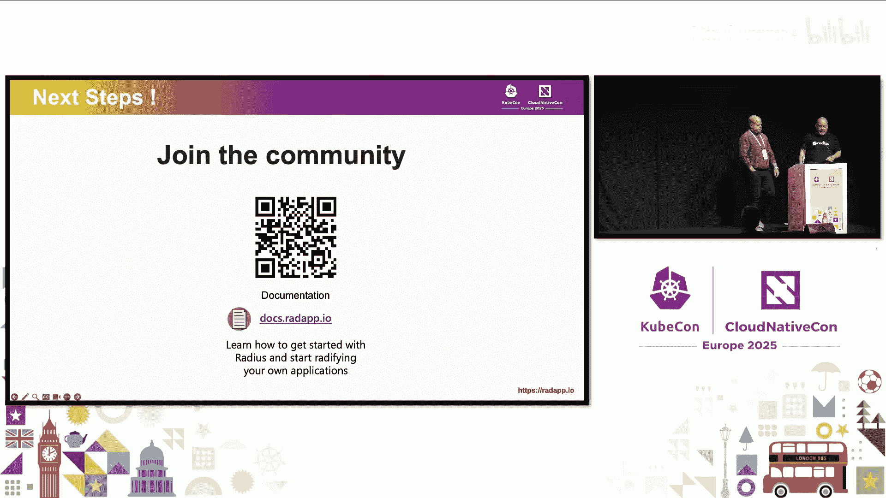

# 059：Millennium BCP 如何利用 Radius 赋能开发者与运维者协作

在本教程中，我们将学习 Millennium BCP 如何利用开源项目 Radius 构建其内部开发者平台，以改善开发者与运维团队之间的协作。我们将了解 Radius 的核心概念，包括应用模型、基础设施配方和自定义资源，并通过实际演示展示其如何简化跨环境部署和平台扩展。

## 概述：什么是 Radius？🤔

上一节我们介绍了本次分享的背景。本节中，我们来看看 Radius 是什么以及它要解决的核心问题。

Radius 是一个云原生应用平台。它允许你定义一次应用，然后将其部署到本地环境、AWS 和 Azure。你可以将其作为独立工具使用，也可以与 Dapr 等配套技术结合。但更重要的是，像 Millennium BCP 这样的早期采用者正在将其集成到现有的内部开发者平台中，以提供应用模型并支持以应用为中心的场景。

平台工程师面临的一个关键挑战是，在分布式系统和云原生技术的世界里，越来越难以将“应用”作为一个整体实体来理解和操作。开发者每天设计、构建和支持的是应用，但底层的基础设施配置和部署细节却异常复杂。这种模糊性增加了开发者的认知负担，而内部开发者平台正是为了解决这种负担而设计的。Radius 的目标就是填补“应用模型”或“应用平台”这一空白，为平台工程师提供一个开源项目，让他们能够像利用其他技术一样，为 IDP 添加应用模型，从而为开发者提供更以应用为中心的体验。

## Radius 如何助力平台与团队？🚀

上一节我们介绍了 Radius 的定位。本节中，我们来看看 Radius 具体通过哪些方式帮助应用团队和内部开发者平台建设。

Radius 主要通过以下四种方式提供价值：

以下是 Radius 的核心价值点：

1.  **改善企业应用团队协作**：它让开发者能够真正专注于他们的应用代码，而无需过多关心基础设施配置和部署细节。
2.  **提供基础设施配方**：运维人员可以预先定义好应用在本地、AWS 或 Azure 上部署时所需的基础设施规格。开发者随后可以自助式地获取这些基础设施资源。
3.  **生成应用关系图**：每次部署 Radius 应用时，都会自动创建一个关系图，清晰展示应用的所有组件（如容器、数据库、缓存、前后端）及其连接方式。这使得团队中的任何人（SRE、开发者、架构师、运维）都能一目了然地了解生产环境中的部署状态。
4.  **保持云中立性与 GitOps 集成**：它提供跨环境的一致部署体验，并可与现有的 GitOps 工作流（如 Flux，未来支持 Argo）集成。

## 演示一：跨环境部署应用 🌍

上一节我们了解了 Radius 的理论价值。本节中，我们通过一个具体演示来看看 Radius 如何实现“一次定义，多处部署”。

在这个演示中，我们将展示如何使用 Radius 将一个应用**不加修改**地部署到本地环境和 AWS 环境。在本地，应用将使用 Kubernetes 集群上的 Redis 缓存；在 AWS，一个“配方”会自动部署 MemoryDB。

演示步骤如下：

以下是部署过程的关键步骤：

1.  **设置环境**：已经预先设置好本地的 Radius 控制平面和一个 AWS 环境，并对应两个工作空间。
2.  **定义配方**：在本地，使用一个 Bicep 配方来部署 Redis 到 Kubernetes。在 AWS，使用一个 Terraform 配方来部署 MemoryDB。
3.  **查看应用定义**：应用定义非常简单，包含一个前端容器和一个 Redis 缓存资源。前端容器通过一个 **`connection`** 声明与缓存连接。这个连接功能非常强大，它能让 Radius 在后台为开发者完成许多工作，包括在应用图中建立显式连接，以及将连接字符串和凭证等详细信息作为环境变量注入容器。
4.  **部署应用**：在终端运行 **`rad run`** 命令来部署应用。命令会提供端口转发，以便我们查看运行中的应用。
5.  **验证应用**：访问应用，可以看到 Radius 自动注入的环境变量，并且应用功能（如待办事项列表）正常工作。
6.  **查看应用图**：通过 Radius 的仪表板（一个基于 Backstage 的 UI），可以直观地看到应用的关系图。即使是这个简单的双节点图，也清晰地展示了缓存和前端容器之间的连接。
7.  **部署到 AWS**：使用 **`rad deploy`** 命令将同一个应用部署到 AWS 环境。
8.  **对比环境**：通过 **`rad app graph`** 命令对比 AWS（左）和本地（右）的应用图。可以看到，前端容器的配置在两边是相同的，但底层部署的基础设施不同：AWS 侧是 MemoryDB 集群和子网组等 AWS 特定资源，本地侧则是运行 Redis 的 Kubernetes 资源。

这个演示清晰地展示了 Radius 如何轻松地将应用逻辑与支撑它的基础设施部署分离开来。

## 演示二：创建自定义应用资源 🛠️

上一节我们看到了 Radius 原生资源的能力。本节中，我们探讨平台工程团队更需要的功能：创建自定义应用资源。

Radius 内置的容器、Redis 缓存、数据库等原生资源很有用，但平台团队真正需要的是能够创建**自定义应用资源**并为这些资源建立目录。这种自定义资源使平台团队能够构建高度定制化的开发者体验。

自定义资源目录可以提供可浏览的集成文档，并能对任何类型的资源进行建模，无论是抽象的资源（如 Web 服务）还是具体的资源（如 DocumentDB）。这些自定义资源实际上充当了消费资源的开发者与提供资源的平台之间的契约。

下一个演示将展示如何创建一个自定义 Radius 资源，并用它为之前的待办事项应用添加新功能。既然是 2025 年，我们的演示应用必须包含 AI 功能。因此，我们将通过一个自定义资源来添加 OpenAI 集成。

演示步骤如下：

以下是创建和使用自定义资源的步骤：

1.  **定义新资源类型**：创建一个名为 **`openai.mycompany.app`** 的资源类型定义文件。在其中，我们定义了一个 **`capacity`** 属性，要求开发者通过 T 恤尺码（小、中、大）来指定他们希望如何使用这个自定义资源。
2.  **上传资源定义**：使用 **`rad resource-type create`** 命令将该文件上传到 Radius，让 Radius API 知晓并支持这个新资源，就像对待原生资源一样。
3.  **注册资源配方**：为这个 OpenAI 资源注册一个配方。这里使用一个模板，通过 Azure OpenAI 来部署一个 GPT Turbo 模型。
4.  **开发者使用资源**：开发者现在可以在应用定义中添加这个 **`openai.mycompany.app`** 资源。VS Code 和 Copilot 等开发工具能识别这个资源，并将其视为一等公民，提示开发者输入所需属性（如 `capacity`）。
5.  **建立连接**：像之前一样，在前端容器和新的 AI 资源之间建立一个 **`connection`**，以便将 AI 集成注入前端容器。
6.  **部署与验证**：再次运行 **`rad run`** 部署应用。Radius 会在 Azure 上创建 OpenAI 模型、Azure Cache for Redis 等基础设施。部署完成后，可以在应用 UI 中测试新的 Copilot 集成反馈功能。

这个演示展示了使用 Radius 扩展内部开发者平台是多么容易，无论是跨不同环境部署，还是创建满足特定需求的自定义资源。

## Millennium BCP 的实践之路 📈

上一节我们看到了 Radius 的强大扩展能力。本节中，我们来听听 Millennium BCP 引入 Radius 的真实历程和收获。

Millennium BCP 的故事并非始于 Radius。早在 2021 年，他们就启动了一个雄心勃勃的计划，名为“从 8 天到 8 分钟”。目标是让一个微服务在所有环境中的构建和部署时间不超过 8 分钟，核心驱动力是加速服务交付。

他们需要摆脱“这个人构建基础设施，那个人部署应用”的旧模式，同时仍需尊重开发和基础设施是两个不同生命周期的事实。他们不仅想覆盖基础设施，还想覆盖整个 IT 生命周期，例如在 CMDB 中注册应用等。作为一个受监管的行业公司，他们需要对运行的一切负责，但又不想重复造轮子。

当时，他们拥有一个庞大的 Terraform 模块库。他们认识到，最关键的缺失环节是：**将“应用”作为一等公民和 API**。他们希望像管理软件一样管理基础设施，应用版本化、部署模式等成熟实践也应适用于基础设施。

起初，他们通过一个 Web UI 让开发者选择模板来创建微服务，生成一个 JSON 文件来描述应用的所有细节（名称、拓扑、技术依赖如缓存、数据库等）。这个 JSON 文件会被部分转换为开放应用模型定义，并传递给 GitOps 工具链。但他们发现这中间仍有差距。

经过近三年的探索和与 Radius 团队的交流，他们明确了差距所在：正是 Jonathan 演示的那种用户体验和用户自定义类型能力。现在，他们正在将团队迁移到新的模式上。

如今，他们的 CI 流水线会将 JSON 转换为 YAML 部署模板。这个模板是标准的 Kubernetes CD 资源，它引用了 Radius 配方。这个 YAML 文件由 GitOps 流程处理，最终完成基础设施的创建并与应用连接。

对于开发者来说，如果在自己的笔记本电脑上工作，只需注册一个在本地运行的静态前端配方即可。如果要部署到共享基础设施，就使用利用该共享基础设施的配方。无论通过 CLI、流水线还是 GitOps 使用，都可以将部署模板放入 Helm Chart 中。**基础设施与应用版本一同被版本化，成为交付物的一部分**。

**他们从中学到的经验**：
*   **促成正确的对话**：团队不再讨论“我的数据库模式准备好了吗”，而是讨论“未来测试”、“渐进式发布”等更高阶的话题。
*   **整合最佳实践**：如果有五个团队用不同方式创建数据库，就选出最佳模式，让所有人都遵循该模式，并将其放入配方中。
*   **预定义 SLO/SLA**：运维团队知道他们需要支持什么，这些要求体现在服务等级协议和合同中。
*   **统一而灵活**：开发者只需声明“我需要一个中型缓存”，而无需关心具体配置。平台确保以正确的方式满足需求。
*   **将应用成熟度实践推向基础设施**：这是他们一直在努力并持续推进的方向。

## 总结与邀请 🤝

本节课中，我们一起学习了 Radius 如何作为一个云原生应用平台，通过引入应用模型来赋能开发者与运维者的协作。

我们回顾了 Millennium BCP 利用 Radius 构建内部开发者平台的旅程，看到了 Radius 如何通过基础设施配方实现跨环境的一致部署，以及如何通过自定义资源扩展平台能力。核心在于，Radius 提供的应用模型能力是大多数内部开发者平台的通用需求。

Nuno 和 Jonathan 希望传达的关键信息是，他们视 Radius 为开源社区带来的应用模型能力为大多数 IDP 的通用需求。因此，他们诚挚邀请大家加入 Radius 社区，共同协作，避免重复劳动，从协作中创造更大价值。

你可以通过上方二维码访问 Radius 文档，其中也包含了 GitHub 链接、社区活动信息以及月度社区会议的详情。如有问题，欢迎通过 Discord 联系。社区拥有非常活跃的支持频道，期待看到更多朋友的参与。