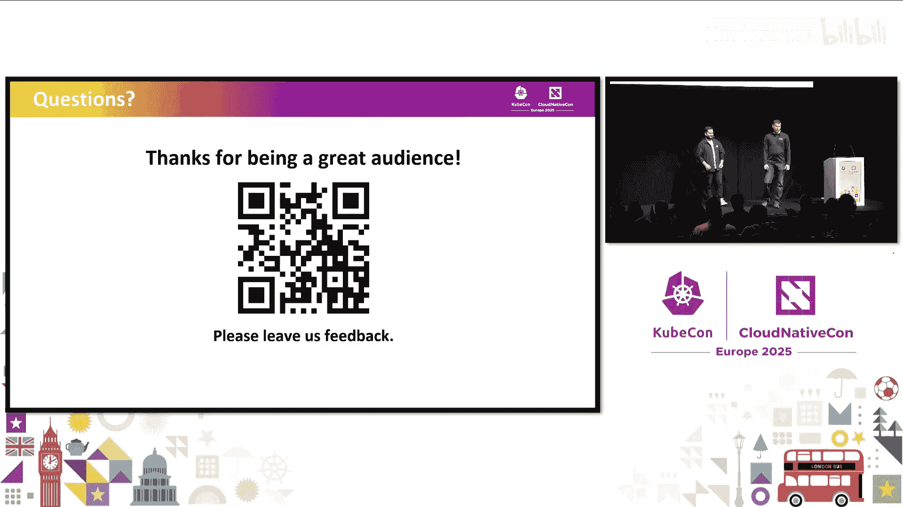

# 060：经验分享与代码生成实践


在本教程中，我们将学习什么是特性标志（Feature Flag），了解 Google 在长期实践中总结的经验教训，并重点介绍 OpenFeature 社区推出的全新代码生成工具（CI），它旨在通过类型安全的方式，彻底改变开发者使用特性标志的体验，避免常见的人为错误。

## 特性标志简介 🚩

特性标志是一种非常强大的技术，它允许你动态地改变应用程序的行为，而无需每次更改都发布新的二进制版本。这意味着你可以动态地启用或禁用某个特定功能，而无需修改源代码。

使用特性标志的主要优势包括：
*   **支持渐进式发布**：它提供了二进制发布无法实现的更细粒度控制，允许你缓慢、逐步地启用新功能。
*   **降低风险**：这为功能启用提供了更安全的方式。如果发现生产环境出现问题，通常可以快速禁用相关功能以缓解问题，这比正常的二进制发布要快得多。
*   **支持实验**：特性标志的一个非常常见的用例是 A/B 测试。

## Google 的经验与挑战 ⚠️

上一节我们介绍了特性标志的基本概念，本节中我们来看看 Google 是如何使用它们以及遇到了哪些挑战。

Google 从 2009 年就开始尝试使用特性标志，如今它已成为引入新功能和发布的事实标准方式。大约 70% 的开发者会定期使用特性标志。随之而来的是庞大的特性标志代码库，其中包含超过 150 万个活跃的特性标志。

然而，一个普遍存在的问题是，开发者喜欢引入特性标志，却不喜欢在之后清理它们。例如，YouTube 曾有一个有趣的政策：如果你想引入一个新的特性标志，就必须先清理掉另外两个旧的特性标志，以保持代码库的整洁。

特性标志的使用方式基本如前所述：渐进式发布和 A/B 测试。这对于确保我们能够安全地更改庞大的代码库、防止服务中断并快速缓解问题至关重要。

### 特性标志的典型问题

让我们看看在代码中如何使用一个特性标志。假设我们有一个 React 示例，我们想引入一个特性标志来在主页上显示新消息。

```javascript
const showNewMessage = useFlag(‘new-message‘);
if (showNewMessage) {
    return <NewMessage />;
} else {
    return <OldMessage />;
}
```

但如果标志管理系统中的标志名称与代码中引用的名称完全不同呢？例如，开发者与产品经理不同步，导致名称不一致。当尝试查询这个标志的值时，在标志管理系统中找不到它，那么会发生什么？

在这种情况下，通常会回退到代码中设置的默认值（例如 `true`）。这可能导致功能在一夜之间对所有用户启用，完全失去了渐进式启用的能力。这就引出了一个根本问题：当标志服务和应用程序对标志的值有不同认知时，谁是正确的？什么是标志值的绝对真实来源？

### 标志的生命周期与一致性

特性标志允许你通过更改标志服务中的设置来影响宿主应用程序的行为。标志服务中的变更通常需要非常快速地传播。而应用程序的更新周期则相对较长，可能是每周或每几天一次。

这就导致标志在两个地方被引用，却以不同的发布周期进行更新。最终可能出现在标志服务中存在但应用程序中还没有，或者应用程序中存在但标志服务中还没有的情况。那么，标志的值应该是什么？我们评估标志值的正确视角是什么？

因此，我们需要认真思考如何正确地引入和发布标志，以及特性标志的完整生命周期。

以下是特性标志生命周期的几个关键步骤：
1.  **创建标志**：在标志服务和宿主应用程序中引入它。
2.  **管理标志**：缓慢或快速地逐步启用功能。
3.  **弃用标志**：完成职责后，确保从代码中移除所有对该标志的引用。
4.  **删除标志**：当代码中不再存在该标志时，从标志服务中将其删除。

但我们应该先在哪里更新？标志应该首先出现在代码中还是标志服务中？Google 的经验表明，如果先引入到代码中，可能会评估到一个不安全的默认值。但如果先引入到标志服务中，标志虽然存在，但暂时不会影响任何东西。

因此，我们得出的普遍观点是：**标志必须首先在标志管理系统中定义，然后才允许存在于宿主应用程序中**。我们完全禁止在标志服务中不存在的标志出现在宿主应用程序中。

然而，如何检查这一点呢？作为开发者，你必须检查标志是否在标志服务中，是否在应用程序中，这可能是相当繁琐的。我们仍然需要以某种方式在引入标志时达到最终的一致性。

### 人为错误导致的故障

除了上述挑战，实践中还会遇到一些人为错误。以下是几个实际发生过的故障例子：
*   **尾部空格**：有人在标志名称中不小心添加了尾部空格，导致标志值意外评估，进而导致某个功能的使用率下降。
*   **默认值不匹配**：代码中定义的默认值与标志管理系统中的默认值不匹配，导致功能在一夜之间全面启动，引发相关故障。
*   **过早删除**：有人认为已经清理了代码中对某个特性标志的所有引用，于是从标志服务中删除了它。结果，标志回退到代码默认值，导致另一个故障，意外禁用了该功能。

作为开发者，我们当然希望小心谨慎。但更好的方式是，我们如何从工具层面帮助开发者，在问题发生前就解决它？整个过程应该是顺畅的。

## OpenFeature 代码生成解决方案 🛠️

上一节我们探讨了传统特性标志使用方式的问题，本节中我们来看看 Google 的经验如何催生了 OpenFeature 的代码生成解决方案。

基于这些经验，Google 提出了引入代码生成的想法。我们根据标志配置生成所有标志访问器，生成类型安全的标志访问器。这在多个方面提供了巨大帮助：
1.  **避免错误**：它有助于避免输入错误标志名等错误。
2.  **单一真实来源**：它提供了可以直接在二进制中引用的标志的单一真实来源。
3.  **编译时检查**：在弃用标志时，由于是代码生成的，任何你可能遗漏的陈旧引用都会导致应用程序无法编译，这是一个巨大的优势。

我们希望将这些经验教训带到开源世界。在过去的半年左右时间里，我们一直在讨论如何开发一个适合开源环境的代码生成工具。OpenFeature 社区非常欢迎我们，我们度过了一段愉快的时光。

### 什么是 OpenFeature？

OpenFeature 是一个 CNCF 孵化项目。它基本上是一个用于特性标志的开放规范。它试图统一开发者与特性标志交互的 SDK，并且可以跨许多不同的供应商工作。你也可以将其集成到自建的解决方案中。它甚至是一种同时接入多个供应商的方式。这是一个非常强大的抽象，如果你是刚刚开始使用特性标志，这是一种理想的方式。

那么，为什么要标准化呢？
*   **避免供应商锁定**：你的代码中可能遍布对特定供应商 SDK 的引用，根据业务情况迁移可能相当具有挑战性。
*   **构建社区**：基于这个社区，我们可以构建能与所有人共享的优秀工具。

OpenFeature 生态系统目前已经相当庞大，涵盖了多种技术栈。

### OpenFeature 架构与代码生成

让我们深入了解 OpenFeature 的架构。回顾之前的图表，右边的标志管理系统可以是任何系统。左边是你的应用程序。OpenFeature 位于中间，左边是我们的 SDK，右边是我们称之为“提供者”（Provider）的部分。提供者是与你的其他系统（如标志管理服务）通信的接口。你可以轻松构建自己的提供者，但我们的生态系统中目前已经有数百个。

让我们看一个 Node.js 示例。在顶部，我们看到注册提供者（这应该在应用程序中只发生一次），然后我们可以创建一个客户端，并使用该客户端与你的特性标志进行交互。在这个例子中，我们使用 `withCows` 标志，并根据它控制控制台输出。

但你可能注意到，我们使用的是硬编码的字符串。这基本上是多年来的现状，大多数人都这样做。一些解决方法是硬编码你自己的配置文件。但在与 Google 的工程师交流后，我们非常清楚地认识到，这可能不是你真正想要的。

这就是 **OpenFeature CI（代码生成倡议）** 的用武之地。这是一个全新的倡议，我们大约三个月前开始了特别兴趣小组（SIG）。我们每周开会，正在积极开发这些东西。我们认为，这将是未来开始使用特性标志的明显方式。

OpenFeature CI 是一个命令行工具，我们真正致力于改善开发者体验。我们认为这里有巨大的机会。它主要有三个核心组件：
1.  **集成标志管理系统**：我们将使其与供应商无关，因此它应该适用于任何工具，包括你自建的解决方案。
2.  **本地清单（Manifest）概念**：我们希望能够从标志管理系统中获取数据，并在你的代码仓库中保留标志的引用。
3.  **代码生成**：利用本地清单，我们可以进行代码生成。除此之外还有很多其他机会。

### 用户流程演示

以下是使用 OpenFeature CI 的典型用户流程：

1.  **创建特性标志**：首先在标志管理系统中创建一个特性标志。例如，创建一个键为 `offer-free-shipping` 的标志。
2.  **获取清单**：从标志管理系统中获取标志的最新状态。这会生成一个 JSON 文件，作为标志的基础表示，包含标志键、描述、失败时的默认行为等元数据。这是标志预期行为的真实来源。
3.  **生成客户端代码**：运行 CI 工具，例如 `generate node-js` 命令。工具会使用清单文件生成一个类型安全的客户端文件，例如一个 OpenFeature TypeScript 文件。

所有变化都体现在这一行代码上。代码从使用不友好的字符串调用方式：
```javascript
const offerFreeShipping = await client.getBooleanValue(‘offer-free-shipping‘, false);
```
变成了类型安全的方法调用：
```javascript
const offerFreeShipping = await client.offerFreeShipping();
```
这虽然是一个小变化，但显著改善了开发者体验。它有效地消除了人为错误，提供了丰富的 IDE 集成（如自动补全和文档提示），并且让编译器在代码清理等方面为我们战斗。

## 总结 📝

本节课中我们一起学习了特性标志的核心概念、Google 在多年实践中总结的经验教训，以及 OpenFeature 社区如何将这些最佳实践转化为开源的代码生成工具。

我们了解到，传统的基于字符串的特性标志引用方式容易导致人为错误，如拼写错误、默认值不一致和清理困难。OpenFeature CI 通过从标志管理系统生成类型安全的客户端代码，为开发者提供了更安全、更高效的使用体验。它确保了标志引用的准确性，提供了更好的 IDE 支持，并利用编译时检查来防止常见问题。



如果你对尝试 OpenFeature CI 或为其贡献代码感兴趣，欢迎加入 OpenFeature 社区。这是一个正在快速发展的项目，我们期待你的反馈和参与，共同塑造特性标志的未来。