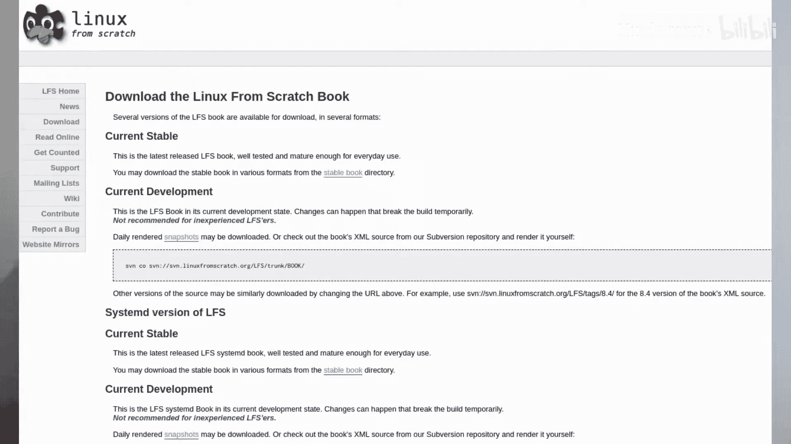
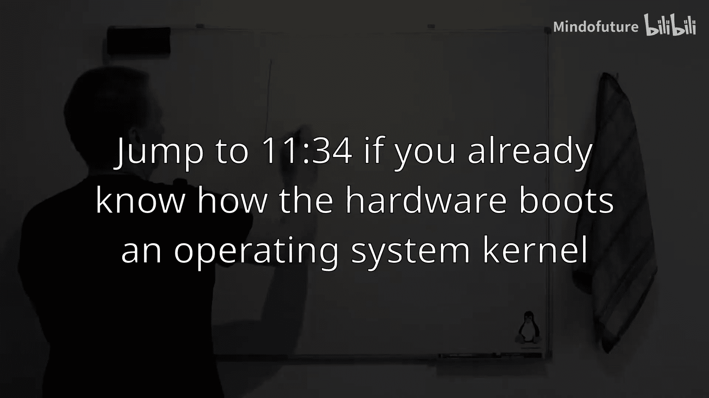

# 001：概述

在本节课中，我们将一起学习如何从零开始构建一个完整的Linux操作系统。我们将了解整个构建过程的概览、背后的原理以及需要经历的各个阶段。

## 计算机启动过程

为了理解如何构建一个可启动的系统，我们首先需要了解计算机的启动过程。上一节我们介绍了课程目标，本节中我们来看看计算机是如何启动的。

你的计算机主板上包含以下核心部件：
*   **CPU**
*   **硬盘**（或SSD等存储设备）
*   **随机存取存储器（RAM）**
*   **BIOS**（存储在ROM或EEPROM芯片中的固件）

当你启动计算机时，会发生以下一系列事件：
1.  主板首先运行存储在BIOS中的固件。
2.  固件被复制到RAM中，CPU的指令指针被设置为开始执行这段代码。
3.  固件指示CPU与硬盘通信，并将硬盘的第一个扇区（即**主引导记录，MBR**）复制到RAM中。
4.  固件随后指示CPU开始执行MBR中的代码。MBR中包含一个**引导加载程序**（如GRUB）。
5.  引导加载程序了解分区表和文件系统。它会根据其配置文件，找到并加载位于例如 `/boot/` 目录下的**内核**文件（如 `vmlinuz`）到RAM中。
6.  引导加载程序设置CPU的指令指针，开始执行内核代码。

## Linux系统的启动

在之前的步骤中，我们加载了内核。然而，内核的主要职责是管理进程间的通信（包括驱动程序、系统服务等），而不是直接运行所有程序。将过多功能放在内核中会带来安全风险。

在现实中，内核启动后，会运行一个**初始化系统**（如传统的 `init` 或现代的 `systemd`）。这个初始化系统负责后续的所有启动任务，例如：
*   根据配置文件（如 `/etc/fstab`）挂载文件系统（例如将根分区 `/` 和启动分区 `/boot` 挂载到正确位置）。
*   启动各种系统服务和守护进程（如网络驱动、DHCP客户端等）。

因此，一个可启动的Linux系统需要包含：**主引导记录（MBR）、引导分区（包含内核）、根分区（包含所有程序、库、配置文件和初始化系统）**。

## 构建我们的Linux系统

现在我们已经了解了启动原理，本节中我们来看看如何实际构建这样一个系统。我们将使用一个USB闪存驱动器作为我们的“硬盘”。

我们需要在这个USB驱动器上创建以下结构：
1.  **主引导记录（MBR）**
2.  **引导分区**（约100MB，用于存放内核和引导加载程序）
3.  **根分区**（剩余空间，用于存放完整的操作系统）

以下是构建过程的主要步骤：
*   使用 `fdisk` 工具在USB驱动器上创建分区表。
*   在分区上创建文件系统（如ext4）。
*   编译并安装所有必要的程序、库和配置文件到根分区。
*   编译Linux内核和GRUB引导加载程序，并将其安装到引导分区。
*   使用GRUB将引导加载程序写入MBR。
*   配置初始化系统（如 `systemd` 或 `sysvinit`）以在启动时正确加载服务和驱动。

完成这些步骤后，我们就可以从这块USB驱动器启动我们自定义的Linux系统了。

## Linux From Scratch (LFS) 构建阶段

Linux From Scratch 项目将整个构建过程系统地分为三个阶段，以确保构建环境的纯净和目标系统的独立性。

### 第一阶段：构建准备

在这个阶段，我们在现有的主机操作系统（称为**构建机器 A**）上工作。我们使用主机系统的包管理器安装必要的开发工具链（如 `gcc`, `make`, `autoconf` 等）。然后，我们下载所有后续阶段需要的源代码包。

### 第二阶段：交叉编译工具链

这是关键的一步。我们使用主机（A）的编译器，编译出一个新的、能在主机（A）上运行但能为**中间系统 B** 生成代码的**交叉编译器**。这个交叉编译器用于编译一系列基础工具（如 `coreutils`, `bash` 等），这些工具将构成临时系统 B 的基础环境。

### 第三阶段：隔离构建与目标系统

接下来，我们将USB驱动器的根分区挂载到主机的一个目录下（例如 `/mnt/lfs`），然后使用 `chroot` 命令切换到该目录。`chroot` 环境创造了一个高度隔离的视图，使得 `/mnt/lfs` 看起来就像是系统的根目录 `/`。这模拟了从目标系统启动后的环境。

在 `chroot` 环境中：
1.  我们使用之前为系统 B 构建的交叉编译器，再次编译所有软件包。但这次，我们使用一个能为**最终目标系统 C** 生成代码的编译器（它本身运行在系统 B 上）。
2.  我们编译出的所有程序都将被安装到USB驱动器的根分区中。
3.  最后，我们还需要构建一个能在最终目标系统 C 上运行并为自身生成代码的“本地”编译器。

完成所有编译后，我们还需要编译Linux内核和GRUB，配置引导加载程序，并编写所有必要的系统配置文件（如网络、服务启动等）。

## 课程总结与展望

本节课中我们一起学习了从零构建Linux操作系统的核心概念和完整流程。我们回顾了计算机的启动过程，明确了构建一个可启动系统所需的组件（MBR、引导分区、根分区）。我们重点介绍了Linux From Scratch项目采用的严谨的三阶段构建方法，它通过构建临时系统、交叉编译和 `chroot` 环境隔离，确保了最终系统的纯净性和独立性。

整个过程中，大量的时间将花费在重复的 `./configure && make && make install` 编译步骤上。在后续的实际操作视频中，我将利用这些编译时间，深入讲解Linux的目录结构（如 `/bin`, `/lib`, `/etc` 的作用）、各个核心软件包的功能以及系统配置的要点。我希望这不仅能带你完成一个系统的构建，更能让你深刻理解Linux系统的内部解剖结构。

如果你喜欢这个系列，请点赞、分享、订阅。我们下次再见。