# 003：下载软件包 📦

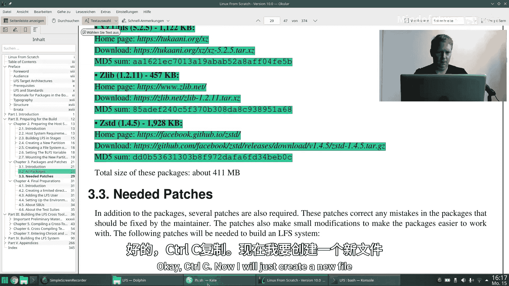

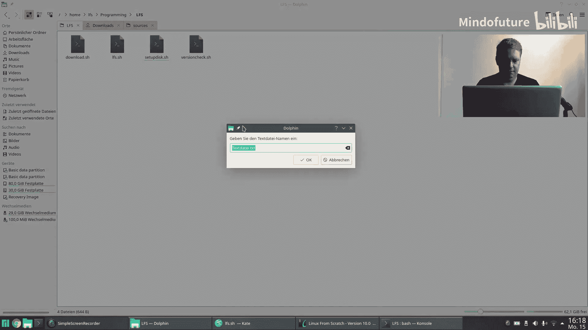

在本节课中，我们将学习如何下载构建LFS系统所需的所有软件包。上一节我们完成了USB存储设备的准备工作，包括分区、格式化和创建目录。本节中，我们将利用`sources`目录来下载所有必要的软件包，为后续的安装步骤做好准备。

## 准备工作

首先，我们需要获取软件包的下载信息。LFS手册的第3.2章提供了一个完整的软件包列表。我们将以此为基础，创建一个便于管理的列表文件。

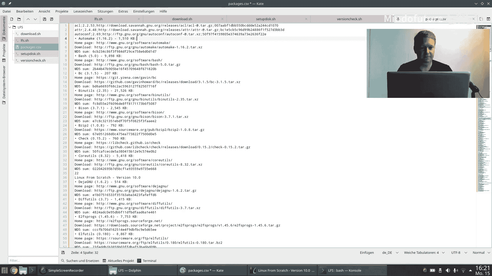

以下是创建和管理软件包列表的步骤：

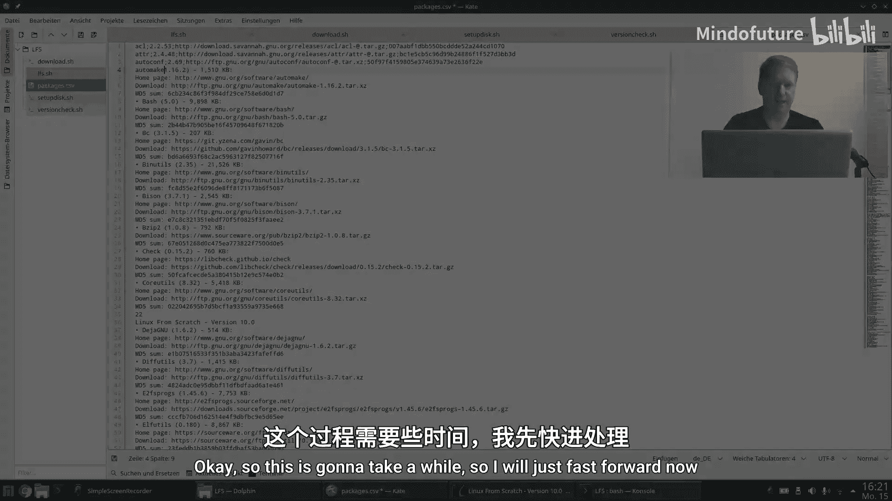

1.  **创建CSV文件**：我们创建一个名为`packages.csv`的文件。CSV（逗号分隔值）是一种简单的表格格式，每行代表一条记录，列之间用分号分隔。
2.  **定义列结构**：我们将列表整理为四列：
    *   第一列：软件包名称（全部转换为小写）。
    *   第二列：软件包版本号。
    *   第三列：下载URL。为了便于后续脚本处理，我们将URL中的版本号替换为`@`符号。
    *   第四列：MD5校验和。由于HTTP协议不安全，校验文件完整性是防止中间人攻击的良好实践。
3.  **转移工作环境**：为了直接在USB设备上工作，我们将脚本和`packages.csv`文件复制到USB挂载点的`LFS/sources`目录下，并切换到此目录。

## 编写下载脚本

接下来，我们编写一个Bash脚本来自动化下载过程。脚本的核心逻辑是读取`packages.csv`文件，并逐行处理每个软件包。

脚本的主要流程如下：

```bash
#!/bin/bash
# 设置PATH环境变量，确保后续能使用交叉编译器等工具
export PATH=/tools/bin:$PATH

# 读取 packages.csv 文件
while IFS=';' read -r name version url md5sum; do
    # 处理URL：将占位符@替换为实际的版本号
    download_url=$(echo "$url" | sed "s/@/$version/g")
    # 从URL中提取文件名
    filename=$(basename "$download_url")

    # 检查文件是否已存在且有效
    if [ ! -f "$filename" ]; then
        echo "下载 $name-$version..."
        # 使用wget下载文件
        wget "$download_url"

        # 验证MD5校验和
        if ! echo "$md5sum  $filename" | md5sum -c --quiet > /dev/null 2>&1; then
            echo "错误：$filename 的MD5校验和不匹配！可能文件损坏或遭到篡改。"
            rm -f "$filename" # 删除无效文件
            exit 1
        fi
        echo "$name-$version 下载并验证成功。"
    else
        echo "$name-$version 已存在，跳过下载。"
    fi
done < packages.csv
```

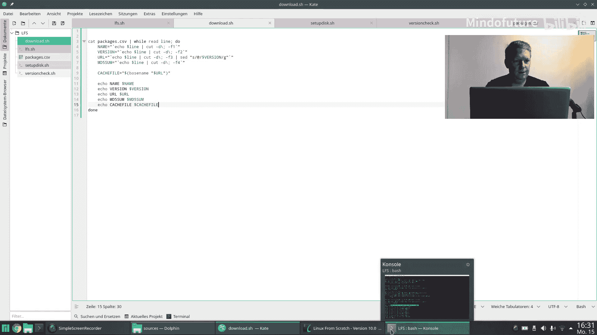

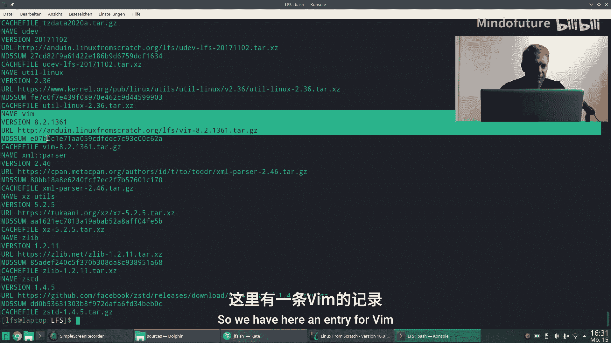

**代码解释**：
*   `while read ... done < packages.csv`：循环读取CSV文件的每一行。
*   `IFS=';'`：将字段分隔符设置为分号，以正确解析CSV列。
*   `sed "s/@/$version/g"`：使用流编辑器`sed`将URL中的`@`占位符全局替换为具体的版本号。
*   `basename`：从完整的URL路径中提取出文件名。
*   `[ ! -f "$filename" ]`：检查目标文件是否不存在，避免重复下载。
*   `wget`：用于从网络下载文件的命令。
*   `md5sum -c`：检查文件的MD5校验和是否与提供的值匹配。如果不匹配，则删除文件并报错。

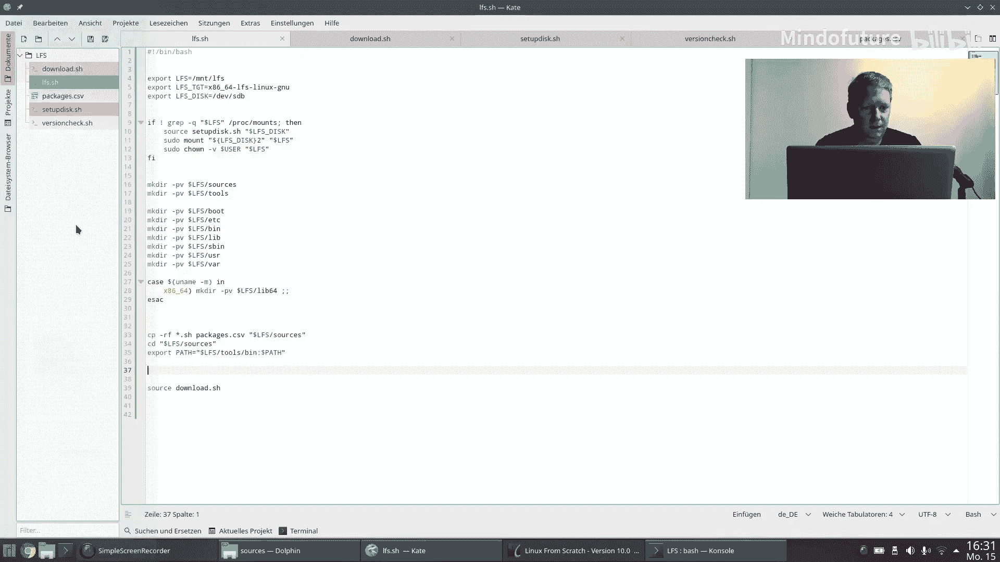

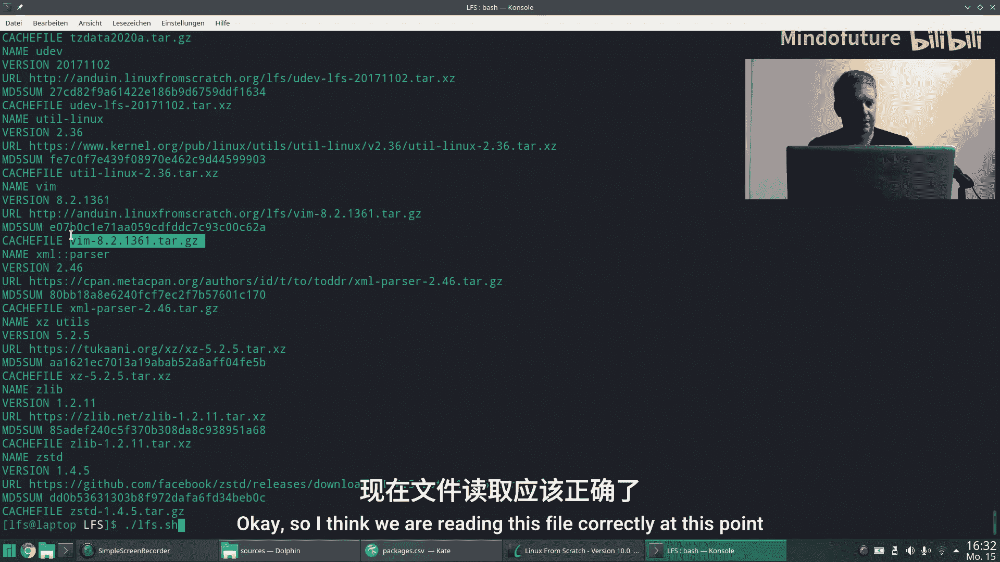

## 运行与调试

运行脚本后，它会开始下载所有列出的软件包。这个过程可能需要一些时间。

在首次运行中，我们可能会遇到一些问题。例如，某些软件包名称（如`P11-Kit`、`Python`）在CSV文件中被错误地转换成了全小写，导致下载URL拼写错误。我们需要返回`packages.csv`文件，将这些名称的首字母修正为大写，然后重新运行脚本。

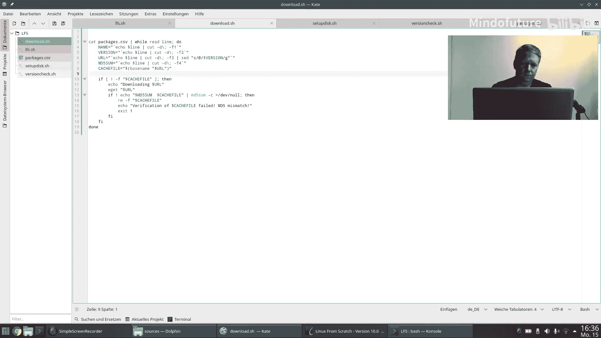

修正后，脚本应能成功下载所有软件包。最终，`sources`目录下应包含所有所需的源码包文件。

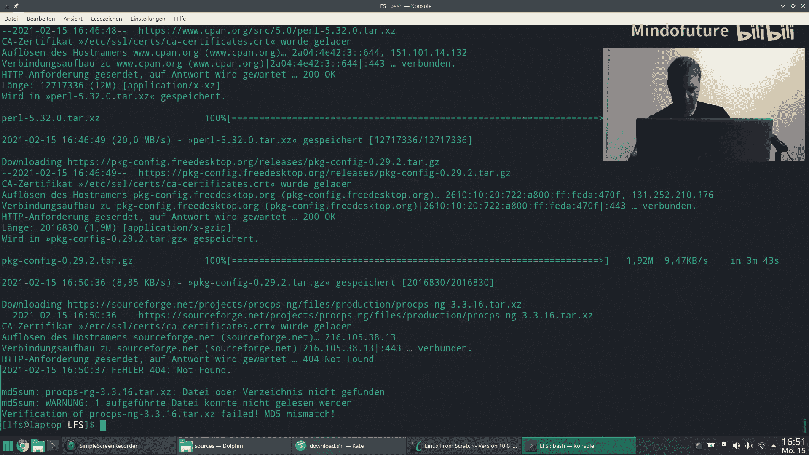

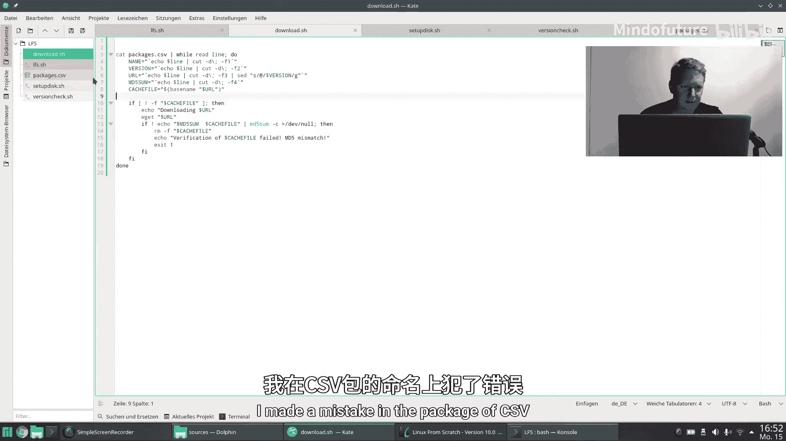

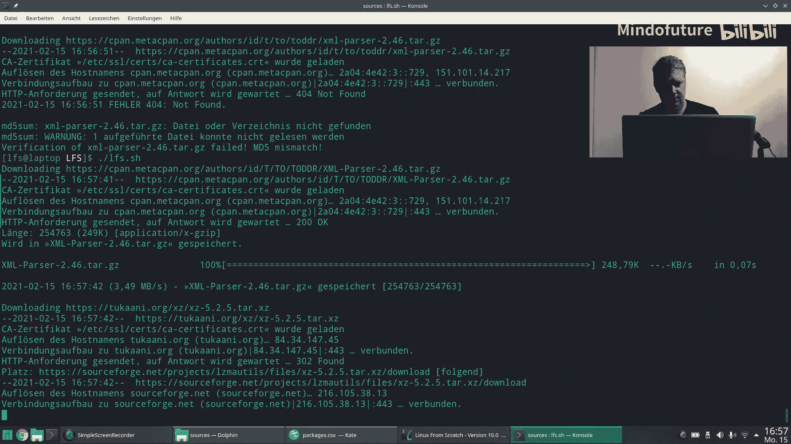

## 总结

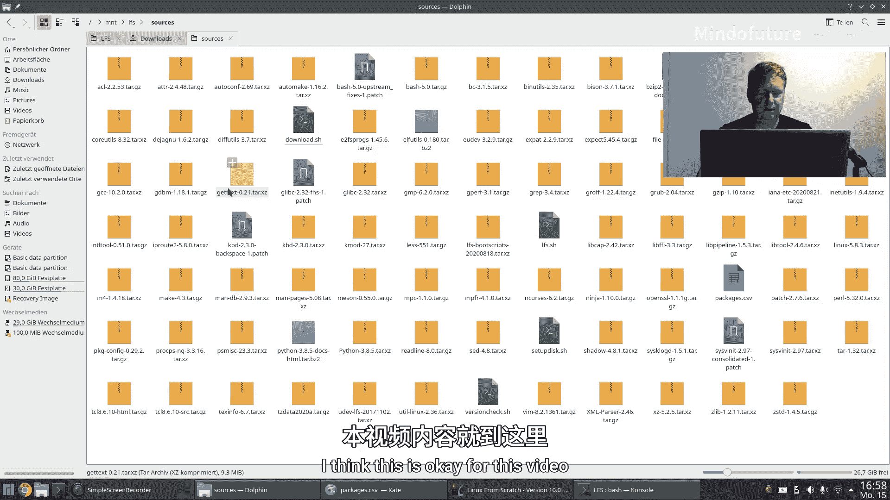

本节课中我们一起学习了如何为LFS系统准备软件包。我们首先根据官方手册创建了一个结构化的软件包列表文件，然后编写了一个自动化脚本，该脚本能够读取列表、下载文件并验证其完整性。通过跳过已存在的有效文件，脚本还优化了下载过程。现在，所有必要的源码包都已准备就绪，下一节课我们将开始安装这些软件包，正式进入构建系统的核心阶段。