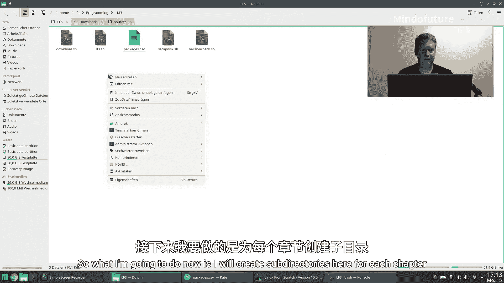
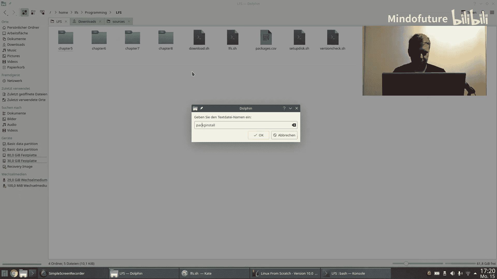
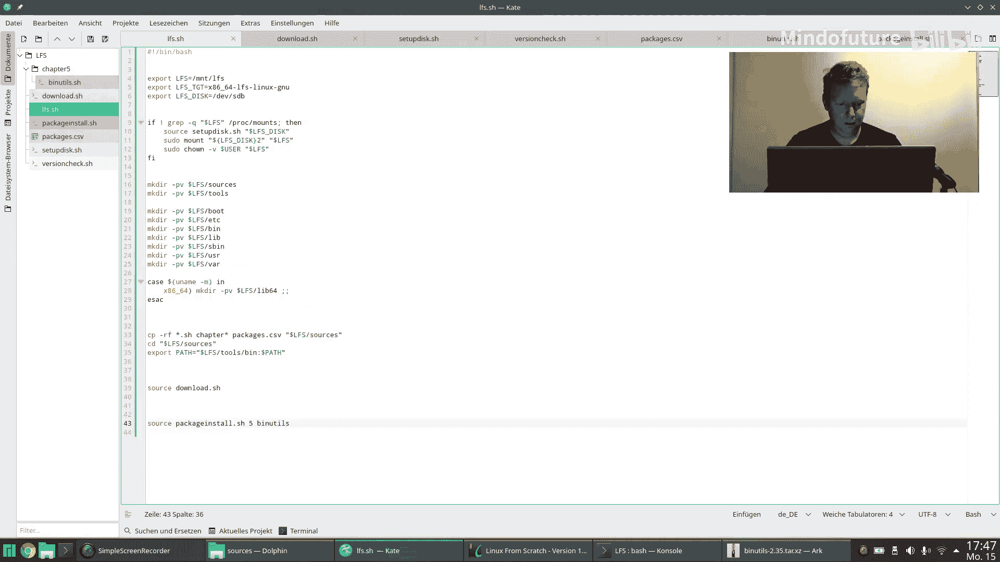
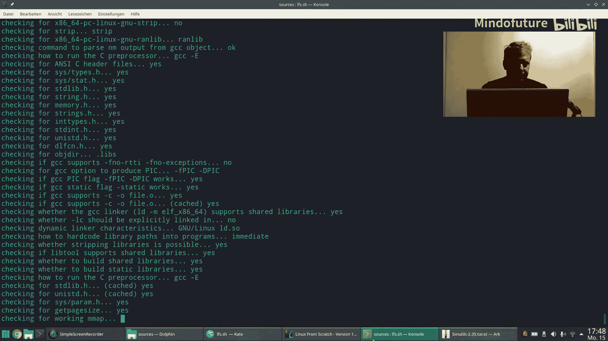
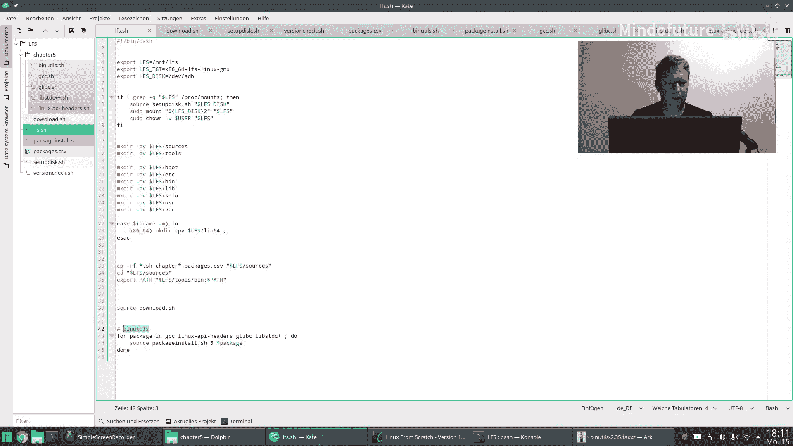
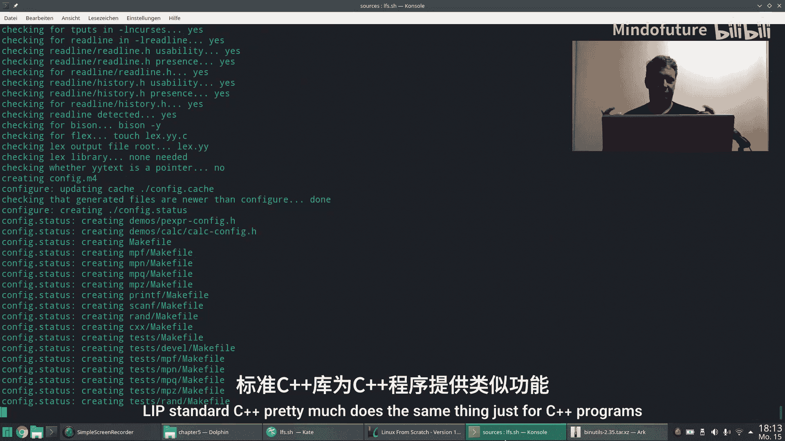
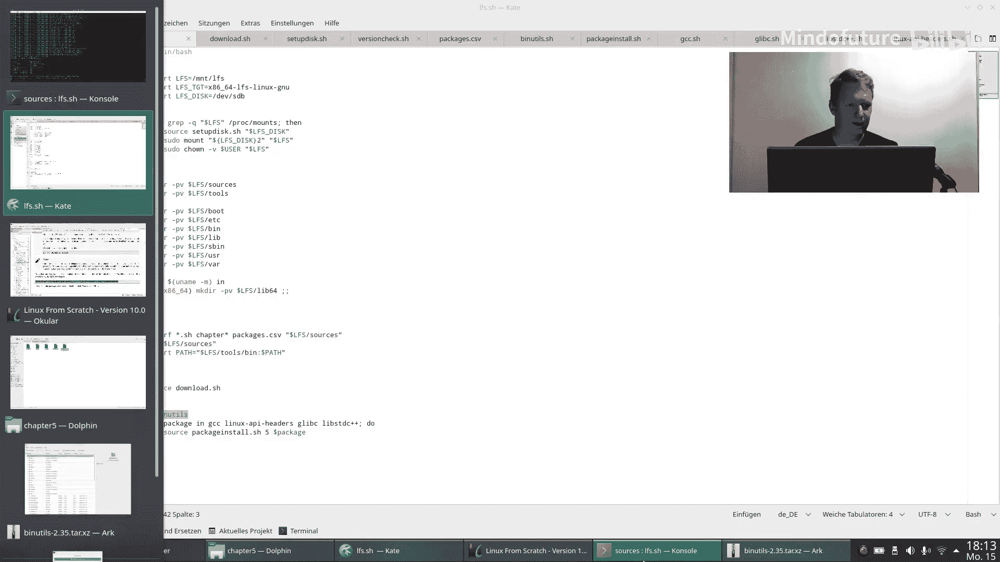

# 004：编译临时工具链



## 概述

在本节课中，我们将开始实际编译和安装构建LFS系统所需的核心工具链。我们将从第5章开始，安装`binutils`、`GCC`、`Linux API头文件`、`glibc`和`libstdc++`等基础包。我们将创建一个自动化脚本来处理这些包的安装过程，并理解每个包在工具链中的作用。

上一节我们完成了所有源代码的下载和准备工作，本节中我们来看看如何开始编译这些基础工具。

## 创建章节目录

首先，我们需要为LFS手册的每个章节创建对应的目录，以便更好地组织我们的工作。



以下是创建目录的步骤：

```bash
mkdir chapter5 chapter6 chapter7 chapter8
```

## 理解binutils包

`binutils`包包含了一系列二进制工具，例如链接器（`ld`）、汇编器（`as`）以及其他用于处理目标文件和库的工具。

以下是`binutils`包中的一些核心工具：

*   **`ar`**：用于创建静态库归档文件。
*   **`ld`**：GNU链接器，用于将目标文件链接成可执行文件或共享库。
*   **`as`**：GNU汇编器。
*   **`nm`**：列出目标文件中的符号。
*   **`readelf`**：显示ELF格式目标文件的信息。

## 编写自动化安装脚本

为了避免手动输入冗长的编译命令，我们将创建一个名为`package_install.sh`的脚本。这个脚本将根据我们提供的包名和章节号，自动执行解压、配置、编译和安装过程。

脚本的核心逻辑如下：

1.  接收两个参数：章节号和包名。
2.  从我们之前创建的`packages.csv`文件中查找对应的包信息。
3.  将源代码包解压到指定目录。
4.  进入源代码目录，并执行该章节对应的安装脚本。
5.  将整个安装过程的输出记录到日志文件中。

以下是脚本处理压缩包和目录的关键代码片段：

```bash
# 从文件名中提取目录名（去除.tar.*后缀）
dir_name=$(echo $cache_file | sed -E 's/(.*)\.tar\..*/\1/')
mkdir -p $dir_name
tar -xf $cache_file -C $dir_name

# 进入目录并保存当前路径
pushd $dir_name

# 如果解压后只有一个子目录，将其内容上移一层
if [ $(ls -1A | wc -l) -eq 1 ]; then
    sub_dir=$(ls -1A)
    mv $sub_dir/* .
    rmdir $sub_dir
fi
```

## 安装第5章的基础包

现在，我们可以使用脚本来安装第5章列出的所有临时工具。

以下是第5章需要安装的软件包列表及其简要说明：

*   **`binutils-2.42`**：第一遍编译，提供基础的二进制工具。
*   **`gcc-13.2.0`**：第一遍编译，GNU编译器集合。
*   **`linux-6.7.4`**：仅安装内核头文件，为`glibc`提供与内核通信的接口定义。
*   **`glibc-2.39`**：GNU C库，几乎所有程序都将链接到它，它是用户程序与Linux内核之间的桥梁。
*   **`libstdc++-13.2.0`**：GNU C++标准库，从GCC包中构建，为C++程序提供支持。



在运行安装脚本时，我们需要注意LFS手册中提供的配置参数。例如，在首次编译`binutils`时，手册建议禁用国际化（`--disable-nls`）并将警告视为错误（`--disable-werror`），以确保临时工具的纯净和构建过程的顺利。



## 处理GCC的依赖库

GCC编译依赖于多个数学运算库，如`MPFR`、`GMP`和`MPC`。LFS手册提供了特定的命令来解压这些库并将其移动到GCC源代码树中预期的目录名下。

为了避免硬编码版本号，我们可以使用`tar`命令的`--strip-components=1`选项来直接解压到目标目录。

相关命令如下：

```bash
tar -xf ../mpfr-4.2.1.tar.xz --strip-components=1 -C mpfr
tar -xf ../gmp-6.3.0.tar.xz --strip-components=1 -C gmp
tar -xf ../mpc-1.3.1.tar.gz --strip-components=1 -C mpc
```

## 编译过程与验证



运行安装脚本后，每个包的`configure`、`make`和`make install`步骤将自动执行。`GCC`和`binutils`的编译会花费较长时间。我们需要观察终端输出或日志文件，确保没有出现致命的错误信息。

编译成功的输出通常以大量的构建信息结束，并返回到命令提示符。





## 总结

本节课中我们一起学习了LFS构建过程中至关重要的一步——编译临时工具链。我们创建了自动化安装脚本，并成功安装了第5章的所有基础包，包括`binutils`、`GCC`、`Linux API头文件`、`glibc`和`libstdc++`。这些工具为我们后续在`chroot`环境中构建其余的系统组件奠定了基础。


下一节，我们将进入第6章，并首次切换到`chroot`环境，开始构建真正属于我们LFS系统的工具链。