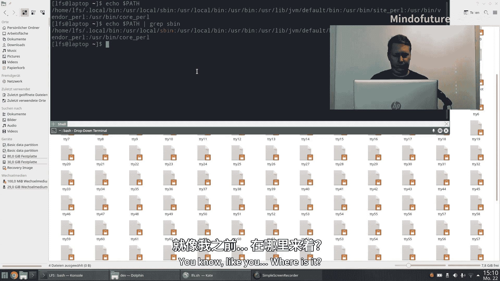
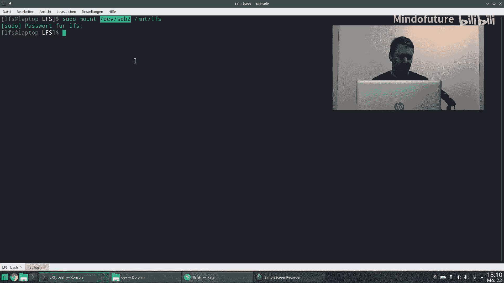
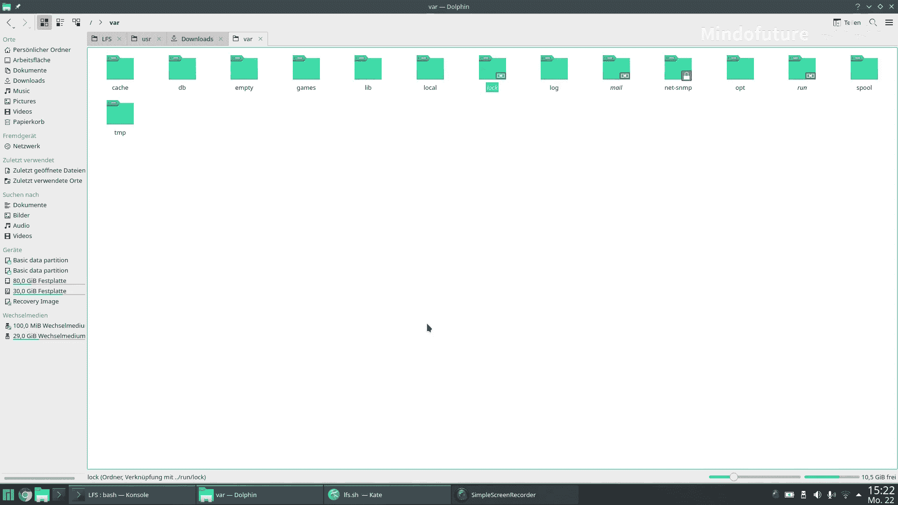
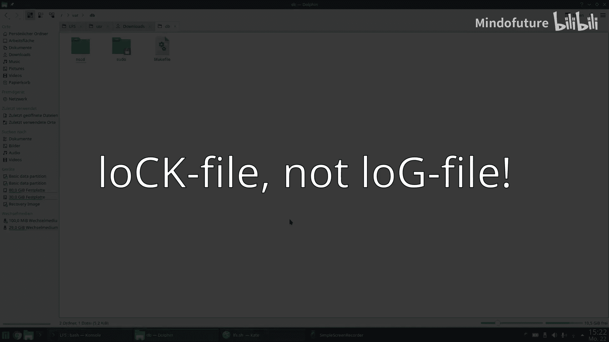
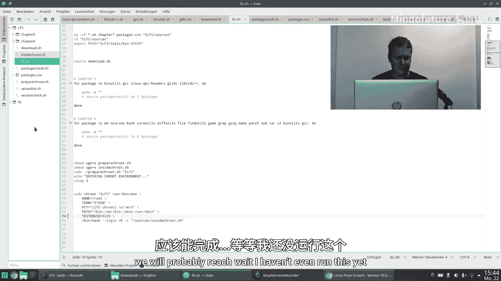
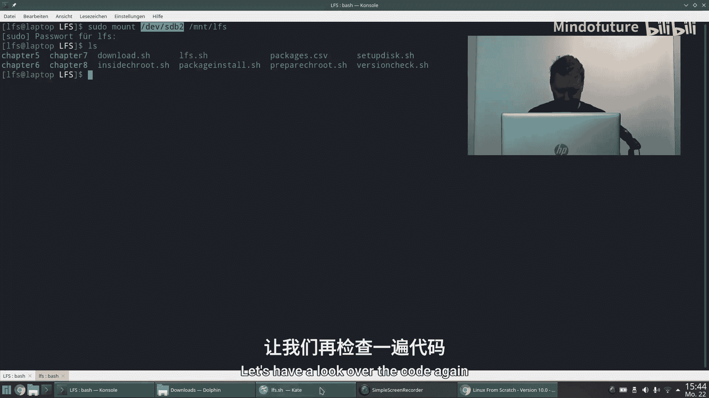
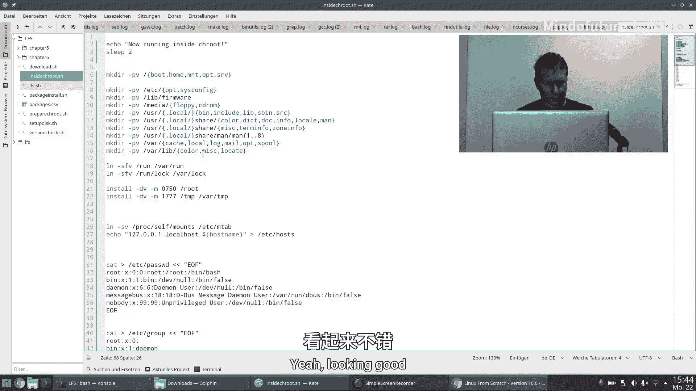
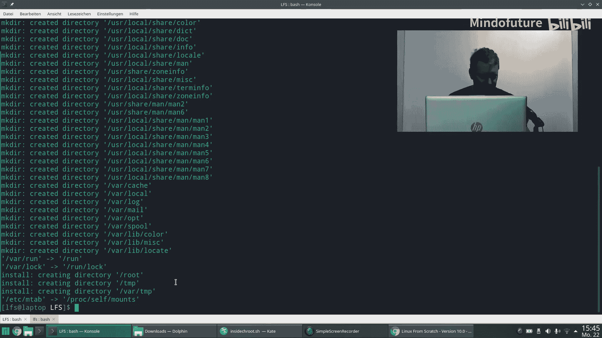
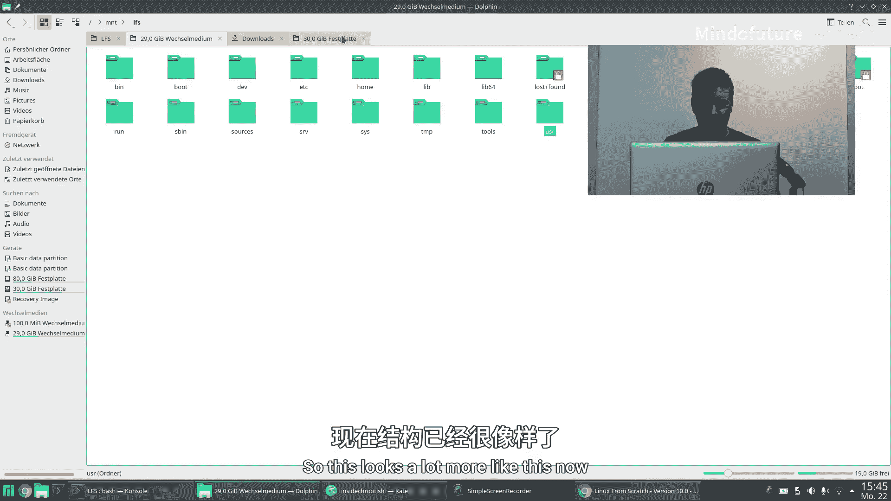

# 006：目录、用户与组管理 🗂️👥

在本节课中，我们将学习如何在LFS（Linux From Scratch）环境中创建标准的Linux目录结构，并设置基本的用户和用户组。这是构建一个功能完整、符合Unix文件系统层次标准（FHS）的操作系统的重要一步。

上一节我们成功进入了`chroot`环境。本节中，我们将在这个环境中开始工作。

## Linux目录结构概述

首先，我们来了解Linux系统（以及类Unix系统）中常见的目录及其作用。理解这些目录的用途，有助于我们明白为何要创建它们。

以下是Linux系统中一些核心目录的简要说明：

*   **`/boot`**：存放引导加载程序（boot loader）、其配置文件以及内核（kernel）文件。初始内存盘（initrd）文件通常也在这里。
*   **`/etc`**：存放系统范围的配置文件，例如硬件配置、网络设置等。它不包含用户的个人配置文件。
*   **`/home`**：存放各个用户的个人目录。每个用户在此目录下有一个以其用户名命名的子目录，用于存放个人文件、配置和下载内容等。
*   **`/bin`**：存放基本的用户命令二进制文件（即可执行程序），相当于Windows中的`.exe`文件。这些是系统启动和运行所必需的程序。
*   **`/sbin`**：存放系统管理命令的二进制文件，例如磁盘分区（`fdisk`）、文件系统创建（`mkfs`）等工具。普通用户通常无权访问此目录。
*   **`/usr`**：一个非常重要的目录，包含大量共享的、只读的用户数据和应用程序。其下通常有`/usr/bin`、`/usr/lib`、`/usr/include`等子目录。`/usr`目录可以被挂载在独立的网络或磁盘分区上，便于集中管理。
*   **`/lib`** 和 **`/lib64`**：存放系统库文件。与Windows不同，Linux程序倾向于共享使用相同的库文件，以节省空间并保持一致性。
*   **`/root`**：系统管理员（root用户）的个人目录。它不位于`/home`下，是为了确保在`/home`目录无法挂载时，管理员仍能登录系统。
*   **`/dev`**：一个由内核在运行时创建的虚拟目录，包含代表各种硬件设备（如硬盘、USB设备）的特殊文件。访问这些文件即访问对应的硬件。
*   **`/proc`**：另一个虚拟文件系统，提供内核和进程信息的接口。例如，`ps`、`top`等命令的信息就来源于此。
*   **`/sys`**：提供与内核交互的接口，包含关于设备、驱动、总线等系统底层信息。
*   **`/mnt`** 和 **`/media`**：传统的挂载点目录，用于临时挂载文件系统（如光盘、USB驱动器）。现代系统更常用`/media`来自动挂载可移动介质。
*   **`/tmp`** 和 **`/var/tmp`**：存放临时文件。
*   **`/opt`**、**`/var`**、**`/srv`**：这些目录的用途在不同Linux发行版中可能略有差异。`/opt`常用于存放第三方大型软件，`/var`存放经常变化的文件（如日志、缓存），`/srv`存放服务（如Web、FTP）提供的数据。

## 创建标准目录结构

现在，我们开始在`chroot`环境中创建上述目录结构。由于目录数量较多，我们将使用脚本命令来批量创建。

请注意，在`chroot`环境中，挂载点`$LFS`现在被视为根目录（`/`），因此我们直接在根目录下创建即可。

以下是创建目录的命令序列：

```bash
mkdir -pv /{boot,etc,home,mnt,opt}
mkdir -pv /{media/{floppy,cdrom},sbin,srv,var}
install -dv -m 0750 /root
install -dv -m 1777 /tmp /var/tmp
mkdir -pv /usr/{,local/}{bin,include,lib,sbin,src}
mkdir -pv /usr/{,local/}share/{color,dict,doc,info,locale,man}
mkdir -pv /usr/{,local/}share/{misc,terminfo,zoneinfo}
mkdir -pv /usr/{,local/}share/man/man{1..8}
mkdir -pv /var/{log,mail,spool}
ln -sv /run /var/run
ln -sv /run/lock /var/lock
```

**命令解释：**
*   `mkdir -pv`：递归创建目录，并显示创建过程。
*   `install -dv -m MODE`：创建目录并直接设置权限模式。
*   `ln -sv`：创建符号链接（软链接）。这里是为了兼容性，将`/run`和`/run/lock`链接到传统的`/var/run`和`/var/lock`路径。

## 创建基础系统文件



目录创建完毕后，我们需要创建一些基础的系统文件。



首先，创建`/etc/mtab`文件。这是一个历史遗留的兼容性文件，现代系统通常使用`/proc/self/mounts`。我们创建一个指向`/proc/self/mounts`的符号链接。

```bash
ln -sv /proc/self/mounts /etc/mtab
```

接下来，创建`/etc/hosts`文件。这个文件用于本地主机名解析，可以看作是一个本地的DNS缓存。

```bash
cat > /etc/hosts << EOF
127.0.0.1  localhost $(hostname)
::1        localhost
EOF
```

**文件内容解释：**
*   `127.0.0.1` 是本地回环地址（IPv4）。
*   `::1` 是本地回环地址（IPv6）。
*   `$(hostname)` 会替换为当前构建主机的名称。请注意，如果最终系统与构建主机在同一网络运行，主机名不应冲突。

## 创建系统用户和用户组





一个完整的系统需要预定义一些基本的用户和用户组，供系统服务和程序使用。

以下是创建基础系统用户和组的命令。我们通过编辑`/etc/passwd`（用户数据库）和`/etc/group`（组数据库）文件来实现。

创建系统用户：

```bash
cat > /etc/passwd << "EOF"
root:x:0:0:root:/root:/bin/bash
bin:x:1:1:bin:/dev/null:/usr/bin/false
daemon:x:6:6:Daemon User:/dev/null:/usr/bin/false
messagebus:x:27:27:D-Bus Message Daemon User:/dev/null:/usr/bin/false
nobody:x:99:99:Unprivileged User:/dev/null:/usr/bin/false
EOF
```

**字段解释（以`root`行为例，由冒号分隔）：**
1.  `root`：用户名。
2.  `x`：密码占位符（实际密码存储在`/etc/shadow`）。
3.  `0`：用户ID（UID）。
4.  `0`：主组ID（GID）。
5.  `root`：用户描述信息。
6.  `/root`：用户家目录。
7.  `/bin/bash`：用户登录后默认使用的shell。

注意，`bin`、`daemon`等系统用户的登录shell被设置为`/usr/bin/false`，这意味着任何尝试以此用户身份登录的操作都会立即失败，这是一种安全措施。

创建系统用户组：

```bash
cat > /etc/group << "EOF"
root:x:0:
bin:x:1:daemon
sys:x:2:
kmem:x:3:
tape:x:4:
tty:x:5:
daemon:x:6:
floppy:x:7:
disk:x:8:
lp:x:9:
dialout:x:10:
audio:x:11:
video:x:12:
utmp:x:13:
usb:x:14:
cdrom:x:15:
adm:x:16:
messagebus:x:27:
input:x:28:
mail:x:34:
kvm:x:61:
wheel:x:97:
nogroup:x:99:
users:x:999:
EOF
```

**字段解释（以`root`行为例）：**
1.  `root`：组名。
2.  `x`：组密码占位符。
3.  `0`：组ID（GID）。
4.  最后一个冒号后可以列出属于该组的**附加用户**（主组关系在`/etc/passwd`中定义）。

## 创建测试用户

在后续的软件包测试阶段，我们需要一个非root的普通用户来执行测试，以确保软件在普通用户权限下也能正常工作。

这里有一个关键点：我们目前仍在宿主系统（System A）的内核上运行。如果我们随意指定一个UID创建用户，宿主系统内核可能不认识这个UID，导致权限控制出现问题。因此，一个常见的技巧是使用当前构建者（你）在宿主系统中的UID来创建这个测试用户。

原始LFS手册使用了一个通过`tty`和`ls -n`来获取当前终端设备所属用户UID的复杂方法，但这在脚本中可能失效。更简单可靠的方法是直接使用宿主系统的环境变量`$UID`。

假设你的宿主系统用户UID是1001，创建测试用户的命令如下：

```bash
cat >> /etc/passwd << EOF
tester:x:1001:1001:Tester User:/home/tester:/bin/bash
EOF
```

同时，为测试用户创建家目录并设置权限：

```bash
mkdir -pv /home/tester
chown -v 1001:1001 /home/tester
```



**注意：** 请将上述命令中的`1001`替换为你自己在宿主系统中的实际UID。你可以通过在宿主系统的终端中运行`echo $UID`或`id -u`命令来查询。









---

本节课中我们一起学习了Linux标准目录结构的意义，并在`chroot`环境中成功创建了这些目录、基础系统文件以及必要的系统用户、用户组和一个用于测试的普通用户。现在，我们的LFS系统骨架已经搭建完毕，为后续编译和安装软件包打下了坚实的基础。下一节，我们将继续编译之旅，开始构建最终的系统软件。