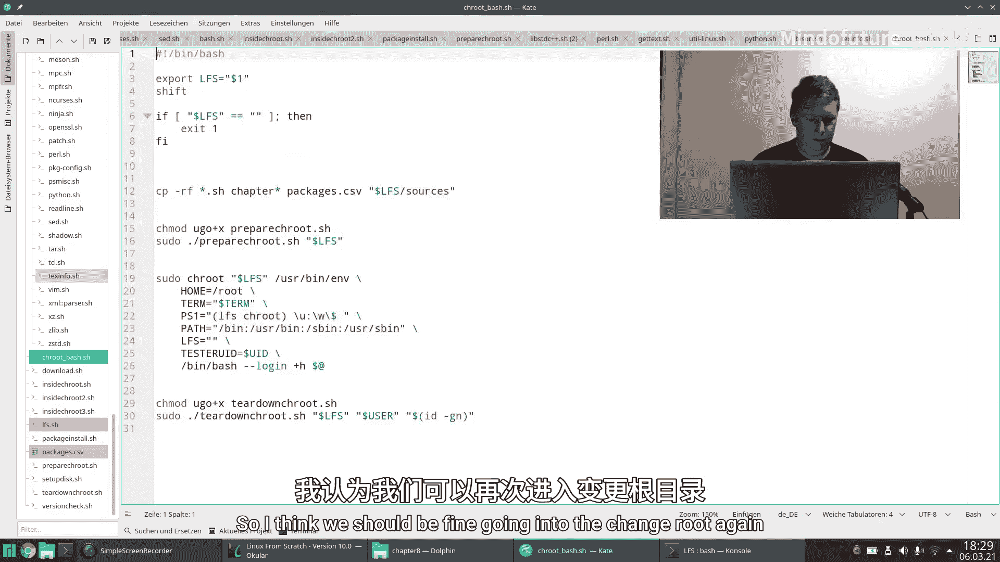
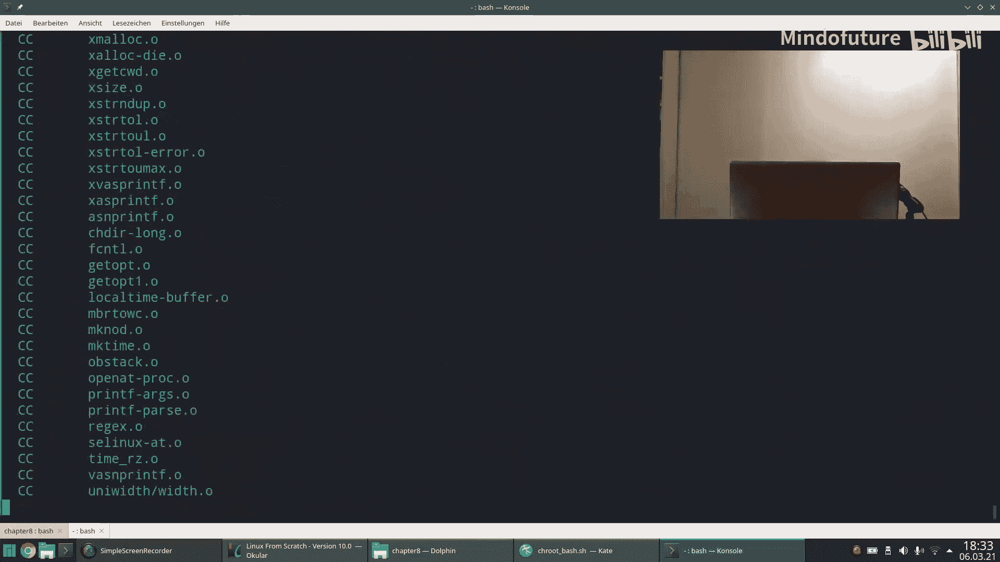
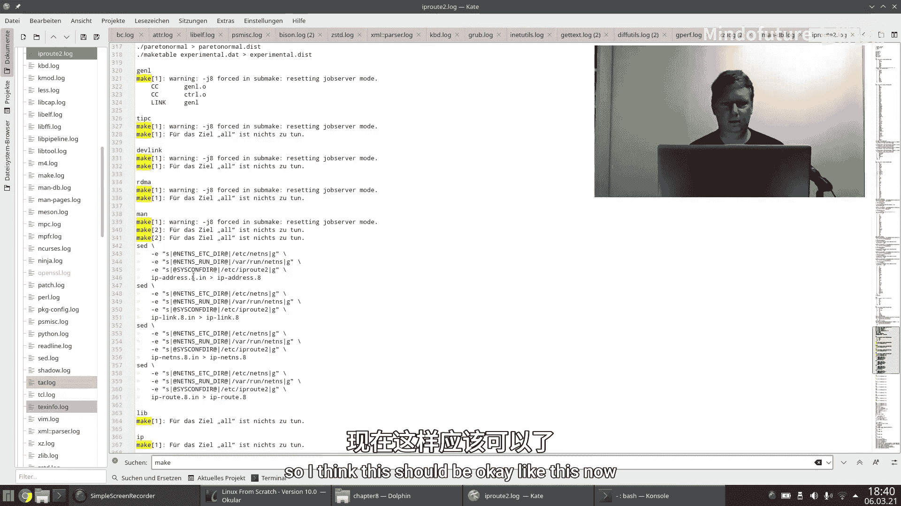

# 010：第9.5节-问题修正

在本节课中，我们将回顾并解决在构建Linux From Scratch过程中遇到的一些编译和测试问题。我们将分析日志文件，定位失败原因，并采取相应措施来修正脚本和跳过有问题的环节，以确保构建过程能够继续进行。

---

## 问题概述与日志分析

上一节我们完成了大部分工具的编译。然而，并非所有过程都如预期般顺利运行。

例如，`tar`工具的编译过程持续运行了很长时间，最终不得不通过按下 `Control+C` 来中断它。这预示着存在一些问题。

在检查日志文件后，我确认了问题的存在。当然，不可能阅读所有日志文件。以GCC的日志文件为例，它有近50万行，无法逐行阅读。

我通常的做法是直接查看日志文件的末尾，检查整个过程是否正常结束。在浏览这些日志时，有几个问题尤为突出。

---

## 具体问题与修正措施

以下是几个在自动测试环节出现问题的软件包及其处理方式。

### 1. Tar 工具测试问题

`tar` 的问题是它一直在运行，最终被我显式取消。其日志中提到“列出大于 2^33 字节的稀疏文件”。2^33 大约是 8GB。当我检查U盘时，发现 `tar` 工具的构建目录实际上有 10GB 之大，U盘几乎已满。

我不明白为何一个自动化测试需要生成 10GB 的示例数据。但无论如何，这让我们别无选择，只能禁用其自动测试。

**修正方法：**
在编译 `tar` 时，跳过 `make check` 步骤。

### 2. Gawk 工具测试问题

`gawk` 的测试以错误代码 2 结束。其日志文件相对较短，但同样出现在自动化测试环节。

**修正方法：**
同样，选择禁用 `gawk` 的自动测试。

### 3. Gnu A 工具测试问题

`gnu-a` 的测试也以错误结束，并且同样持续运行了很久。它请求一个伪终端，这可能在脚本运行时引发问题。

**修正方法：**
禁用 `gnu-a` 的自动测试。

### 4. Texinfo 工具测试问题

`texinfo` 启动了一些 `make` 进程并运行了几个自动测试。根据记忆，我也中断了这个过程。

**修正方法：**
禁用 `texinfo` 的自动测试。

---

## 缺失的软件包：IP Route 2

在检查日志文件数量时，我发现了一个不一致的地方。第8章有两个与这些脚本无关的章节。如果算上Vim，我们本应构建67个软件包，但日志文件显示只有66个。

经过核对，发现缺少 `iproute2` 软件包的日志文件。这意味着构建脚本根本没有尝试编译它。

**问题根源：**
检查 `package.csv` 文件，发现软件包名称为 `iproute2`，但对应的构建脚本名称却是 `iproute`（缺少了数字“2”）。



**修正方法：**
将构建脚本从 `iproute` 重命名为 `iproute2`，以确保它能被正确调用。



```bash
# 假设脚本位于 /mnt/lfs/sources 目录下
mv /mnt/lfs/sources/iproute /mnt/lfs/sources/iproute2
```

修正后，重新运行构建过程。虽然从中间环节重试可能存在风险（例如，后续软件的配置脚本可能依赖之前构建的组件），但为了不从头开始，我们决定尝试一下。

---



## 重新构建与备份

进入 `chroot` 环境后，我们重新构建了 `texinfo`、`tar`、`iproute2`、`gawk` 和 `gdb` 这几个有问题的软件包。

过程很快完成，没有出现明显的错误信息，这表明修正措施可能是有效的。

至此，我们已经编译了包括Vim在内的所有工具。我将在此处暂停，并创建一个系统备份。

**暂停原因：**
接下来的软件包是针对 System V init 系统的。我计划在此处分支视频系列：一个分支使用 System V init，另一个分支将使用 systemd。因为 Linux From Scratch 有两本手册，从此处开始它们将走向不同的方向。

备份完成后，我们将继续制作关于 System V init 系统的视频，后续再制作 systemd 版本。接下来的章节包含许多有趣的内容，敬请期待下一次的视频。

---

## 总结

本节课中，我们一起学习了如何分析和解决在构建 Linux From Scratch 时遇到的编译与测试问题。我们通过检查日志文件定位了 `tar`、`gawk`、`gnu-a` 和 `texinfo` 的测试失败，并采取了禁用自动测试的解决方案。同时，我们发现了 `iproute2` 软件包因脚本名不匹配而缺失构建的问题，并通过重命名脚本进行了修正。最后，我们在一个关键节点创建了备份，为后续探索不同的初始化系统（System V init 与 systemd）做好了准备。