# 011：System V Init 与网络配置 🖥️


在本节课中，我们将完成第8章剩余的System V Init相关软件包的编译，并进入第9章，学习如何配置System V Init系统以及基本的网络设置。我们将重点理解`/etc/inittab`文件的结构和运行级别（runlevel）的概念。

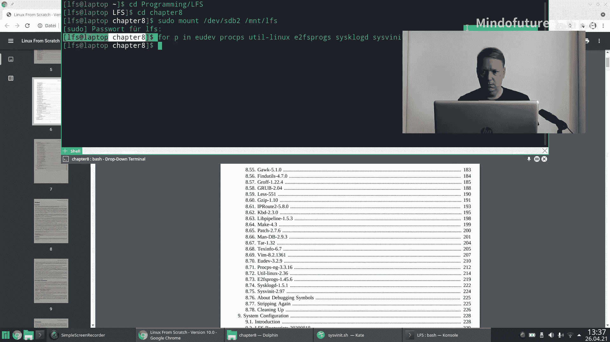

---

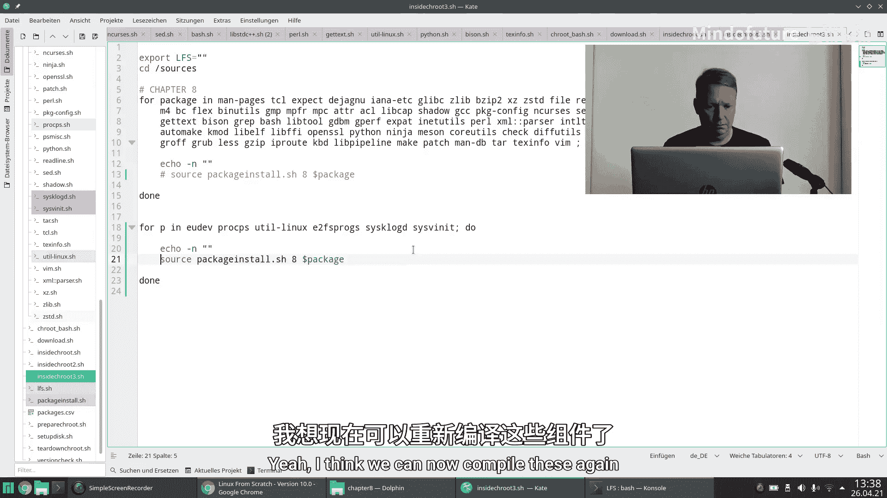

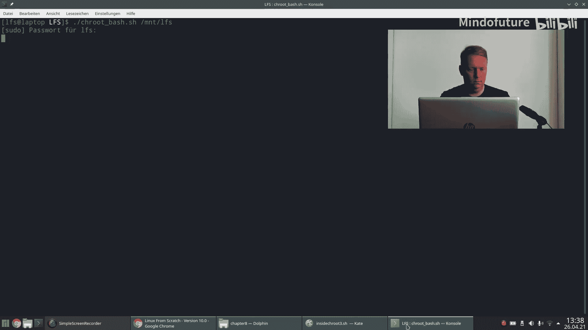

## 章节 8 收尾：编译System V Init相关软件包

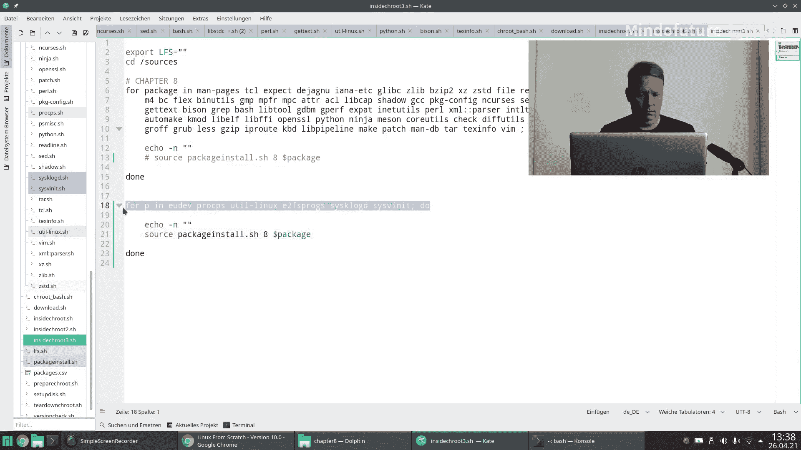

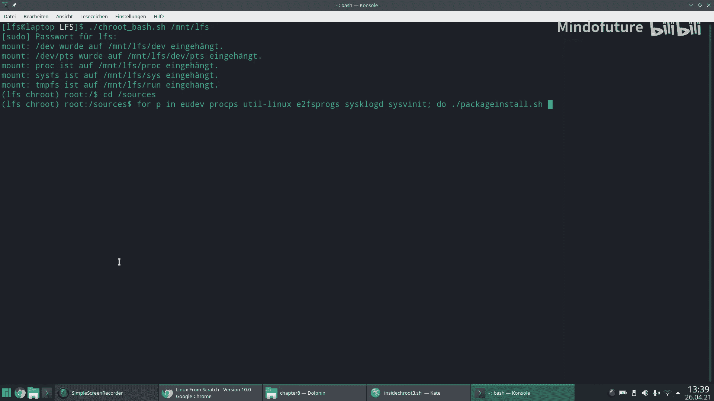

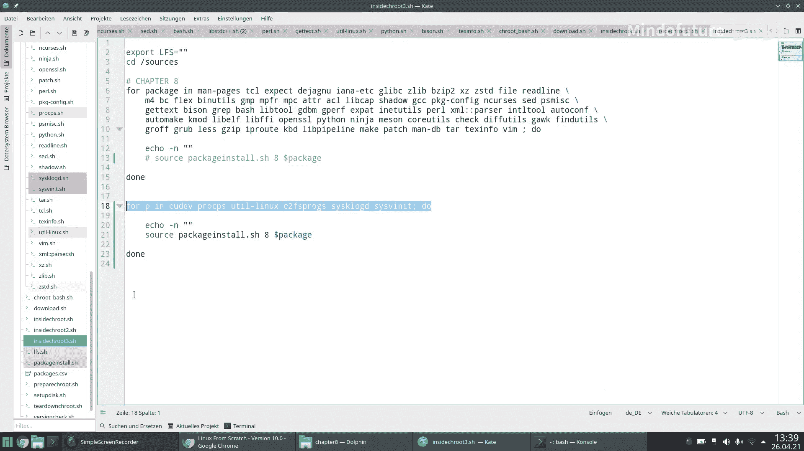

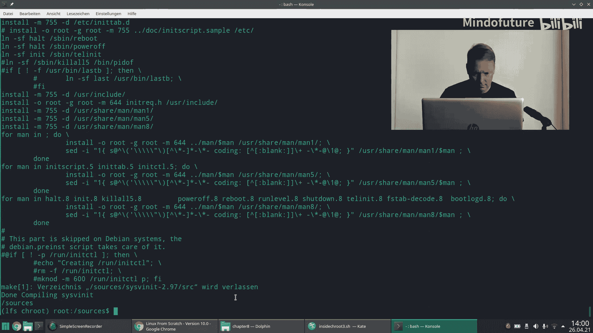

上一节我们完成了第8章的大部分内容。本节中，我们将编译最后几个专用于System V Init系统的软件包。

我们需要编译的软件包是 `eudev`、`procps` 和 `util-linux`。编译完成后，我们将正式完成第8章。

以下是编译和安装这些软件包的命令序列。请注意，我们假设您已处于正确的构建环境中。

```bash
# 编译 eudev
tar -xf eudev-*.tar.gz
cd eudev-*/
./configure --prefix=/usr           \
            --bindir=/sbin          \
            --sbindir=/sbin         \
            --libdir=/usr/lib       \
            --sysconfdir=/etc       \
            --libexecdir=/lib       \
            --with-rootprefix=      \
            --with-rootlibdir=/lib  \
            --enable-manpages       \
            --disable-static
make
make install
cd ..

# 编译 procps
tar -xf procps-*.tar.gz
cd procps-*/
make
make install
cd ..

# 编译 util-linux
tar -xf util-linux-*.tar.gz
cd util-linux-*/
./configure ADJTIME_PATH=/var/lib/hwclock/adjtime   \
            --docdir=/usr/share/doc/util-linux-* \
            --disable-chfn-chsh  \
            --disable-login      \
            --disable-nologin    \
            --disable-su         \
            --disable-setpriv    \
            --disable-runuser    \
            --disable-pylibmount \
            --disable-static     \
            --without-python     \
            --without-systemd    \
            --without-systemdsystemunitdir
make
make install
cd ..
```

编译完成后，建议检查各软件包的日志文件（log files），确认没有严重的错误（Severe errors）。虽然可能会有一些警告（warnings），但只要没有错误，通常可以继续。

---

## 进入第9章：配置System V Init系统

现在，我们进入第9章。本章的核心是配置System V Init系统，理解其工作原理，特别是启动脚本（boot scripts）的作用。

首先，我们需要创建一个新的脚本，用于切换到最终的系统根目录并执行后续配置。我们将其命名为 `init-change-root.sh`。

```bash
#!/bin/bash
# init-change-root.sh
chroot "$LFS" /tools/bin/env -i \
    HOME=/root                  \
    TERM="$TERM"                \
    PS1='(lfs chroot) \u:\w\$ ' \
    PATH=/bin:/usr/bin:/sbin:/usr/sbin \
    /tools/bin/bash --login +h
```

运行此脚本后，我们将进入最终的系统环境。

---

### 理解启动脚本与运行级别

System V Init 启动过程的核心是位于 `/etc/rc.d/init.d/` 目录下的启动脚本。`init` 进程会根据运行级别（runlevel）来决定执行哪些脚本。

运行级别由 `/etc/inittab` 文件定义。以下是一个典型的 `inittab` 文件结构示例：

```
id:3:initdefault:
si::sysinit:/etc/rc.d/rc.sysinit
l0:0:wait:/etc/rc.d/rc 0
l1:1:wait:/etc/rc.d/rc 1
l2:2:wait:/etc/rc.d/rc 2
l3:3:wait:/etc/rc.d/rc 3
l4:4:wait:/etc/rc.d/rc 4
l5:5:wait:/etc/rc.d/rc 5
l6:6:wait:/etc/rc.d/rc 6
ca::ctrlaltdel:/sbin/shutdown -t3 -r now
1:2345:respawn:/sbin/agetty --noclear tty1 9600
2:2345:respawn:/sbin/agetty tty2 9600
3:2345:respawn:/sbin/agetty tty3 9600
4:2345:respawn:/sbin/agetty tty4 9600
5:2345:respawn:/sbin/agetty tty5 9600
6:2345:respawn:/sbin/agetty tty6 9600
```

让我们解读关键部分：
*   **`id:3:initdefault:`** 定义系统启动后默认进入的运行级别（这里是3，多用户文本模式）。
*   **`si::sysinit:/etc/rc.d/rc.sysinit`** 指定系统初始化脚本。
*   **`l3:3:wait:/etc/rc.d/rc 3`** 对于运行级别3，执行 `/etc/rc.d/rc 3` 脚本。`wait` 动作表示init会等待该脚本执行完毕。
*   **`1:2345:respawn:/sbin/agetty ...`** 在运行级别2、3、4、5下，在tty1上启动一个getty登录进程。`respawn` 表示如果该进程终止，init会重新启动它。
*   **`ca::ctrlaltdel:/sbin/shutdown ...`** 定义按下Ctrl+Alt+Del组合键时的动作。

`/etc/rc.d/rc` 脚本会根据运行级别，进入 `/etc/rc.d/rcN.d/` (N为运行级别) 目录。该目录中包含指向 `/etc/rc.d/init.d/` 中实际脚本的符号链接。
*   以 **`S`** 开头的链接，会以 `start` 参数调用对应脚本，启动服务。
*   以 **`K`** 开头的链接，会以 `stop` 参数调用对应脚本，停止服务。

---

### 配置系统时钟与键盘

接下来，我们配置系统控制台。例如，设置键盘映射为德语布局并包含欧元符号：

```bash
# 设置控制台键盘映射
loadkeys de-latin1
# 设置控制台字体（可选）
setfont lat9w-16
```

创建 `/etc/sysconfig/console` 文件来持久化这些设置：

```bash
cat > /etc/sysconfig/console << "EOF"
KEYMAP="de-latin1"
FONT="lat9w-16"
EOF
```

---

### 配置Shell环境

我们创建 `/etc/profile` 和 `/etc/bashrc` 文件，为所有用户设置统一的Shell环境变量。

以下是 `/etc/profile` 示例，设置本地化环境：

```bash
cat > /etc/profile << "EOF"
# /etc/profile
# 设置系统范围的全局环境变量

export LANG=de_DE.UTF-8
export INPUTRC=/etc/inputrc
EOF
```

创建 `/etc/shells` 文件，列出所有合法的用户登录shell：

```bash
cat > /etc/shells << "EOF"
# /etc/shells
/bin/sh
/bin/bash
EOF
```

这个文件是一个安全特性，防止用户意外地将无效程序（如 `/bin/false`）设置为自己的登录shell而导致无法登录。

---

### 配置网络

最后，我们配置基本的静态网络。创建 `/etc/sysconfig/network-devices/ifconfig.eth0` 文件：

```bash
cat > /etc/sysconfig/network-devices/ifconfig.eth0 << "EOF"
ONBOOT=yes
SERVICE=ipv4-static
IP=192.168.1.30
GATEWAY=192.168.1.1
PREFIX=24
BROADCAST=192.168.1.255
EOF
```

*   `IP`: 为本机设置的静态IP地址。
*   `PREFIX=24`: 子网前缀，等同于子网掩码 `255.255.255.0`。这定义了本地网络的范围。
*   `GATEWAY`: 网关地址，用于访问本子网外的网络。

然后配置DNS解析器，创建 `/etc/resolv.conf` 文件：

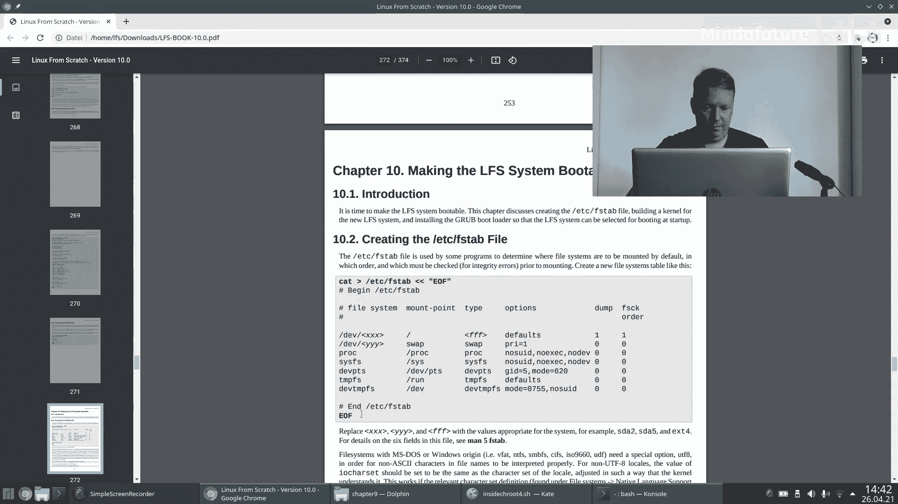

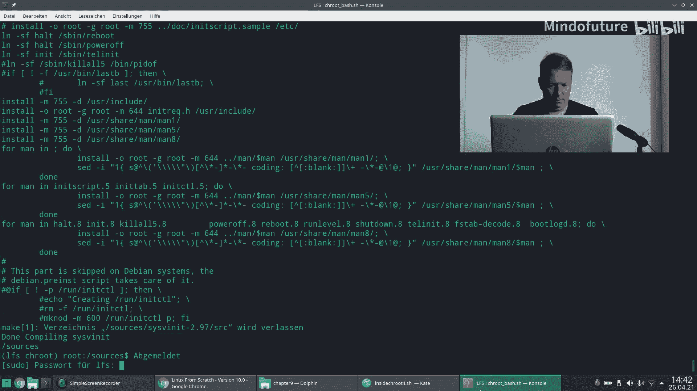

```bash
cat > /etc/resolv.conf << "EOF"
# /etc/resolv.conf
nameserver 192.168.1.1
EOF
```

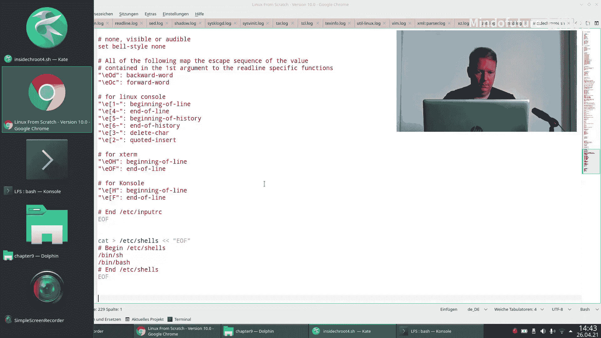

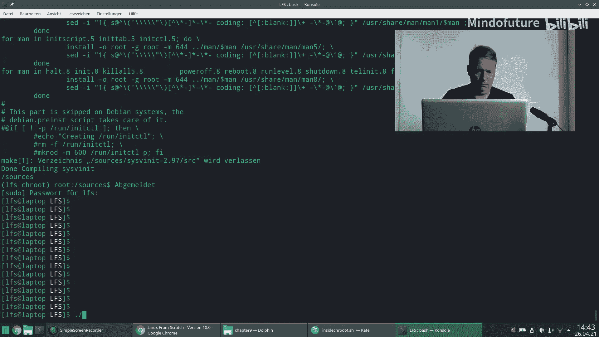

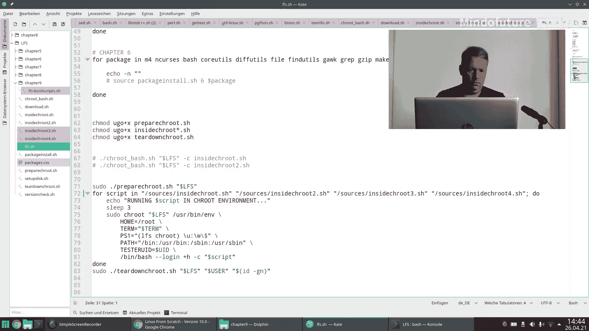

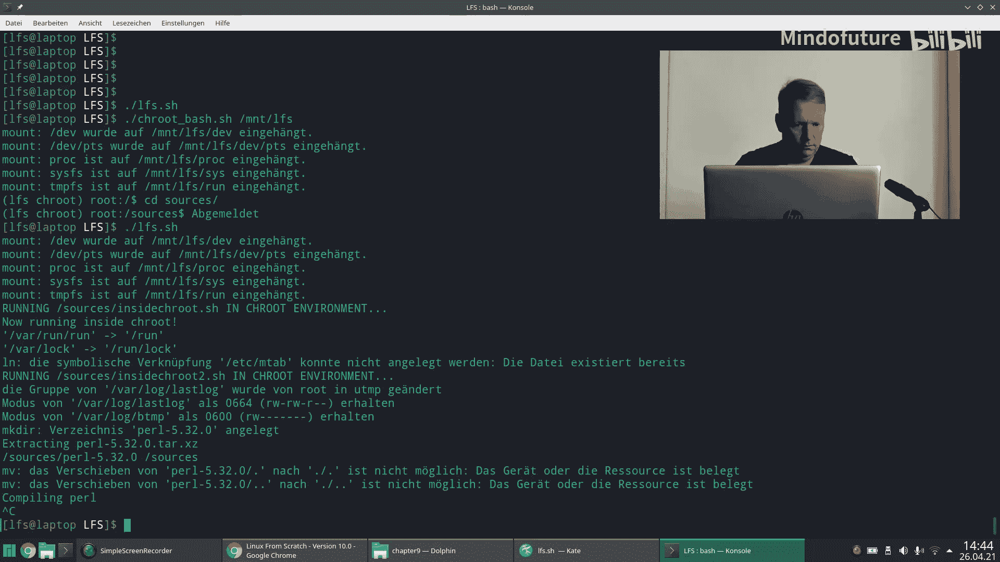

设置主机名，并更新 `/etc/hosts` 文件，实现本地主机名解析：

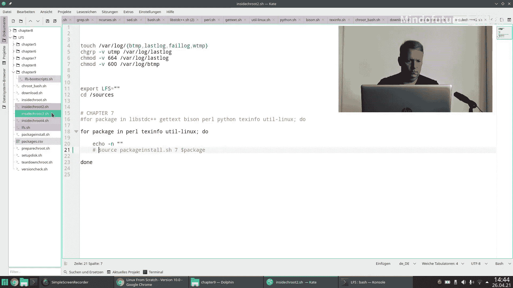

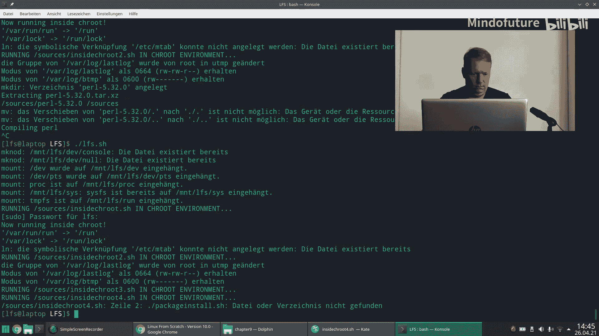

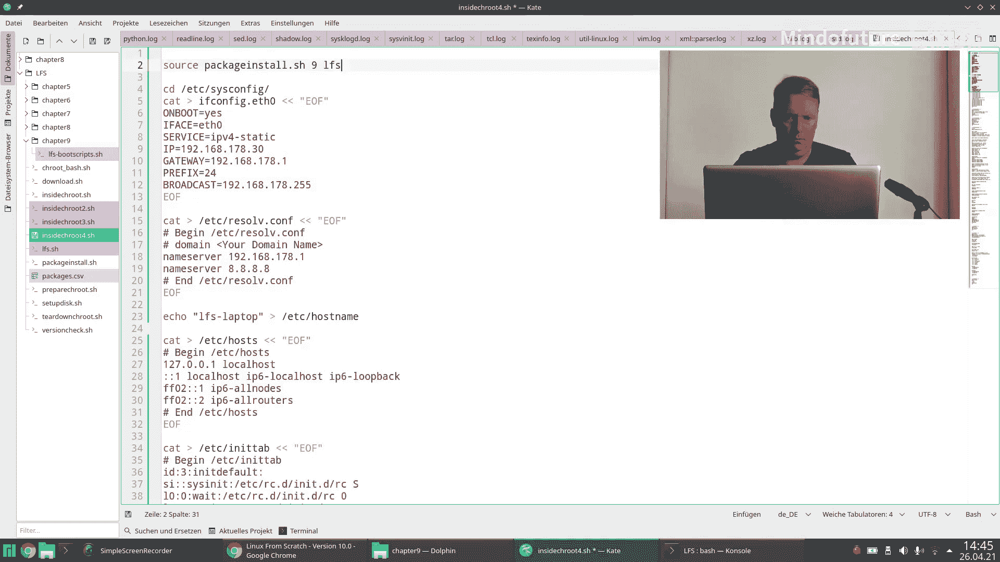

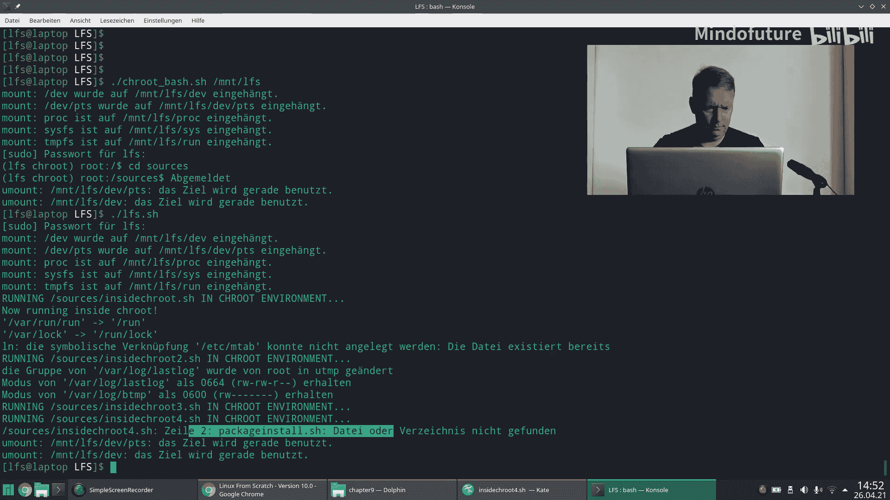

```bash
echo "lfs" > /etc/hostname

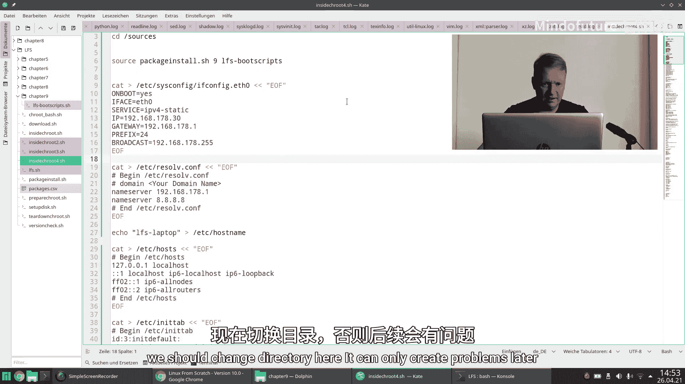

cat > /etc/hosts << "EOF"
# /etc/hosts
127.0.0.1  localhost
192.168.1.30 lfs
EOF
```

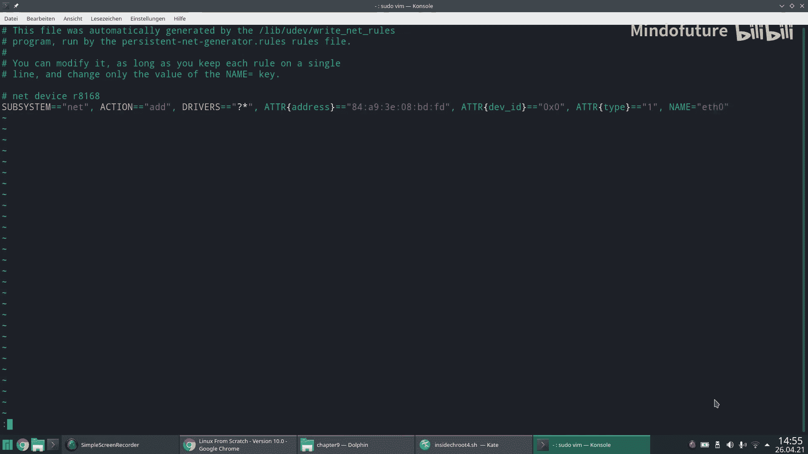

---

## 总结

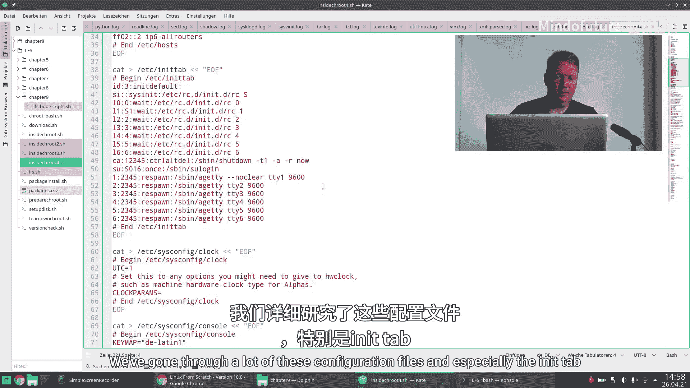

本节课中我们一起学习了：
1.  完成了第8章，编译了 `eudev`、`procps` 和 `util-linux` 软件包。
2.  进入了第9章，深入了解了System V Init系统。
3.  详细解析了 `/etc/inittab` 文件的构成和运行级别的概念，理解了 `rc` 脚本如何通过符号链接管理服务的启动与停止。
4.  配置了系统控制台的键盘映射。
5.  通过 `/etc/profile` 和 `/etc/bashrc` 配置了系统范围的Shell环境。
6.  完成了基本的静态网络配置，包括IP地址、网关、DNS和主机名。

现在，我们的系统已经具备了基本的启动和服务管理框架，并配置好了网络环境。下一章（第10章），我们将编译Linux内核、安装引导程序，并最终启动这个我们从零构建的系统。