# 012：内核编译与系统启动 🚀

在本节课中，我们将完成Linux From Scratch项目的最后一步：编译Linux内核并配置系统启动。我们将创建文件系统表、编译内核、安装引导程序，并最终尝试从我们构建的系统启动。

上一节我们完成了第9章的系统配置。本节中，我们来看看如何编译内核并使其能够启动。

## 挂载启动分区

首先，需要再次挂载USB密钥。这次，我们还需要挂载启动分区，因为需要将其配置为可启动状态。

## 创建文件系统表

以下是需要创建的文件系统表 `/etc/fstab` 的内容。它定义了系统启动时需要挂载的文件系统。

```bash
# 文件系统     挂载点       类型    选项               转储  检查顺序
/dev/sdb2      /            ext4    defaults            1     1
# /dev/sdb1    swap         swap    pri=1               0     0
/dev/sdb1      /boot        ext4    defaults            1     2
```

*   `/dev/sdb2` 是我们的根设备，将被挂载到根目录 `/`，文件系统类型是 `ext4`。
*   我们没有交换分区，因此注释掉相关行。
*   `/dev/sdb1` 是启动分区，将被挂载到 `/boot`。

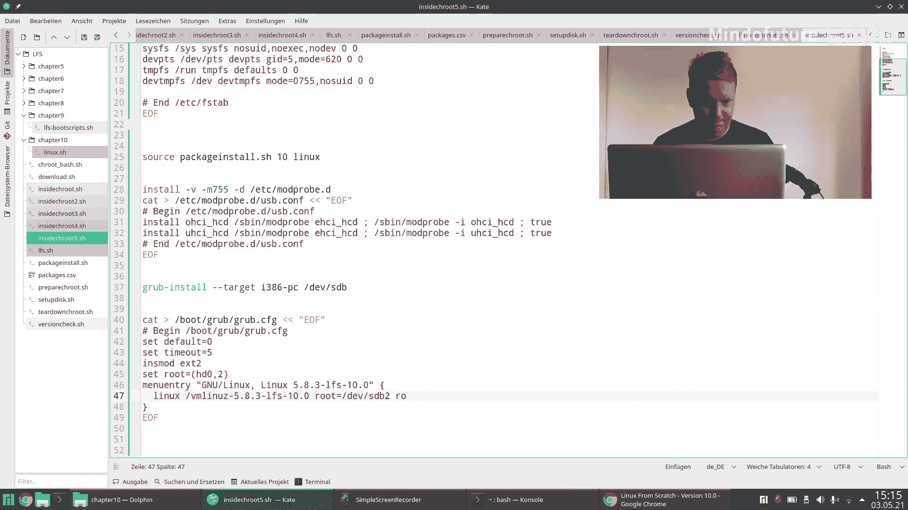

## 编译Linux内核

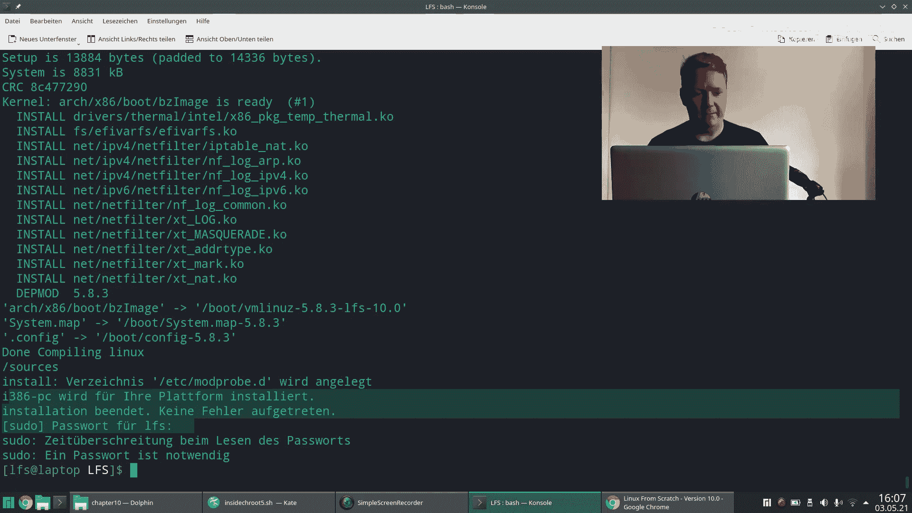

现在，我们进入最核心的步骤：编译Linux内核。关于内核编译的更多细节，可以参考专门的Linux内核编程系列视频。

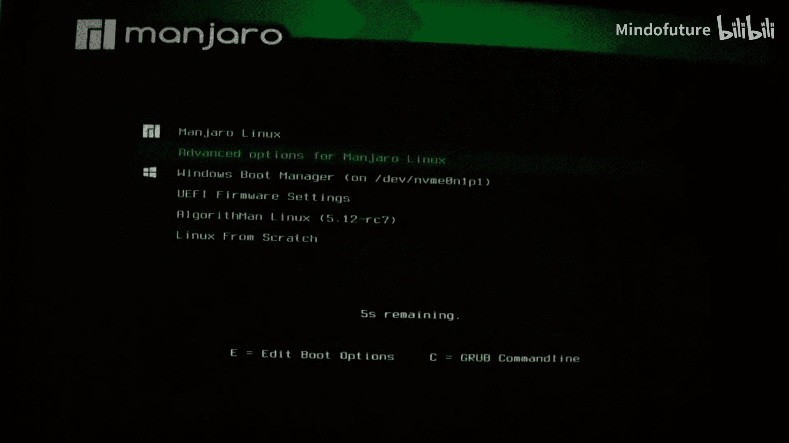

以下是编译内核的基本步骤：

1.  **清理源代码目录**：使用 `make mrproper` 命令清理目录，避免与之前可能失败的构建产生冲突。
2.  **生成默认配置**：使用 `make defconfig` 命令生成一个默认的内核配置文件 `.config`。我们这里不进行手动配置。
3.  **编译内核**：运行 `make` 命令开始编译内核。这个过程可能需要一些时间。
4.  **安装内核模块**：使用 `make modules_install` 命令将编译好的内核模块安装到 `/lib/modules` 目录下。
5.  **复制内核映像**：使用 `make install` 命令将内核映像、System.map文件和配置文件复制到 `/boot` 目录。

## 配置GRUB引导程序

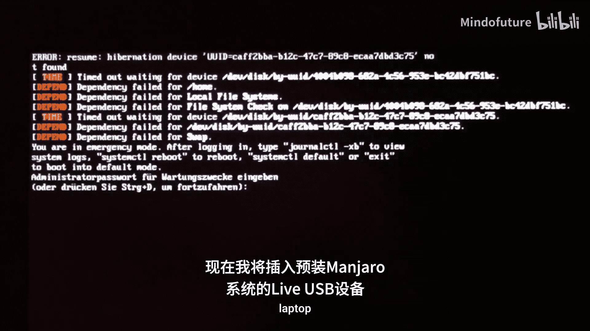

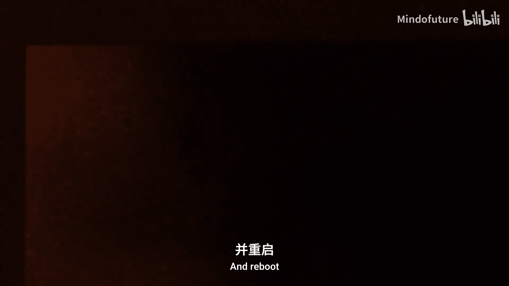

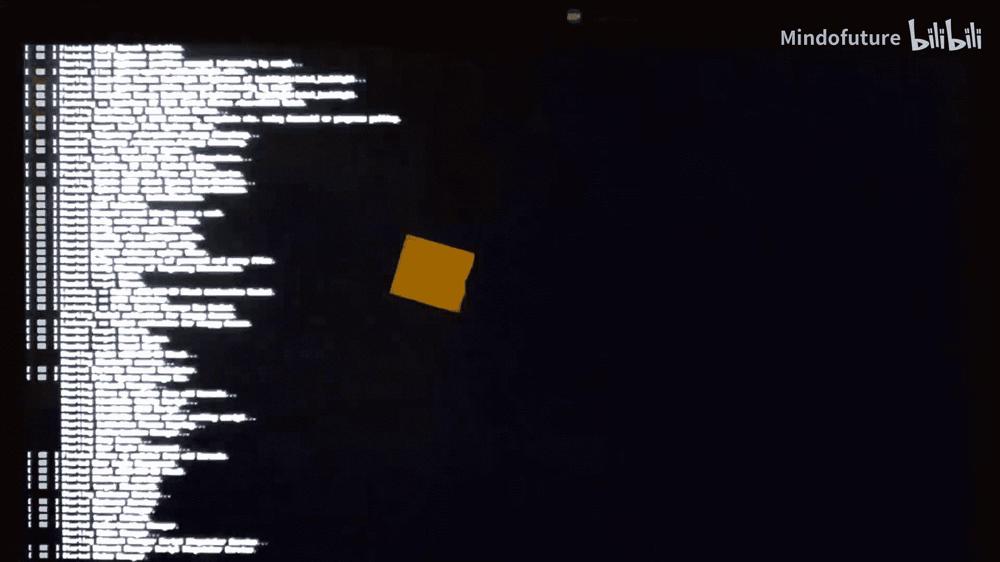

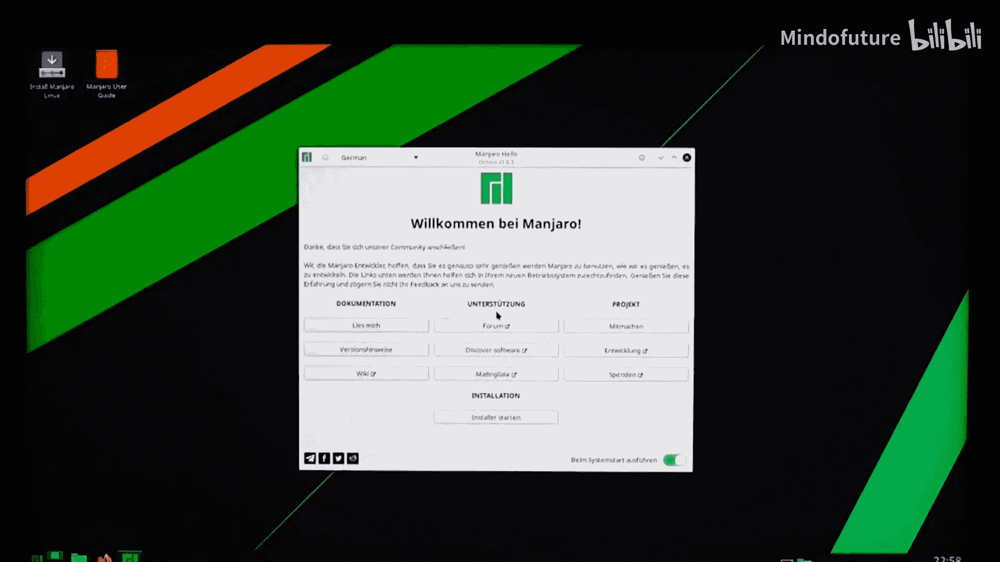

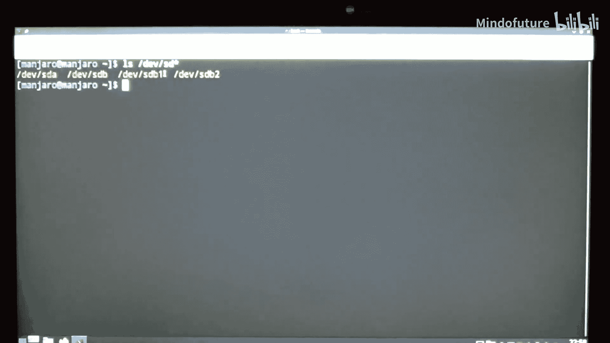

内核编译完成后，需要配置GRUB引导程序，以便系统能够启动。


以下是配置GRUB的步骤：

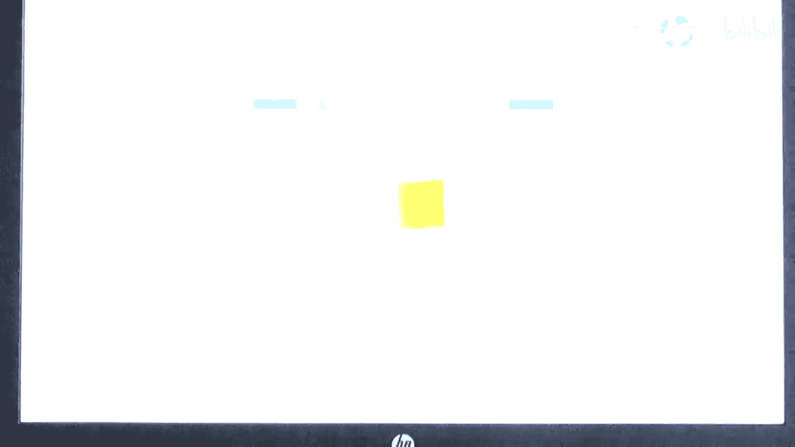

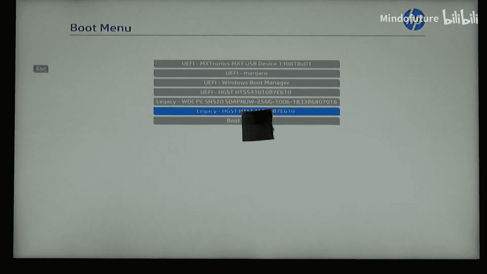

1.  **安装GRUB**：使用 `grub-install` 命令将GRUB安装到启动设备（例如 `/dev/sdb`）。注意，我们使用 `--target=i386-pc` 参数指定为传统BIOS模式，因为我们的USB密钥可能不支持UEFI。
2.  **生成GRUB配置文件**：创建 `/boot/grub/grub.cfg` 文件。以下是其核心内容：
    ```bash
    # 加载ext2文件系统模块
    insmod ext2
    # 设置根设备为第一个硬盘
    set root=(hd0)
    # 设置内核路径，注意这里的路径是相对于GRUB的根设备
    linux /vmlinuz root=/dev/sdb2
    # 设置初始内存盘（如果有的话）
    # initrd /initrd.img
    boot
    ```
    *   需要指定正确的根设备（例如 `root=/dev/sdb2`）。
    *   如果从USB设备启动，内核可能来不及识别设备，可以尝试在内核参数中添加 `rootwait` 或 `rootdelay=10`。

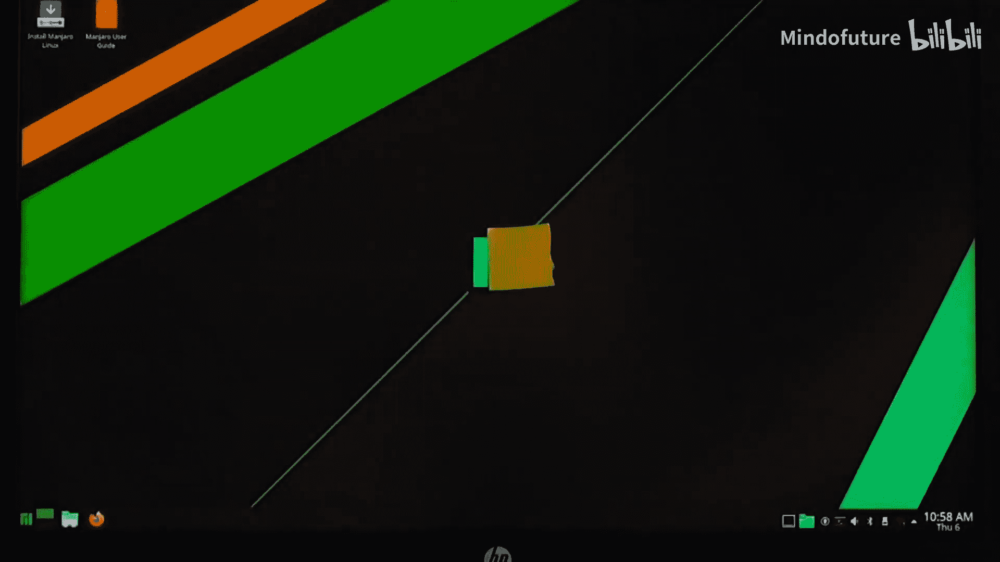

## 尝试启动与问题排查


配置完成后，尝试从构建的系统启动。

可能会遇到以下问题及解决方案：

1.  **无法从USB设备启动**：确保在BIOS/UEFI设置中选择了正确的启动模式（传统/Legacy BIOS）。对于USB设备，有时必须使用UEFI模式，但如果GRUB未编译UEFI支持，则可能需要使用传统模式。
2.  **启动设备未找到**：使用 `fdisk` 工具检查并确保启动分区已设置“可启动”标志。
    ```bash
    sudo fdisk /dev/sdb
    # 在fdisk交互界面中，使用 `a` 命令切换分区1的可启动标志，然后使用 `w` 命令写入。
    ```
3.  **内核恐慌：无法挂载根文件系统**：这通常是因为内核启动速度太快，USB设备尚未就绪。在内核启动参数中添加 `rootwait` 或 `rootdelay=10`。
    ```bash
    # 在GRUB命令行或grub.cfg的linux行中添加
    linux /vmlinuz root=/dev/sdb2 rootdelay=10
    ```

## 启动成功与后续步骤

成功解决上述问题后，系统将正常启动，出现登录提示符。登录后，可以执行基本命令，如 `echo`、`ping` 等，这标志着一个从零构建的Linux系统已经成功运行。

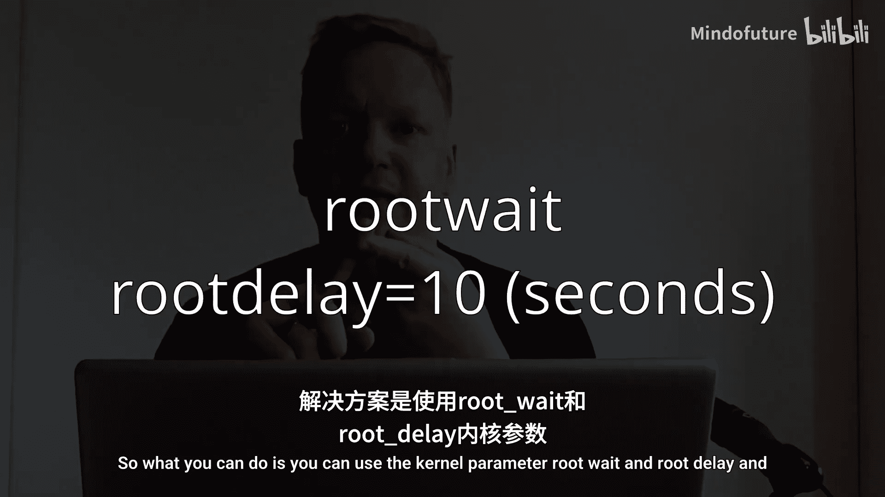

本节课中我们一起学习了如何编译Linux内核、配置GRUB引导程序以及解决启动过程中常见的各种问题，最终成功启动了我们的LFS系统。

## 超越LFS

在 [Linux From Scratch 官网](http://www.linuxfromscratch.org) 上，有一个“超越Linux From Scratch”的章节。它提供了大量流行软件包的编译指南，例如SSH服务器、图形服务器（X Window System）、桌面环境等。你可以根据这些指南，继续为你的系统添加更多功能。

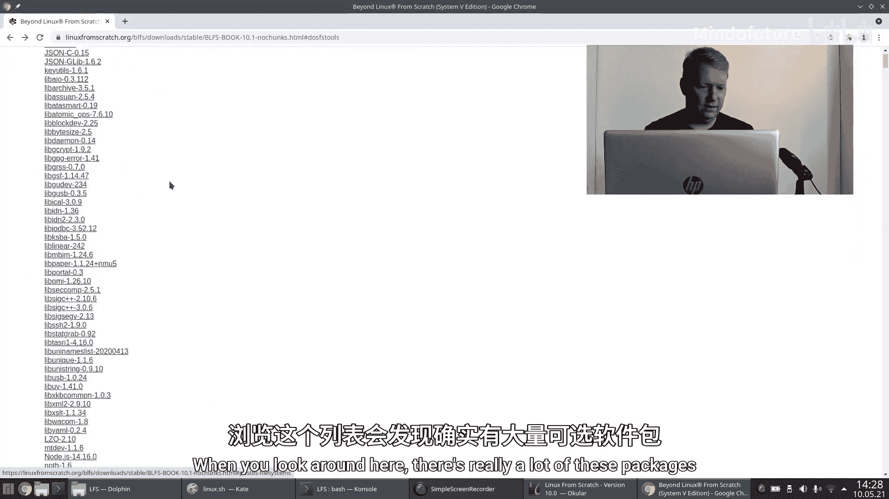

至此，从零构建Linux操作系统的主要旅程已经完成。如果你喜欢这个系列，欢迎分享和订阅。我们下次再见！