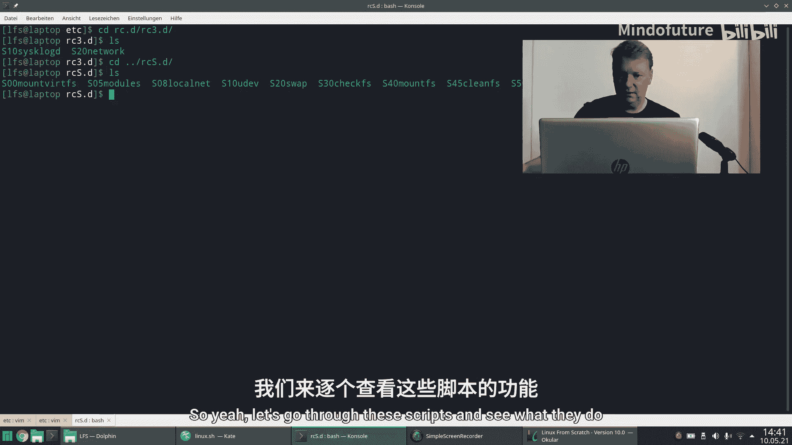
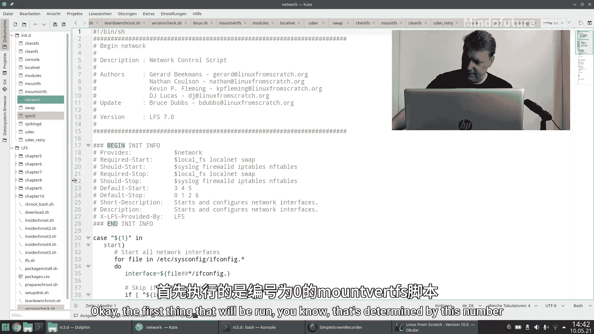
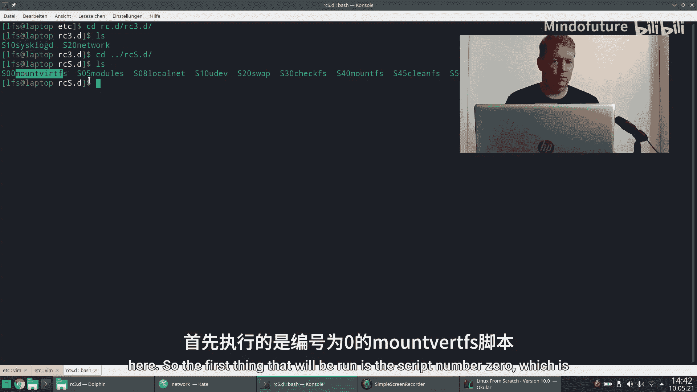
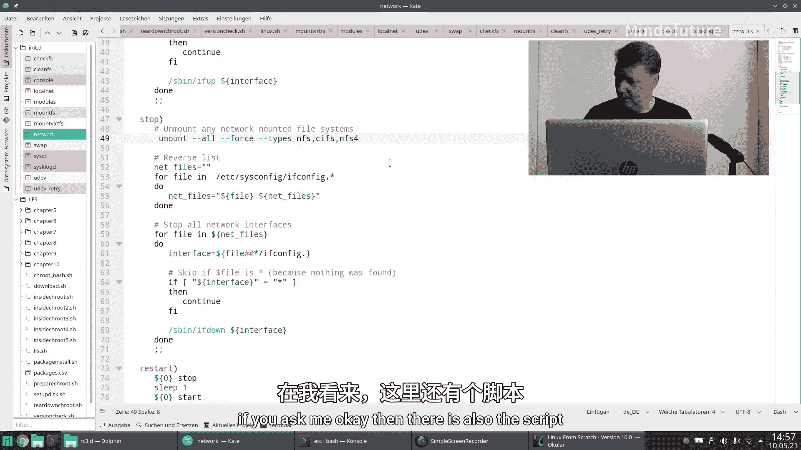
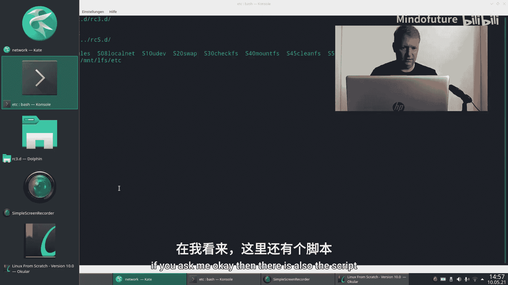
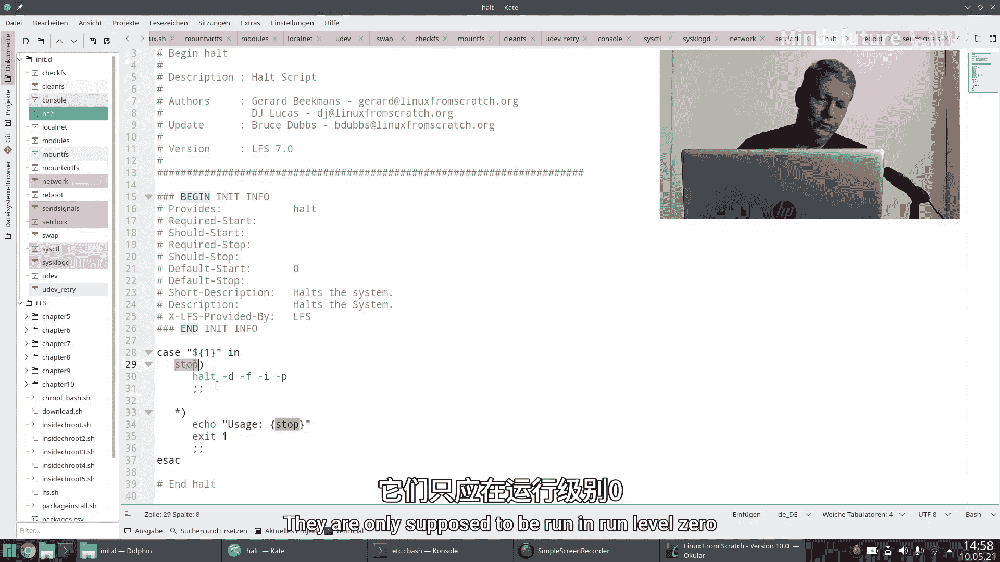
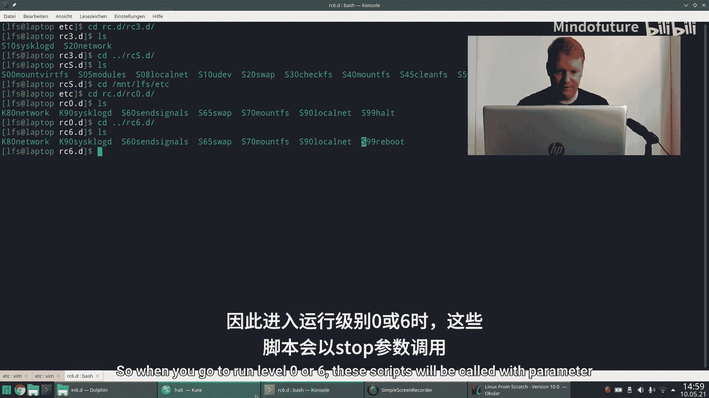
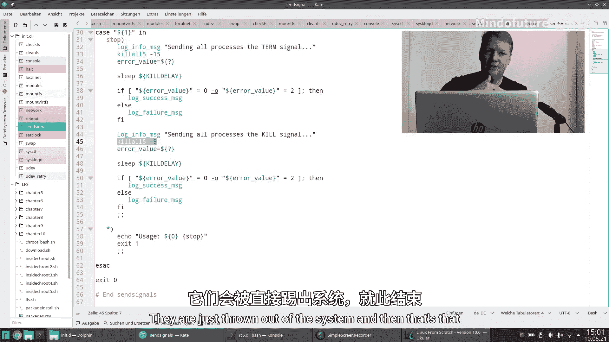

# 013：启动脚本详解 🚀

在本节课中，我们将深入剖析Linux系统的启动过程，特别是启动脚本（bootscripts）的工作原理。上一节我们完成了整个LFS系统的构建并成功启动，本节我们将详细拆解启动过程中各个脚本的作用，帮助你理解系统从开机到登录的完整流程。

## 概述

启动脚本是系统初始化过程的核心。它们负责在系统启动时设置硬件、挂载文件系统、加载内核模块、配置网络等关键任务。我们将逐一分析`/etc/rc.d/rc3.d/`目录下的脚本，了解每个脚本的功能和执行顺序。

## 启动流程回顾

计算机启动时，固件（Firmware）首先加载引导程序GRUB。GRUB读取其配置文件`grub.cfg`，找到内核文件（如`vmlinuz`）并加载它。内核启动后，会执行第一个用户空间程序`/sbin/init`。`init`程序读取`/etc/inittab`文件，根据默认运行级别（通常是3）执行相应的启动脚本。

## 启动脚本执行机制

`/etc/rc.d/rc`脚本是启动过程的总调度器。它的核心逻辑是遍历指定运行级别目录（如`/etc/rc.d/rc3.d/`）中的脚本，并按特定顺序执行。

以下是其执行逻辑的简化描述：

```bash
# 首先，停止所有以K开头的服务
for script in /etc/rc.d/rc3.d/K*; do
    $script stop
done

# 然后，启动所有以S开头的服务
for script in /etc/rc.d/rc3.d/S*; do
    $script start
done
```

脚本的执行顺序由文件名中的数字决定，数字越小，优先级越高。

## 启动脚本逐项解析

以下是`/etc/rc.d/rc3.d/`目录中主要脚本的详细说明。每个脚本通常接收`start`或`stop`参数，并据此执行不同的操作。

### 1. S00mountfs

这是第一个执行的脚本。它的主要功能是挂载虚拟文件系统。

*   **作用**：挂载`proc`、`devpts`、`tmpfs`、`sysfs`和`shm`等虚拟文件系统。这些是系统运行所必需的基础文件系统。
*   **对应操作**：我们在“切换根环境”的视频中也手动执行过类似操作。



### 2. S05modules



此脚本负责加载内核模块。



*   **作用**：读取`/etc/sysconfig/modules`文件中的模块列表，并使用`modprobe`命令逐一加载它们。
*   **关键命令**：`modprobe <module_name>`
*   **灵活性**：你可以通过修改配置文件路径来改变模块列表的来源。

### 3. S10localhost

此脚本配置本地网络。

*   **作用**：
    1.  将IP地址`127.0.0.1`（localhost）分配给回环接口。
    2.  从`/etc/hostname`文件中读取并设置系统的主机名。

### 4. S20udev

此脚本启动设备管理守护进程`udev`。

*   **作用**：
    1.  启动`udev`守护进程。
    2.  让`udev`为内核已发现的设备创建设备节点（位于`/dev`目录）。
    3.  后续如果有新的设备被内核发现（热插拔事件），`udev`会自动为其创建设备节点。

### 5. S30swap

此脚本管理交换空间（swap）。

*   **作用**：
    *   `start`：运行`swapon -a`，启用所有在`/etc/fstab`中定义的交换分区。
    *   `stop`：运行`swapoff -a`，禁用所有交换分区。
    *   `restart`：先执行`stop`，再执行`start`。

### 6. S40checkfs

此脚本执行文件系统检查。

*   **作用**：运行`fsck`命令，检查并修复非根文件系统。根文件系统通常在启动早期由内核检查。

### 7. S45mountfs

此脚本挂载所有用户定义的文件系统。

*   **作用**：
    *   `start`：运行`mount -a`，挂载`/etc/fstab`文件中定义的所有文件系统。
    *   `stop`：运行`umount -a`，卸载所有文件系统。

### 8. S47cleanfs

此脚本执行清理任务。

*   **作用**：清理临时目录（如`/tmp`），并检查一些系统目录的访问权限，确保系统环境整洁。

### 9. S50udev_retry

此脚本再次尝试设备发现。

*   **作用**：由于在挂载根文件系统之前，某些设备的发现可能失败（例如，驱动模块位于尚未挂载的根文件系统上），此脚本在根文件系统挂载后，再次运行`udev`以发现这些设备。

### 10. S55console

此脚本配置控制台。

*   **作用**：
    1.  运行`loadkeys`，加载键盘映射。
    2.  运行`setfont`，设置控制台字体。
    *   这些也是我们在手动配置系统时执行过的步骤。

### 11. S60sysctl

此脚本应用内核参数调整。

*   **作用**：运行`sysctl -p /etc/sysctl.conf`，加载并应用`/etc/sysctl.conf`文件中定义的内核参数。在我们的LFS系统中，此文件尚未创建。

### 12. S65clock

此脚本配置系统时钟。



*   **作用**：运行`hwclock`命令，根据硬件时钟（RTC）设置或同步系统时间。有趣的是，在默认的LFS配置中，这个脚本似乎从未被执行，但它仍然存在以供需要时启用。



### 13. S70network

此脚本配置网络接口。

*   **作用**：遍历`/etc/sysconfig/network-devices/`目录下的网络接口配置文件（如`ifconfig.eth0`），并对每个接口运行`ifup`命令来启动它。
*   **停止操作**：运行`stop`时，它会运行`ifdown`并尝试卸载所有网络文件系统。需要注意的是，如果系统有多个网络接口，这可能会误卸载通过其他接口访问的网络资源。



## 特殊运行级别的脚本

有些脚本的工作方式比较特殊，它们主要在运行级别0（关机）和6（重启）中被调用。

### S01halt 与 S06reboot



这两个脚本在正常启动（运行级别3）时被调用`start`参数不会执行任何操作。它们只在切换到运行级别0或6时，被`rc`脚本以`stop`参数调用。

*   **S01halt**：执行`halt`命令，关闭计算机。
*   **S06reboot**：执行`reboot`命令，重新启动计算机。

### S05sendsignals

此脚本负责在关机或重启前终止所有进程。



*   **作用**：
    1.  首先向所有进程发送`SIGTERM`（信号15），请求它们优雅地终止。
    2.  等待一段时间。
    3.  向仍未退出的进程发送`SIGKILL`（信号9），强制终止它们。

## 总结

本节课中，我们一起深入学习了Linux系统的启动脚本。我们从GRUB加载内核开始，跟踪到`init`进程执行`/etc/rc.d/rc`脚本，并详细分析了运行级别3下每个启动脚本的具体功能，包括挂载文件系统、加载模块、配置网络、管理设备等。我们还了解了用于关机和重启的特殊脚本的工作机制。通过本次学习，你现在应该对Linux从按下电源键到出现登录提示符的整个初始化过程有了清晰而完整的认识。