# 015：内核与引导

## 概述
在本节课中，我们将完成Linux内核的编译与安装，并配置GRUB引导加载程序，最终尝试启动我们构建的系统。

上一节我们完成了系统基础服务和网络的配置。本节中，我们来看看如何编译内核并设置引导。

---

## 创建文件系统表
首先，我们需要定义根设备。这是一个ext2设备。我们尚未设置交换分区，因此将其关闭。同时需要访问引导驱动器。

以下是`/etc/fstab`文件的内容示例：
```
# 文件系统  挂载点  类型  选项       转储  检查顺序
/dev/sdb2   /       ext2 defaults    0     1
/dev/sdb1   /boot   ext2 defaults    0     2
```

---

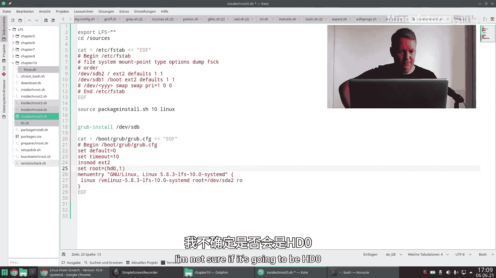

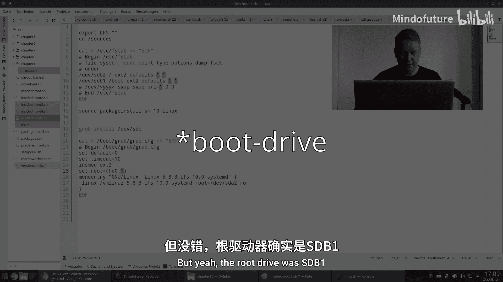

## 编译Linux内核
接下来，我们开始编译Linux内核。首先进入内核源码目录。

以下是编译内核的基本步骤：

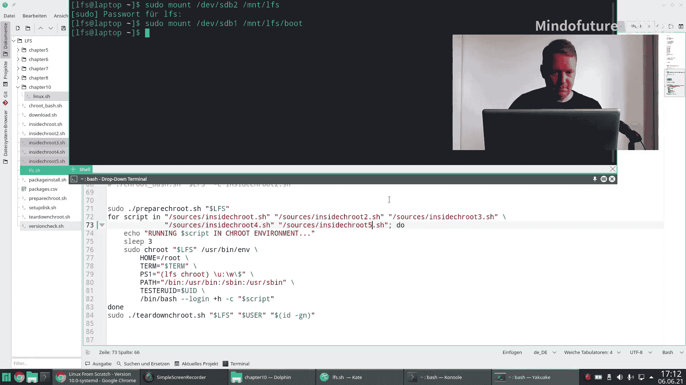

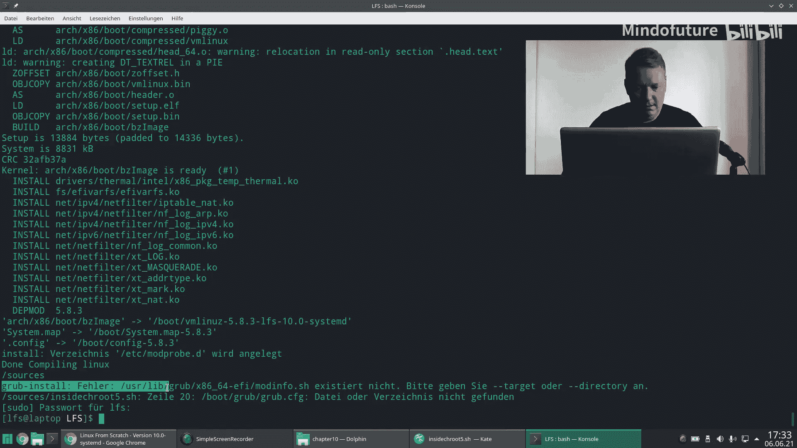

1.  **清理源码树**：执行`make mrproper`命令。此命令会重置源码树，清除所有之前的构建产物。虽然对于新解压的目录可能不是必须的，但为了避免构建失败，建议执行此步骤。
2.  **生成配置**：使用`make defconfig`命令生成默认配置。这比手动使用`make menuconfig`进行配置更简单快捷。
3.  **编译内核**：执行`make`命令开始编译内核。
4.  **安装模块**：编译完成后，使用`make modules_install`命令将所有模块和驱动程序安装到目标位置。
5.  **安装内核**：使用`make install`命令将内核安装到`/boot`目录。

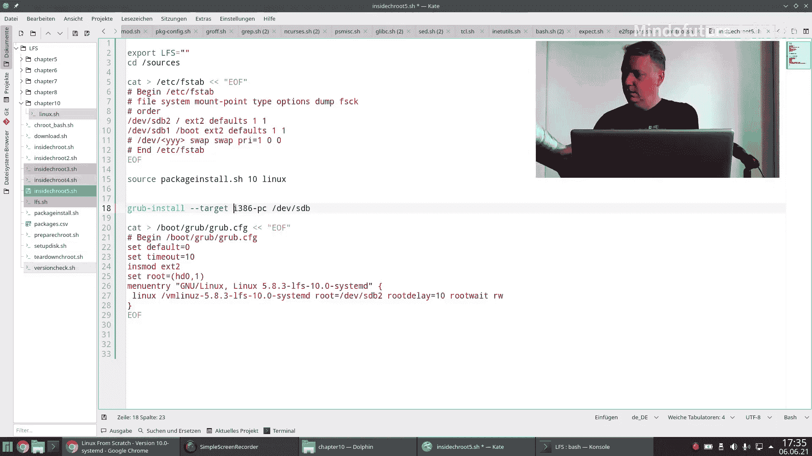

编译过程可能需要一些时间。

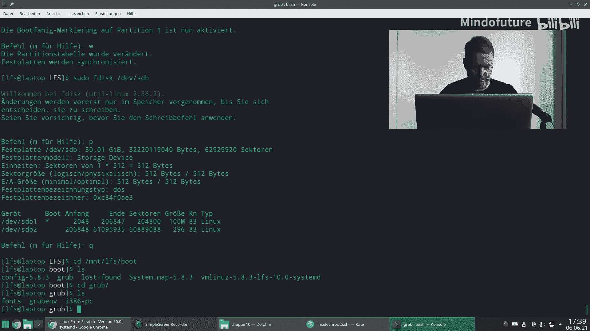

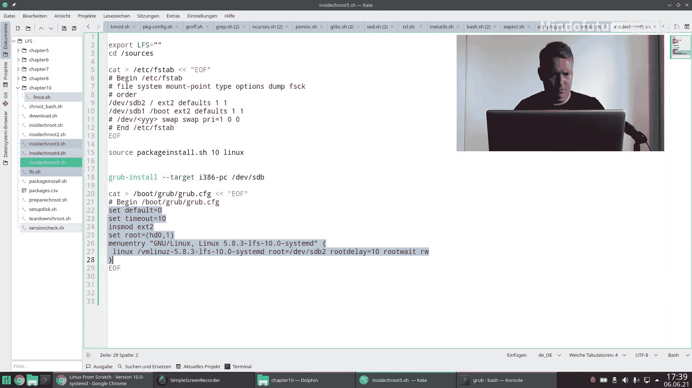

---

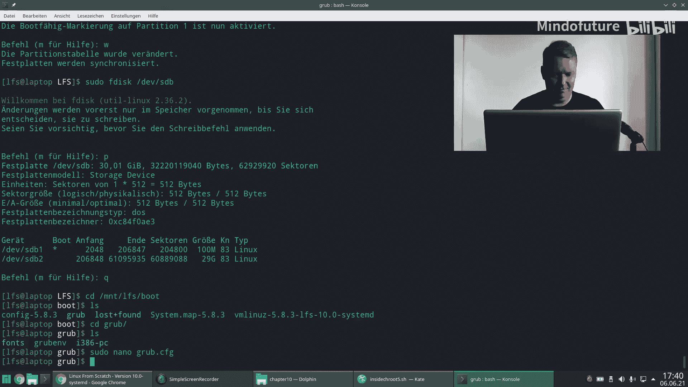


## 配置GRUB引导加载程序
内核安装完成后，我们需要安装引导加载程序。这里使用GRUB。

以下是安装和配置GRUB的步骤：

1.  **安装GRUB**：在宿主系统（非LFS环境）中，对目标磁盘（例如`/dev/sdb`）运行`grub-install`命令。
    ```bash
    grub-install /dev/sdb
    ```
    如果系统以UEFI模式启动，可能需要指定目标平台为`i386-pc`（即传统BIOS模式）：
    ```bash
    grub-install --target=i386-pc /dev/sdb
    ```
2.  **生成GRUB配置文件**：创建`/boot/grub/grub.cfg`文件。以下是一个基本配置示例：
    ```bash
    set timeout=10
    set default=0

    menuentry "GNU/Linux, Linux 5.15.12-lfs-11.0" {
        linux /vmlinuz-5.15.12-lfs-11.0 root=/dev/sdb2 ro rootdelay=10 rootwait
    }
    ```
    *   `timeout`：引导菜单等待时间（秒）。
    *   `default`：默认启动项索引（从0开始）。
    *   `linux`：指定内核文件路径。注意，如果`/dev/sdb1`挂载到`/boot`，那么内核文件在设备上的路径就是`/vmlinuz-...`。
    *   `root`：指定根文件系统设备。
    *   `ro`：以只读方式挂载根文件系统。
    *   `rootdelay`和`rootwait`：为解决从USB等慢速设备启动时，内核可能因等待设备就绪超时而导致启动失败的问题，可以添加这些参数。

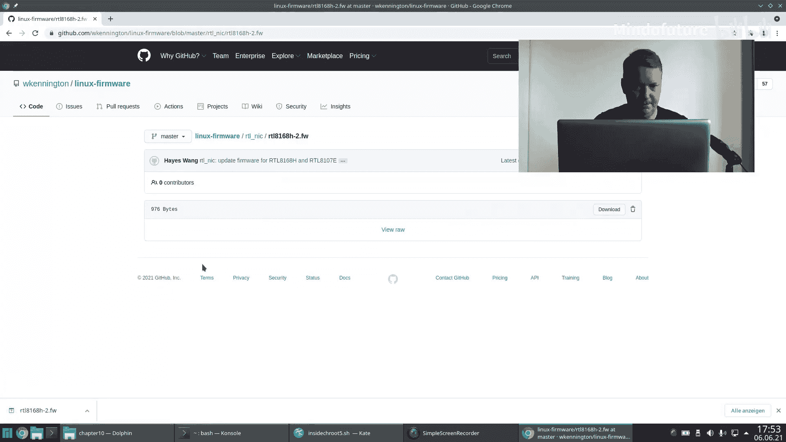

3.  **设置引导标志**：确保引导分区（例如`/dev/sdb1`）被标记为可引导。可以使用`fdisk`工具进行设置：
    ```bash
    fdisk /dev/sdb
    # 在fdisk交互界面中，输入 `a` 并选择分区1，然后写入（`w`）退出。
    ```

---

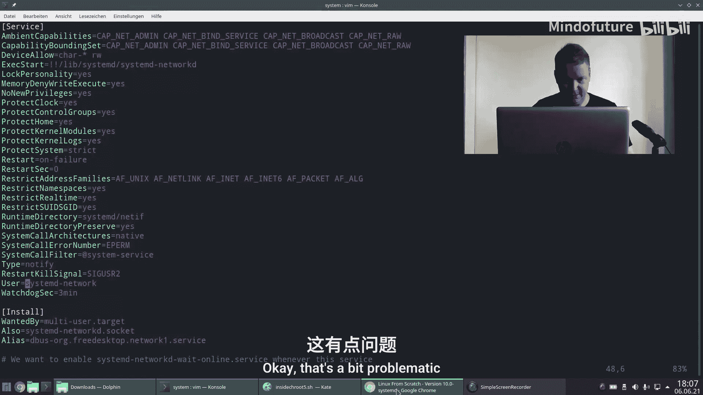

## 测试启动系统
完成上述步骤后，可以尝试启动新系统。

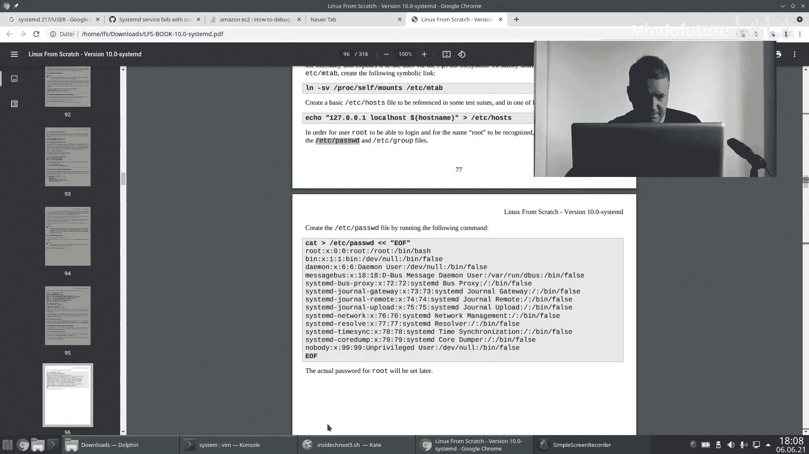

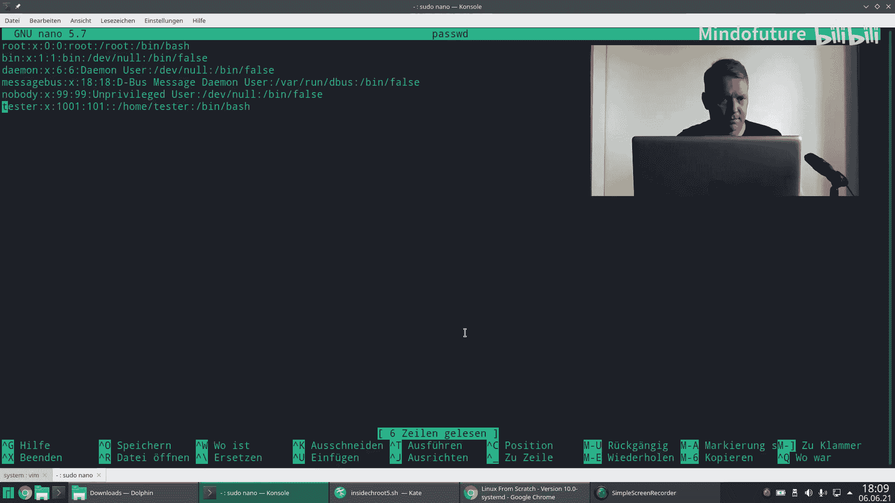

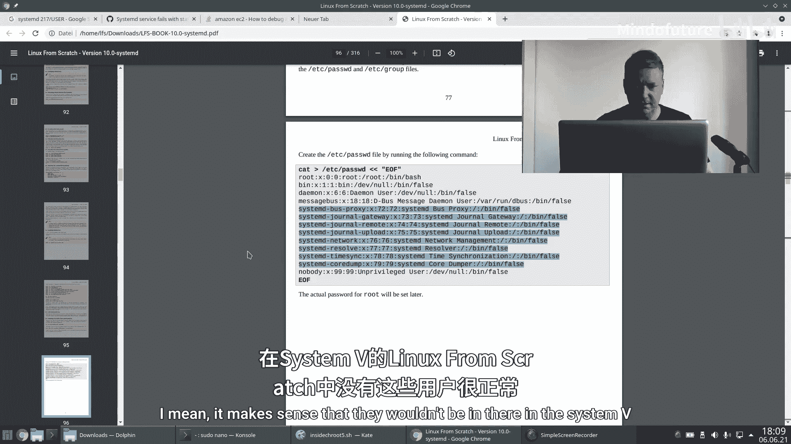

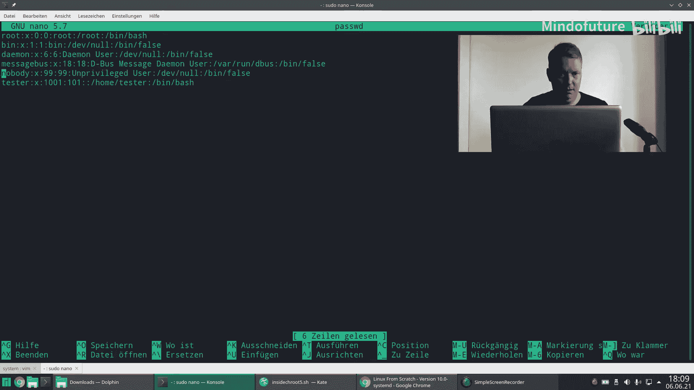

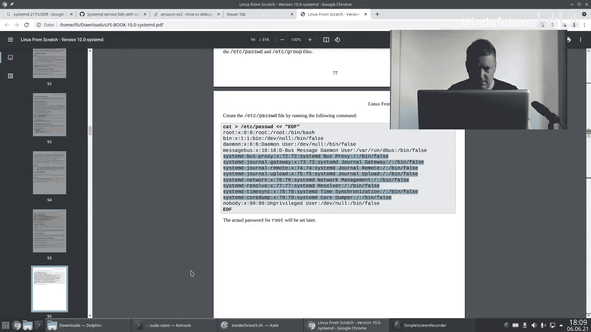

1.  将构建好的磁盘插入目标机器或配置虚拟机从其启动。
2.  在BIOS/UEFI设置中，确保从该磁盘启动。
3.  如果一切顺利，应该能看到GRUB引导菜单，并成功启动内核。
4.  系统启动后，可以尝试登录并执行基本命令，例如`echo`、`ping`等。

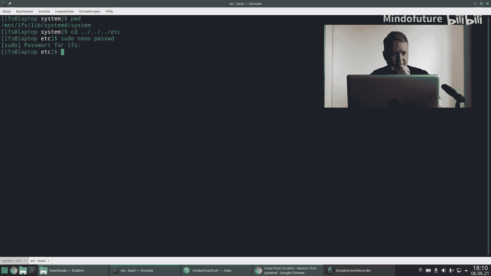

在测试过程中，可能会遇到一些问题，例如网络服务启动失败。这可能是由于缺少必要的固件文件或系统用户配置不匹配导致的。例如，`systemd-networkd`服务可能需要以特定的系统用户（如`systemd-network`）运行，如果该用户不存在，服务就会启动失败。解决方法是根据系统需求创建相应的用户和组。

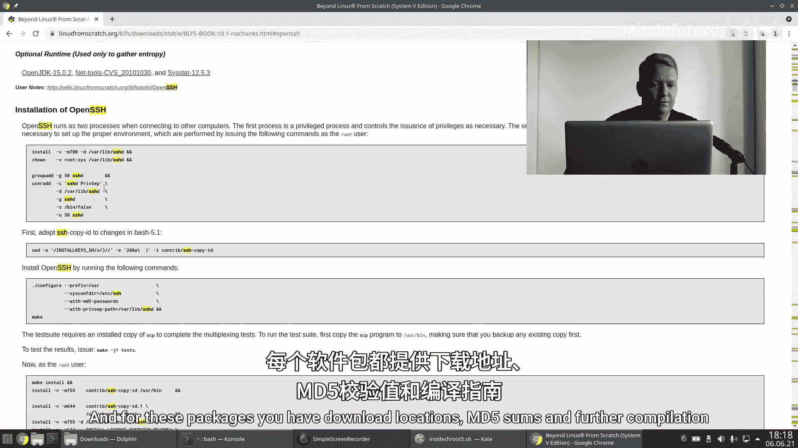

---

## 总结
本节课中我们一起学习了如何编译Linux内核、安装GRUB引导加载程序以及配置系统启动。我们成功地从自己构建的系统中启动，并进入了Bash shell。虽然可能遇到如网络服务等小问题，但核心的启动过程已经完成。

构建一个可用的Linux系统主要步骤至此已基本结束。但这只是一个起点。在“Beyond Linux From Scratch”项目中，还可以安装更多软件包，如SSH服务器、图形界面（X11/Wayland）、桌面环境（KDE, GNOME等）来扩展系统的功能。后续可以根据需要继续探索和构建。