# 002：安装LLVM 🛠️

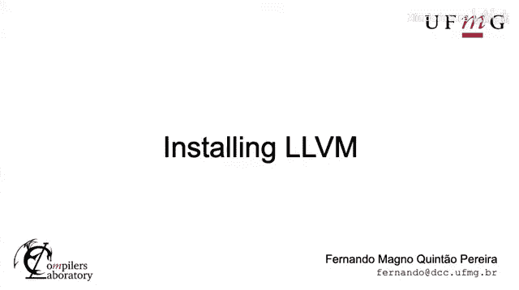


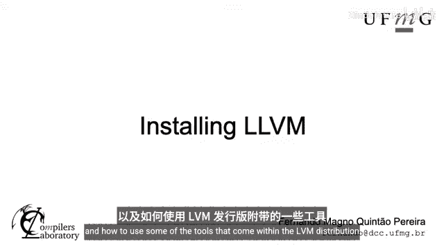

在本节课中，我们将学习如何安装LLVM以及如何使用其发行版中包含的一些工具。我们将介绍两种主要的安装方法：二进制发行版安装和从源代码编译安装。

## 安装方式选择

关于在本地系统安装LLVM，有几种不同的方法。本节我们将探讨两种主要途径。

首先，你需要决定是安装二进制发行版还是源代码。安装LLVM的二进制版本速度更快，因为你无需下载源代码并在本地编译。如果你的硬盘空间有限，这种方式占用的空间也更少。

然而，如果你安装并编译源代码，之后可以对其进行修改。只要遵守许可证（Apache 2.0，这是一种非常宽松的许可证），你甚至可以分发修改后的版本。

## 安装二进制发行版

让我们先看看如何安装二进制发行版。

在macOS上，你可以使用Homebrew来安装Brew仓库中可用的最新LLVM发行版。这将安装LLVM及其所有依赖项。

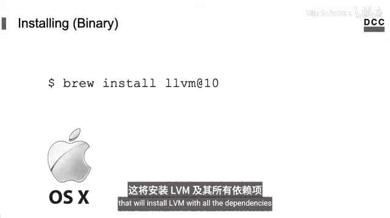

```bash
brew install llvm
```

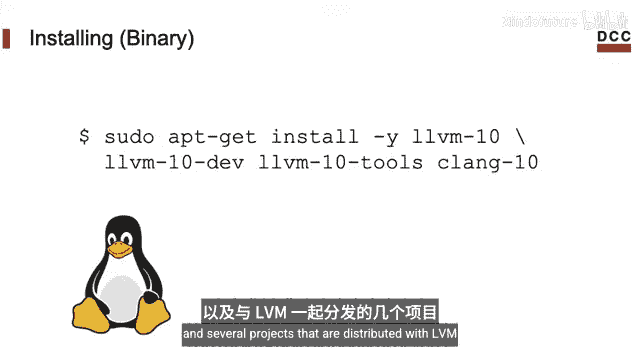

在Linux上，你可以使用包管理器，例如`apt`，来安装。你甚至可以安装像Clang这样的编译工具以及随LLVM一起分发的其他项目。


```bash
sudo apt-get install llvm clang
```

## 从源代码安装LLVM

另一种获取LLVM的方式是从源代码安装。


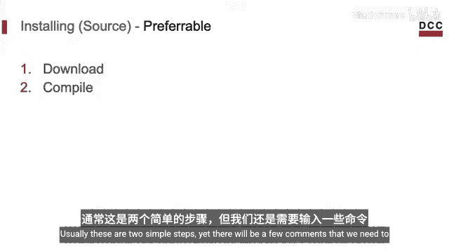

在这种情况下，我们必须下载其源代码然后进行编译。这是本课程将采用的选项。如果条件允许，你应该优先选择这种方式，因为它为你提供了完整的LLVM源代码，我们可以随时查阅。

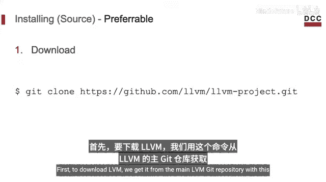

要从源代码安装LLVM，我们需要执行两个步骤：下载和编译。通常这是两个简单的步骤，但需要输入一些命令。

### 下载源代码

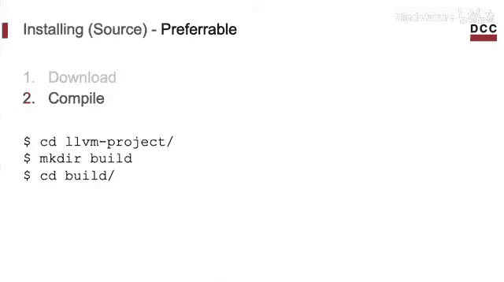

首先，从主要的LLVM Git仓库下载源代码。

```bash
git clone https://github.com/llvm/llvm-project.git
```

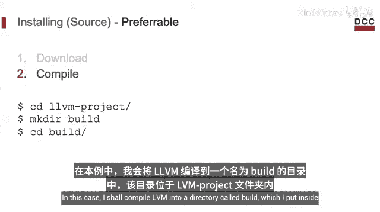

### 编译源代码

现在开始编译。我们首先需要决定一个合适的位置来存放编译生成的二进制文件。

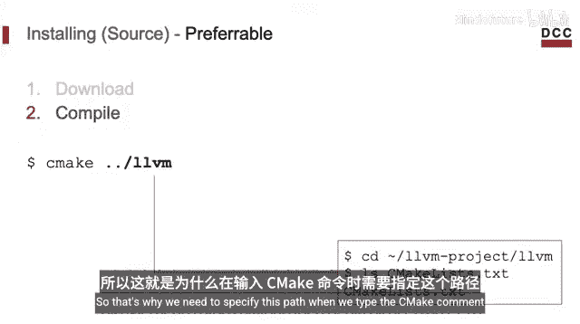

请注意，这通常会占用大量磁盘空间。在本例中，我将LLVM编译到一个名为`build`的目录中，该目录位于下载的`llvm-project`文件夹内。

```bash
cd llvm-project
mkdir build
cd build
```

如今，LLVM使用CMake来管理构建过程。CMake需要一个名为`CMakeLists.txt`的特殊文件。这个文件位于`llvm`文件夹中，该文件夹比我们的`build`目录高一级。这就是为什么我们在输入以下命令时需要指定该路径。

```bash
cmake -G "Unix Makefiles" -DLLVM_ENABLE_PROJECTS="clang" -DCMAKE_BUILD_TYPE=Release -DCMAKE_INSTALL_PREFIX=/path/to/install ../llvm
```

我们可以向CMake传递更多选项。例如，这里我指定使用Makefile来构建LLVM。另一个选项是使用Ninja或Xcode。

我们需要指定构建LLVM的位置。在我的例子中，我构建在图中所示的文件夹中。

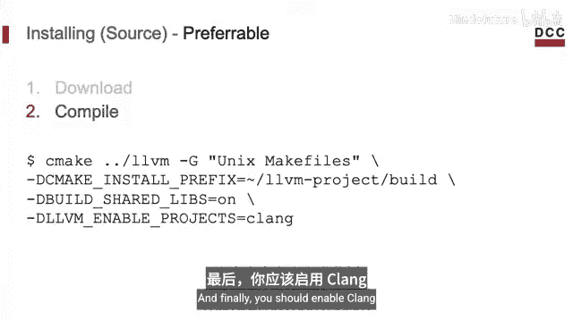

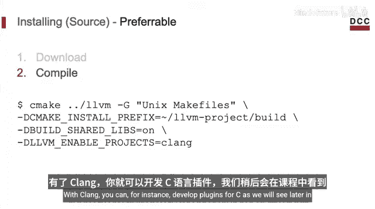

另一个我喜欢的选项是使用共享库，而不是静态构建，这通常可以节省大量硬盘空间。

最后，你应该启用Clang。这个选项将构建Clang。有了Clang，你可以为C语言开发插件，我们将在本课程后面看到。

```bash
-DLLVM_ENABLE_PROJECTS="clang" -DBUILD_SHARED_LIBS=ON
```

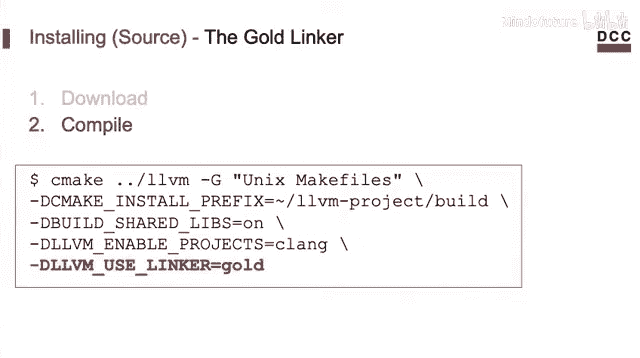

无论如何，这些是我在运行Ubuntu的x86_64机器上设置LLVM构建系统时使用的选项。这些选项可能也适合你。

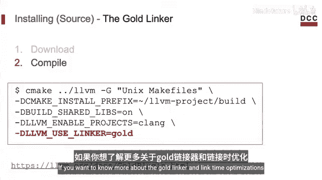

但如果你愿意，可以使用gold插件。这个插件的主要优点是它启用了链接时优化。如果你想了解更多关于gold链接器和链接时优化的信息，请查看LLVM的官方文档。

请注意，这是一个可选步骤。

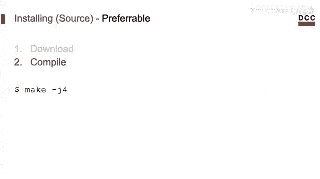

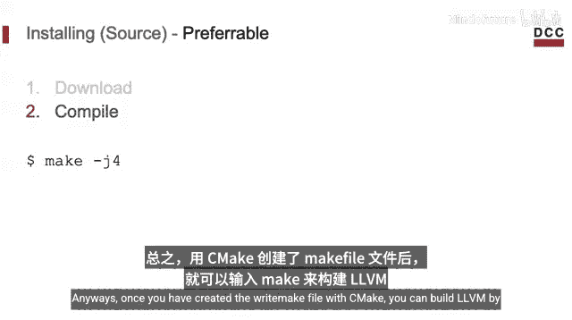

一旦你使用CMake创建了正确的Makefile，就可以通过输入`make`来构建LLVM。

```bash
make -j$(nproc)
```

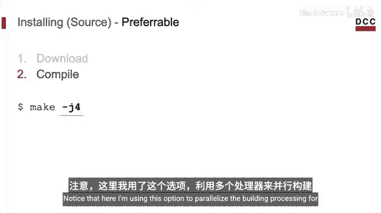

请注意，这里我使用了`-j`选项来并行化构建过程。编译LLVM需要相当长的时间，在这种情况下，拥有多个核心会很有帮助。

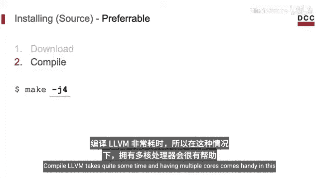

## 编译完成后的工具

编译完LLVM后，你会发现现在可以访问许多不同的工具。要查看它们，请进入构建目录中生成的`bin`文件夹，然后输入`ls`。

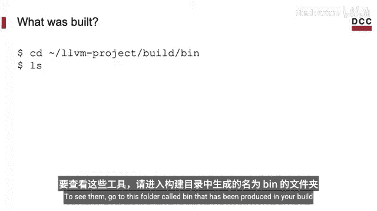

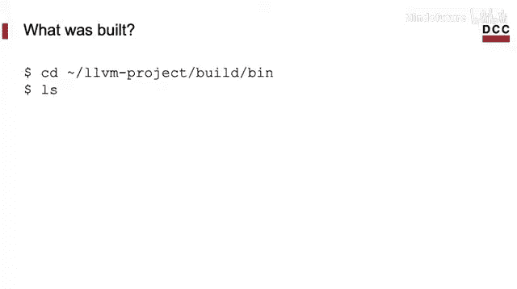

```bash
cd /path/to/llvm-project/build/bin
ls
```

这些是我在准备这门课程时系统上的工具。在本课程的其余部分，我们将了解其中的一些工具，但别担心，我们不会全部用到。

## 总结

本节课我们一起学习了LLVM的安装过程。我们介绍了两种主要方法：安装预编译的二进制发行版和从源代码编译安装。对于初学者，二进制安装更快捷方便；而对于希望深入研究和定制LLVM的开发者，从源代码编译是更好的选择。我们还了解了编译过程中的一些关键配置选项。

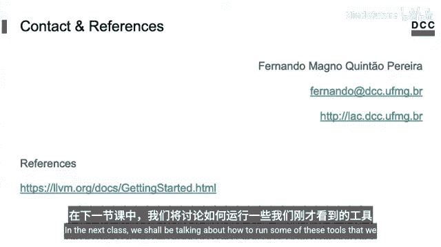

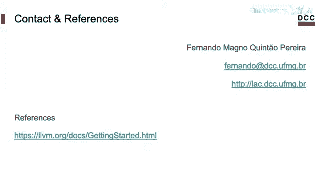

在下一节课中，我们将讨论如何运行刚刚看到的这些工具。