# 003：运行LLVM工具 🔧

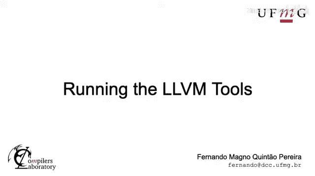

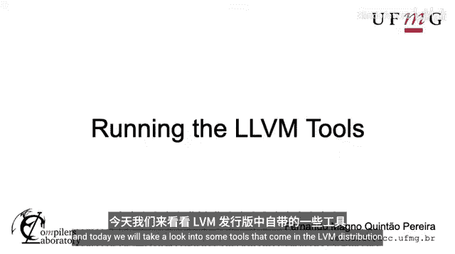

在本节课中，我们将学习LLVM发行版中自带的三个核心工具：`clang`、`opt`和`llc`。我们将了解它们各自在编译器流水线中的角色，并通过简单的例子演示如何使用它们将C源代码转换为机器码。

---

## 编译器流水线回顾 🚀

上一节我们介绍了LLVM作为一个框架和工具集的整体概念。本节中我们来看看三个具体的工具。

一个编译器通常由三部分组成：
1.  **前端**：负责解析源代码。
2.  **中端**：负责代码分析和优化。
3.  **后端**：负责生成目标机器代码。

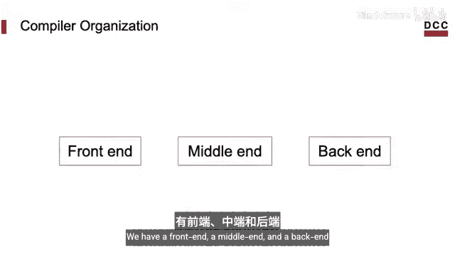

LLVM的这三个工具分别对应这三个部分：
*   `clang` 是C语言前端。
*   `opt` 是中端优化器。
*   `llc` 是后端代码生成器。

---

## Clang：C语言前端 ⚙️

`clang` 是LLVM的C语言前端。它的主要作用是将C语言源代码文件解析并转换为LLVM中间表示。

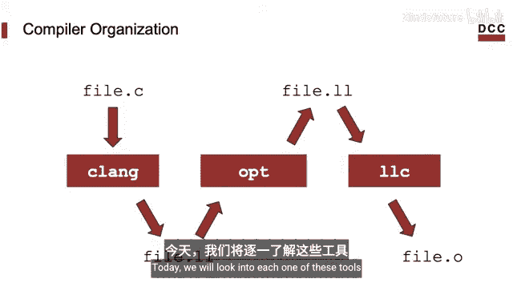

以下是一个简单的C程序示例，它实现了一个低效的前缀和算法：

```c
// prefix_sum.c
int prefix_sum(int *arr, int n, int i) {
    int sum = 0;
    for (int j = 0; j <= i; j++) {
        sum += arr[j];
    }
    return sum;
}
```

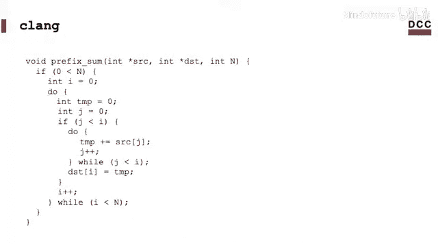

我们可以使用 `clang` 将这个C程序转换为LLVM IR。转换命令如下：

```bash
clang -S -emit-llvm prefix_sum.c -o prefix_sum.ll
```

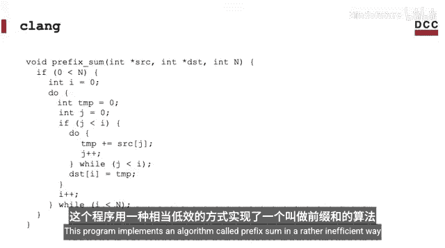

在这个命令中：
*   `-S` 标志指示生成汇编输出。
*   `-emit-llvm` 标志指示生成LLVM IR格式的“汇编”，而不是机器架构的汇编。
*   `-o prefix_sum.ll` 指定了输出文件的名称。

生成的 `prefix_sum.ll` 文件包含了LLVM IR代码，这是一种包含指令、变量和函数名的中间表示格式。

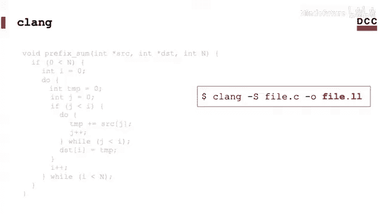

---

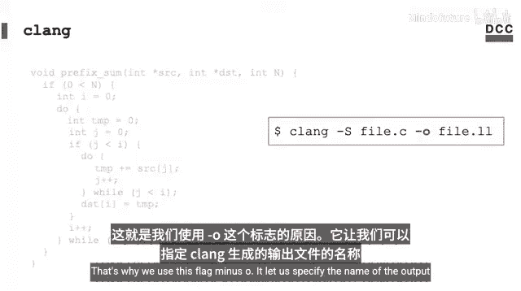

## 多样化的LLVM前端 🌈

需要理解的重要一点是，`clang` 只是LLVM众多前端中的一个。LLVM的设计优势在于，任何语言只要有一个前端将其转换为LLVM IR，就能获得整个LLVM框架的支持。

以下是其他一些语言的LLVM前端示例：
*   **Rust**：使用 `rustc`。
*   **Julia**：使用Julia自带的编译器。
*   **Swift**：使用Swift编译器。

这种设计意味着，无论使用哪种编程语言，一旦代码被转换为LLVM IR，它就能受益于LLVM强大的中端分析和优化能力。

---

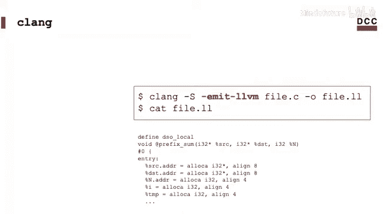

## Opt：中端优化器 🛠️

上一节我们介绍了`clang`如何将源代码转换为LLVM IR。本节中我们来看看中端工具`opt`。

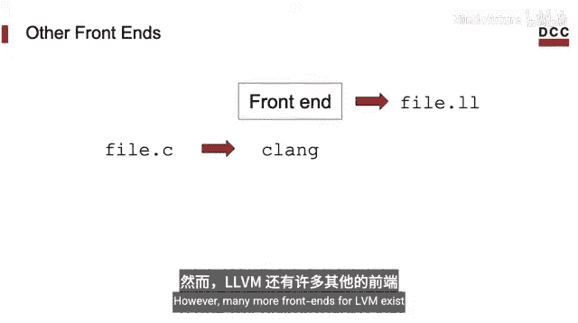

`opt` 是LLVM的中端优化和转换工具。它接收LLVM IR，并可以对其应用各种分析和转换过程，例如优化性能、检测漏洞或进行性能剖析插桩。

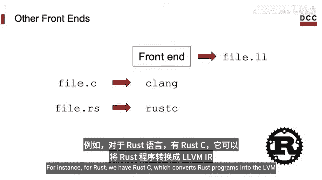

例如，我们可以使用 `opt` 将LLVM IR文件转换为一种名为DOT的图形描述格式：

```bash
opt -dot-cfg prefix_sum.ll
```

这个命令会生成一个 `.dot` 文件。DOT是一种用于描述图形的文本格式，可以使用像Graphviz这样的工具将其可视化。生成的图形代表了程序的**控制流图**，这是一种编译器用于分析和优化程序的数据结构。它展示了程序中的所有指令以及指令之间可能的执行顺序。

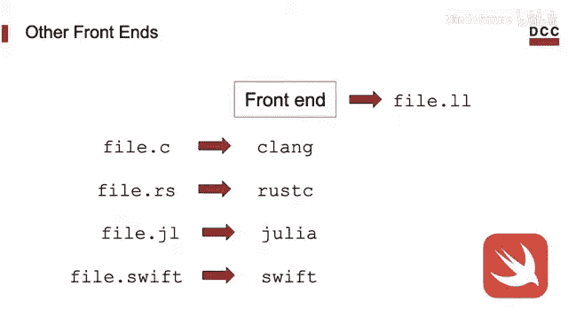

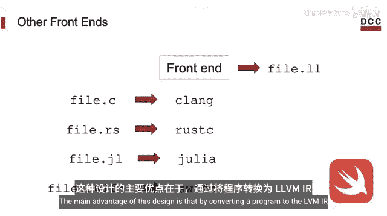

虽然现在不需要深入理解这个图，但知道它代表了程序的一种关键内部表示形式就足够了。经过中端处理后的这种表示，将被传递给后端。

---

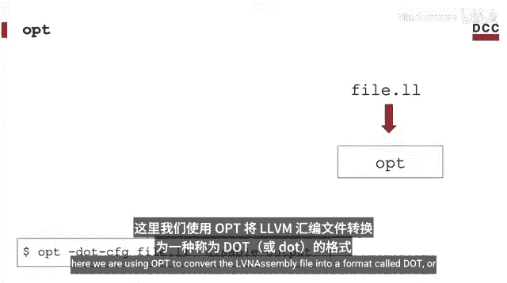

## Llc：后端代码生成器 💻

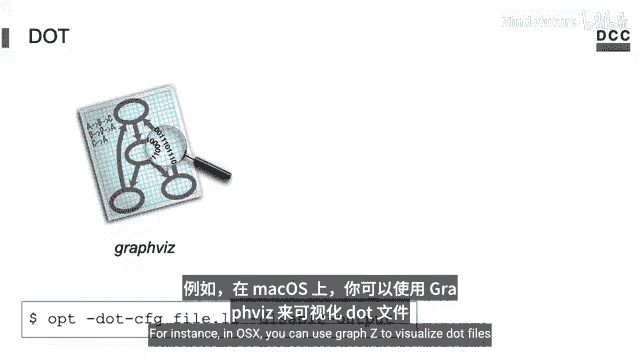

经过前端和中端处理后，我们得到了优化过的LLVM IR。接下来，后端工具 `llc` 负责将这个与机器无关的IR映射到具体的**目标架构**。

LLVM拥有众多后端，每个后端针对一种不同的处理器架构。以下是一些例子：
*   `x86` / `x86-64`
*   `ARM`
*   `PowerPC`
*   `MIPS`

要查看你的LLVM发行版支持哪些架构，可以运行：

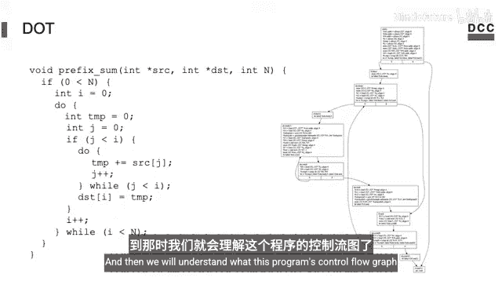

```bash
llc --version
```

输出会列出一个很长的目标架构列表。要为特定目标生成汇编代码，只需使用 `-march` 标志指定它。

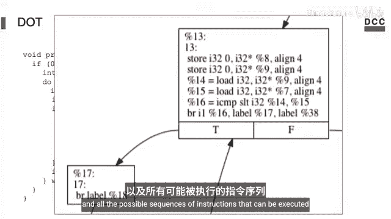

例如，为x86-64架构生成汇编文件：

```bash
llc -march=x86-64 prefix_sum.ll -o prefix_sum_x86.s
```

或者，为ARM架构生成汇编文件：

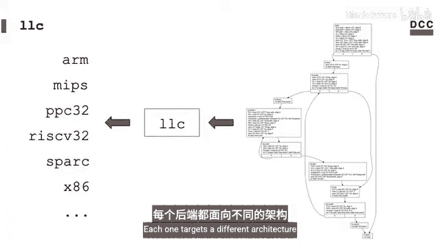

```bash
llc -march=arm prefix_sum.ll -o prefix_sum_arm.s
```

这样，我们就得到了可以在相应目标处理器上汇编和执行的机器级汇编代码。

---

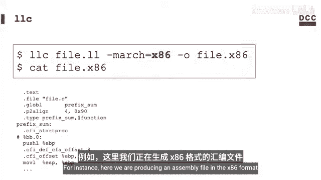

## 总结 📚

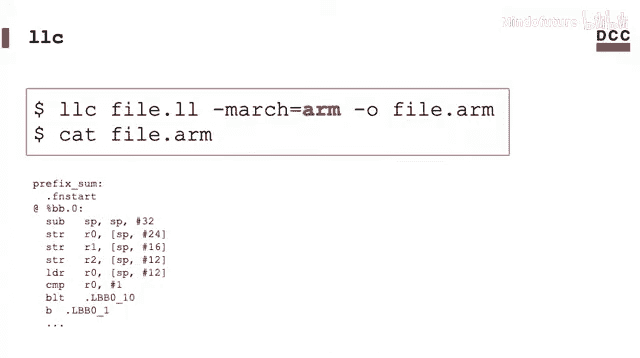

本节课我们一起学习了LLVM工具链中的三个核心独立工具：
1.  **`clang`**：作为C语言前端，将源代码转换为LLVM IR。
2.  **`opt`**：作为中端优化器，对LLVM IR进行各种转换和优化，并可以生成程序内部表示（如控制流图）以供分析。
3.  **`llc`**：作为后端代码生成器，将优化后的LLVM IR转换为特定目标处理器架构的汇编代码。

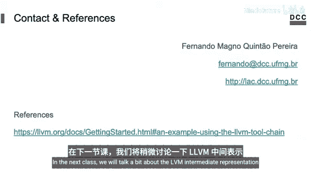

通过这三个工具的串联使用，我们完成了一个从C源代码到目标机器码的完整编译流程。在接下来的课程中，我们将更深入地探讨**LLVM中间表示**的细节。