# 004：LLVM中间表示（IR）🔧

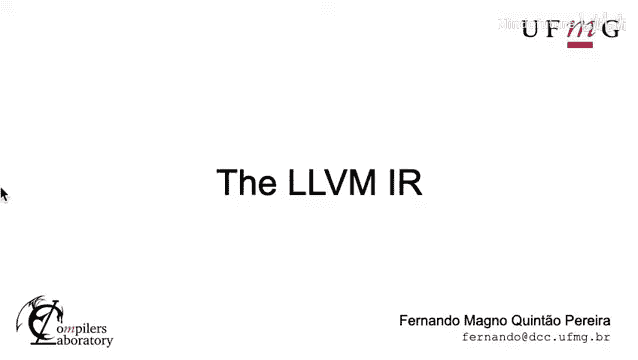

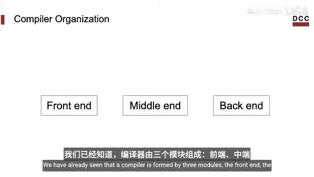

在本节课中，我们将要学习LLVM中间表示（IR）。这是一种低级的程序表示语言，是LLVM编译器框架的核心。我们将了解IR是什么样子，它能做什么，以及如何通过工具链来操作它。

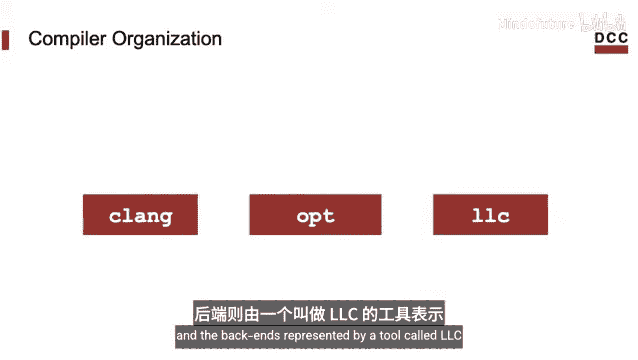

## 什么是LLVM IR？🤔

我们已经知道，一个编译器通常由三个模块组成：前端、中端和后端。在上一节中，我们了解到LLVM的一个可能前端是Clang，中端由名为`opt`的工具代表，后端则由名为`llc`的工具代表。

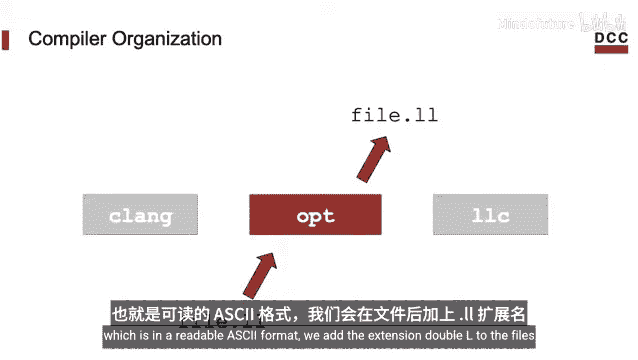

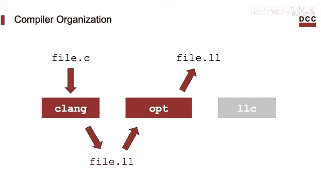

中端操作的对象就是用LLVM中间表示（IR）编写的程序。通常，当这种中间表示以可读的汇编格式给出时，我们给文件添加`.ll`扩展名。

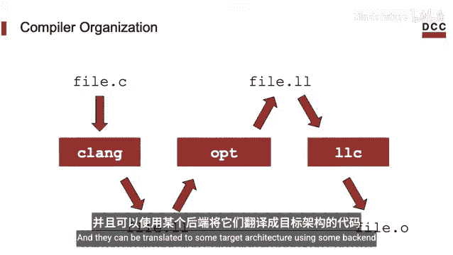

这些`.ll`文件是从某些高级编程语言（例如C语言）翻译而来的。它们可以通过某个后端工具，被翻译成特定目标架构的代码。

LLVM的许多魅力和优雅之处都来自于它的中间表示。那么，这种编程语言到底是什么？它看起来怎么样？我们能用它做什么？这就是本节课的主题。

## IR的基本特性 📝

首先，中间表示是一种编程语言，这意味着我们可以用它来编写程序。IR主要是为了由编译器自动生成而设计的，但这并不妨碍我们直接在IR中编写程序。

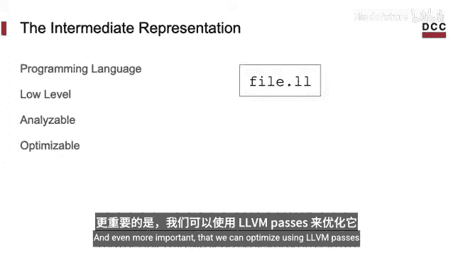

因为它旨在由编译器生成，所以它是低级的。因此，IR看起来很像一个汇编程序。我们可以使用LLVM基础设施中的工具来分析它，更重要的是，我们可以使用LLVM来优化它。

## 一个IR示例 🔍

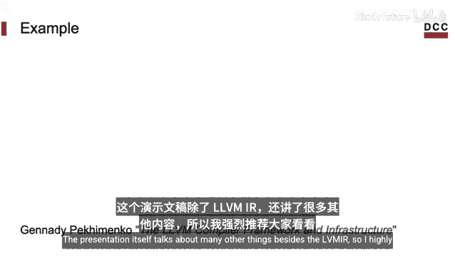

让我们看一个例子。我将展示一个程序，并检查它在LLVM中间表示中的样子。这个程序取自Gennadiy Peytman在网上公开的演示文稿，该演示文稿还讨论了LLVM IR之外的许多其他内容，我强烈推荐大家阅读。

Gennadiy的程序包含一个通过指针接收参数并更新该内存位置的函数。为了使内容更完整，这里是调用该函数的代码。

为了生成IR格式的等效程序，我们可以使用以下命令行，我们在上一节课中已经见过它：
```bash
clang -S -emit-llvm code.c -o code.ll
```
注意，我们的示例存储在名为`code.c`的文件中，我们正在生成一个名为`code.ll`的文件。我们使用`-S`标志表示要生成汇编文件，否则会生成二进制程序。我们使用`-emit-llvm`来指定我们想要的是LLVM中间表示的汇编，否则会生成目标架构（本例中是x86）的汇编。

让我们看一下IR文件。首先，让我缩小源代码的显示尺寸，以便所有内容都能在屏幕上显示。

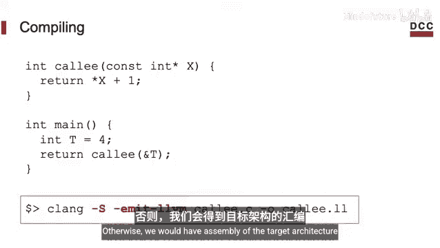

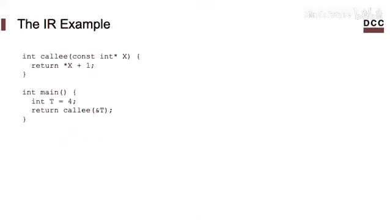

你会发现，与原始程序相比，IR文件在某种程度上显得更大。这是很自然的，因为我们对同一个程序使用了更低级的表示。请注意，我们甚至没有显示整个文件，为了专注于最有趣的部分，我们将省略其余内容。

注意IR文件中有两个函数，这是因为源文件中有两个函数。

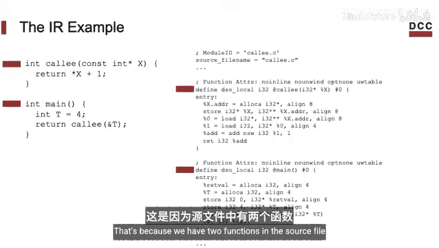

## 深入分析IR代码 🧐

让我们看看LLVM为`foo`函数生成的代码。它就在这里。

这里有很多需要注意的地方。首先，程序是SSA（静态单赋值）格式。这意味着函数由一系列线性指令组成，每条指令都有一个操作码。操作码是指令所执行操作的名称。例如，这个程序使用了六条指令和五个不同的操作码。

另一个有趣的点是，LLVM IR是强类型的。这意味着程序操作的值具有类型。在这个例子中，我们有三种不同的类型：
*   我们有**32位整数**，比如函数的返回值。
*   我们有**指向32位整数的指针**，比如函数`foo`的参数`x`的类型。
*   我们还有**指向指针的指针**。在这种情况下，指向指针的指针作为编译器实现程序所需的辅助变量出现。

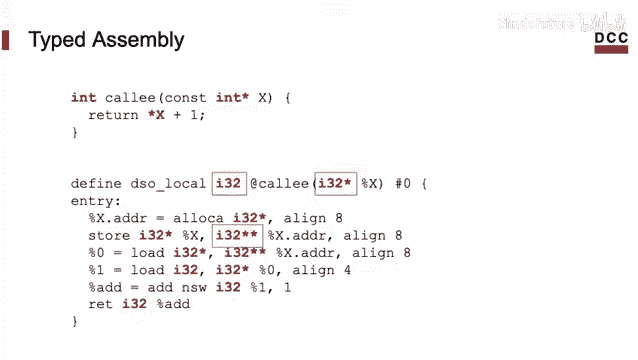

## 优化IR代码 ⚡

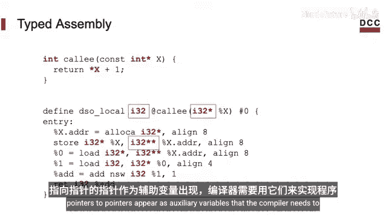

注意，我们可以优化IR。例如，我们可能希望将变量从内存移动到寄存器中。为此，我们可以使用名为`mem2reg`的`opt`测试。

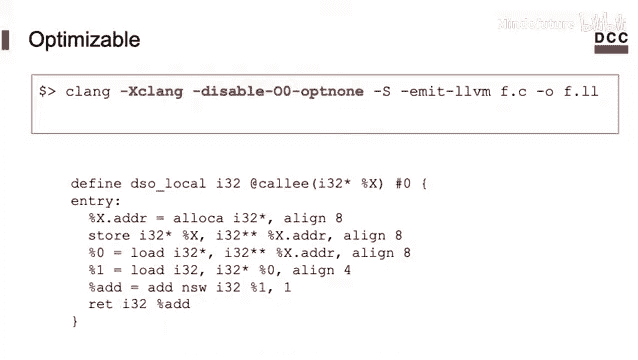

但要做到这一点，我们需要通过`-Xclang`参数向Clang表明，IR将被`opt`进一步转换。

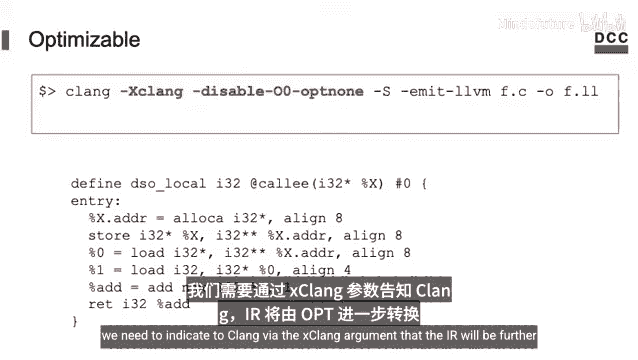

如果你不使用这个标志，那么LLVM会在IR中的函数上添加`optnone`限定符，这将阻止程序被优化。

无论如何，在禁用这个标记（`optnone`限定符）之后，你就可以优化函数了。在这个例子中，我们使用了一个名为`mem2reg`的优化。你能通过思考它的名字来想象这个优化是做什么的吗？

基本上，这个优化会将栈上分配的变量移动到寄存器中。我们可以看到，我们目标函数中的变量是在栈上的，因为我们看到了操作内存的指令，比如`alloca`、`store`和`load`。`alloca`通常意味着我们在栈上分配空间。

这是我们优化后的函数。注意，变量的加载现在是在寄存器中进行的。这些不是架构寄存器，而是虚拟寄存器。一旦生成机器代码，这些值就可以被放置在物理寄存器中。

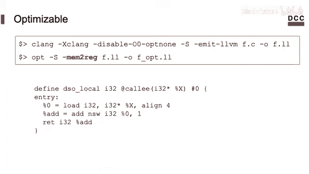

这些变量的名称以百分号`%`开头，例如`%0`和`%1`。

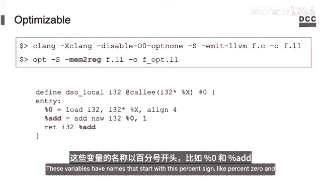

## 直接操作IR ✍️


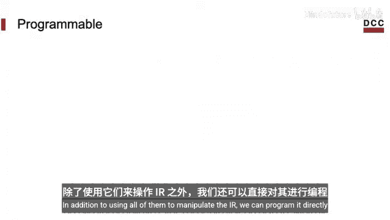

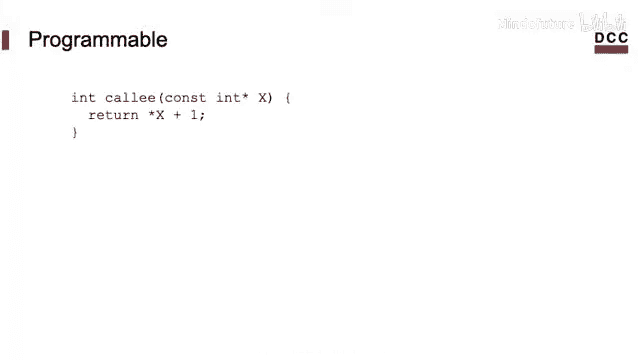

除了使用LLVM工具来操作IR，我们也可以直接对它进行编程。毕竟，它只是一个文本文件。

例如，假设我们想改变这个函数。我们不想通过指针传递参数，而是想直接传递值。我们当然可以用C语言重写程序，然后用LLVM生成优化版本。但我们也可以简单地通过编辑其文本文件来改变IR。

这就是我们修改后得到的等效代码。如你所见，这只是我们自己编写函数的问题。当然，我们还需要更改调用我们优化后函数的代码。我们将不再传递地址，而是直接传递值本身。

这就是我们手动优化后整个程序的样子。

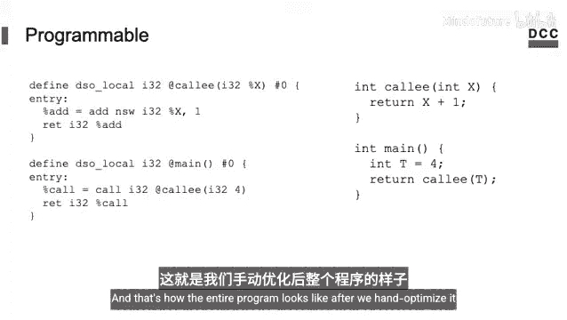

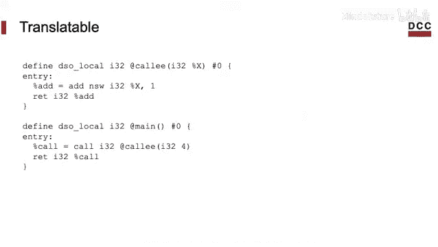

## 转换到其他表示形式 🔄

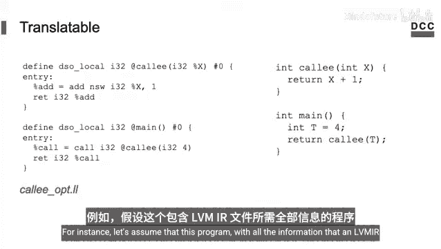

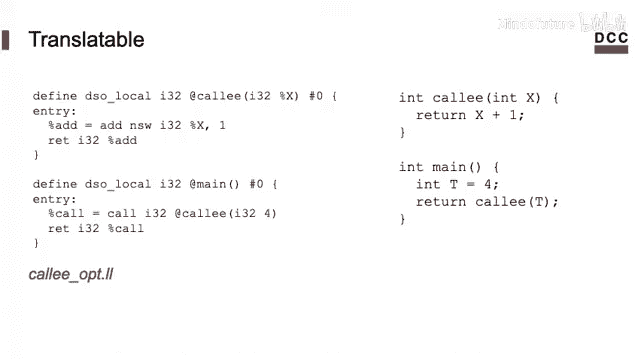

我们可以将程序转发到其他表示形式。例如，假设这个包含所有LLVM IR文件所需信息的程序叫做`callptr.ll`。

我们可以使用`llvm-as`将它编译成LLVM字节码。LLVM字节码是LLVM IR程序的二进制表示形式。

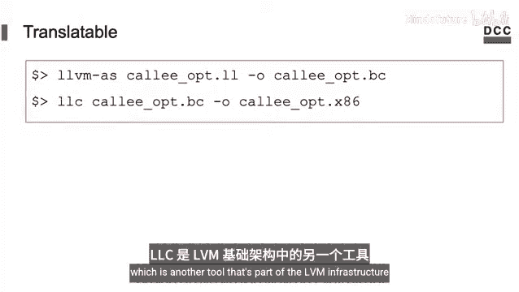

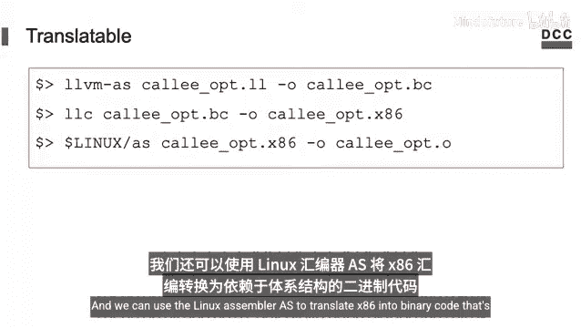

然后，我们可以使用`llc`（LLVM基础设施中的一个工具）将字节码翻译成汇编，例如x86汇编。

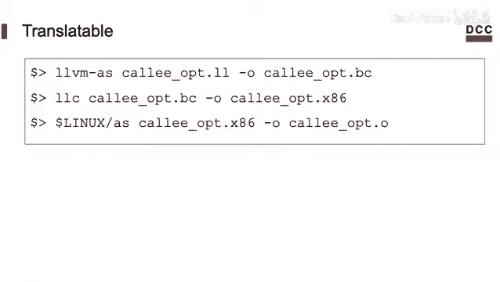

我们可以使用Linux汇编器`as`将x86汇编翻译成依赖于架构的二进制代码。

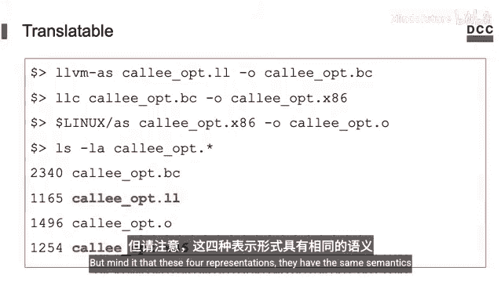

这样，我们就得到了同一个程序的四种不同表示形式。其中两种是二进制格式，另外两种是用汇编语言编写的，所以你可以阅读这些文件。这没有问题，但请注意，这四种表示形式具有相同的语义，它们代表同一个程序。

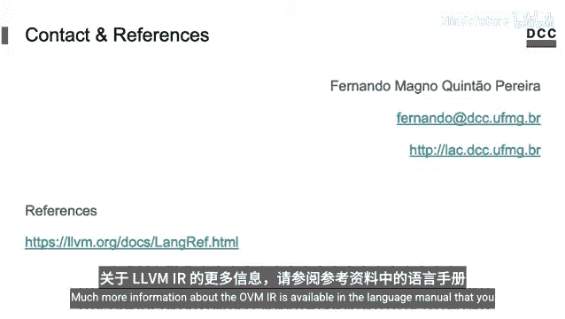

## 总结 📚

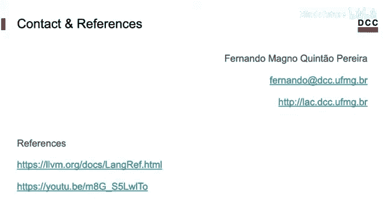

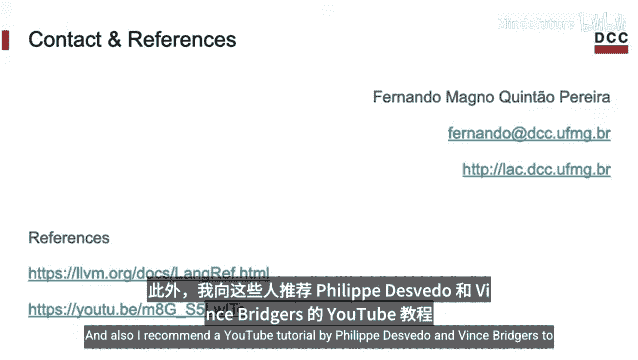

本节课中，我们一起学习了LLVM中间表示（IR）。我们了解到IR是一种低级的、强类型的、SSA格式的编程语言，它是LLVM编译器框架的核心。我们看到了一个IR代码的示例，学习了它的基本结构和类型系统。我们还探讨了如何使用`opt`工具（特别是`mem2reg`优化）来优化IR代码，以及如何直接编辑IR文本文件。最后，我们了解了如何将IR转换为其他表示形式，如字节码、汇编代码和最终的可执行二进制文件。


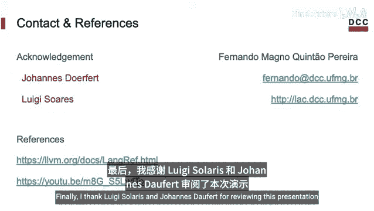

关于LLVM IR的更多信息，可以在语言手册中找到，你可以在参考资料中看到。此外，我向那些想更深入研究IR的人推荐Philip Devedo和Vince Bridges的YouTube教程。