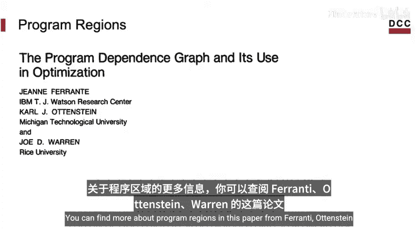
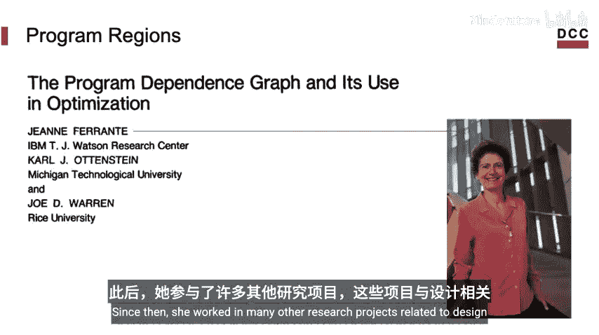
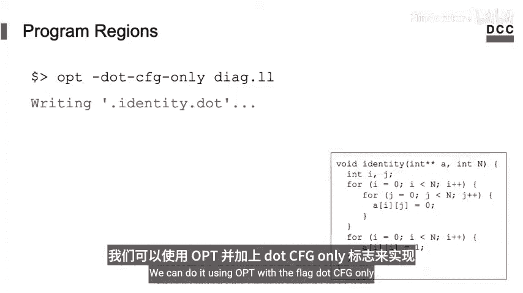
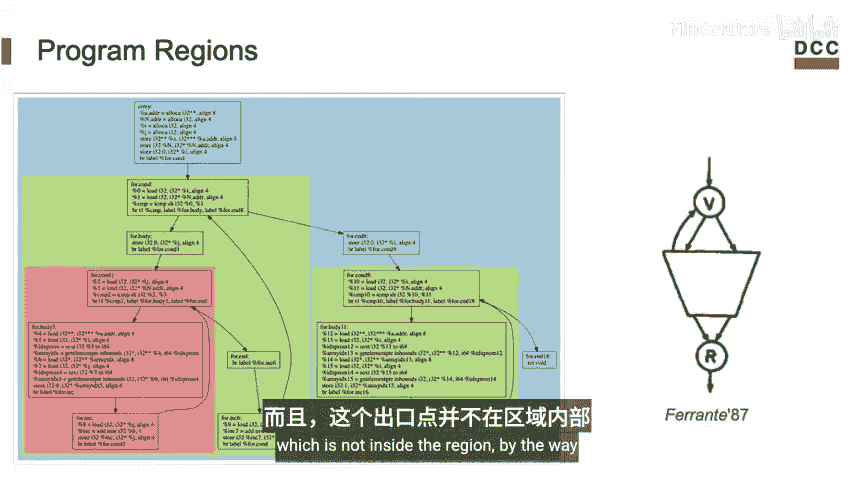
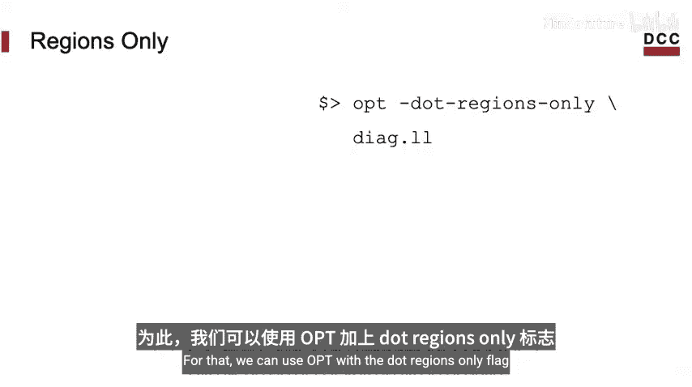
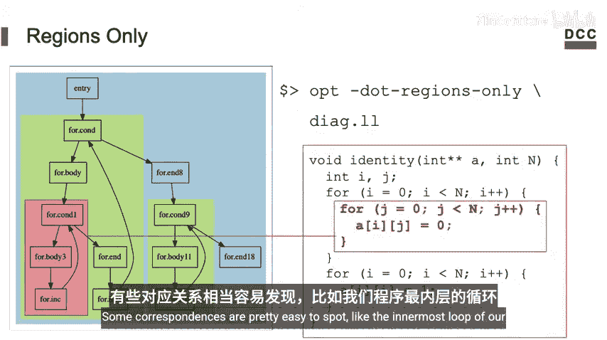
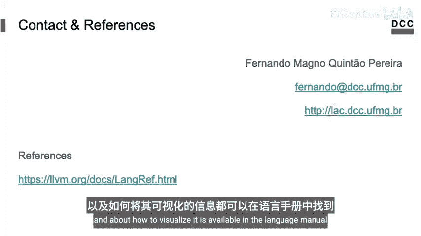

# 005：使用LLVM进行程序可视化 📊

在本节课中，我们将学习如何使用LLVM编译基础设施来可视化程序。我们将重点介绍一个名为`opt`的工具，它是LLVM中间端优化器，可以用来生成程序的各种图形化表示，例如控制流图、支配树和调用图等。

## 使用OPT工具

上一节我们介绍了LLVM的整体架构。本节中我们来看看用于程序可视化的核心工具：`opt`。

`opt`是LLVM发行版中自带的一个命令行工具，属于LLVM中间端（Middle End）的一部分。它接收LLVM中间表示（LLVM IR）格式的文件，并输出同样为LLVM IR格式的新文件。

你可以通过以下命令查看`opt`的版本信息：
```bash
opt --version
```

`opt`主要有三个用途：
1.  **可视化程序**：生成程序结构的图形表示。
2.  **分析代码**：例如，统计指令类型、循环数量或分析安全漏洞。
3.  **转换程序**：运行各种优化或插入插桩代码。

本教程将首先聚焦于如何使用`opt`进行程序可视化。

## 生成控制流图（CFG）

控制流图是理解程序执行路径的基础。以下是生成CFG的步骤。

首先，我们需要一个C语言源文件（例如`dag.c`），并使用`clang`将其编译为LLVM IR格式：
```bash
clang -S -emit-llvm dag.c -o dag.ll
```

接着，使用`opt`的`-dot-cfg`标志来生成DOT格式的控制流图文件：
```bash
opt -dot-cfg dag.ll
```
此命令会生成一个名为`.dot`的隐藏文件。DOT是一种通用的图形描述语言。

为了查看这个图形，我们需要使用`dot`工具（通常包含在Graphviz软件包中）将其转换为图像格式，如PNG：
```bash
dot .dot -Tpng -o cfg.png
```

在控制流图中：
*   **节点（基本块）**：代表一组总是顺序执行的指令序列。
*   **边**：代表程序执行的可能路径。





## 其他可视化格式



除了详细的控制流图，`opt`还支持生成多种简化或不同侧重点的图形表示。



以下是`opt`支持的一些其他可视化选项：



*   **仅显示CFG结构**：使用`-dot-cfg-only`标志，可以生成只包含基本块节点和边的简化图，有助于快速理解程序整体结构，例如识别循环。
    ```bash
    opt -dot-cfg-only dag.ll
    ```



*   **单入口单出口区域（SESE）**：程序区域是控制流图的子图，只有一个入口点和一个出口点。使用`-dot-regions`和`-dot-regions-only`标志可以可视化这些区域及其嵌套关系。
    ```bash
    opt -dot-regions-only dag.ll
    ```

*   **支配树（Dominator Tree）**：支配树是一种重要的数据结构，用于计算程序区域。节点A支配节点B意味着从程序入口到B的任何执行路径都必须经过A。使用`-dot-dom`和`-dot-dom-only`标志可以生成支配树。
    ```bash
    opt -dot-dom-only dag.ll
    ```

*   **调用图（Call Graph）**：调用图展示了函数之间的调用关系。节点代表函数，边表示调用关系（从调用者指向被调用者）。使用`-dot-callgraph`标志可以生成调用图。
    ```bash
    opt -dot-callgraph dag.ll
    ```
    例如，如果`main`函数调用了`fact`函数，图中就会有一条从`main`指向`fact`的边。如果`fact`是递归函数，图中则会有一个从`fact`指向自身的环。

你可以通过运行`opt --help`来查看你的LLVM版本所支持的所有可视化选项。

## 总结

本节课中我们一起学习了如何使用LLVM的`opt`工具进行程序可视化。我们介绍了如何生成控制流图来查看基本块和程序路径，以及如何生成简化结构图、程序区域图、支配树和调用图等多种表示形式。这些图形化工具是分析和理解程序内部结构的有力助手，为后续学习代码分析和优化奠定了基础。



关于LLVM IR和可视化更详细的信息，可以参考LLVM语言手册。