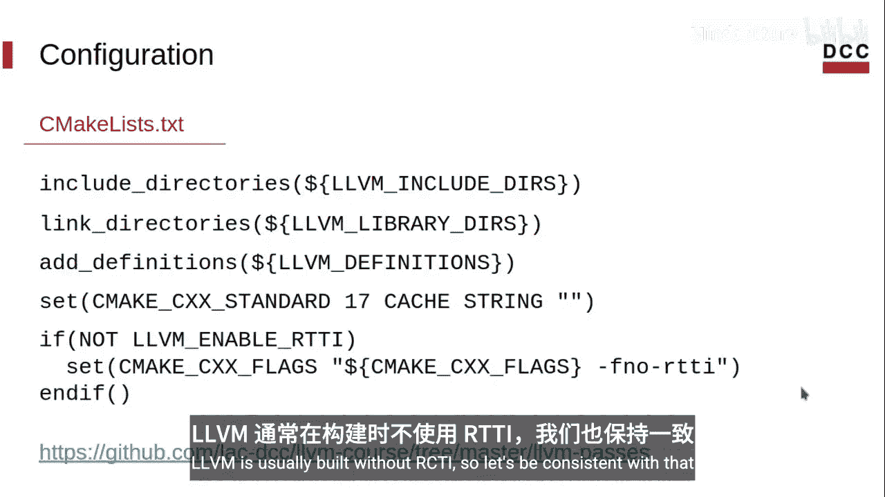
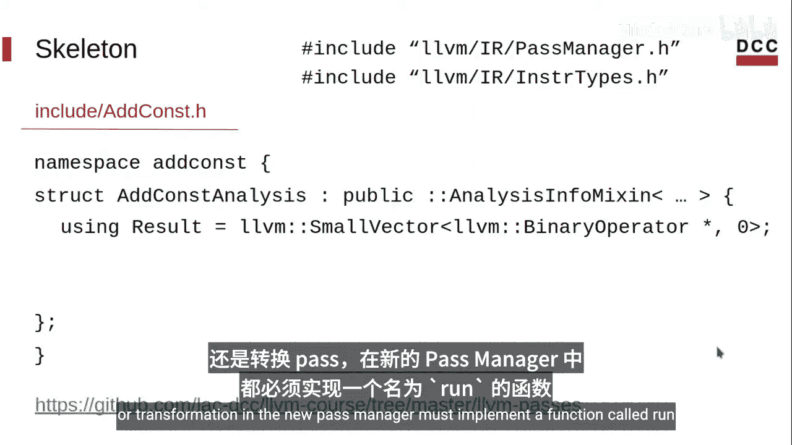
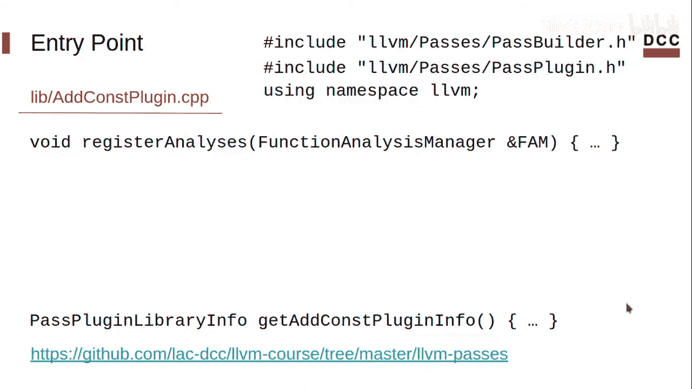
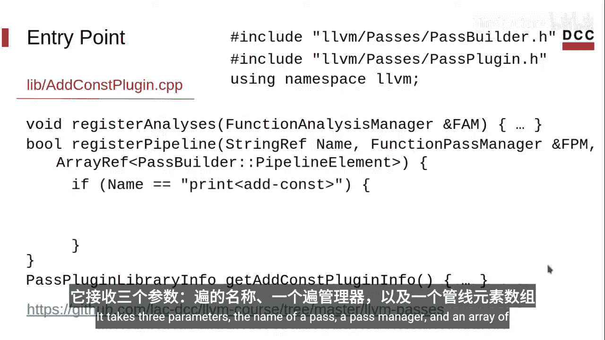
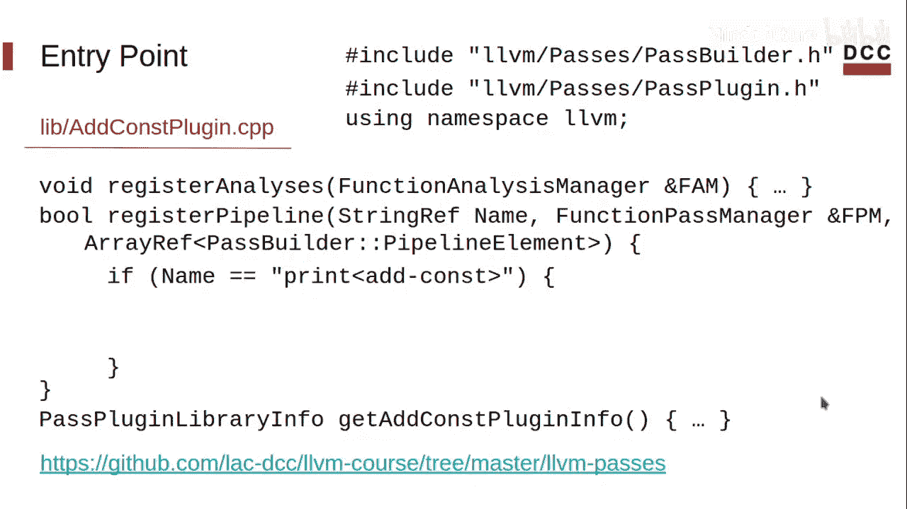
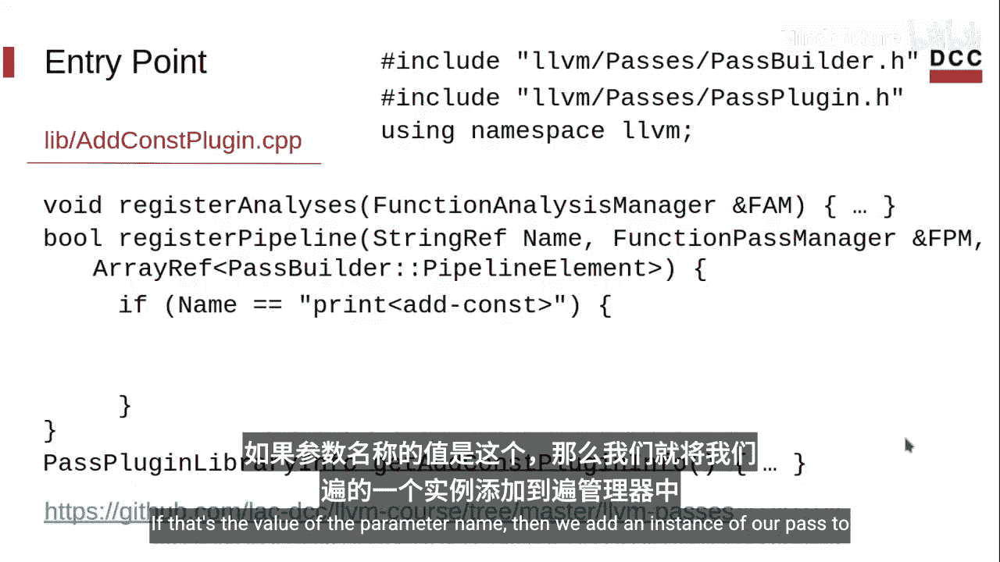
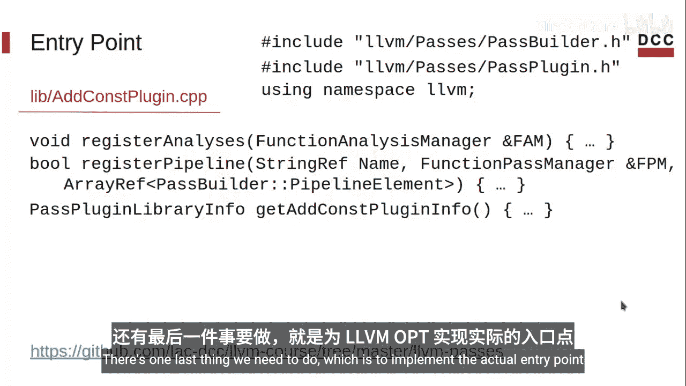
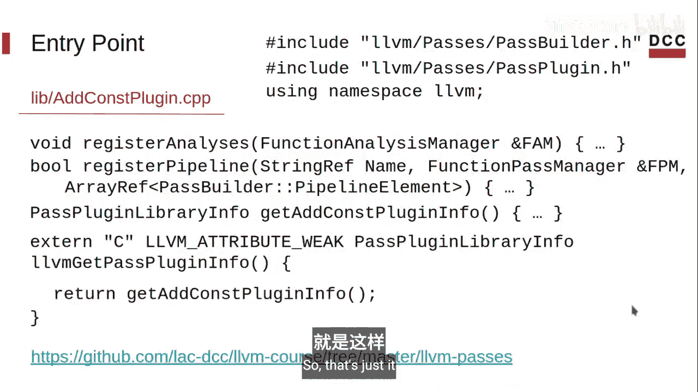
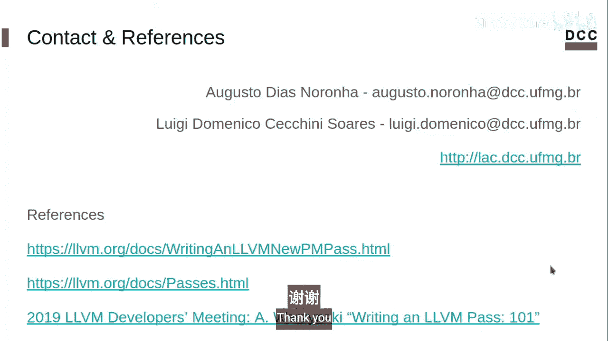

# 007：编写LLVM分析（第一部分）📚

## 概述
在本节课中，我们将学习如何编写一个自定义的LLVM分析（Analysis）。我们将从项目结构开始，创建分析所需的头文件，并定义其入口点。本教程分为两部分，这是第一部分，主要关注分析的结构搭建。

---

## 项目结构 🗂️

上一节我们介绍了分析与转换的区别，本节我们来看看如何构建一个分析项目。编写LLVM分析时，有两种主要方式：在LLVM源代码树内工作，或在外部构建独立的工具。本课程选择第二种方式，以便后续使用LLVM命令行库构建我们自己的工具。

以下是项目的基本目录结构：

*   **`include/`**：存放头文件的文件夹。
*   **`lib/`**：存放源代码文件的文件夹。
    *   **`CMakeLists.txt`**：用于创建库的CMake文件。
*   **`build/`**：用于存放编译生成的库和二进制文件的文件夹。

项目源代码已公开在GitHub上，您可以随时查阅。

---

## 主CMake文件配置 ⚙️

让我们从主`CMakeLists.txt`文件开始。我将聚焦于核心部分，完整代码可在GitHub查看。

首先，我们定义CMake所需的最低版本和项目名称。

```cmake
cmake_minimum_required(VERSION 3.13.4)
project(AddConst)
```

接着，定义一个变量`LLVM_INSTALL_DIR`，它指向LLVM的安装路径。这个变量将通过命令行传递给CMake，用于定位LLVM的CMake配置文件。

```cmake
set(LLVM_INSTALL_DIR "" CACHE PATH "Path to LLVM installation")
```

然后，包含LLVM的头文件和库路径。

```cmake
list(APPEND CMAKE_PREFIX_PATH "${LLVM_INSTALL_DIR}")
find_package(LLVM REQUIRED CONFIG)
```

接下来，设置使用的C++版本。LLVM通常使用C++17构建，我们保持一致性。

```cmake
set(CMAKE_CXX_STANDARD 17)
set(CMAKE_CXX_STANDARD_REQUIRED ON)
```

您也可以定义所需的编译器标志。

最后，设置库文件的输出路径，并包含我们的`lib`目录。

```cmake
set(CMAKE_LIBRARY_OUTPUT_DIRECTORY ${CMAKE_BINARY_DIR})
add_subdirectory(lib)
```

---



## 库CMake文件配置 📦

现在，让我们看看`lib/`目录下的`CMakeLists.txt`文件。它比主文件简单得多。

我们只需要设置库的源文件，并让`include`目录可见，以便使用我们的头文件。

```cmake
set(SOURCES AddConst.cpp)
add_library(AddConst MODULE ${SOURCES})
target_include_directories(AddConst PUBLIC ${CMAKE_SOURCE_DIR}/include)
```

---

## 分析头文件设计 🧠

目前，LLVM有两个Pass管理器：旧版（Legacy）和新版（New Pass Manager）。新版Pass管理器的文档虽然尚未完全覆盖所有场景，但正在不断完善。由于它是LLVM的一个特性，本教程将使用新版Pass管理器。

新版Pass管理器的实现使用了一些清晰的设计模式。虽然编写Pass不一定需要深入了解它们，但LLVM文档中有提及。以下是两个您可能想了解的模式：奇异递归模板模式（CRTP）和混入（Mixin）模式。您可以从维基百科等资源开始查阅。

我们的LLVM分析是一个结构体（或类），它以`AnalysisInfoMixin`作为基类。这里可以很容易地看到上述两个设计模式的应用。

为了节省空间，我将省略一些代码。首先，我们需要定义分析将返回什么结果。在我们的案例中，将返回一个指令列表。这里我使用了`SmallVector`，它是LLVM提供的一个高效数据结构。LLVM有许多优秀的数据结构，我们可以在文档中详细了解。

```cpp
// 分析结果：一个包含常量加法指令的列表
using Result = llvm::SmallVector<llvm::BinaryOperator *, 4>;
```

在我们的案例中，我们将收集加法指令（`add`），它们属于二元运算符（`BinaryOperator`）。

在新版Pass管理器中，每个Pass（无论是分析还是转换）都必须实现一个名为`run`的方法。该方法接收两个参数，其类型取决于Pass的工作范围。我们的分析将在函数（Function）级别工作，因此第一个参数的类型是`Function`，第二个是`FunctionAnalysisManager`，用于请求我们所需的其他分析的结果。

```cpp
// 核心分析方法
Result run(llvm::Function &F, llvm::FunctionAnalysisManager &FAM);
```



最后，一个分析还必须有一个`AnalysisKey`，它提供了一个基于地址的标识符，用于唯一识别该分析。

---

## 定义打印Pass 🖨️

除了分析Pass，我们还将定义一个非常简单的转换Pass（实际上仅用于打印）。这个Pass要做的事情就是请求并打印分析的结果，主要用于调试目的。本课程稍后将会看到一个真正的转换Pass示例。

一个转换Pass也必须有一个`run`方法，接收两个参数，与分析Pass类似。唯一的区别是返回类型：转换Pass总是返回一个`PreservedAnalyses`集合，表明哪些分析结果在转换后仍然有效。在我们的案例中，所有分析都将被保留，因为我们不进行任何实际转换。

```cpp
// 打印Pass的run方法
llvm::PreservedAnalyses run(llvm::Function &F,
                            llvm::FunctionAnalysisManager &FAM);
```

同时，我们定义一个私有字段作为输出流，以及一个初始化该输出流的构造函数。

```cpp
private:
  llvm::raw_ostream &OS;
public:
  explicit PrintAddConstPass(llvm::raw_ostream &OS) : OS(OS) {}
```

这样，我们就完成了头文件的骨架设计。

---

## 实现OPT插件入口点 🔌

现在，我们将为LLVM OPT工具实现插件的入口点。

首先，使用LLVM的命名空间。然后，定义一个返回插件信息的函数。这些信息包括插件版本、插件名称、LLVM版本以及用于正确注册Pass的回调函数。

```cpp
extern "C" LLVM_ATTRIBUTE_WEAK ::llvm::PassPluginLibraryInfo
llvmGetPassPluginInfo() {
  return {
      .APIVersion = LLVM_PLUGIN_API_VERSION,
      .PluginName = "AddConst",
      .PluginVersion = "v0.1",
      .RegisterPassBuilderCallbacks = &registerPassBuilderCallbacks,
  };
}
```

首先，注册我们的分析Pass，以便其他Pass可以请求它。然后，注册一个打印Pass，以便可以通过OPT使用它。这两个注册方法都需要回调函数。



为了注册一个分析，我们需要一个分析管理器（在我们的案例中是`FunctionAnalysisManager`），并用它来注册我们的`AddConstAnalysis`实例。

```cpp
// 注册分析Pass的回调
void registerAnalysisCallback(llvm::FunctionAnalysisManager &FAM) {
  FAM.registerPass([&] { return AddConstAnalysis(); });
}
```





我们还需要实现将插件注册到LLVM OPT管道的回调函数。它接收三个参数：Pass名称、Pass管理器和一个管道元素数组（目前暂不使用）。

```cpp
// 注册到OPT管道的回调
bool registerPassBuilderCallbacks(llvm::PassBuilder &PB,
                                  llvm::ArrayRef<llvm::PipelineElement>) {
  PB.registerAnalysisRegistrationCallback(registerAnalysisCallback);
  // ... 其他注册
  return true;
}
```



我们将打印Pass引用为`print-add-const`。如果传入的Pass名称是这个值，那么我们就将一个打印Pass的实例添加到Pass管理器中，并返回`true`。

```cpp
if (Name == "print-add-const") {
  FPM.addPass(PrintAddConstPass(llvm::errs()));
  return true;
}
```

请注意，我们的打印Pass构造函数接收一个输出流。这里我们使用了`llvm::errs()`，它是一个标准错误输出流。否则，返回`false`，因为没有匹配的Pass。



还有最后一件事需要做，那就是实现LLVM OPT工具的实际入口点。这非常简单，我们只需让`llvmGetPassPluginInfo`函数返回插件信息即可。



```cpp
// OPT插件入口点
extern "C" LLVM_ATTRIBUTE_WEAK ::llvm::PassPluginLibraryInfo
llvmGetPassPluginInfo() {
  // ... 返回插件信息结构体
}
```

---



## 总结
本节课中，我们一起学习了如何为编写自定义LLVM分析搭建项目骨架。我们配置了CMake项目结构，设计了分析Pass和打印Pass的头文件，并实现了LLVM OPT插件的注册入口点。在下一部分，我们将完成分析Pass的具体实现，并看一个实际运行的例子。如有任何疑问，欢迎提出。