# 008：编写LLVM分析（第二部分）🔍

在本节课中，我们将完成一个LLVM分析（Analysis）的实现，并运行它以验证结果。我们将学习如何遍历函数中的指令，筛选出仅使用常量整数的加法操作，并最终输出分析结果。

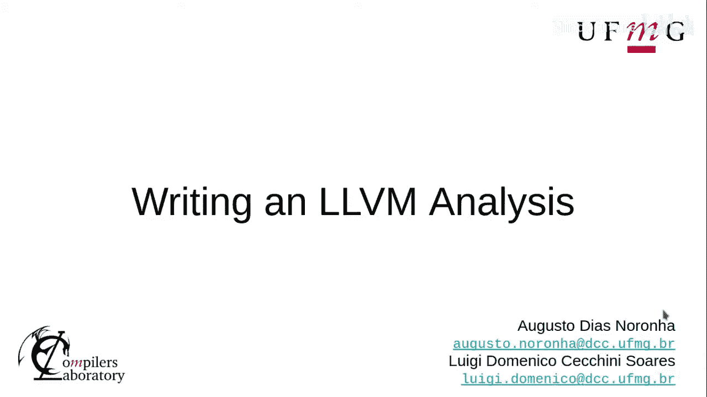

上一节我们介绍了分析项目的结构和插件入口点。本节中，我们将深入实现分析逻辑的核心部分。

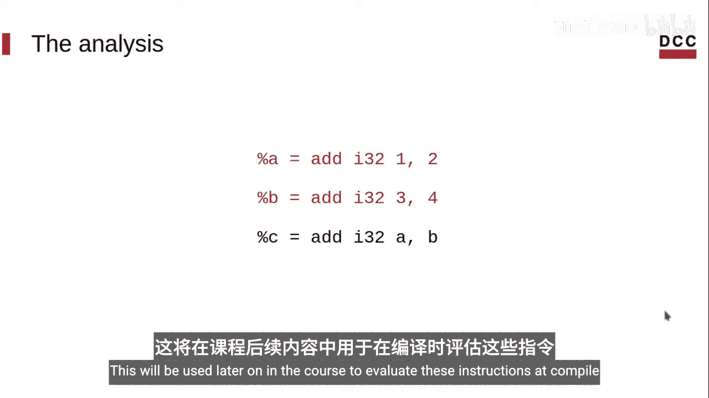

## 实现分析逻辑

首先，在代码中包含必要的头文件，并使用之前定义的命名空间。为了简化，我们也使用LLVM的命名空间。

```cpp
#include "AddConst.h"
using namespace llvm;
namespace addconst {
```

分析的第一步是初始化分析键（Analysis Key）。请注意，此处的值并不重要，因为LLVM内部使用该变量的地址作为唯一标识符。

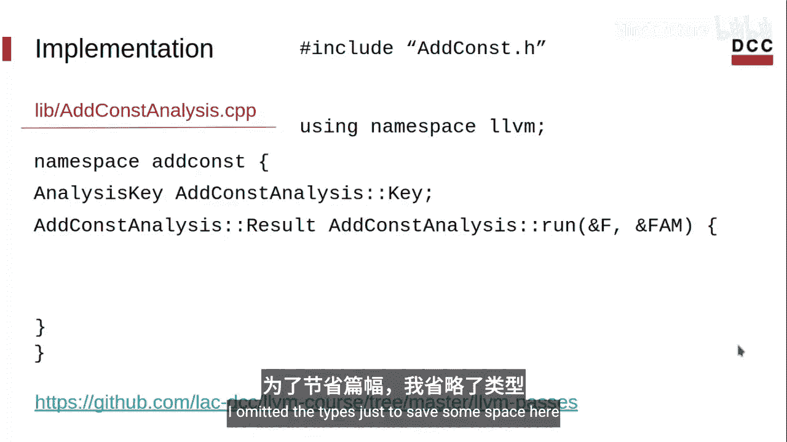

```cpp
AnalysisKey AddConstAnalysis::Key;
```

接下来，我们需要实现 `run` 方法。此方法接收一个函数 `F` 和一个函数分析管理器 `FAM`，并返回我们收集的指令列表。

```cpp
AddConstAnalysis::Result AddConstAnalysis::run(Function &F, FunctionAnalysisManager &FAM) {
    std::vector<BinaryOperator*> CollectedInsts;
```

以下是分析逻辑的主要步骤：

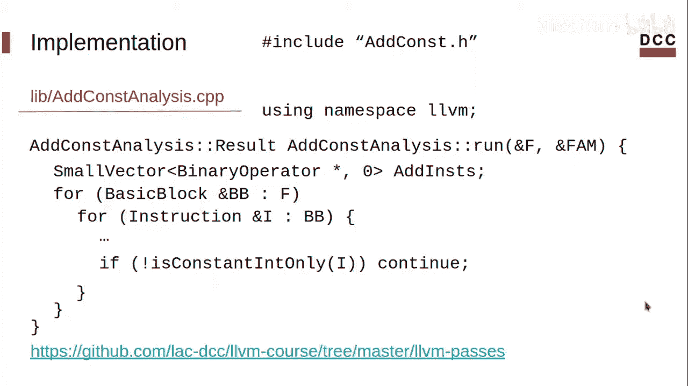

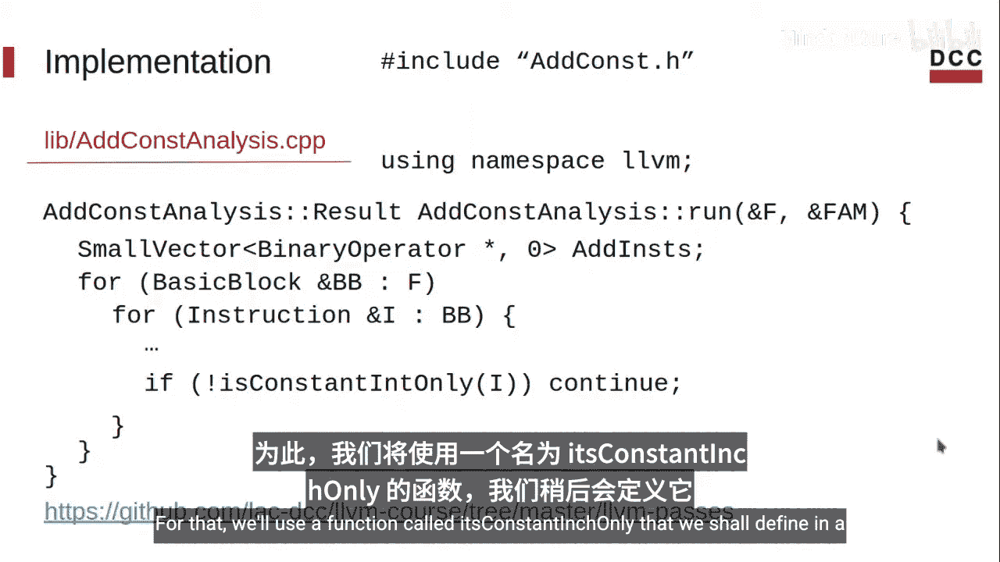

1.  **遍历基本块和指令**：我们首先遍历函数 `F` 中的所有基本块（Basic Block），然后遍历每个基本块中的所有指令。
2.  **筛选二元操作符**：检查当前指令是否为二元操作符（Binary Operator）。如果不是，则跳过。
3.  **筛选加法操作**：检查该二元操作符的操作码（Opcode）是否为加法（`Instruction::Add`）。
4.  **检查常量操作数**：调用一个辅助函数 `isConstantOnly`，检查该加法的所有操作数是否都是常量整数（ConstantInt）。
5.  **收集指令**：如果满足以上所有条件，将该指令转换为 `BinaryOperator` 类型，并添加到结果列表中。

```cpp
    for (auto &BB : F) {
        for (auto &I : BB) {
            // 检查是否为二元操作符
            if (!I.isBinaryOp()) continue;
            // 检查是否为加法操作
            if (I.getOpcode() != Instruction::Add) continue;
            // 检查操作数是否均为常量整数
            if (!isConstantOnly(&I)) continue;
            // 收集该指令
            CollectedInsts.push_back(cast<BinaryOperator>(&I));
        }
    }
    return CollectedInsts;
}
```

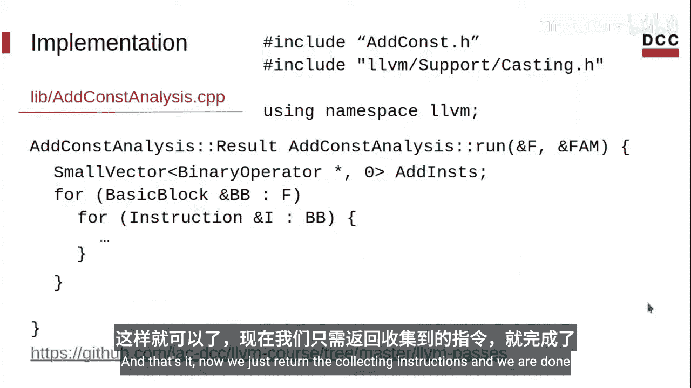

## 实现辅助函数

现在，我们需要实现用于检查指令操作数是否全为常量整数的辅助函数 `isConstantOnly`。

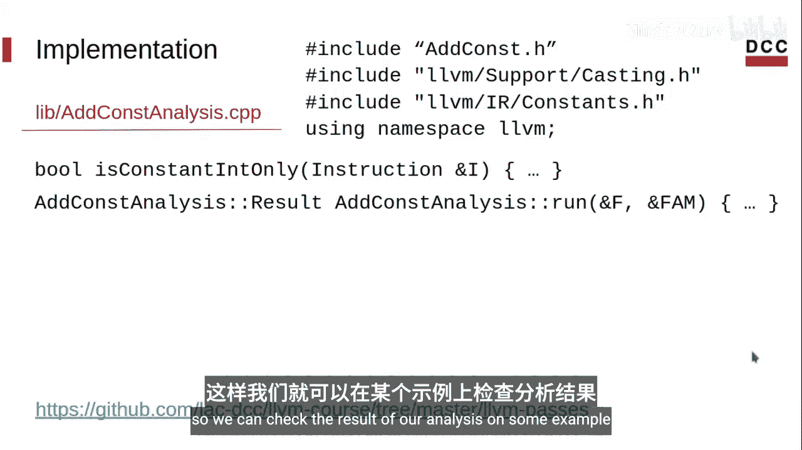

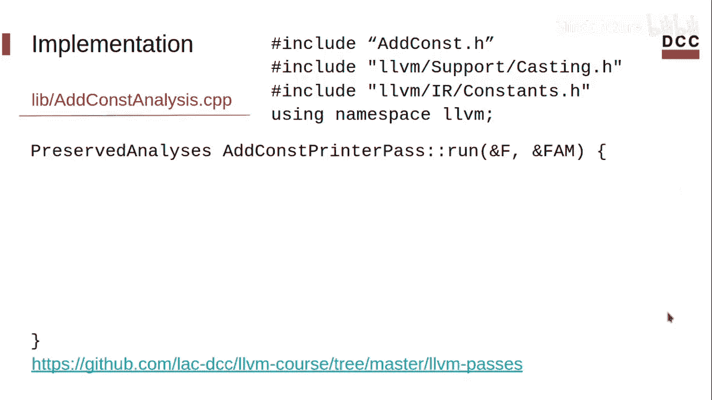

```cpp
bool isConstantOnly(Instruction *I) {
    // 遍历指令的所有操作数
    for (auto &Op : I->operands()) {
        // 检查操作数是否为 ConstantInt 类型
        if (!isa<ConstantInt>(Op)) {
            return false; // 如果有一个不是，则返回 false
        }
    }
    return true; // 所有操作数都是常量整数
}
```

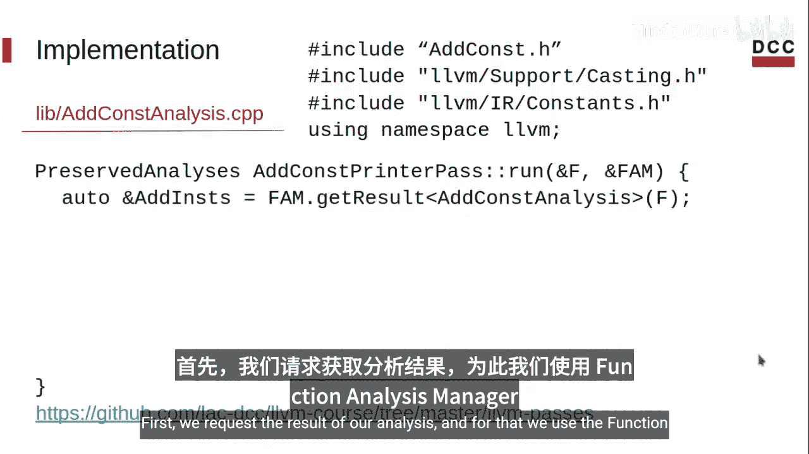

## 实现结果打印器（Printer Pass）

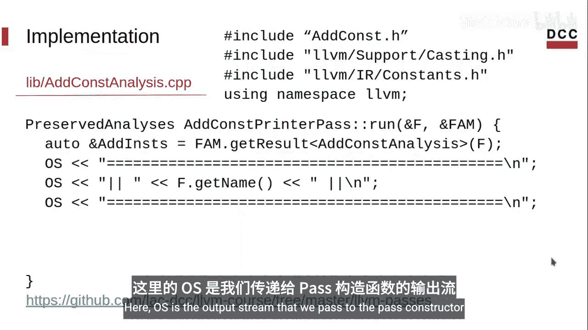

为了查看分析结果，我们需要实现一个打印器（Printer Pass）。它也是一个LLVM Pass，负责获取分析结果并格式化输出。

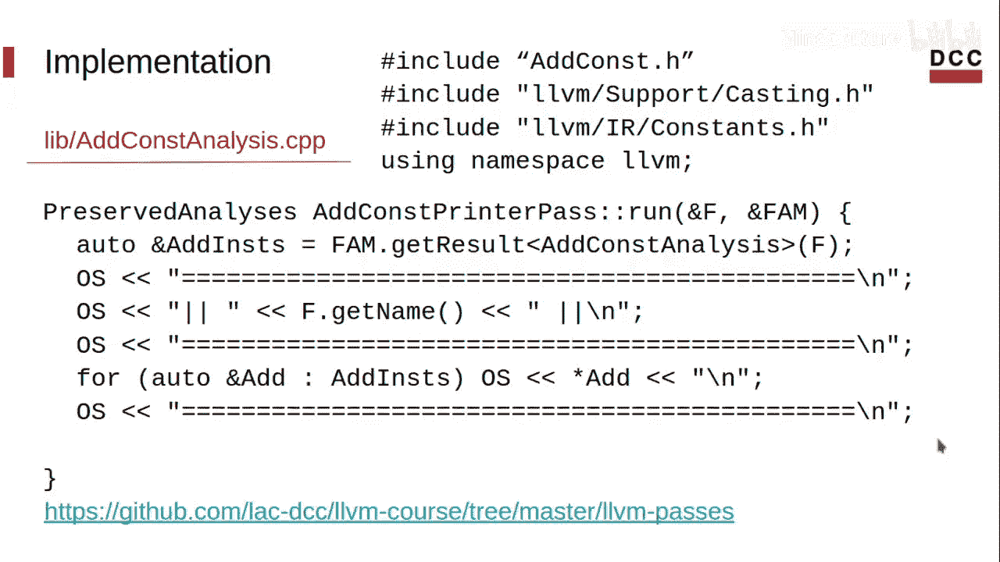

```cpp
PreservedAnalyses AddConstPrinterPass::run(Function &F, FunctionAnalysisManager &FAM) {
    // 从分析管理器获取 AddConstAnalysis 的结果
    auto &CollectedInsts = FAM.getResult<AddConstAnalysis>(F);
    
    // 打印函数名
    auto &OS = llvm::errs();
    OS << "Function: " << F.getName() << "\n";
    
    // 遍历并打印收集到的指令
    for (auto *BI : CollectedInsts) {
        OS << "  " << *BI << "\n";
    }
    
    // 声明此Pass保留了所有其他分析结果
    return PreservedAnalyses::all();
}
```

## 编译与运行

实现完成后，我们需要编译整个项目并运行分析。

1.  **确保位于项目根目录**。
2.  **使用CMake配置项目**：在配置时，通过命令行传入LLVM的安装路径。
    ```bash
    cmake -B build -DLLVM_DIR=/path/to/llvm/installation/lib/cmake/llvm -G Ninja
    ```
3.  **编译项目**：进入构建目录并使用 `make` 或 `ninja` 进行编译。
    ```bash
    cd build
    ninja
    ```

## 创建测试用例

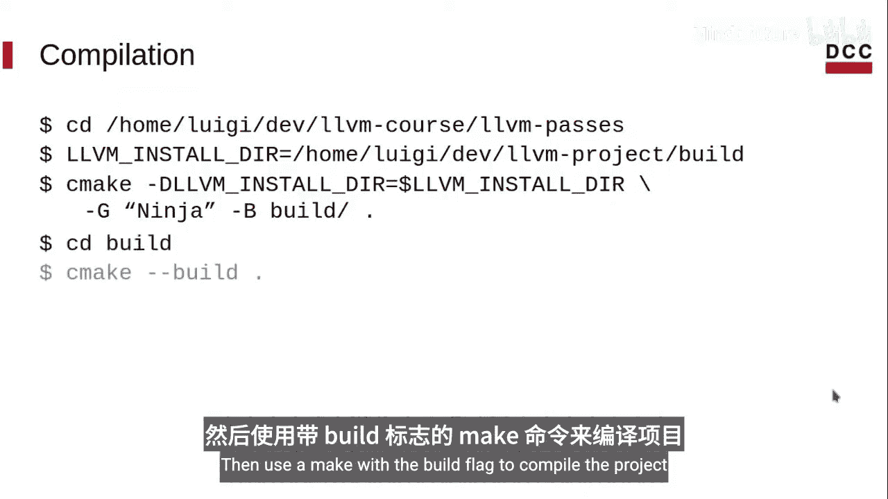

在运行分析之前，我们创建一个LLVM IR（`.ll`）文件作为测试用例。

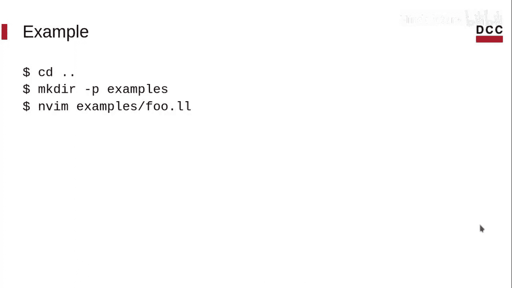

```llvm
; examples/test.ll
define i32 @foo(i32 %a, i32 %b) {
  %c = add i32 1, 2        ; 常量加法
  %d = add i32 3, 4        ; 常量加法
  %e = add i32 %a, %b      ; 非常量加法
  %f = add i32 %c, %e      ; 混合操作数
  ret i32 %f
}
```

## 运行分析

使用 `opt` 工具加载我们编译好的插件，并运行打印器Pass。

```bash
opt -load-pass-plugin ./build/libAddConstPlugin.so -passes="print<add-const>" -disable-output ./examples/test.ll
```

运行后，输出应类似于：
```
Function: foo
  %c = add i32 1, 2
  %d = add i32 3, 4
```
这表明我们的分析成功识别并收集了函数 `foo` 中仅使用常量整数的两个加法指令。

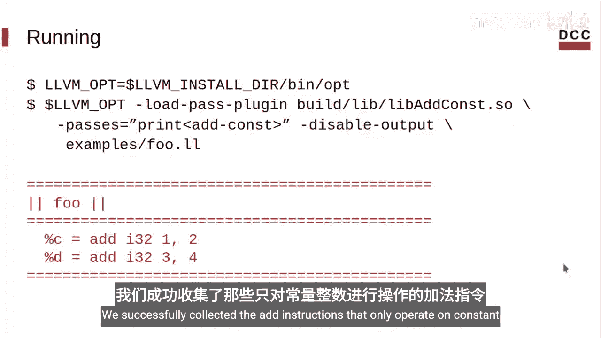

## 总结

本节课中我们一起学习了如何完整实现一个LLVM分析（Analysis）。我们完成了以下工作：
1.  实现了核心的 `run` 方法，用于遍历指令并筛选出目标操作。
2.  编写了辅助函数来检查指令的操作数属性。
3.  实现了一个打印器Pass，用于直观地展示分析结果。
4.  编译了项目，并创建测试用例验证了分析的正确性。

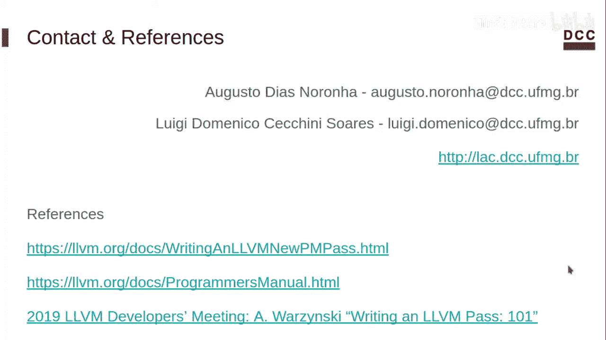

我们成功构建了一个可以收集函数中“常量整数加法指令”的分析工具。在下一节课中，我们将学习如何基于此分析结果，实现一个转换（Transformation）Pass来优化代码。