# 009：编写LLVM转换Pass 🛠️

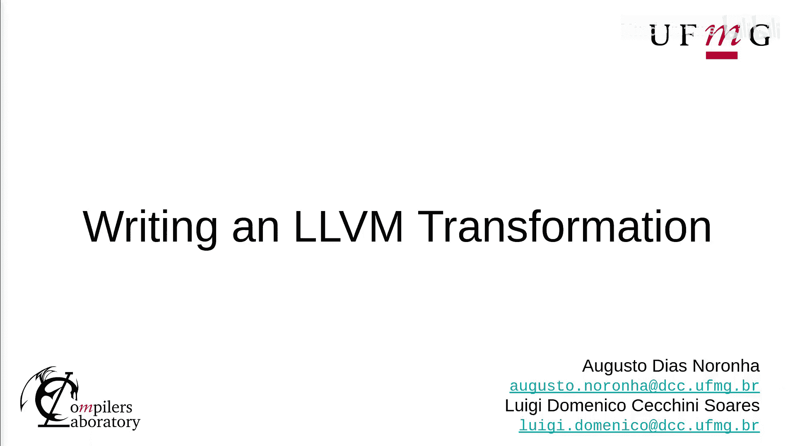

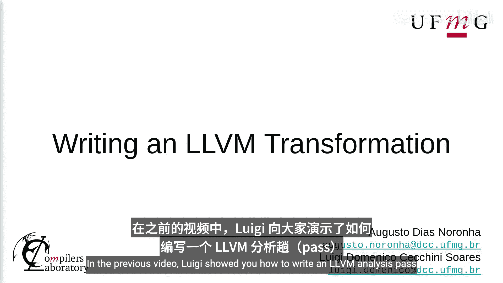

在本节课中，我们将学习如何基于之前编写的分析Pass，实现一个实际的LLVM转换Pass。我们将把仅使用常量的加法指令在编译时计算出来，并从程序中移除。

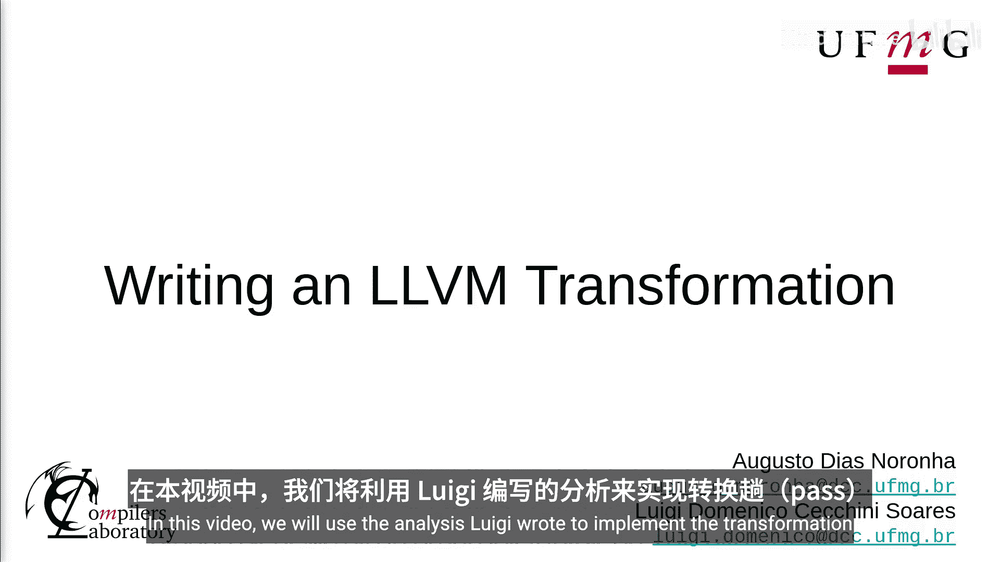

## 概述

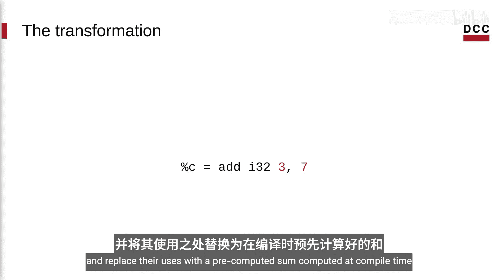

上一节我们介绍了如何编写一个LLVM分析Pass，用于收集函数中仅使用常量的加法指令。本节中，我们来看看如何利用这个分析结果，实现一个转换Pass来优化程序。

## 实现转换Pass

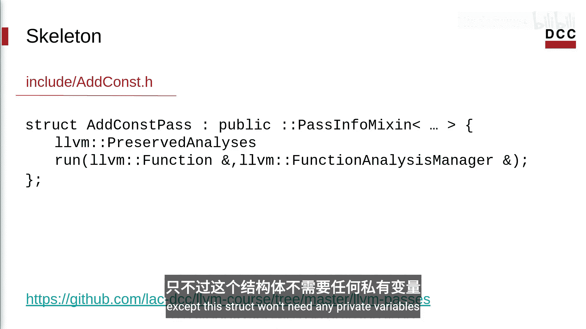

首先，我们需要更新头文件，添加一个新的转换Pass结构体。这与我们上次定义的`AddConstPrinterPass`非常相似，但这个结构体不需要任何私有变量。

```cpp
struct AddConstTransformPass : public PassInfoMixin<AddConstTransformPass> {
  PreservedAnalyses run(Function &F, FunctionAnalysisManager &FAM);
};
```

接下来，我们创建一个新文件来实现我们的转换Pass。记得同时更新你的CMakeLists.txt文件以包含它。

与我们的分析Pass类似，转换Pass也需要一个`run`函数。这个函数返回一个`PreservedAnalyses`对象，该对象表示在转换Pass运行后，哪些分析结果仍然有效。我们稍后会详细解释这一点。

以下是`run`函数的主要步骤：

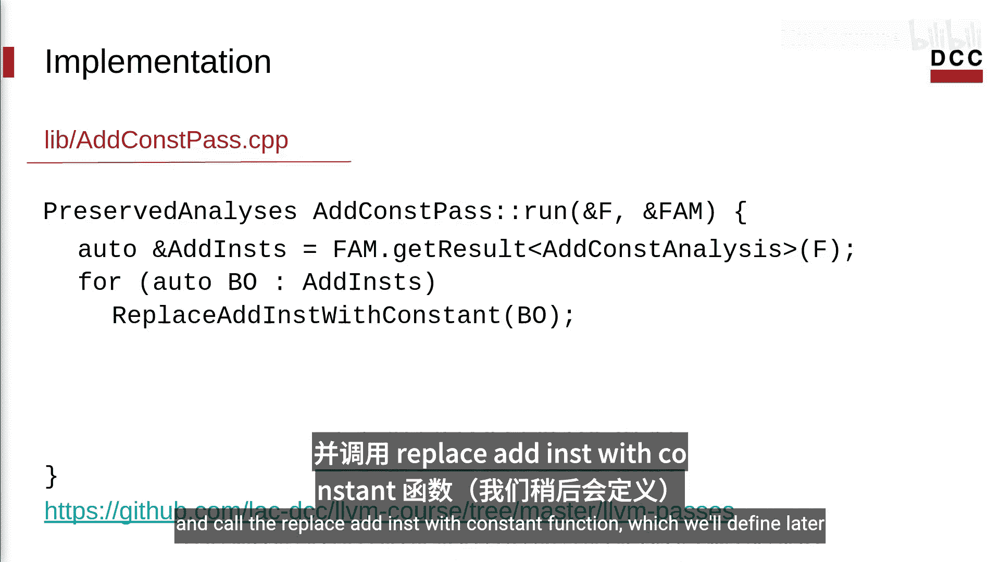

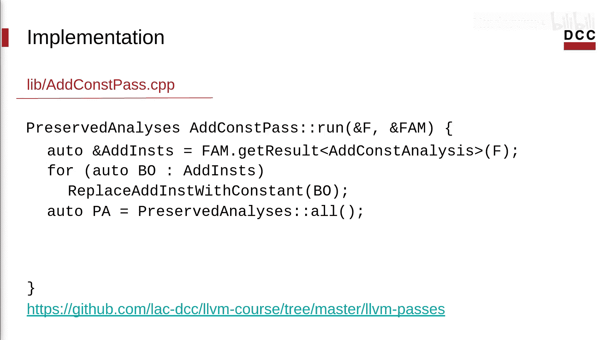

1.  获取我们之前编写的分析Pass的结果，即收集到的指令向量。
2.  遍历收集到的加法指令，并对每条指令调用一个我们将要定义的`replaceAddInstWithConstant`函数。

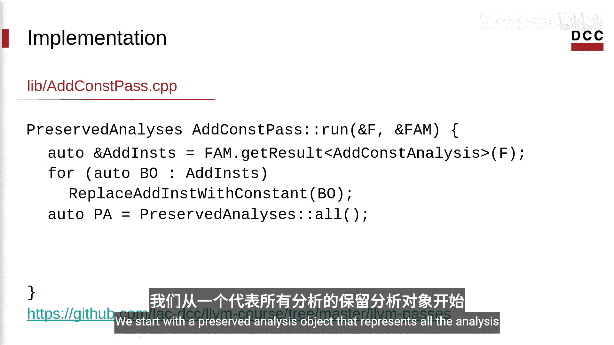

```cpp
PreservedAnalyses AddConstTransformPass::run(Function &F, FunctionAnalysisManager &FAM) {
  auto &AddInsts = FAM.getResult<AddConstAnalysis>(F);
  for (auto *AddInst : AddInsts) {
    replaceAddInstWithConstant(AddInst);
  }
  // ... 处理PreservedAnalyses
}
```

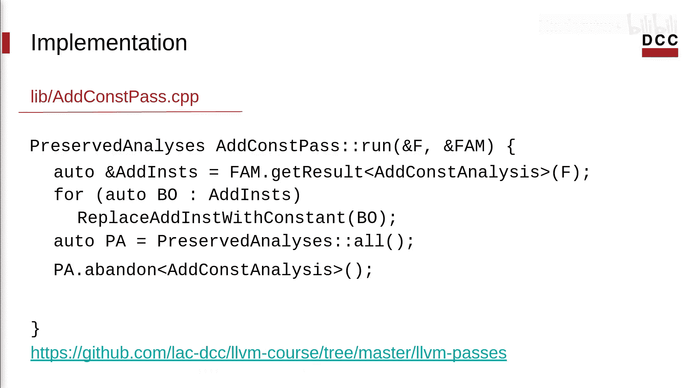

## 处理保留的分析

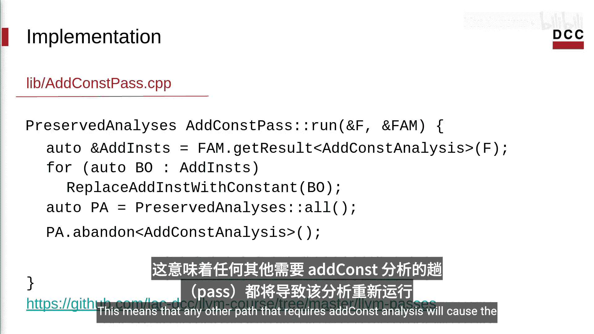

现在，我们来处理`PreservedAnalyses`对象。我们首先创建一个表示所有分析都被保留的对象。

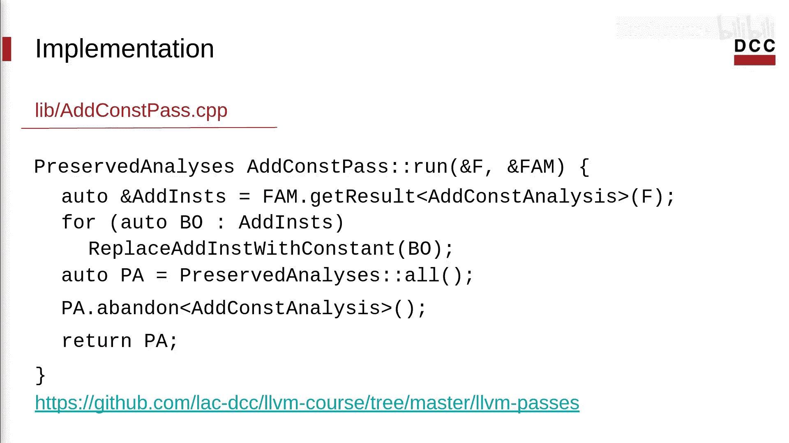

```cpp
PreservedAnalyses PA = PreservedAnalyses::all();
```

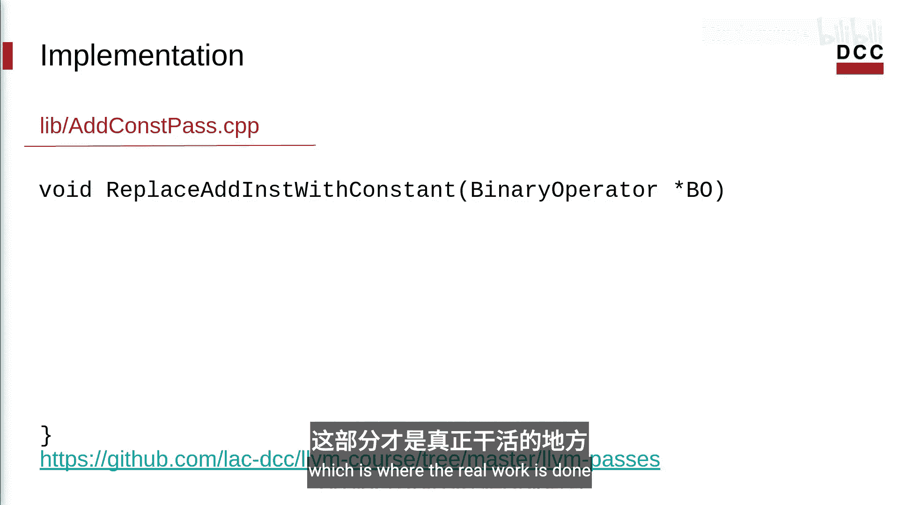

然后，我们明确放弃`AddConstAnalysis`，因为我们从程序中删除了收集到的加法指令。这意味着任何其他需要`AddConstAnalysis`结果的Pass都会导致该分析重新运行。

```cpp
PA.abandon<AddConstAnalysis>();
```

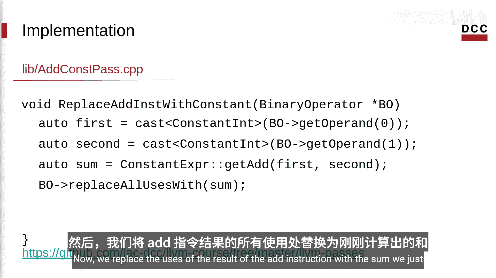

最后，我们返回这个`PreservedAnalyses`对象。

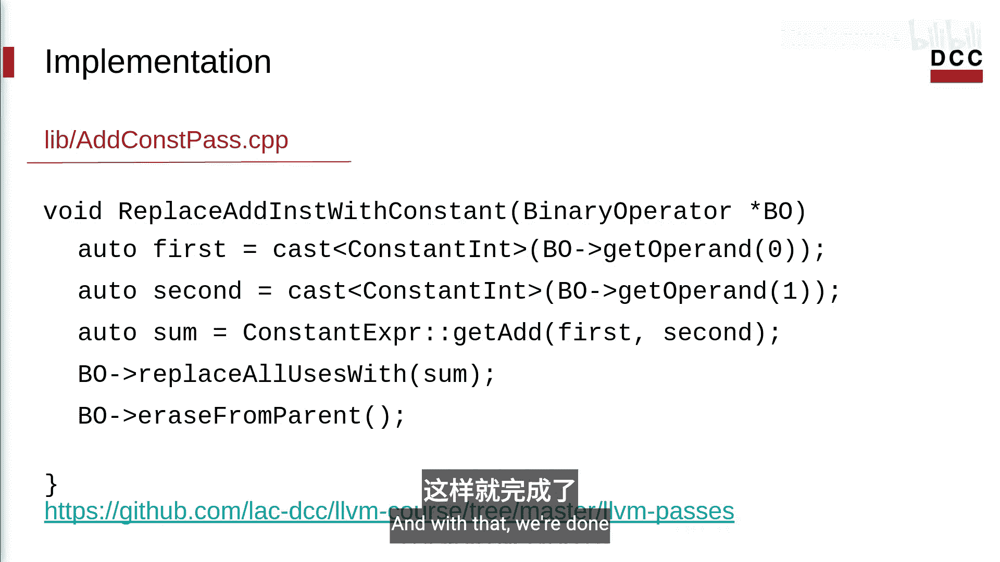

## 核心转换函数

现在，让我们看看`replaceAddInstWithConstant`函数，这是真正完成工作的地方。

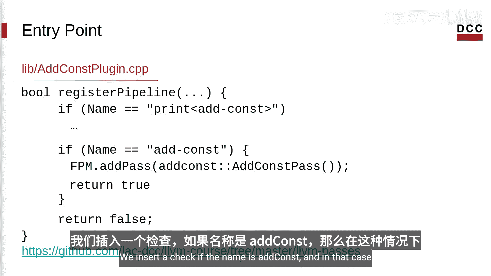

该函数执行以下操作：
1.  提取加法指令的第一个操作数，并将其转换为常量整数类型。
2.  对第二个操作数执行相同的操作。
3.  计算它们的和，并存储在一个变量中。
4.  用我们刚刚计算出的和，替换该加法指令结果的所有使用处。
5.  从程序中擦除这条加法指令。

```cpp
void replaceAddInstWithConstant(Instruction *AddInst) {
  ConstantInt *Op1 = dyn_cast<ConstantInt>(AddInst->getOperand(0));
  ConstantInt *Op2 = dyn_cast<ConstantInt>(AddInst->getOperand(1));
  APInt Sum = Op1->getValue() + Op2->getValue();
  AddInst->replaceAllUsesWith(ConstantInt::get(AddInst->getContext(), Sum));
  AddInst->eraseFromParent();
}
```

## 注册转换Pass

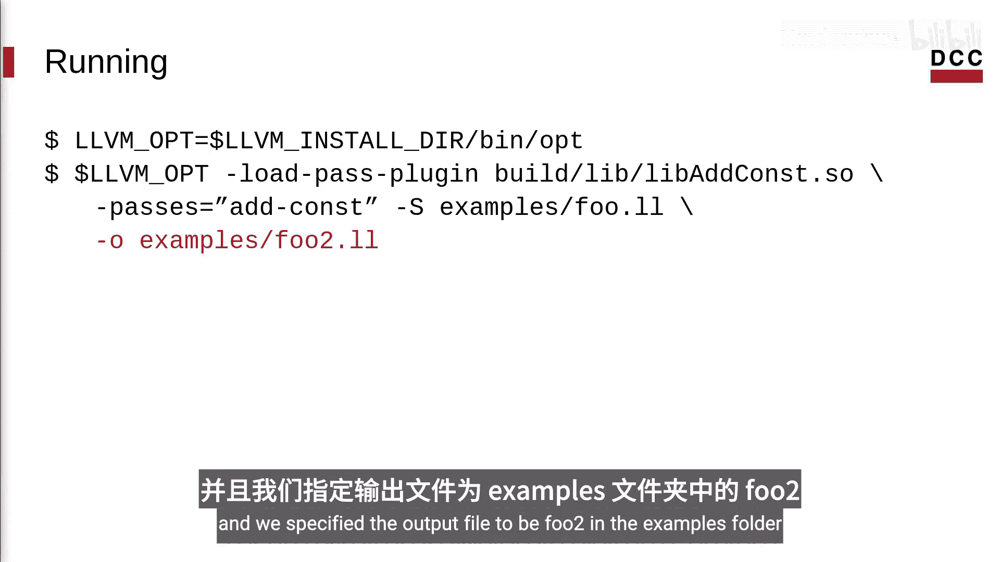

最后一步是注册我们的Pass。以下是我们上次简化版的注册管道函数。我们插入一个检查，如果Pass名称是`add-const-transform`，就将我们的转换Pass加入管道。

```cpp
llvm::PassPluginLibraryInfo getPassPluginInfo() {
  return {LLVM_PLUGIN_API_VERSION, "MyPasses", "1.0",
          [](PassBuilder &PB) {
            PB.registerPipelineParsingCallback(
                [](StringRef Name, FunctionPassManager &FPM,
                   ArrayRef<PassBuilder::PipelineElement>) {
                  if (Name == "add-const-printer") {
                    FPM.addPass(AddConstPrinterPass(errs()));
                    return true;
                  }
                  if (Name == "add-const-transform") { // 新增
                    FPM.addPass(AddConstTransformPass());
                    return true;
                  }
                  return false;
                });
          }};
}
```

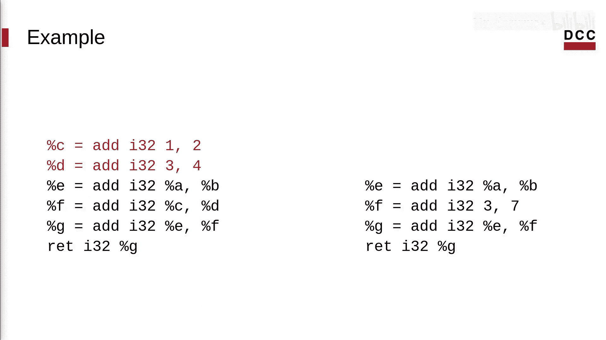

## 运行与验证

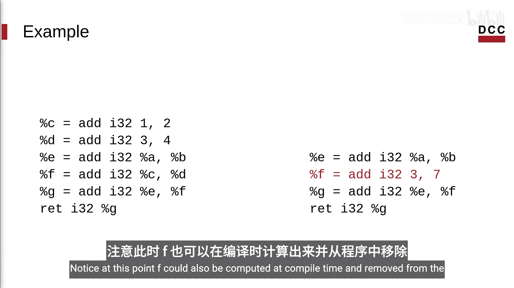

让我们在之前的示例文件上运行我们的转换Pass。我们使用`opt`工具来运行Pass。

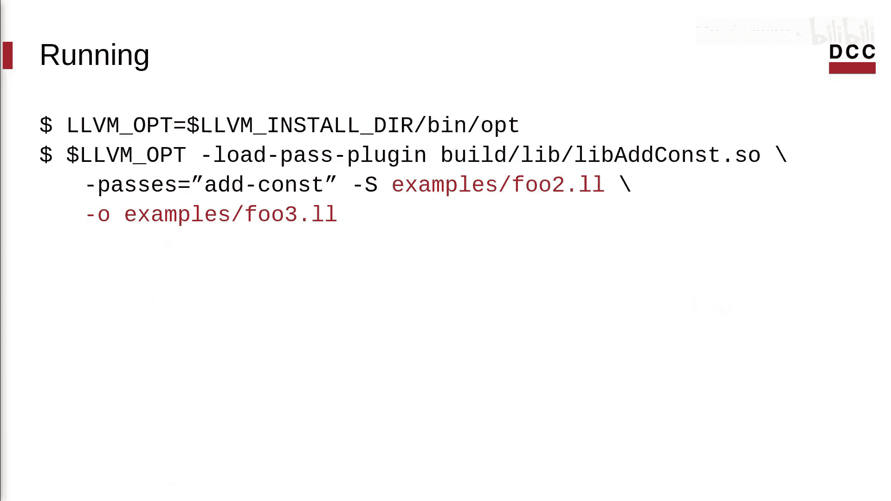

首先，加载我们的插件，然后指定要运行的Pass名称。`-S`标志表示我们希望输出为LLVM IR文本格式。我们指定输入文件和输出文件。

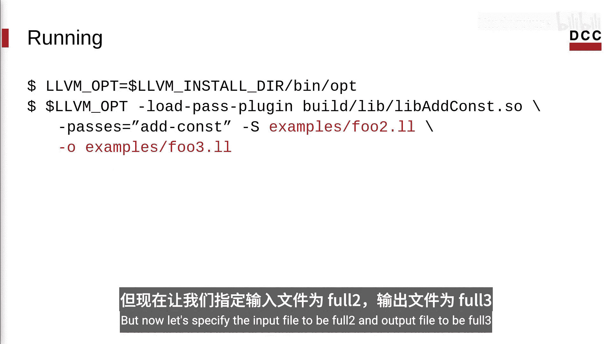

运行第一次转换后，程序中的`c`和`d`被移除，定义`f`的加法指令的操作数也发生了变化。但我们可以更进一步，注意到此时`f`也可以在编译时计算并移除。

让我们重新运行Pass，但这次指定第一次转换的输出作为输入。最终，我们得到了一个完全优化后的版本，所有仅涉及常量的加法都被预先计算了。

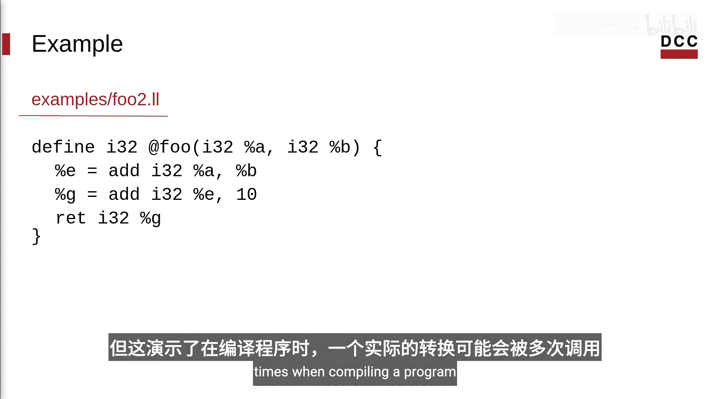

虽然我们可以设计我们的转换Pass来迭代函数直到没有更多的加法需要移除，但这个例子演示了在编译程序时，一个真实的转换Pass可能会被多次调用。

## 总结

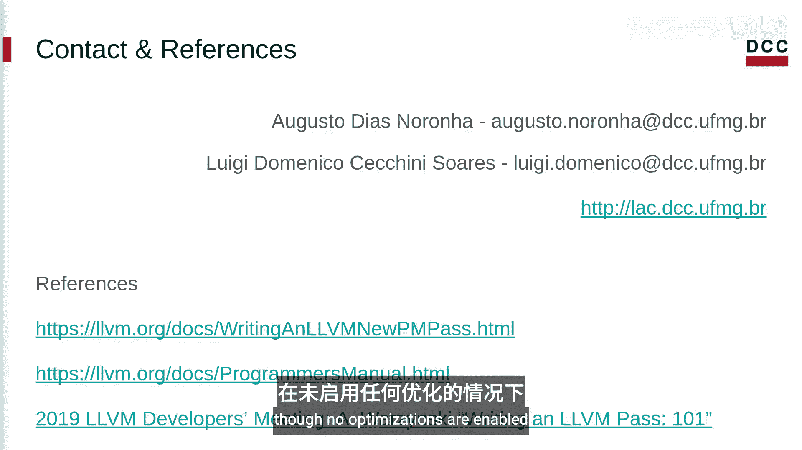

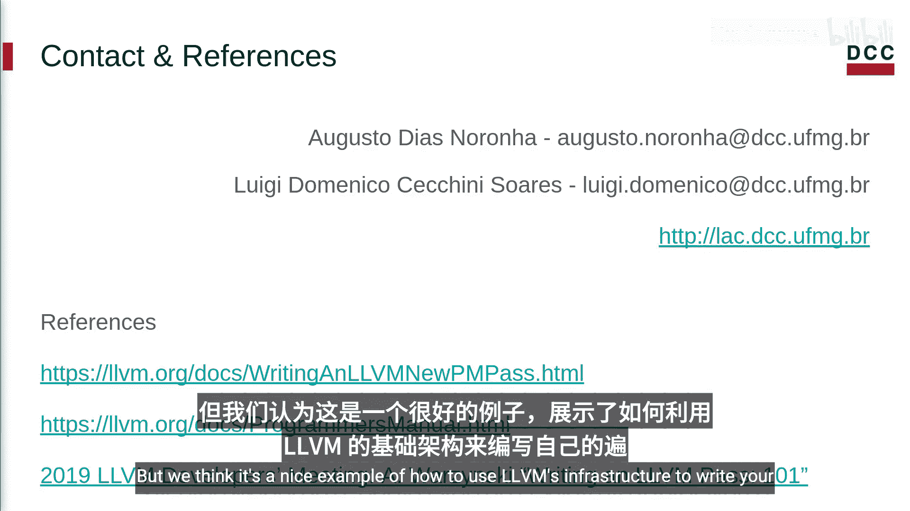

本节课中我们一起学习了如何在LLVM上编写一个转换Pass。我们基于之前的分析Pass，实现了一个常量传播优化，将编译时可确定的加法指令替换为计算结果。这种常量传播实际上由LLVM自动完成，即使没有启用任何优化选项。但我们认为这是一个很好的例子，展示了如何使用LLVM的基础设施来编写你自己的Pass。

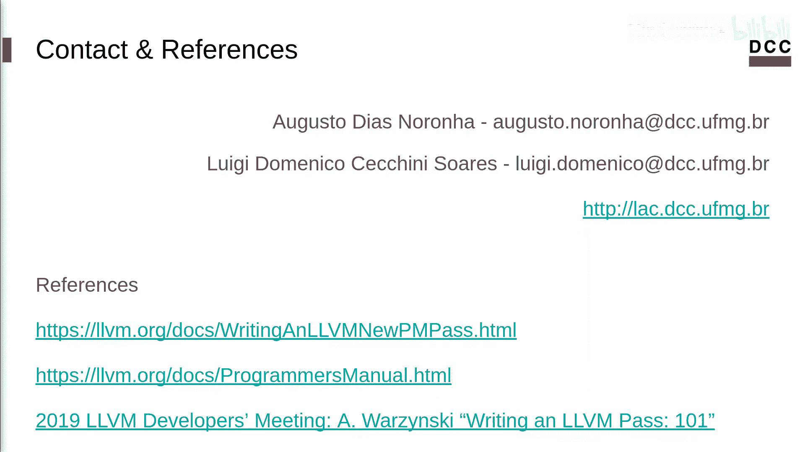

在下一节视频中，我们将学习如何编写LLVM后端。欢迎提出任何评论或问题。