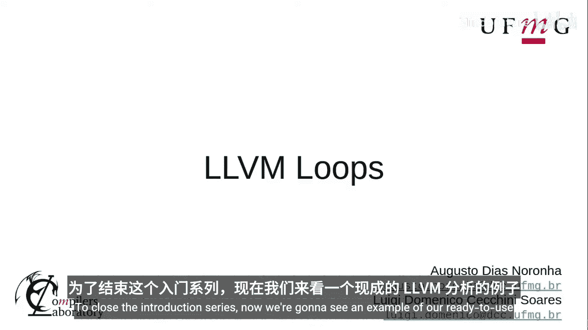
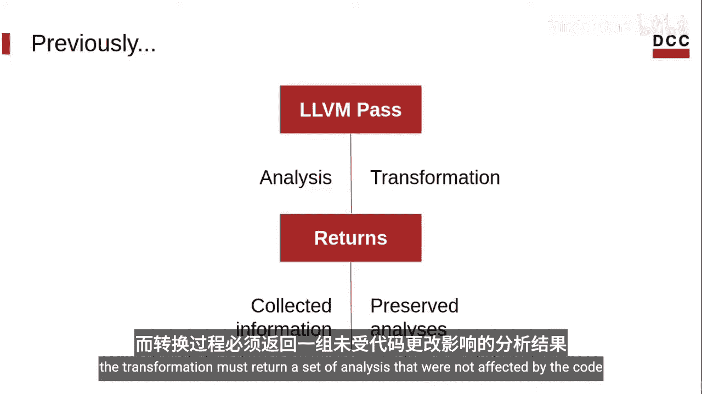
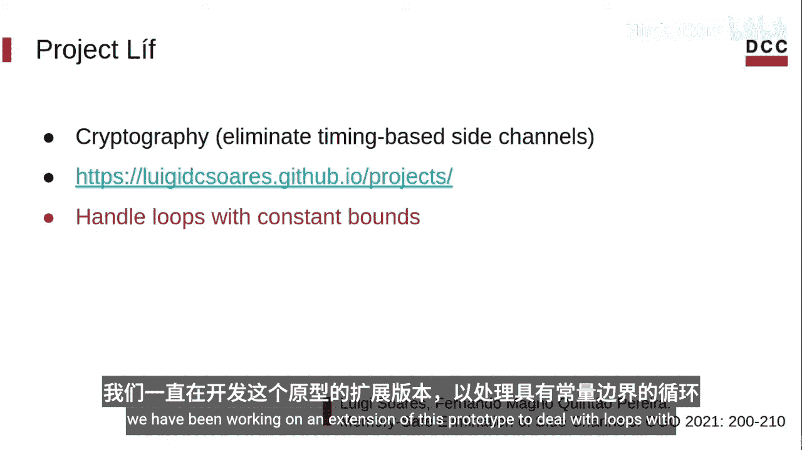
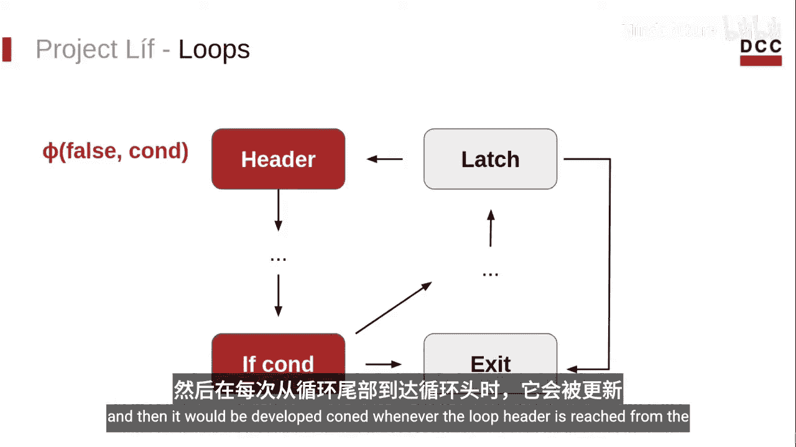
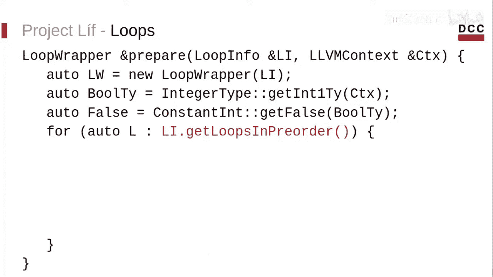
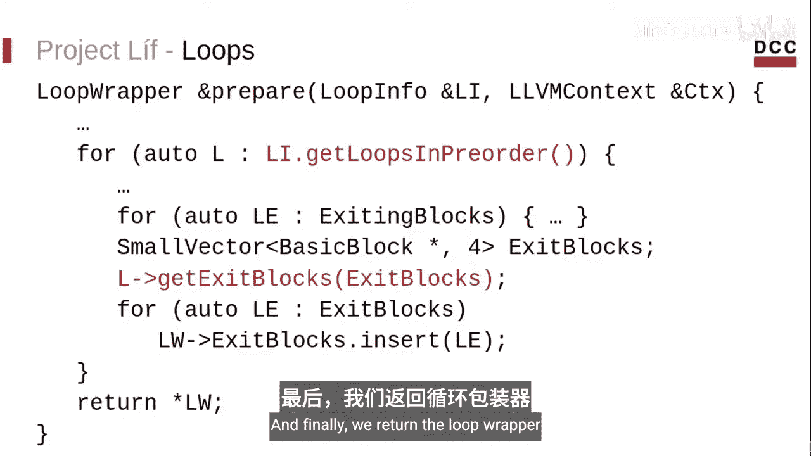
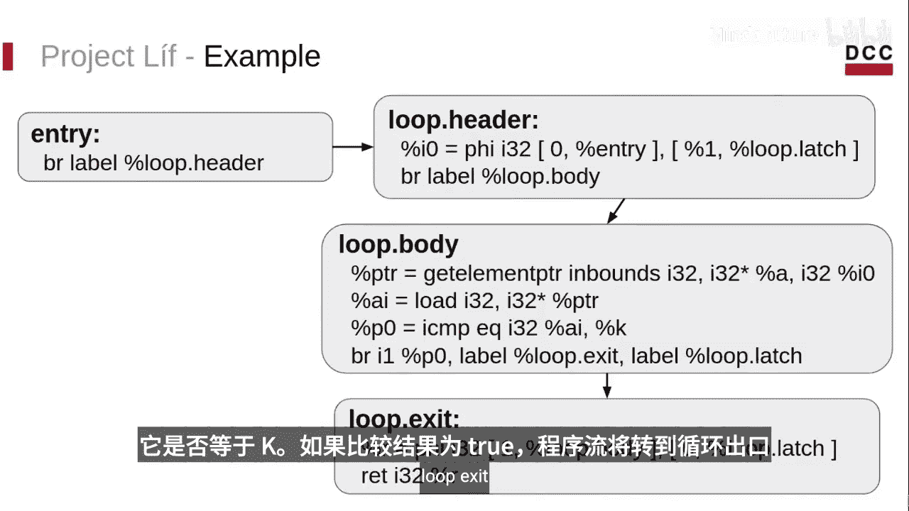
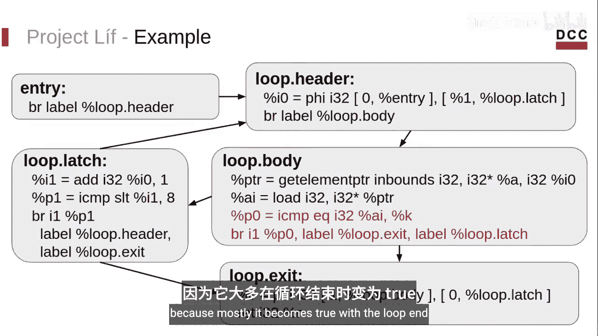
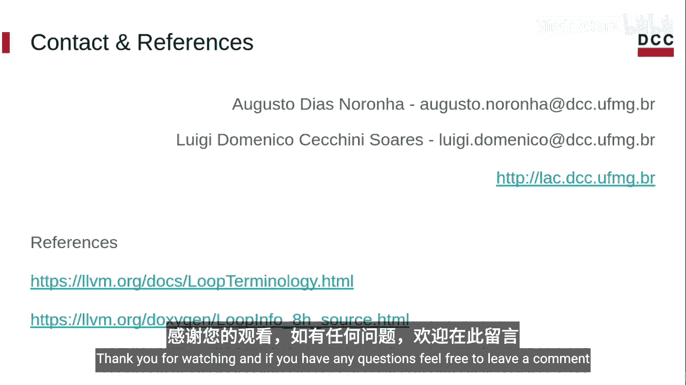

# 011：LLVM循环分析 🔄



在本节课中，我们将学习如何使用LLVM中一个现成的、功能强大的分析工具——循环分析。我们将通过一个具体的代码示例，了解如何获取循环信息并利用这些信息进行程序转换。

## 概述



在之前的视频中，我们讨论了相关Pass的概念、使用方法以及如何编写它们。为了结束这个入门系列，现在我们将展示一个使用现成LLVM分析功能的完整示例。

## 循环分析简介

我们已经知道，LLVM中间表示（IR）是由一系列Pass构成的。这些Pass可以是分析（Analysis）或转换（Transformation）。尽管分析Pass和转换Pass的代码结构非常相似，但它们存在一些关键区别。例如，转换Pass可以修改代码，而分析Pass则不能。它们的结果也不同：分析Pass返回收集到的信息，而转换Pass则返回一组不受代码更改影响的分析结果。

## LoopInfo分析Pass

LLVM自带了一个现成的分析Pass，称为`LoopInfo`分析。这个循环分析返回一个名为`LoopInfo`的结构，它存储了一个函数中的所有循环信息。一旦我们获得了对循环的访问权限，就可以获取大量有用的信息，例如：
*   循环头（Loop Header）
*   循环锁存块（Loop Latch），即有一条指向循环头的回边的块
*   退出中块（Exiting Blocks），即拥有指向循环外边的块
*   退出块（Exit Blocks），即退出中块的目标块
*   以及其他更多信息

接下来，我将展示我参与开发的一个项目中的一段代码，它使用了与循环相关的信息。首先，让我简要介绍一下这个项目的背景。

## 项目背景：LAF

LAF是“Low La Zran”的缩写。这里的“Zran”指的是程序的运行时间。如果一个程序无论输入什么，总是以相同的顺序执行相同的操作和内存访问，我们就说它是“Zran”的。这保证了其运行时间不依赖于输入。这种恒定时间特性对于加密实现尤其重要，因为它们必须免受侧信道攻击。侧信道攻击是一种可以被对手利用来获取敏感信息的漏洞。



如果你想了解更多关于这个项目的信息，可以查看我的网页，我也会在视频描述中留下链接。你也可以阅读我们在CGO 2021上发表的论文，其中详细解释了侧信道攻击。在发表那篇论文时，我们的原型完全无法处理循环，要求所有循环都必须被展开。

但从那时起，我们一直在扩展这个原型，以处理具有恒定边界的循环。这就是我今天要展示的代码片段所涉及的内容。

## 代码示例：prepareLoop函数

我将展示的这个函数的目标是对循环进行预处理，以便我们后续能够处理它们。

假设我们有一个循环，包含一个循环头和一个循环体。循环体内有一个条件语句，如果条件为真则退出循环，否则继续执行循环体的第二部分。循环末尾有一个循环条件，它有一条回边和一条指向退出块的边。我们希望消除循环内的这个条件语句，因为我们需要保证循环总是执行相同次数的迭代。

为了实现这一点，我们需要在循环头中添加一个Phi函数，来跟踪条件语句是否被触发。这就是我将展示的函数主要做的事情。此外，它还会收集一些信息供后续使用。



Phi函数存在于SSA形式中，用于合并变量。在本例中，Phi函数的结果在程序首次到达循环头时为`false`，之后每当从循环锁存块到达循环头时，其值将取决于条件语句的结果。

## 函数详解

这个函数名为`prepareLoop`，它接收一个`LoopInfo`和一个上下文（Context），并返回一个`LoopWrapper`。这个`LoopWrapper`是一个自定义结构，我们将在其中存储循环信息以及一些额外数据。如前所述，`LoopInfo`是循环分析的结果。因此，在代码库的某个地方，我们必须有类似下面的代码来请求`LoopInfo`的结果：



```cpp
LoopInfo &LI = getAnalysis<LoopInfoWrapperPass>().getLoopInfo();
```

首先，我们初始化`LoopWrapper`。然后，定义一些常量，用于插入那些Phi函数。这些常量包括Phi函数的类型和初始值。

现在，我们将遍历所有循环，为此我们将使用`LoopInfo`。

```cpp
for (Loop *L : LI) {
    // 处理每个循环
}
```

接着，我们获取循环头和循环锁存块。我们假设锁存块是唯一的，因此循环只有一条回边。这主要是为了简化。有一个名为`loop-simplify`的算法Pass可以保证这一点。我们还假设循环是旋转形式（rotated form），这可以通过运行`loop-rotate` Pass来实现。一个旋转后的循环基本上是一个`do-while`风格的循环，条件在末尾。



我们保存循环边以供后续使用。接下来，我们获取退出中块（exiting blocks），以及循环头中我们将要插入那些Phi函数的位置。

然后，我们访问每个退出中块（除了循环边，因为一旦它的条件语句为真，循环就结束了）。我们获取退出中块的终止指令，它是一个条件语句。接着，我们获取条件值，并创建一个Phi函数。然后，我们遍历循环头的前驱块，用正确的传入值填充这个Phi函数。我们还将这个函数保存在我们的`LoopWrapper`结构中。

之后，我们获取退出块（exit blocks），即循环外的目标块，并将它们也保存起来。最后，我们返回`LoopWrapper`。

## 代码概览



这就是我们代码的样子。如你所见，整个`prepareLoop`函数并不大，只有29行代码。无论如何，你可以在GitHub仓库中找到它，我会在视频描述中留下链接。

## 示例说明



为了说明，考虑以下函数。它接收一个数组`A`和一个整数`K`，并遍历数组`A`，尝试搜索这个整数`K`。它被翻译成如下的LLVM IR表示：
*   入口块，跳转到循环头。
*   循环头，获取循环归纳变量`i`的值。
*   循环体，从数组`A`的位置`i`加载值，并检查它是否等于`k`。
*   如果比较结果为真，控制流转到循环退出并返回1。
*   否则，程序移动到循环锁存块，在那里更新归纳变量并评估循环条件。

在这个循环中，我们有一个条件语句。我们需要在循环头中添加一个Phi函数，它与循环体中的条件语句相关。它被初始化为`false`，因为一旦它变为`true`，就意味着循环应该结束。

## 总结

本节课中，我们一起学习了如何使用`LoopInfo`分析来获取一个函数中的所有循环信息，包括嵌套循环。一旦我们能够访问每个循环，就可以获取各种信息，如循环头、锁存块、退出块和退出中块，以及循环是否处于旋转形式等等。



本视频的目标是向你展示，LLVM已经内置了许多现成的、非常有用的工具。这个视频结束了入门系列。相关的链接、GitHub仓库和论文都在视频描述中。感谢观看，如果你有任何问题，请随时在下方留言。