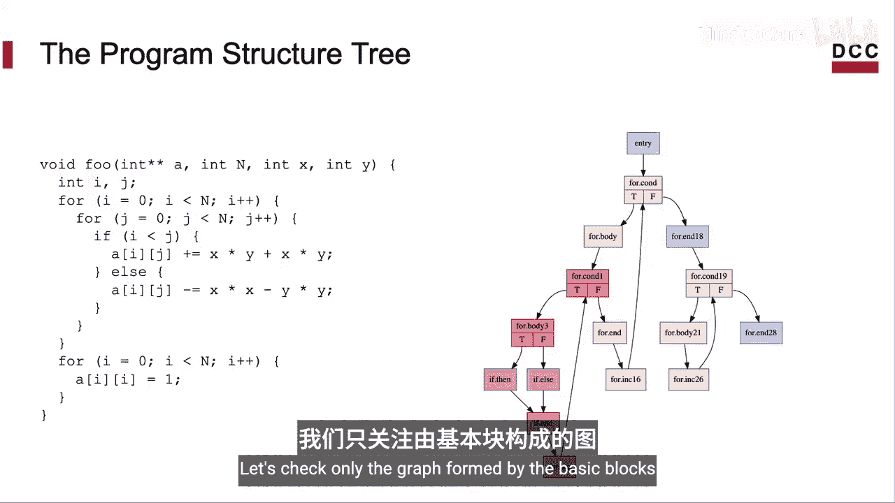
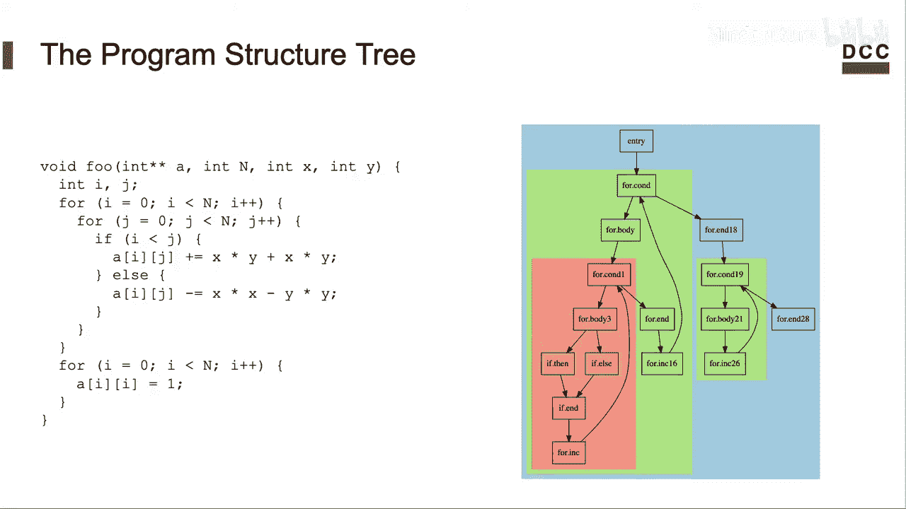
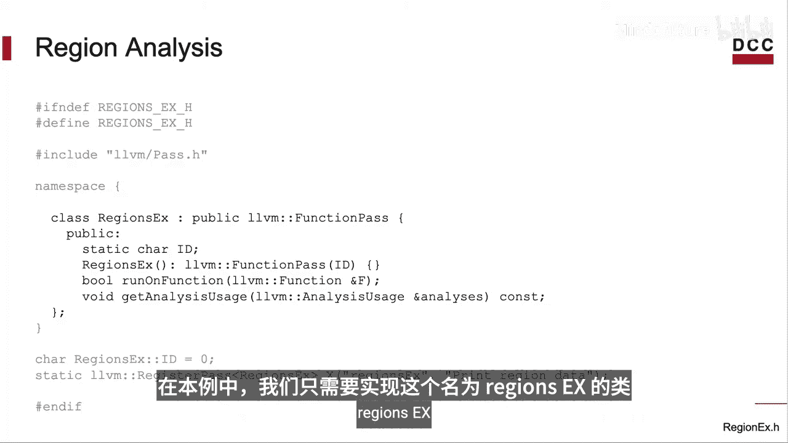
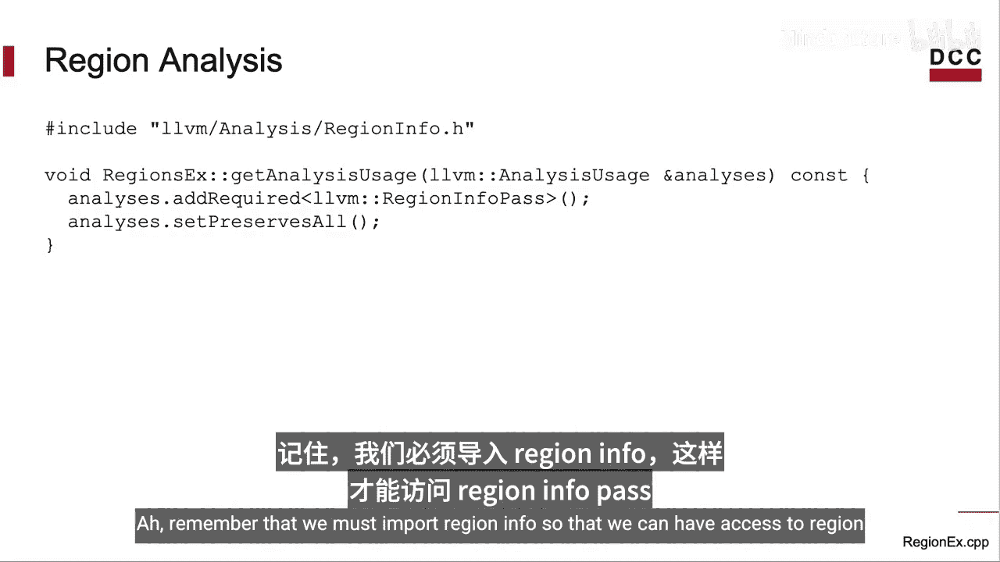
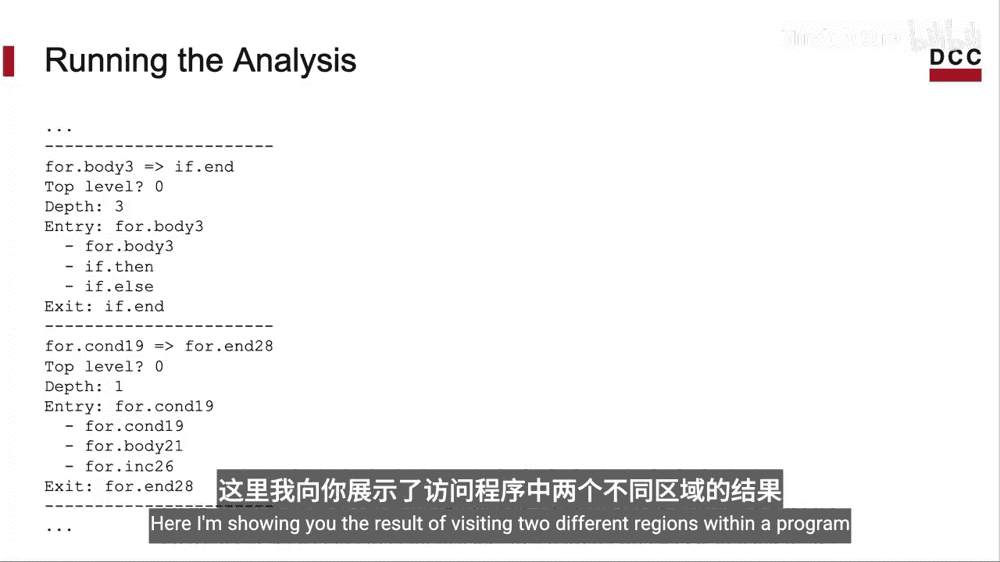
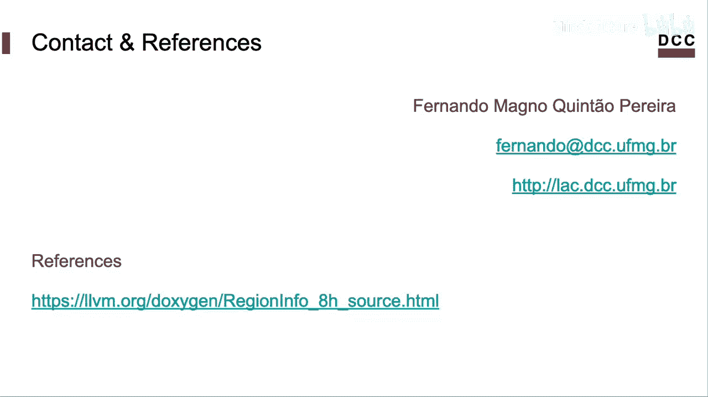

# 012：区域分析 🔍

在本节课中，我们将要学习LLVM执行的一种特定静态分析，称为区域分析。该分析将构成程序的基本块分组为所谓的“单入口单出口区域”。我们将了解其基本概念，并学习如何调用一个LLVM Pass来遍历和分析这些区域。

## 概述

区域分析将程序的控制流图（CFG）中的基本块分组为嵌套的、单入口单出口的区域。这种结构对于许多编译器优化和分析任务非常有用，例如自动并行化、快速构建程序依赖图以及检测时序侧信道。

## 什么是区域？ 🧩

首先，我们需要理解什么是区域。一个区域是控制流图中的一个子图，它满足以下条件：
*   **单入口**：只有一个基本块可以从区域外部进入。
*   **单出口**：只有一个基本块可以退出到区域外部。

例如，如果一个图是程序的控制流图，我们可以识别出多个这样的区域。整个CFG本身就是一个区域，其入口是函数的入口节点，出口是函数的出口节点。在这个大区域内，可以嵌套更小的子区域，例如一个循环结构。子区域内部还可以包含其他子区域。

这些就是非平凡的单入口单出口区域。我们简称它们为“C区域”。未展示的其他C区域是平凡的，因为它们只包含一个基本块（即一个节点）。你可以自行验证，每个C区域确实都满足单入口和单出口的条件，即使对于内部包含循环的区域也是如此。

## 区域的用途 🛠️

上一节我们介绍了区域的定义，本节中我们来看看区域分析的实际用途。虽然本课程的目标是展示如何调用LLVM Pass，但了解其用途有助于理解其重要性。

将基本块分组为区域对许多任务非常有用：
*   **自动并行化**：识别可以并行执行的代码区域。
*   **快速构建程序依赖图**：帮助构建程序的依赖关系。
*   **函数提取**：利用控制依赖关系从函数内部提取出子函数。
*   **侧信道检测**：一个非常酷的应用是，我们可以利用这些概念来检测程序中与时间相关的侧信道漏洞。

如果你想了解如何使用C区域来检测侧信道，我推荐一篇论文，其中包含了基于LLVM构建的实现。

## 程序结构树 🌳

LLVM为我们提供了一个数据结构，将区域组织成一棵树。这棵树被称为**程序结构树**。计算程序结构树的算法可在一篇1994年的论文中找到。

为了说明LLVM提供了什么，请考虑下面这个程序。程序具体做什么并不重要，我们只关心其结构。

这是程序的控制流图。我们并不太关心每个基本块内的指令，只关注由基本块构成的图结构。




LLVM会将基本块分组为嵌套的C区域。你可以在右侧看到这些区域。




这种将块分组为区域的操作是由称为**区域分析**的Pass完成的。

## 实现一个区域遍历Pass 💻



现在，让我们来实现一个遍历LLVM提供给我们的区域的Pass。这是我们的分析Pass的头文件。整个头文件并不大。顺便说一下，我将使用传统的Pass管理器。

对于这个例子，我们只需要实现一个类，我称之为`RegionsEX`。它只包含少数几个方法。


我们需要实现其中的两个方法：`runOnFunction` 和 `getAnalysisUsage`。让我们从更简单的后者开始。

### 实现 `getAnalysisUsage`



`getAnalysisUsage` 方法本身只有两行。第一行向LLVM说明我们将使用区域分析，这个分析由 `RegionInfoPass` 类提供给我们。另一行只是说明我们保留了LLVM迄今为止收集的所有信息，即我们的Pass不会以任何方式转换代码。

记住，我们必须导入 `RegionInfo` 以便能够访问 `RegionInfoPass`。我们可以在CPP文件中完成这个操作。


### 实现 `runOnFunction`

现在，让我们回到头文件。还需要为这个分析实现 `runOnFunction` 方法。我们想要做的就是打印出构成函数的每个区域的信息。

以下是 `runOnFunction` 方法的实现。它包含四行代码，我们将逐一讲解。

```cpp
bool runOnFunction(Function &F) override {
    auto &RI = getAnalysis<RegionInfoPass>().getRegionInfo();
    Region *TopRegion = RI.getTopLevelRegion();
    visitRegion(TopRegion);
    return false; // 我们没有修改代码
}
```

1.  首先，我们获取一个对 `RegionInfo` 类的引用。这是第一行代码的作用。
2.  然后，我们获取一个指向区域树根节点的指针。我们通过捕获区域树根的引用来做到这一点，使用 `RegionInfo` 的 `getTopLevelRegion` 方法。
3.  接着，我们需要访问这些区域。我们将递归地访问它们，就像遍历一棵树一样。
4.  最后，方法返回 `false`，表示此Pass没有修改函数。

### 实现 `visitRegion` 方法

以下是 `visitRegion` 方法。它也比较简短，让我们看看它的各个部分。

```cpp
void visitRegion(Region *R) {
    printLog(R);
    for (auto &SubRegion : *R) {
        visitRegion(SubRegion.get());
    }
}
```

首先，它打印关于区域 `R` 的信息。我将在后面展示这个 `printLog` 方法。请注意，在我们处理完区域 `R`（即打印区域信息）之后，我们将遍历其子区域。换句话说，我们遍历区域中的子区域列表，并对所有这些子区域递归调用 `visit`。

### 实现 `printLog` 方法

`printLog` 方法打印关于区域的信息，正如我之前所说。以下是我写的实现。这个实现的目标只是向你展示操作区域的LLVM API的不同部分。

```cpp
void printLog(Region *R) {
    errs() << "Region Name: " << R->getNameStr() << "\n";
    errs() << "Is Top Level? " << (R->isTopLevelRegion() ? "Yes" : "No") << "\n";
    errs() << "Region Nesting Level: " << R->getDepth() << "\n";

    if (BasicBlock *Entry = R->getEntry())
        errs() << "Entry Block: " << Entry->getName() << "\n";

    errs() << "Contains Blocks: ";
    for (auto *BB : R->blocks())
        errs() << BB->getName() << " ";
    errs() << "\n";

    if (BasicBlock *Exit = R->getExit())
        errs() << "Exit Block: " << Exit->getName() << "\n";
    else
        errs() << "No Exit Block (e.g., outermost region)\n";

    errs() << "---\n";
}
```

*   每个区域都有一个名称，我们可以获取它。
*   我们还可以检查区域是否是最外层的（即不包含在任何其他区域内）。
*   我们可以检查区域的嵌套级别，即任何给定区域距离根区域有多远。顶级区域的深度为0。
*   我们可以读取区域的入口基本块。在这里，我读取入口基本块并打印其字符串名称。
*   接下来，我遍历构成当前正在访问的区域的每个基本块，并打印这些基本块的名称。
*   然后我打印区域的出口。请注意，并非每个区域都有出口块。有些区域没有，例如函数的最外层区域就没有出口块。这就是为什么我们需要检查出口是否可用。

哦，记得导入实现此方法所需的接口，即 `RegionIterator` 和LLVM的输出流实现。

这个分析因此实现在两个文件中：一个头文件和一个CPP实现文件。

## 编译与运行Pass 🚀

一旦分析准备就绪并编译完成，我们就可以调用它。你需要准备一个字节码文件，然后使用 `opt` 工具在这个文件上调用我们的Pass。

首先，让我用 `clang` 编译一个程序以产生 `.bc` 字节码文件。
```bash
clang -c -emit-llvm example.c -o example.bc
```
然后，为了便于阅读，让我用 `opt` 优化并重命名变量。
```bash
opt -mem2reg example.bc -o example.opt.bc
```
最后，这就是我们如何在新产生的字节码文件上调用刚刚创建的Pass。
```bash
opt -load ./libRegionsEX.so -regions-ex < example.opt.bc
```
命令行中 `-load ./libRegionsEX.so` 这部分定位了我们的Pass库。我称这个Pass为 `regions-ex`。不确定你是否记得，我们在头文件中有这样一行代码来注册Pass及其命令行标志 `-regions-ex`。哦，记得在命令行中传递存储Pass库的完整路径。

我们之前已经展示过如何编译LLVM Pass。这是我们的区域分析的输出。我向你展示了访问程序中两个不同区域的结果。




我想你可以将我们在 `printLog` 方法中使用的不同命令与我们在输出中得到的结果联系起来。比如，这里是我们访问的两个区域的名称，这里是基本块的列表。

无论如何，我将留给你暂停视频，并检查右侧的每个方法在左侧的输出中产生了什么。如果你遇到困难，可以写信问我问题。你也可以查看区域分析的实现，我在这里放了一个链接。

## 总结



本节课中我们一起学习了LLVM中的区域分析。我们了解了什么是单入口单出口区域，以及它们如何被组织成程序结构树。我们实现了一个简单的LLVM Pass来遍历和打印函数中的区域信息，包括区域的名称、嵌套级别、入口/出口块以及包含的基本块。通过这个实践，你掌握了调用和利用LLVM区域分析基础设施的基本方法，这为进行更复杂的程序分析和转换奠定了基础。