# 013：什么是LLVM元数据？ 🔍


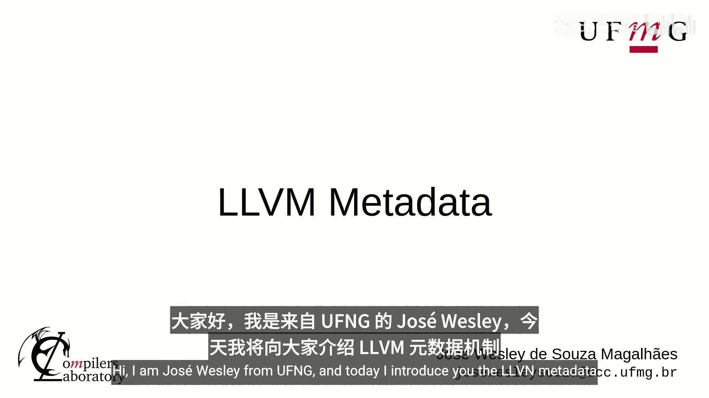

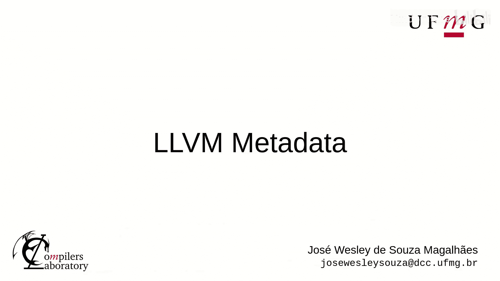

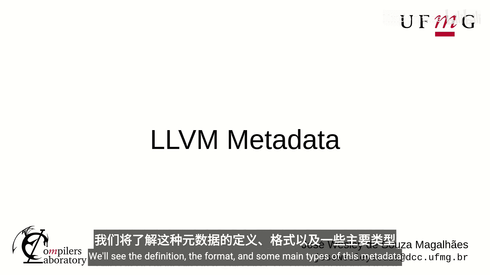

在本节课中，我们将要学习LLVM元数据（Metadata）机制。我们将了解其定义、格式以及一些主要的类型。

## 概述

LLVM提供元数据来存储关于程序的信息。这些信息可以被优化器和代码生成器使用。其主要用途是调试信息，但并非唯一用途。元数据也可用于不同的程序分析和转换。例如，C语言的类型别名分析会使用元数据，因为它必须依赖于源代码语言的类型系统，而不是IR的类型系统。

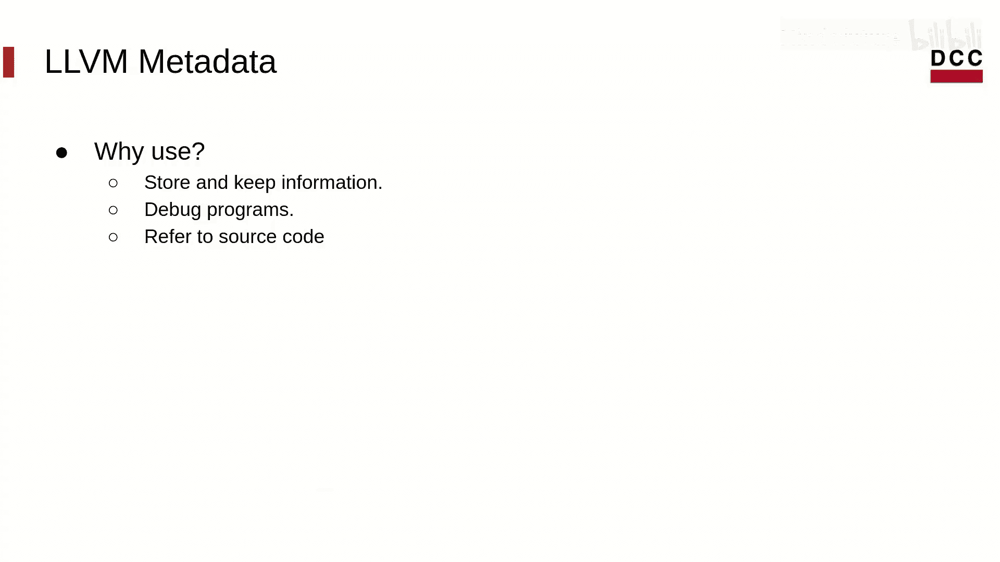

那么为什么要使用元数据呢？通过元数据，可以在程序进行转换时存储并保留相关信息。它同样有助于开发调试程序，并在源代码早已不存在时，仍能引用源代码信息。

在本课程中，我们将重点介绍如何使用元数据来开发调试程序。

## 生成元数据

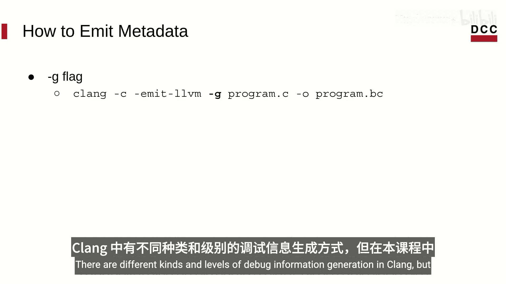

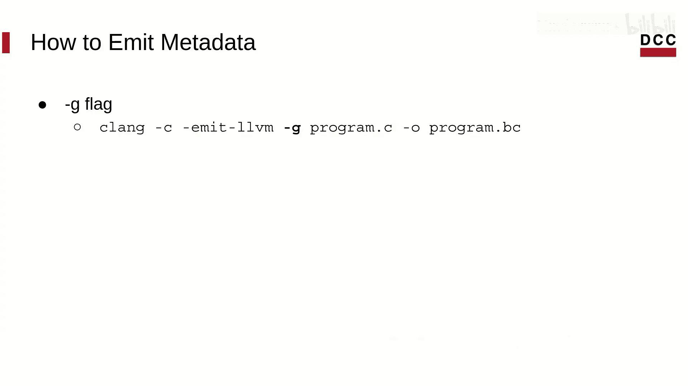

为了生成用于调试目的的元数据，我们需要在编译程序时添加 `-g` 标志。这个标志告诉编译器在生成IR时附带源代码调试信息。这些元数据随后会被代码生成器翻译成平台特定的调试信息。

在Clang中，有不同种类和级别的调试信息生成选项。但对于本课程，仅使用 `-g` 就足够了。默认情况下，它会生成完整的调试信息。

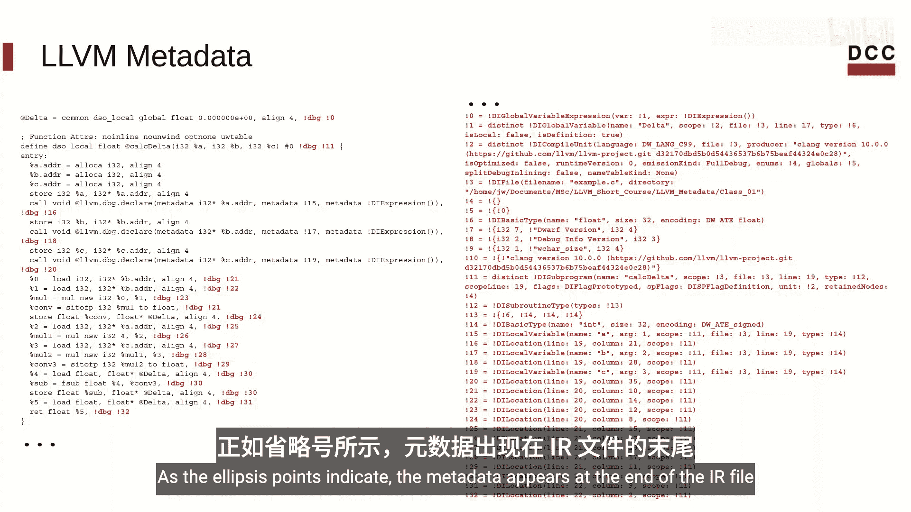

## 元数据格式

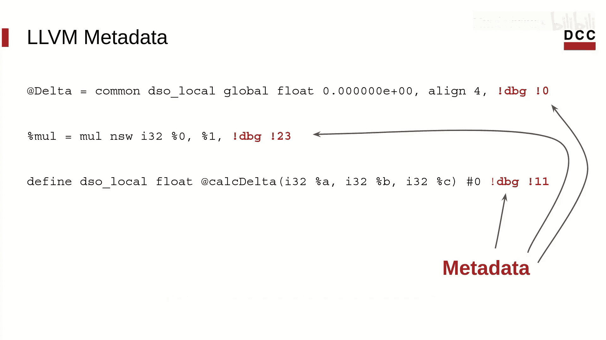

以下是一个函数被翻译成LLVM IR后的示例。其中，红色字体部分是与该函数关联的元数据。如省略号所示，元数据出现在IR文件的末尾。

元数据可以附加到IR的容器上，例如全局变量、指令和函数。元数据附加在容器的末尾。所有元数据都以感叹号开头，并拥有索引。例如，附加到名为 `delta` 的函数上的元数据索引为 `!11`。可以使用这个索引来检索特定的元数据。

## 元数据类型

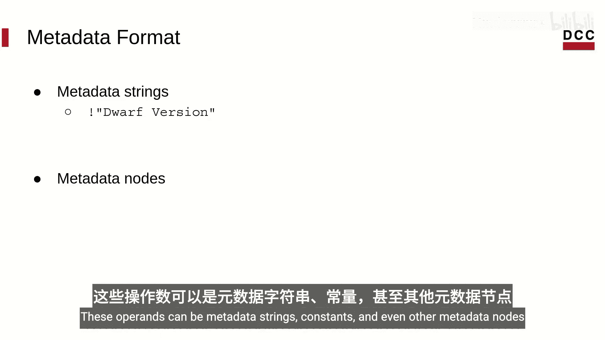

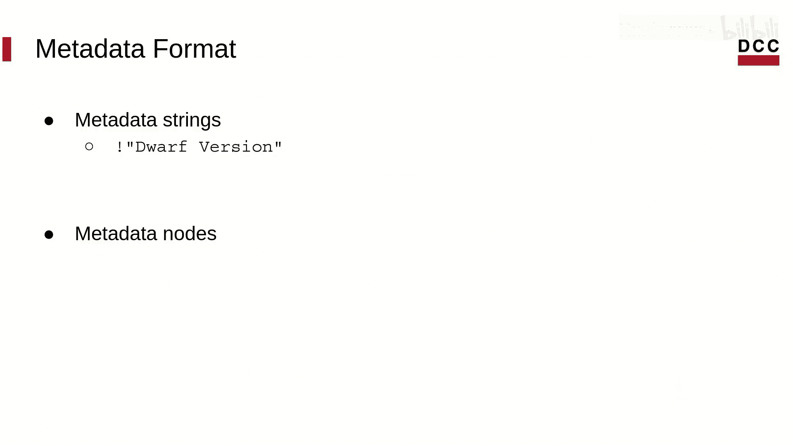

本质上，元数据有三种类型：元数据字符串、元数据节点和命名元数据。

**元数据字符串**可以存储字面量字符串，可以包含任何字符，并且总是由双引号包围的字符串。例如，以下元数据字符串用于显示当前的DWARF版本：
```llvm
!0 = !{!"Dwarf Version", i32 4}
```

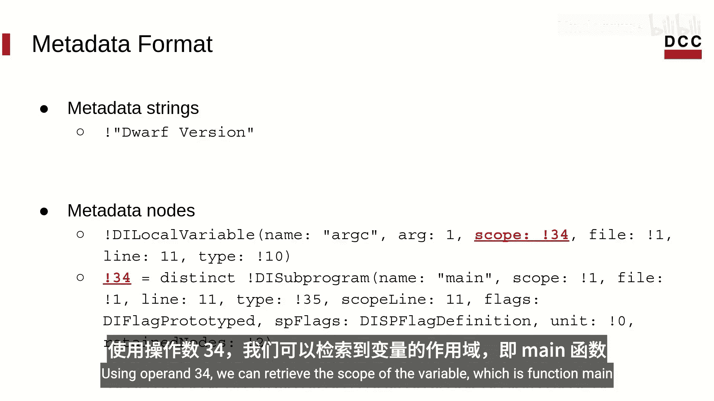

**元数据节点**类似于元数据的元组，它们能更精确地描述源代码对象。节点具有操作数，我们可以轻松访问它们，这允许用户遍历元数据。这些操作数可以是元数据字符串、常量，甚至是其他元数据节点。

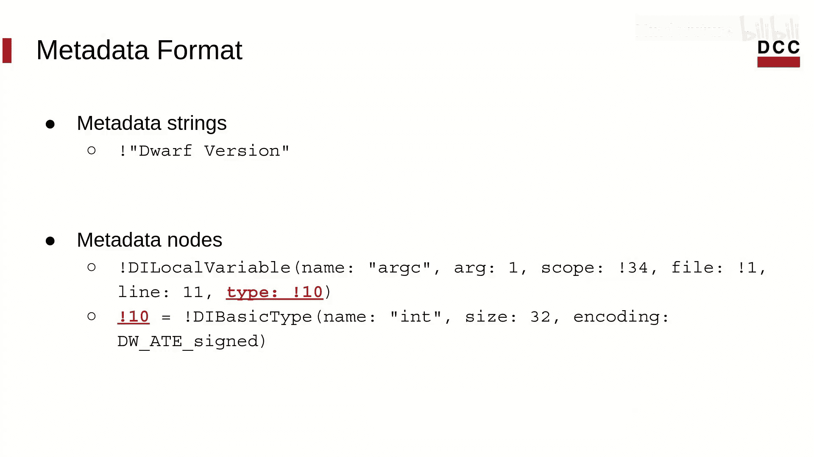

例如，以下节点描述了一个名为 `a_c` 的局部变量：
```llvm
!1 = !DILocalVariable(name: "a_c", arg: 1, scope: !2, file: !3, line: 11, type: !4)
```
仅通过查看这个节点，我们就可以看到该变量是一个参数，其声明位于源代码的第11行。但这并不是我们能从这个节点获取的唯一信息。通过遍历其操作数，我们可以访问其他元数据节点。使用操作数 `!2`，我们可以检索变量的作用域，即函数 `main`。我们还可以获取源文件代码和变量的类型。可以看到，所有这些信息都存储在其他元数据节点中。

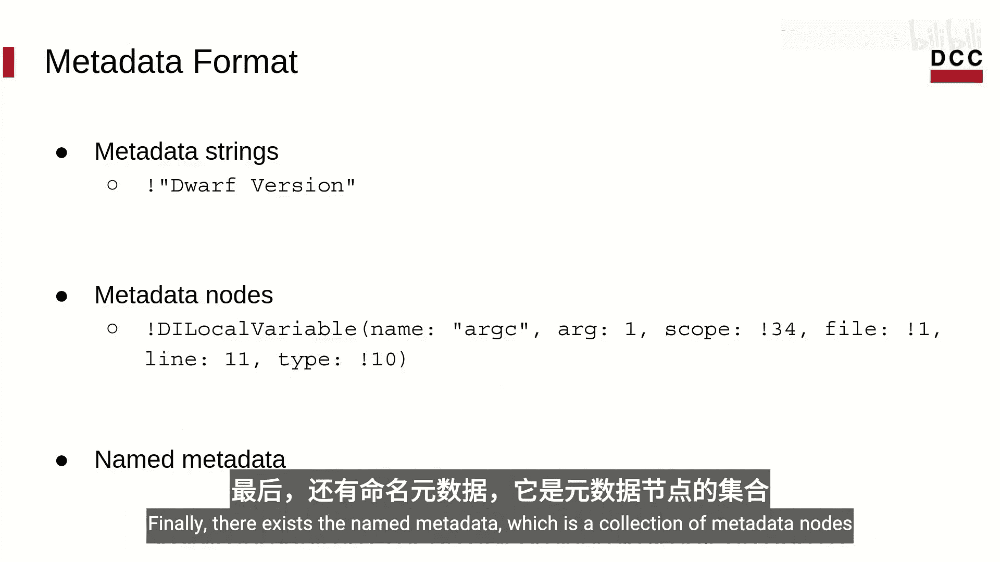

在课程中，我们将更详细地介绍元数据节点的主要类型。

最后，存在**命名元数据**，它是元数据节点的集合。在示例中，`named` 就是一个命名元数据。它可以在模块符号表中查找。命名元数据表示为一个带有元数据前缀（即感叹号）的字符串。

需要知道的是，元数据不是LLVM值，并且元数据没有类型。但是，元数据可以作为用户参数用于函数调用，例如LLVM的 `dbg.declare` 指令。然而，当被函数调用引用时，我们使用的不是元数据本身，而是元数据类型。

## 主要专用节点

专用节点与源代码对象直接相关。


*   **DICompileUnit**：表示一个编译单元。使用此节点可以访问诸如全局变量、宏和程序导入等信息。
*   **DIFile**：表示源文件。
*   **描述作用域的节点**：如描述词法块的 `DILexicalBlock`、描述局部作用域的 `DILocalScope` 以及描述函数的 `DISubprogram`。
*   **描述变量的节点**：如局部变量和全局变量。
*   **描述类型的节点**：
    *   基本类型，如 `int`、浮点数和 `bool`。
    *   派生类型，如指针和结构体成员。
    *   复合类型，如数组、结构和联合。
    *   字符串类型，用于表示字面量字符串。

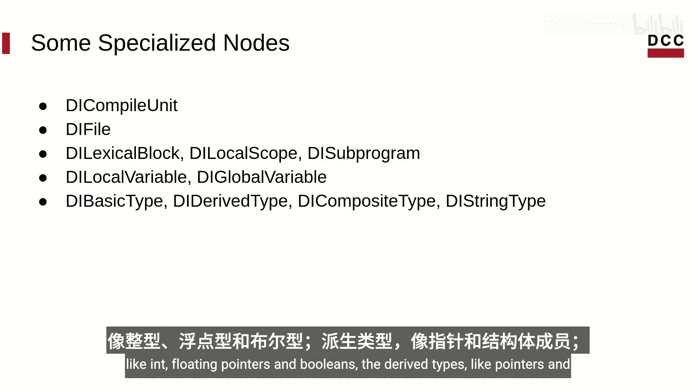

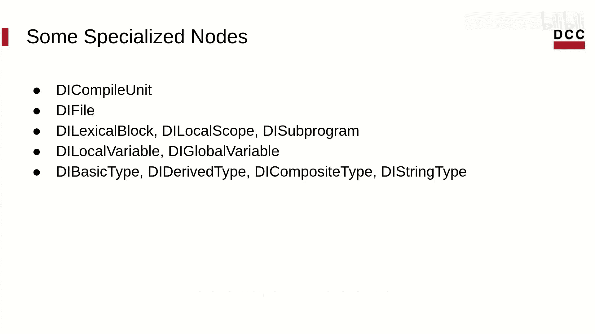

## 总结

本节课我们一起学习了LLVM元数据的入门知识。我们了解了它是什么、如何生成以及其基本格式和类型。在下一节课中，我们将学习如何访问元数据并从中检索信息。

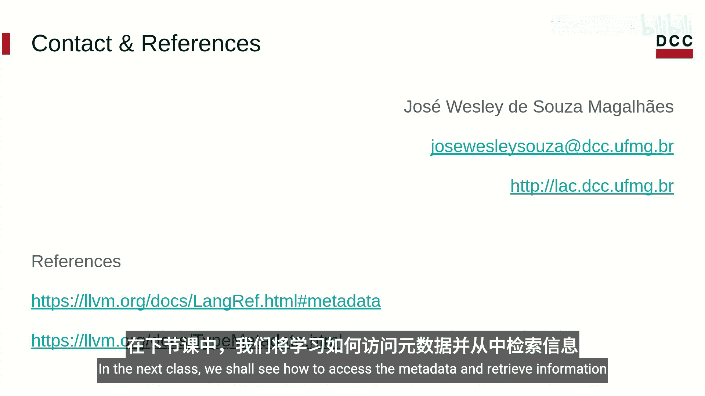

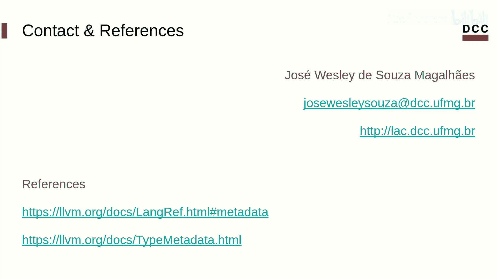

如果你有任何问题或评论，欢迎随时联系我。你可以在下面的描述中找到参考链接。