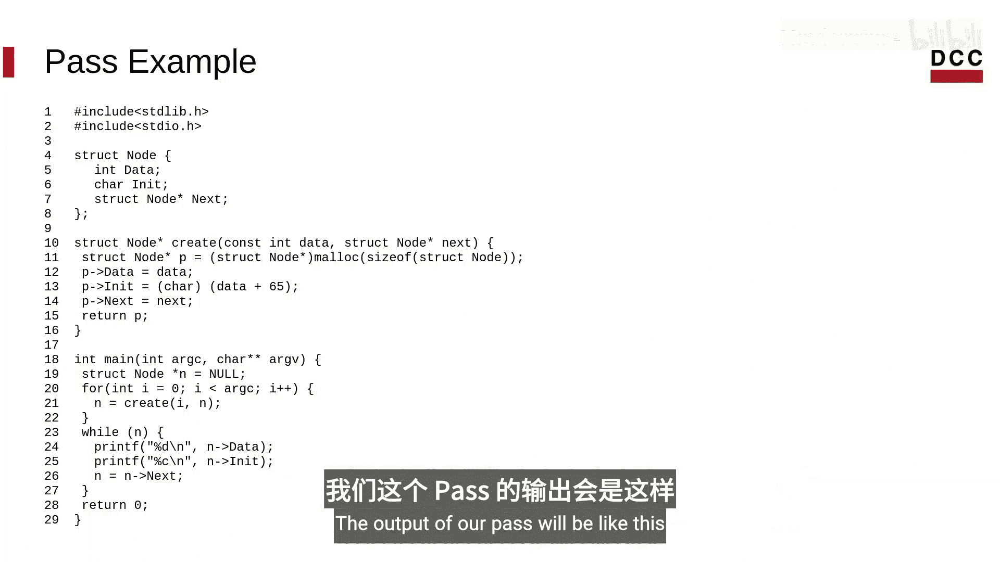
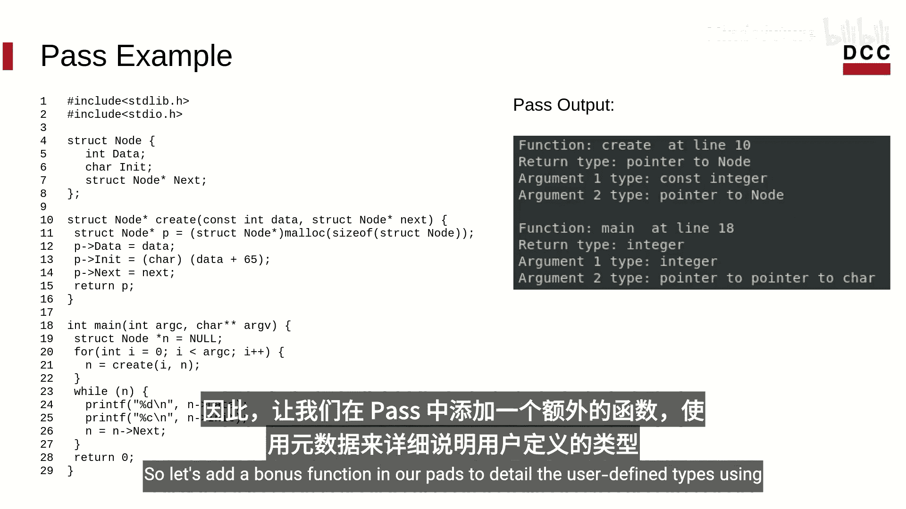
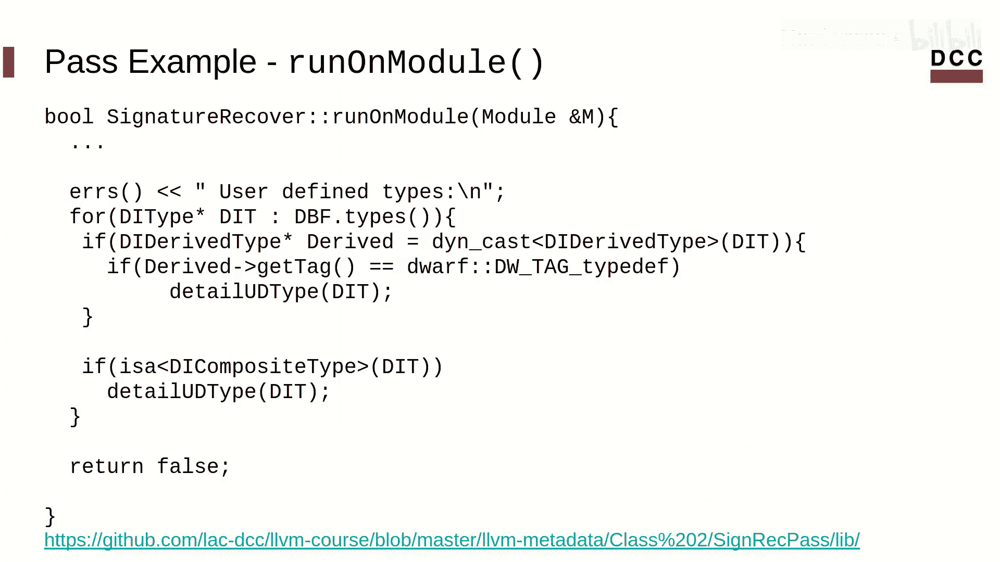
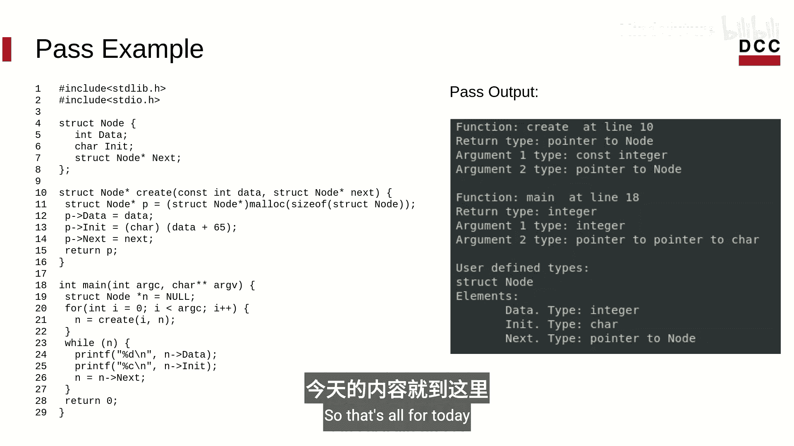
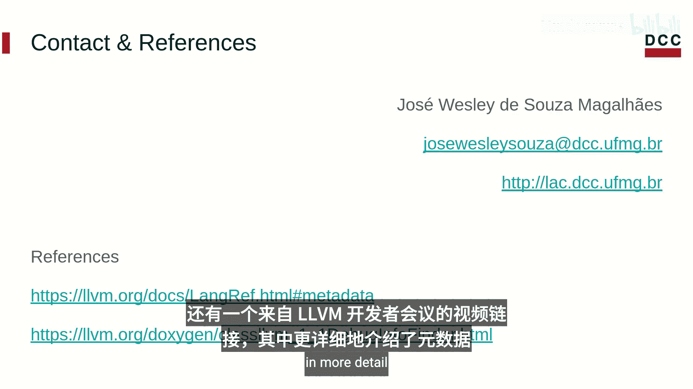

# 014：使用元数据恢复源码信息 🔍

在本节课中，我们将学习如何在LLVM Pass中利用元数据来获取程序源代码的相关信息。

上一节我们介绍了元数据的概念、作用及其主要类型。本节中，我们将动手实践，看看如何在LLVM Pass中具体使用元数据。

## 访问元数据的方法

DIR（调试信息表示）的某些组件提供了方法来获取附加在其上的元数据。

以下是指令（Instruction）组件访问元数据的方法示例：
```cpp
// 通过索引访问
instruction.getMetadata(20);
// 通过名称访问
instruction.getMetadata("dbg");
```
这两种方式都会返回相同的结果，即一个源代码位置信息。

类似地，其他组件（如全局变量、函数）也提供了获取其附加子程序（Subprogram）元数据的方法。这些方法都返回元数据节点。

## 使用DebugInfoFinder类

由于我们专注于使用元数据进行调试，接下来介绍DebugInfoFinder类。这是一个LLVM工具类，用于查找模块中的所有调试信息。

DebugInfoFinder内部维护了以下信息的迭代器：
*   所有编译单元（Compile Units）
*   所有子程序（Subprograms）
*   所有全局变量表达式（Global Variable Expressions）
*   所有类型（Types）
*   所有作用域（Scopes）

因此，一旦你处理了一个LLVM模块，在你的Pass中就可以访问所有这些信息。

## 构建一个函数签名恢复Pass

现在，我们来构建一个利用元数据重建函数签名的LLVM Pass。我们的最佳选择是创建一个模块Pass（Module Pass）。如果你对LLVM中Pass项目的结构有疑问，可以回顾我们关于编写LLVM Pass的课程。

我们的项目名为“Sign Re”。我们将结合模块的调试信息来使用DebugInfoFinder。

首先，我们需要处理模块。处理完成后，我们可以遍历所有子程序并逐个分析。

以下是获取每个子程序的两种等效方法：
1.  使用DebugInfoFinder遍历所有子程序。
2.  遍历IR函数，然后获取每个函数的子程序。

## 分析子程序信息

我们可以直接获取子程序的名称和声明行号。我们还可以获取子程序的类型，这是一个子程序类型（SubroutineType）。

SubroutineType类包含一个类型数组，构成了函数的签名。我们可以遍历这个数组来访问每个类型。

*   数组的第一个位置是函数的返回类型。如果第一个位置的元素是null，则表示这是一个无返回类型的void函数。
*   数组的其他元素是函数的参数类型。

接下来，我们的Pass将分析每个参数的类型，以及返回类型（如果函数有返回值的话）。

## 处理调试类型

请注意，我们正在处理的是调试类型（Debug Type），而不是上节课提到的IR类型。



*   **调试基本类型（Debug Basic Type）**：代表语言中的原始类型。我们定义一个函数，根据DWARF标签（Dwarf Tag）来识别每种类型，并返回包含类型名称的字符串用于打印。
*   **调试派生类型（Debug Derived Type）**：代表诸如指针或引用之类的限定类型。我们处理三种最常见的派生类型：指针（Pointers）、常量修饰符（Const Modifiers）和引用（References）。然后，我们递归调用相同的`analyzeDebugType`函数，但这次传递派生类型所基于的类型作为参数。
*   **调试复合类型（Debug Composite Type）**：代表由其他类型组成的类型，如结构体或联合体。我们处理这两种类型以及数组类型。同样，我们基于DWARF标签来识别该节点代表哪种复合类型。

## 示例程序与输出

以一个在链表中插入元素并打印的程序为例，我们的Pass输出将如下所示：
```
Function `create` at line 10 returns `node*`.
  Argument 1 is `const int`.
  Argument 2 is `node*`.
Function `main` at line 18 returns `int`.
  Argument 1 is `int`.
  Argument 2 is `char**`.
```
我们可以看到程序中有一个用户定义类型`node`，但输出没有提供关于此类型的更多信息。



## 扩展功能：详述用户定义类型

因此，让我们在Pass中添加一个额外的功能，利用元数据来详述用户定义类型。

我们像之前一样，通过DWARF标签来识别调试类型。当我们找到一个复合类型时，可以详述其每个组成元素（即构成它的类型）。在这种情况下，每个类型都是一个代表复合类型中字段的派生类型。我们可以获取字段的名称，并使用我们已经定义的函数来分析其类型。我们同样处理`typedef`关键字重定义的类型。



在我们的主方法中，我们使用DebugInfoFinder来访问模块中找到的每个类型。如果找到一个用户定义类型，我们现在就可以详述它。

现在，输出也包含了用户定义类型的信息，使得输出更加完整：
```
User defined type `node` at line 1.
  Field `data` has type `int`.
  Field `next` has type `node*`.
```



## 总结

本节课中，我们一起学习了如何在LLVM Pass中使用元数据，以及如何检索程序源代码的相关信息。



在下一节课中，我们将了解如何在经过优化的IR代码中跟踪变量。如果你有任何问题或评论，欢迎随时联系我。你可以在描述中找到参考资料、链接，以及本视频中使用的Pass实现链接。此外，还有一个链接指向LLVM开发者大会上更详细介绍元数据的视频。