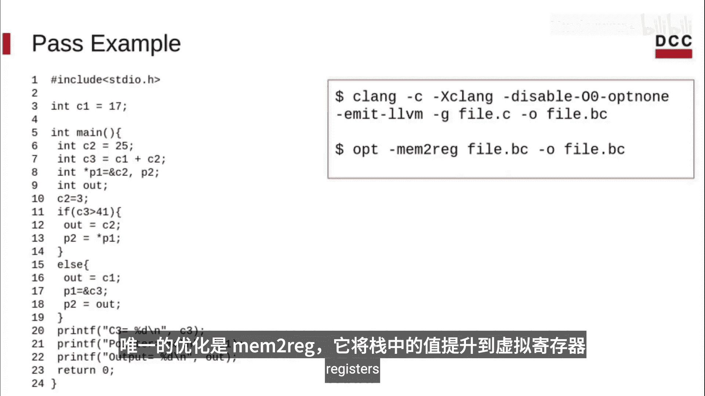
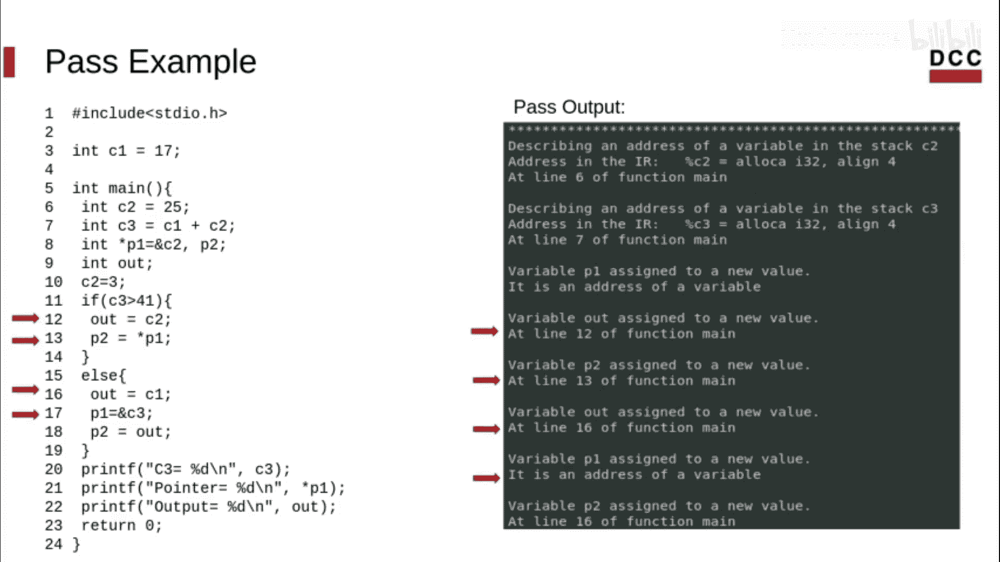
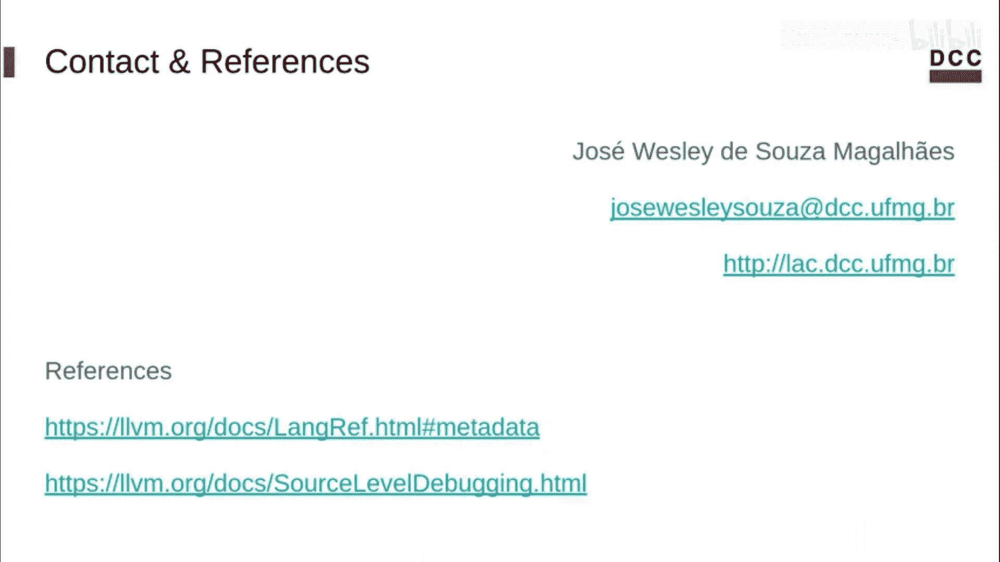

# 015：在LLVM IR中追踪变量 🔍

在本节课中，我们将学习如何使用元数据作为调试信息，在LLVM IR程序中追踪变量。

正如我们在之前的课程中所见，调试信息是LLVM元数据的主要应用场景。元数据是LLVM的一种机制，用于存储程序的某些信息，并确保这些信息在程序经过各种转换时得以保留。LLVM提供调试信息，旨在帮助开发者识别高级语言中的元素如何映射到LLVM代码，它保留了通常在编译过程中被剥离的信息。

调试信息必须仅服务于其自身目的。换句话说，它应该对编译器的其他部分影响甚微。任何转换、分析或代码生成都不应因为调试信息的存在而需要修改。同时，调试信息无需了解源语言级别的语义，因为LLVM被设计为支持多种语言。它应该能与任何语言协同工作，而不依赖于源代码语言施加任何限制。此外，它还需要与传统的机器码级别调试器（如GDB）兼容。

## 调试信息与元数据

LLVM使用了许多内联函数来在代码优化和生成过程中追踪变量。这些内联函数以 `llvm.dbg` 为前缀，并使用元数据作为参数。在本节中，我们将重点关注两个：`llvm.dbg.declare` 和 `llvm.dbg.value`。

`llvm.dbg.declare` 内联函数用于描述局部变量的地址。其第一个参数是变量本身的地址，第二个参数是一个 `DILocalVariable` 元数据节点，第三个参数是一个 `DIExpression`，用于描述引用的LLVM变量如何与源语言变量相关联。

以下是一个描述变量 `c2` 地址的 `dbg.declare` 示例：
```llvm
call void @llvm.dbg.declare(metadata i32* %c2, metadata !31, metadata !DIExpression()), !dbg !35
```
请注意，调试内联函数也附加了元数据（本例中是 `!dbg !35`）。需要重点注意的是，每个局部变量只能有一个 `dbg.declare` 调用，并且 `dbg.declare` 通常与 `alloca` 指令直接相关。

`llvm.dbg.value` 内联函数则提供关于用户源变量何时被赋予新值的信息。其第一个参数是新值（在本例中包装为元数据），第二个参数是包含变量描述的 `DILocalVariable`，第三个参数同样是一个 `DIExpression`。请注意，`llvm.dbg.value` 描述的是分配给源变量的**值**，而不是其地址。

以下是一个变量（由元数据 `!31` 描述）被赋予新值 `%3` 的示例：
```llvm
call void @llvm.dbg.value(metadata i32 %3, metadata !31, metadata !DIExpression()), !dbg !35
```

## 处理调试内联函数的LLVM Pass示例

上一节我们介绍了调试内联函数的基本概念，本节中我们来看看一个处理这些内联函数并打印变量赋值信息的LLVM Pass代码示例。

我们将遍历函数中的每条指令，并基于调试内联函数构建赋值追踪。以下是该函数的核心逻辑：

首先，我们获取与内联函数关联的变量。然后，需要识别我们正在处理的是 `dbg.declare` 还是 `dbg.value` 内联函数。这可以通过 `isAddressOfVariable()` 方法来完成，该方法对于 `dbg.declare` 返回 `true`，对于 `dbg.value` 返回 `false`。

对于 `dbg.declare`，我们可以获取该内联函数描述的地址并打印它。我们还可以获取该变量被声明的行号。为此，我们可以使用附加到调试内联函数的元数据，在本例中，该元数据是一个调试位置（`DebugLoc`）。

接下来，我们处理 `dbg.value` 内联函数。我们不处理行号节点，因为它们没有与源代码直接对应的严格映射。但是，我们会检查变量是否是一个常量值，并检查变量是否被赋予了一个新值。以类似的方式，我们可以检查新值是最终值还是某个变量的地址。最后，如果某个值是由另一条指令计算得出的，我们可以使用与之前讨论的相同方法获取相应源代码行的信息，即获取附加到它的元数据并打印行号。

## 示例程序分析

为了说明我们的分析如何工作，让我们使用这个程序示例。我们使用调试标志进行编译，并且唯一的优化是 `mem2reg`，它将栈上的值提升到虚拟寄存器中。



请注意，两个变量 `c2` 和 `c3` 保留在栈上。我们打印了这些信息，包括声明行。您可以暂停视频以更仔细地查看输出。

我们还可以检索到告诉我们 `p1` 被赋值为一个变量地址的信息，因为 `p1` 是一个指针。通过这种方式，我们能够为此程序中的每次赋值显示这些信息。




## 总结


本节课中，我们一起学习了如何使用调试信息在LLVM中间表示中追踪变量。在下一节课中，我们将了解如何向IR添加自定义元数据。如果您有任何问题或评论，请随时联系我。您可以在描述中找到参考和最佳实现的链接。还有一个链接指向LLVM开发者会议的视频，该视频深入探讨了LLVM中调试的一般用途。

感谢观看。



