# 016：TBAA元数据

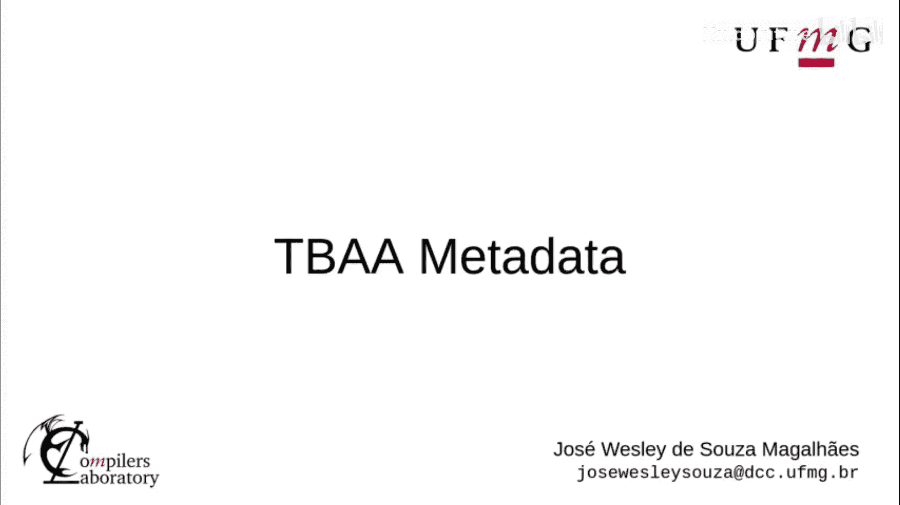

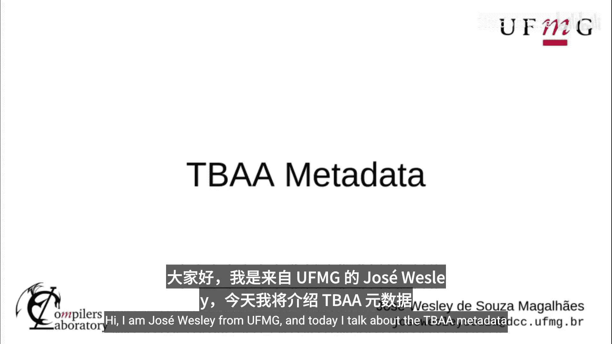


在本节课中，我们将学习LLVM中的TBAA（基于类型的别名分析）元数据系统。我们将了解其核心概念、组成部分，以及如何在LLVM IR中表示和访问这些信息。

## 概述：TBAA元数据的作用

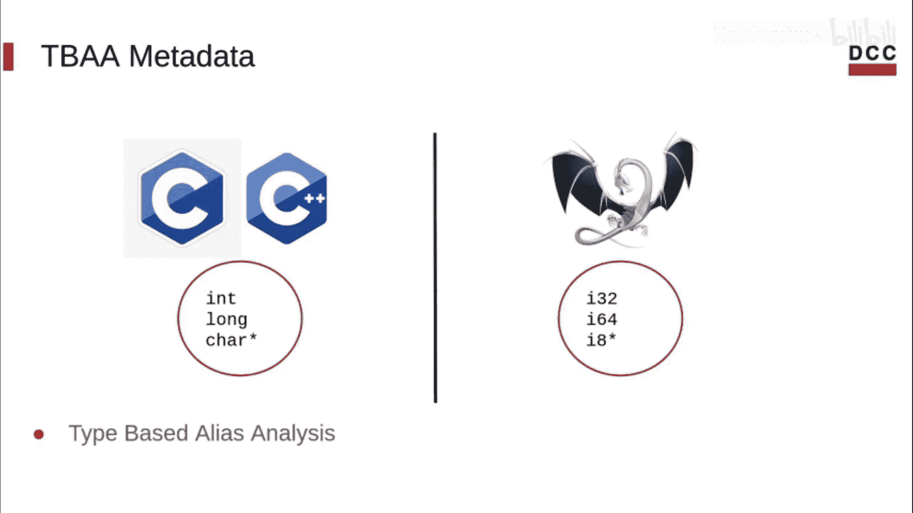

LLVM IR拥有自己的类型系统，这个系统与程序源代码语言的类型系统不同。此外，内存本身没有类型。这使得LLVM的类型系统不适用于进行基于类型的别名分析，这正是TBAA所代表的功能。因此，LLVM使用元数据机制来存储关于高级语言类型系统的信息。通过使用TBAA，可以实现C或C++的别名规则，以及依赖于编程语言类型系统的自定义分析。

## TBAA系统的核心组成部分

TBAA系统主要包含两个部分：语义和表示。语义部分描述了访问标签和类型描述符，而表示部分则解释了这些信息如何被编码为元数据节点。

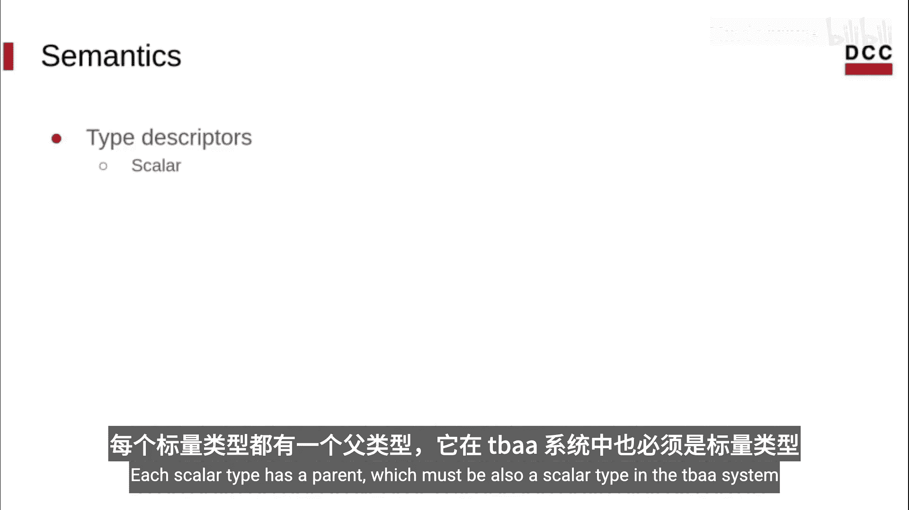

### 类型描述符

类型描述符用于表达高级语言的类型系统。

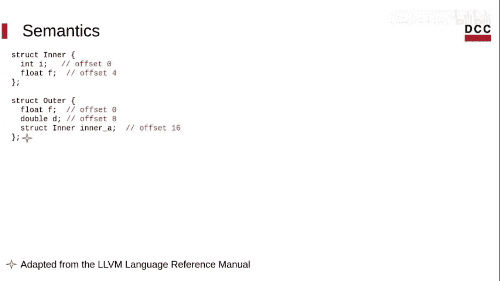

*   **标量描述符**：描述不包含其他类型的类型。每个标量类型都有一个父类型，在TBAA系统中，父类型也必须是一个标量类型。
*   **结构体描述符**：表示包含一系列其他类型描述符的类型，同时包含这些成员的偏移量信息。

父关系在TBAA系统中形成了一棵树，我们称之为**类型描述符图**。

让我们通过一个例子来看看TBAA图的样子。


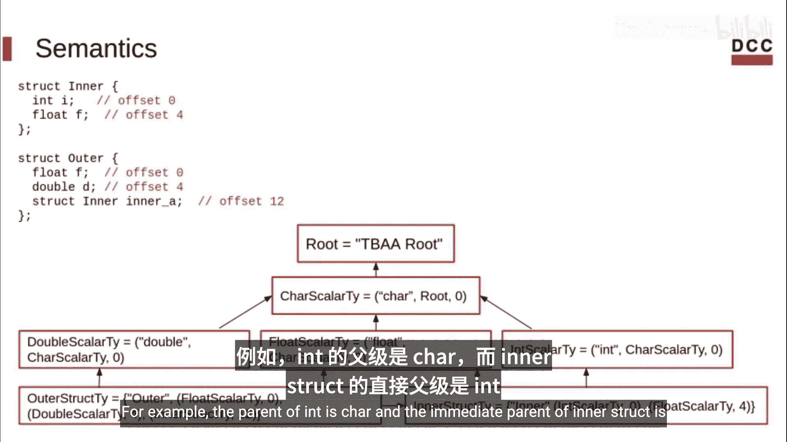

在TBAA图中，每个节点代表源代码中一个不同类型的描述符。图中存在一个根节点。有些节点可能位于不同的根节点下，但在那种情况下，它们之间的别名关系是未知的，LLVM会假设它们可能互为别名。我们这里讨论的所有内容都适用于同一根节点下的节点。

*   存在一个`char`类型的节点，因为在C/C++中，`char`可以用来访问任意类型。
*   然后我们有程序中包含的其他类型的节点。
*   注意，每个描述符都有一个直接父节点。例如，`int`的父节点是`char`，而`inner`结构体的直接父节点是`int`。

### 访问标签

访问标签是附加在加载和存储指令上的元数据。它们根据高级语言的类型系统来描述被访问的内存位置。

一个访问标签包含三个部分：一个**基类型**、一个**访问类型**和一个**偏移量**。访问标签可以描述两种情况：

1.  如果基类型是一个结构体类型，那么该标签描述的是：在基类型结构体中，位于指定偏移量处的、访问类型成员的内存访问。
2.  如果基类型是一个标量类型，那么偏移量必须为0，并且基类型和访问类型必须相同，因为你正在访问一个单一的标量。

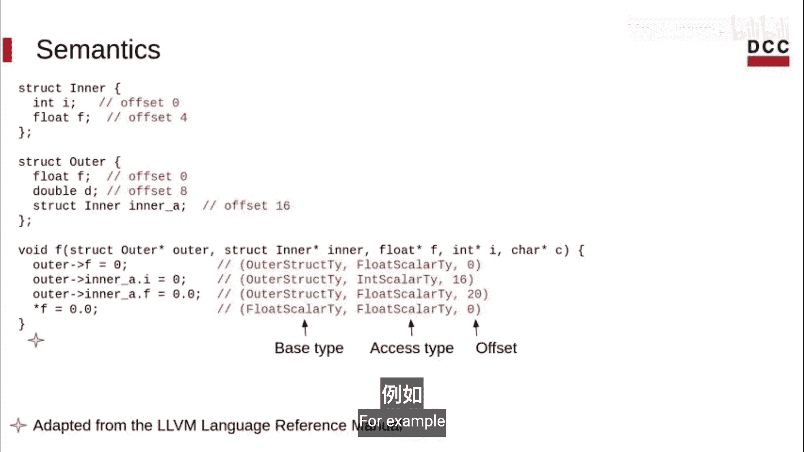

继续我们的例子，在函数`F`中，我们可以看到四个不同的访问及其对应的标签。

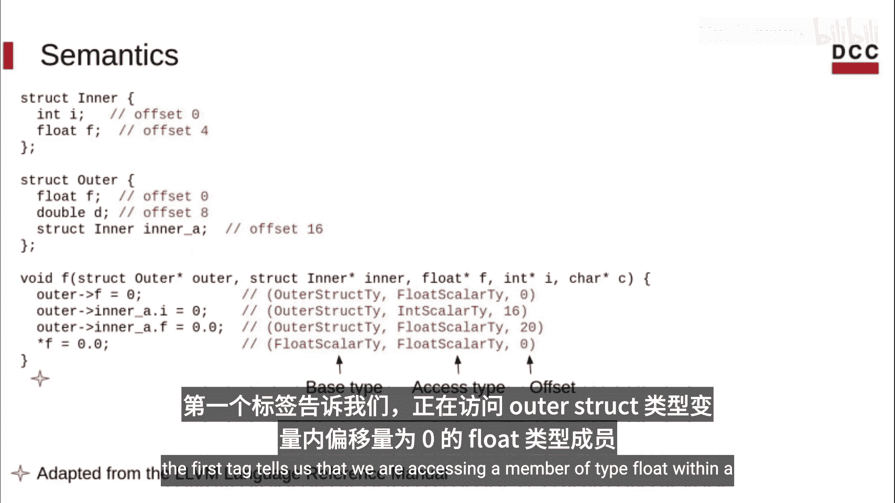

例如，第一个标签告诉我们，我们正在访问一个`outer`结构体类型变量中，偏移量为0处的`float`类型成员。


最后一个访问是针对标量类型`int`的，因此基类型和访问类型相同，且偏移量必须为0。

## TBAA元数据的表示

如前所述，所有的TBAA信息都被编码为元数据。因此，我们刚刚看到的组件在IR中都被表示为元数据节点。

以下是各种元数据节点的表示方式：

*   **TBAA根节点**：一个具有零个或一个操作数的节点。如果有一个操作数，它必须是一个元数据字符串。
*   **标量类型描述符**：一个具有两个操作数的节点。第一个是元数据字符串（类型名称），第二个是一个指向该描述符父节点的节点（父节点可以是另一个标量类型或TBAA根节点）。标量类型描述符可以有一个可选的第三个参数，但它必须是常量整数`0`。
*   **结构体类型描述符**：一个具有大于1的奇数个操作数的节点。第一个操作数是元数据字符串（结构体类型名称）。之后，结构体类型描述符包含一系列交替出现的元数据节点和常量整数，分别表示成员类型和其偏移量。
*   **访问标签**：一个具有三个或四个操作数的节点。第一个操作数是指向基类型表示节点的指针，第二个操作数是指向访问类型表示节点的指针，第三个操作数是一个常量整数，表示访问的偏移量。如果存在第四个字段，它必须是一个值为`0`或`1`的常量整数。如果它是`1`，则表示该访问标签所描述的内存位置在别名分析中被认为是常量。

## 在IR中访问TBAA元数据

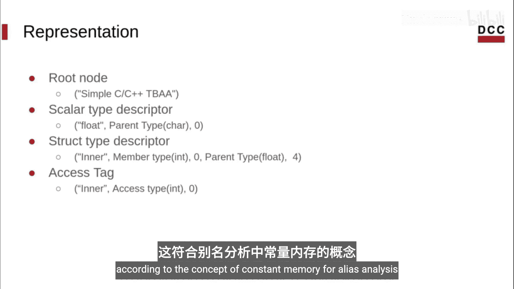

我们可以通过`!tbaa`访问标志在IR中访问TBAA元数据。如前所述，访问标签附加在加载和存储指令上。

以下代码展示了如何访问元数据节点及其组件：

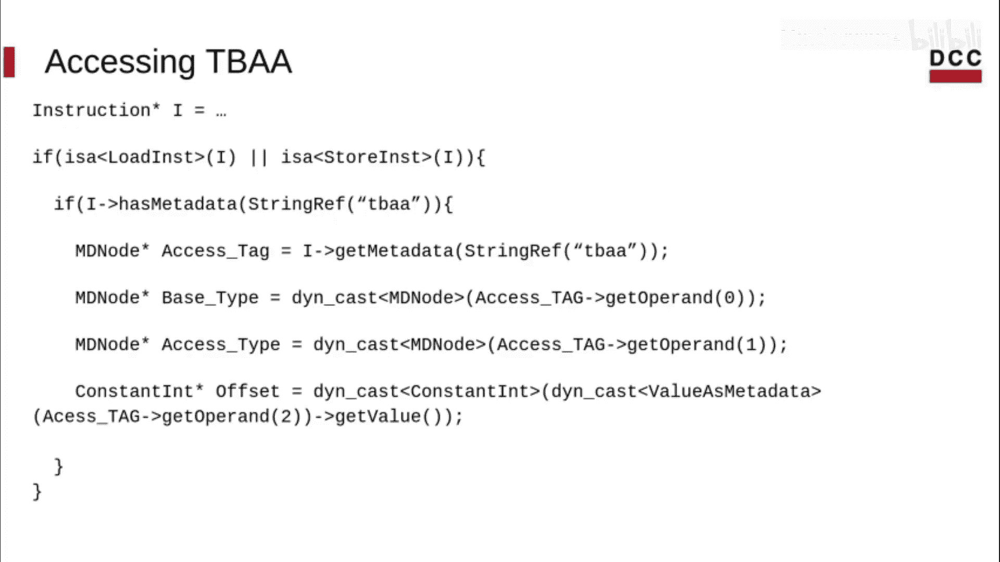

```llvm
; 假设 %inst 是一条加载或存储指令
%tbaa_metadata = !{!0} ; 示例元数据节点
!0 = !{!1, !2, i64 0} ; 访问标签节点
!1 = !{!"outer"} ; 基类型描述符
!2 = !{!"float"} ; 访问类型描述符
```

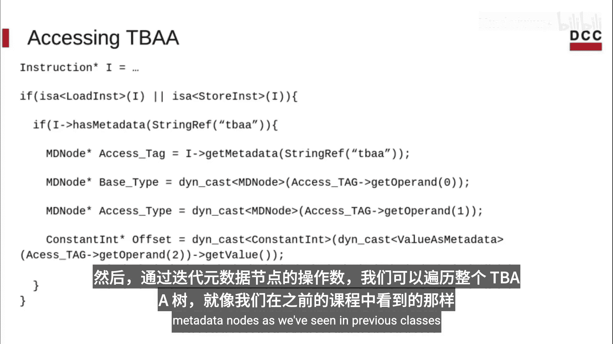

然后，我们可以像在前面的课程中一样，通过迭代元数据节点的操作数来遍历整个TBAA图。

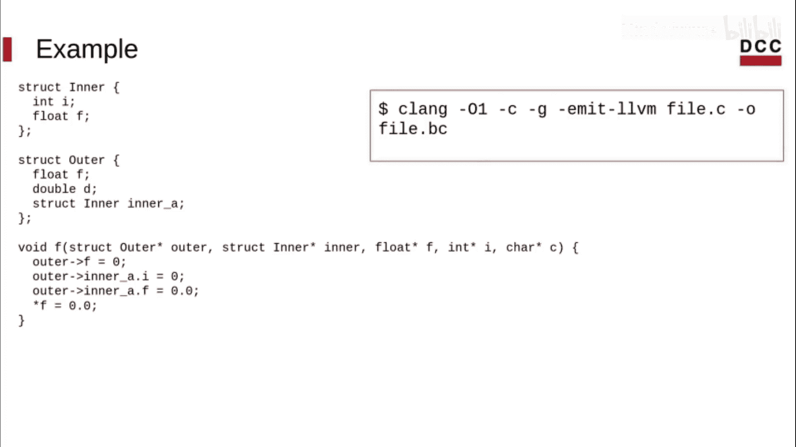


回到我们的例子，让我们看看TBAA元数据在IR中是什么样子。为了让Clang生成TBAA元数据，我们必须启用优化，因此需要使用`-O1`标志进行编译。

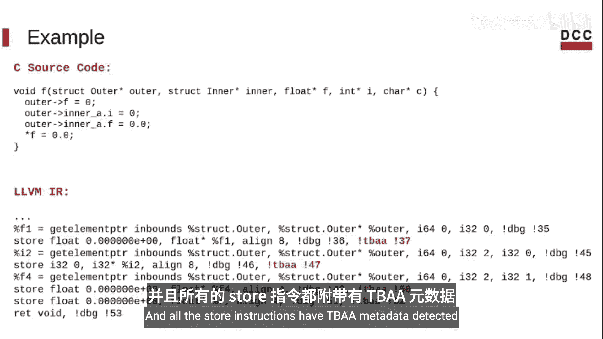


我们将省略部分IR，专注于与我们目的相关的部分。如你所见，函数`F`中的每个赋值在IR中都有一个对应的存储指令。所有的存储指令都附加了TBAA元数据。


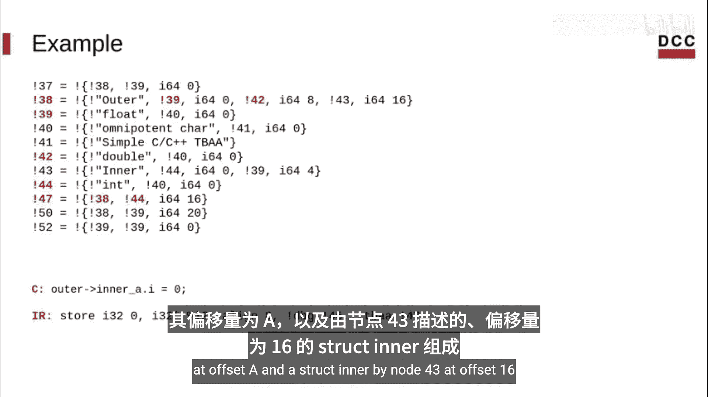

在这里，我们可以看到该模块中的所有TBAA元数据，它们形成了我们之前看到的图。例如，对于这个存储指令，节点47表示这是一个赋值。节点38描述了变量的类型，节点44描述了被赋值的结构体成员`f`的类型。从节点38，我们知道`outer`类型在偏移量0处由一个`float`（节点41）、在偏移量8处由一个`double`（节点42）和在偏移量16处由一个`inner`结构体（节点43）组成。

## 总结

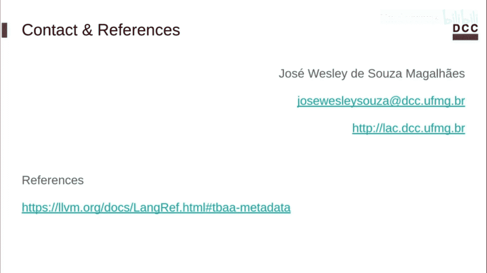

本节课中，我们一起学习了TBAA元数据是什么，它的组成部分（类型描述符和访问标签），以及如何在LLVM IR中表示和获取这些信息。TBAA元数据是LLVM实现高级语言别名规则和进行精确别名分析的关键工具。