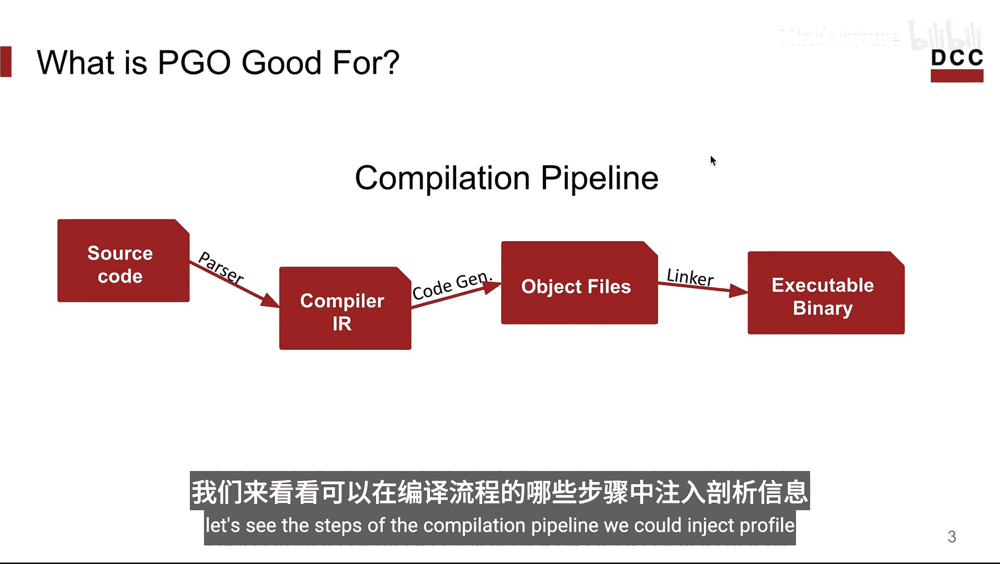
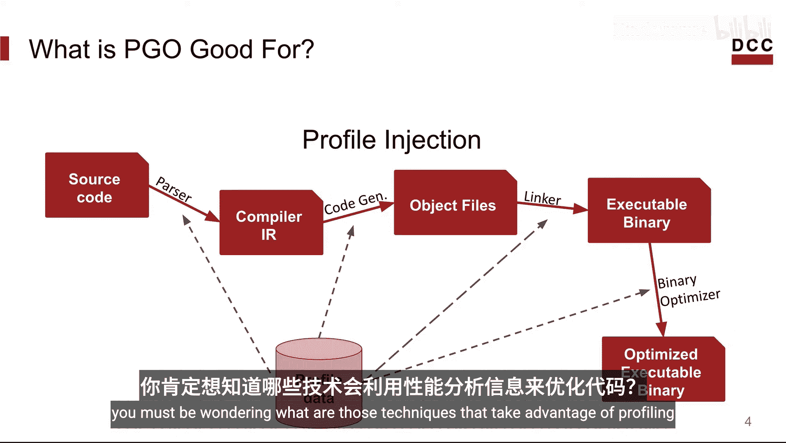
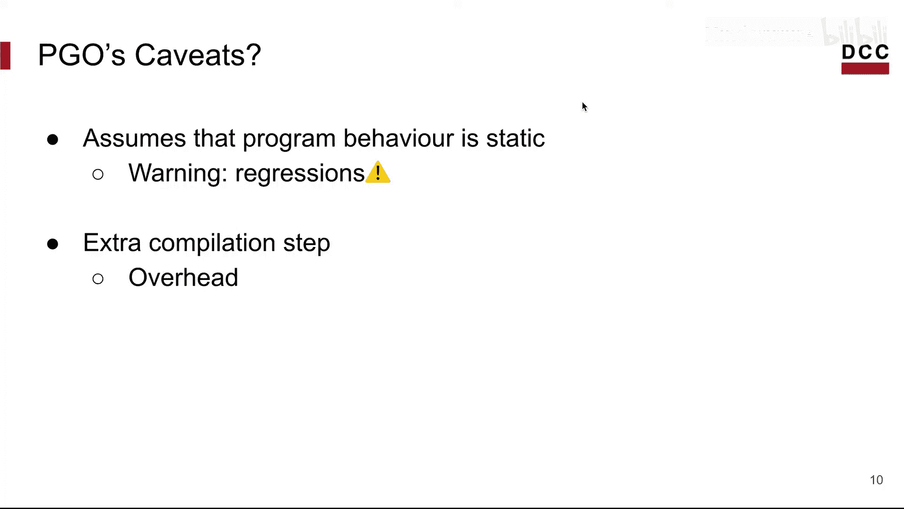
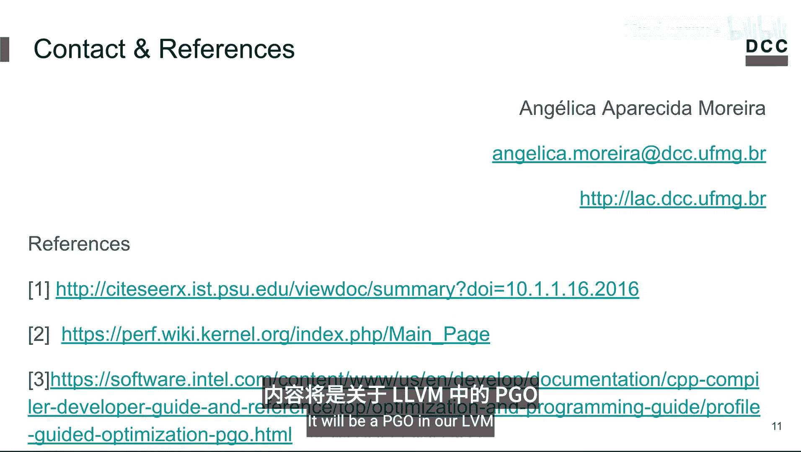

# 017：基于性能剖析的优化 - 第一部分

在本节课中，我们将要学习基于性能剖析的优化的一些基本概念。

## 概述

基于性能剖析的优化，也常被称为 **PGO**。

**PGO** 是一种编译器优化技术，它收集程序运行时的行为信息，并将这些收集到的信息作为反馈提供给编译器。因此，编译器可以做出更优的优化决策。

PGO 背后的思路是：在剖析应用的同时运行它，以收集该应用行为的样本。然后，利用剖析器提供的信息作为反馈，重新编译该应用，使编译器能够更好地优化程序。

请注意，PGO 也被称为其他名称，例如 **FDO**（反馈驱动优化）、**PBO**（基于性能剖析的优化）等。这里分享的是最常见的名称。

## 编译流程回顾

在介绍可以利用剖析信息的具体优化技术之前，我们先回顾一下编译流程。一个典型编译器的编译过程如下：

1.  从程序的源代码开始。
2.  解析器（也称为编译器前端）解析输入的源代码，并最终将其转换为**中间表示**。这种中间表示可以被编译器的其他阶段理解。
3.  然后，编译器优化这段代码，并输出目标文件（二进制形式）。
4.  最后，链接器将这些目标文件与外部库链接在一起，输出一个可执行的二进制文件。

现在我们已经了解了编译流程，接下来看看我们可以在哪些步骤中注入剖析信息。

我们可以在解析步骤、代码生成步骤、链接步骤中注入剖析信息。甚至在获得可执行二进制文件之后也可以，不过在这种情况下，我们不会使用编译器，而是会使用二进制优化工具。

## 利用剖析信息的优化技术

此时，你可能会问，有哪些技术可以利用剖析信息来优化代码呢？

以下是几种主要的优化技术：

*   **基本块布局**：代码生成器可以根据执行频率来布局基本块，优先排列执行更频繁的基本块。这可以改善指令缓存行为，并减少分支开销。
*   **函数内联**：内联器可以优先内联调用更频繁的函数。
*   **热点代码识别**：编译器可以将地址空间分隔为**热点代码**（运行更频繁的部分）和**冷点代码**。这可以减少工作集大小并降低页面错误。
*   **溢出代码放置**：寄存器分配器可以将溢出代码放置在较少执行的代码区域。

这些以及其他优化可以带来显著的性能收益，例如提高运行速度、减少内存占用。

## 剖析信息的内容

那么，剖析信息里包含什么呢？它可以包含很多内容。大多数人开始收集的是关于**控制流**的信息。

这类信息通常是**执行计数**，但也可能包括分支预测失误、分支未命中等其他信息。

我们还可以收集与不同程序结构相关联的剖析信息。例如：

*   我们可以收集特定基本块或该基本块内特定指令的执行计数。为此，我们可以利用**控制流图边**。
*   我们也可以收集整个函数的执行计数，并利用**调用图**来收集关于调用图边和函数间依赖关系的信息。

请记住，收集的信息将完全取决于所执行优化的最终目标。

## 剖析信息的类型

基本上有两种主要的剖析信息类型：

*   **动态剖析**：这是最常用的类型，在程序执行期间收集剖析信息。此类别中的技术包括：
    *   **插桩**：向程序中注入额外的代码，以跟踪程序行为信息。
    *   **采样**：通常使用像 Linux `perf` 这样的工具，通过采样程序指令的一个子集来从硬件计数器收集信息。
*   **静态剖析**：在编译流程中收集关于程序的剖析信息，试图基于其结构特征来预测其运行时行为。此类别中也有两种主要技术：
    *   **基于启发式规则**：使用规则进行预测。
    *   **基于机器学习**：使用基于从先前获得的知识中学习的更高级搜索技术。

## 注意事项与挑战

然而，凡事总有挑战，PGO 也不例外。PGO 基于一个假设：你可以预测程序的行为。在某些情况下，这可能是正确的，但并非对所有程序都成立。

例如，如果程序行为对输入非常敏感，针对一组输入进行优化可能会使应用在运行另一组输入时变慢。因此，在使用 PGO 时，必须非常小心，确保通过收集能代表程序通常采取的所有不同执行路径的剖析信息来“训练”优化。

另一个挑战（虽然通常不那么显著）是，根据应用 PGO 的方式，它可能会在构建过程中引入额外的步骤。这些额外步骤可能会显著影响部署周期，有时还会增加开销。

## 总结

本节课中，我们一起学习了基于性能剖析优化的基本概念。我们回顾了编译流程，探讨了PGO可以应用的环节，并介绍了几种利用剖析信息的关键优化技术，如基本块布局和函数内联。我们还了解了剖析信息的内容和主要类型（动态与静态剖析），最后讨论了使用PGO时需要注意的挑战，例如输入敏感性和构建流程的复杂性。

希望你喜欢这节课。如有任何疑问，可以给我发送邮件。也期待你观看本课程的第二部分，内容将是 LLVM 中的 PGO。我们下次再见。