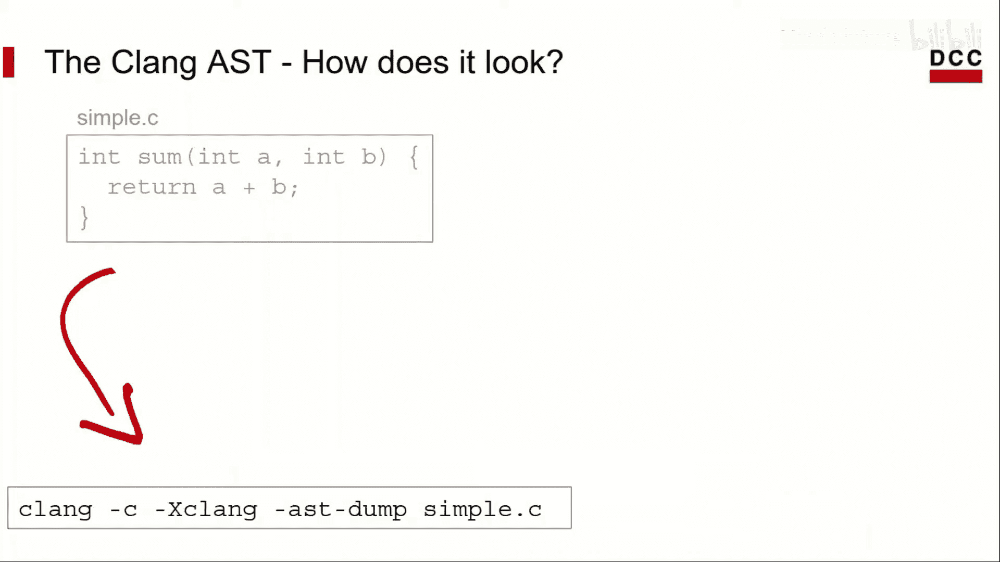
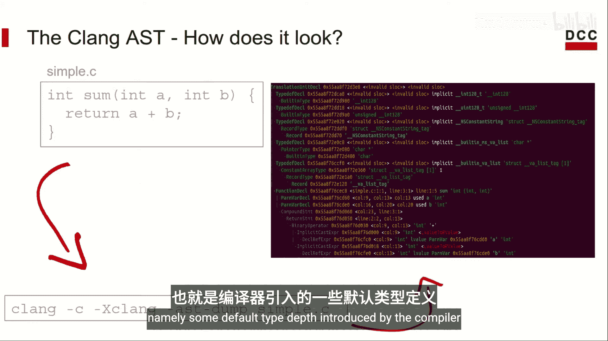
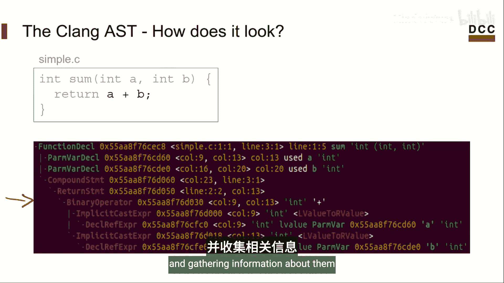
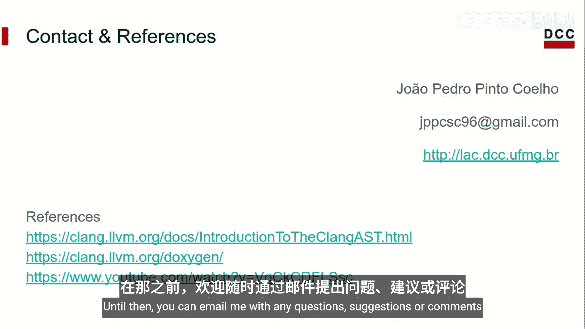

# 018：Clang AST简介 🧠

在本节课中，我们将学习Clang AST（抽象语法树）的基本概念。Clang是LLVM基础设施中的C语言前端，其主要目标是将C源代码转换为LLVM IR代码。理解AST是使用Clang库构建自定义工具（如插件）的基础。

## 什么是Clang AST？

AST代表抽象语法树。它是一种用于以树形结构表示源代码的数据结构。从编译器的角度来看，将程序视为树形结构比原始文本更容易理解和处理。好消息是，Clang通过其库将这些结构提供给我们使用。

## AST的结构示例

为了理解AST的形态，让我们看一个表达式的例子。假设我们想将表达式 `2 + 1 * 4` 表示为树。

首先，我们需要计算右侧的乘法。因此，我们先为这部分构建一个树。树顶部的节点是我们想要执行的操作，即乘法。从该操作节点分出两个分支，代表操作数 `1` 和 `4`。这部分的计算结果为 `4`。



接下来，我们将表达式左侧的加法引入。同样，加法操作位于顶部节点，操作数从它分支出来。在本例中，操作数是左侧的 `2` 和我们乘法结果的 `4`。最终，正如预期，答案是 `42`。



## 从C代码生成AST

现在，让我们看一个用C语言编写的简单函数，它只是返回两个整数的和，并保存在名为 `simple.c` 的文件中。

我们可以使用以下命令来生成该函数的AST的文本表示：
```bash
clang -Xclang -ast-dump -fsyntax-only simple.c
```

生成的输出中，围绕我们求和函数的部分有一些编译器引入的默认类型声明。让我们聚焦于实际代表我们函数的AST部分。

我们函数的根节点是一个名为 `FunctionDecl` 的节点。这是Clang表示函数声明的方式，它保存了诸如函数名、返回类型、参数类型，甚至其在源代码中位置等信息。



构成此函数的所有内容都作为 `FunctionDecl` 节点的子节点保存。其参数可以在顶部的 `ParmVarDecl` 节点中找到。紧接着下方，有一个 `CompoundStmt` 节点，它代表语句组。通常，你可以将其视为条件语句、循环和函数中大括号内的语句。在我们的例子中，它代表函数体，其中只包含一个 `ReturnStmt` 节点。

再深入一层，有一个 `BinaryOperator` 节点，代表表达式 `a + b`。熟悉这种格式很重要，因为正如我们将看到的，在编写插件时，我们将遍历AST的节点并收集有关它们的信息。

## AST的组织方式

既然我们已经看到了AST的样子，接下来讨论一下它是如何组织的。首先，Clang没有实现单一的基类。这意味着我们无法拥有一个能够遍历树中任何类型节点的单一方法。

相反，有三个核心类：
*   **Decl**：代表代码中的声明。我们在示例中已经见过几个，如 `FunctionDecl` 和 `ParmVarDecl`。当然，C语言中还有许多其他类型的声明，例如变量声明或结构体声明，每种都有对应的Decl类。
*   **Stmt**：代表代码中的语句。例如，我们已经见过求和函数中的 `CompoundStmt`。`BinaryOperator` 节点也属于此类。你可能会期望此节点继承自表达式类，它确实如此。然而，表达式继承自语句，因此该节点继承的核心类实际上是 `Stmt`。
*   **Type**：代表类型对象。在我们的示例中没有明确看到代表类型对象的节点，但类型信息确实出现了。例如，我们看到函数的参数具有 `int` 类型。使用Clang库，我们将能够从这些节点中提取类型对象。例如，`BuiltinType` 和 `PointerType` 是用于表示整数和指针的类型类示例。

这些只是属于每个核心类的几个示例类，但正如你可能想象的，还有很多其他类。我鼓励你自己编写几个C程序，并查看Clang为它们构建的AST。这将帮助你熟悉构成Clang的庞大库。

## 总结

本节课中，我们一起初步了解了Clang AST库。本视频使用的主要参考资料是官方的Clang文档。当你探索AST并发现新内容时，可以查阅该文档以获取更多信息。



在下一个视频中，我将讨论可用于构建我们工具的接口。在那之前，你可以通过电子邮件向我提出任何问题、建议或意见。