# 020：Clang插件基础模板

在本节课中，我们将学习如何构建一个最基础的Clang插件。我们将了解创建一个可运行的Clang插件所需的核心组件和基本模板代码。

## 概述

上一节我们介绍了使用Clang作为库来构建工具的一些接口。本节中，我们来看看如何构建一个最小的Clang插件，并解释你需要设置哪些基础模板代码，以便在其之上构建你的工具。

## 构建Clang插件所需组件

要构建并运行一个Clang插件，需要实现哪些部分呢？

正如我们在之前的视频中所见，Clang插件在代码上运行前端操作。前端操作是一种接口，允许我们编写我们想要的代码，并让Clang作为编译过程的一部分来执行。这是我们在使用LibTooling和Clang插件编写Clang工具时的入口点。

对于插件，有一个更具体的接口，它继承自前端操作，称为`PluginASTAction`，这也是我们将要介绍的内容。`PluginASTAction`是一种特定类型的前端操作。

我们将编写一个继承自`PluginASTAction`的操作类。当我们运行插件时，Clang会处理代码并生成一个AST对象，然后将这个AST对象传递给我们的操作类，这就是我们编写的插件开始执行的地方。

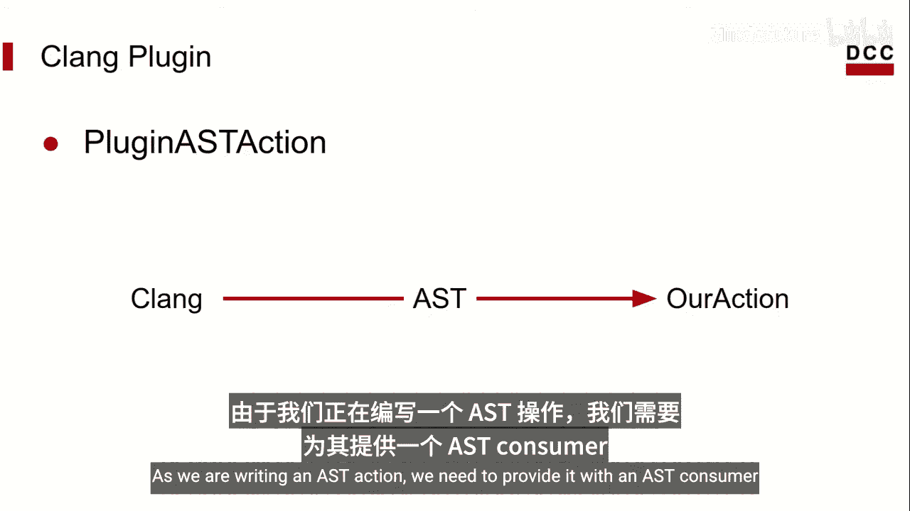

由于我们编写的是一个AST操作，我们需要为它提供一个AST消费者。

## AST消费者接口

消费者为我们提供了一些访问AST对象的方法。

以下是AST消费者提供的一些关键方法：

*   `HandleTopLevelDecl`：这个方法允许我们访问AST中顶层声明的条目，即程序文件中最外层作用域内的任何声明。当编译器处理每个顶层声明时，会调用此方法。
*   `HandleTranslationUnit`：这个方法为我们提供对AST中代表整个C程序文件实体的访问。它在编译器完成对整个文件的AST处理后调用，这也是我们今天示例中将使用的方法。

此外，还有一种访问AST节点的模式，即通过实现AST访问器来完成。

最后，剩下的就是注册插件。这将允许我们在运行时从共享库中加载我们的插件到Clang中。

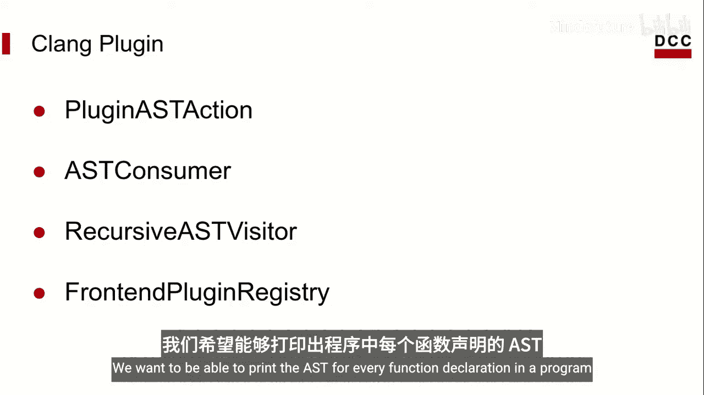

## 开始实现

我们今天要构建的插件非常简单。我们希望能够在程序中打印每个函数声明的AST。

首先，我们来看插件AST操作。我们的插件将被称为`hello`，因此我们的操作类将被称为`HelloAction`。它的主要目的是实现`CreateASTConsumer`方法，该方法返回一个AST消费者的实例，我们稍后会实现它。

在此之前，我们需要谈谈`ParseArgs`。根据官方的Clang文档，这是`PluginASTAction`与常规前端操作的主要区别——处理命令行参数的能力。我们的示例不会使用这个，但当你需要将命令行选项整合到你的工具中时，你很可能会用到它。

即使我们不解析任何参数，`ParseArgs`是`HelloAction`继承的一个纯虚方法，因此我们需要在这里定义它，否则我们将无法编译我们的插件。

如果你决定使用命令行参数，可以在这个参数`Args`中找到它们。

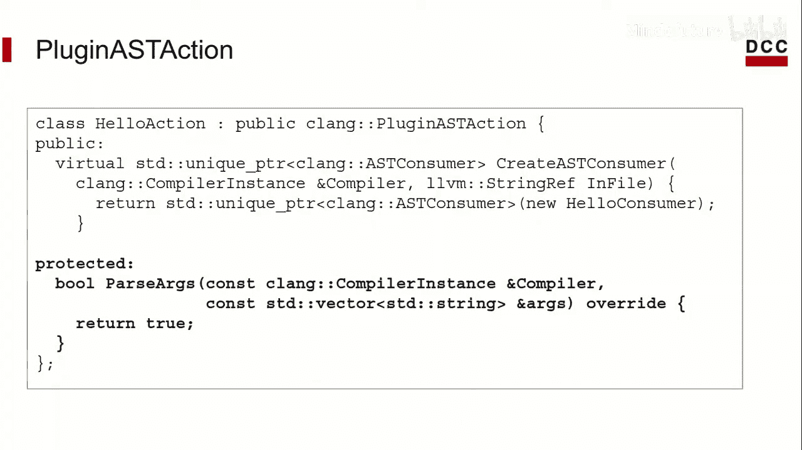

接下来，我们需要实现这里的AST消费者，让我们开始吧。

## 实现AST消费者

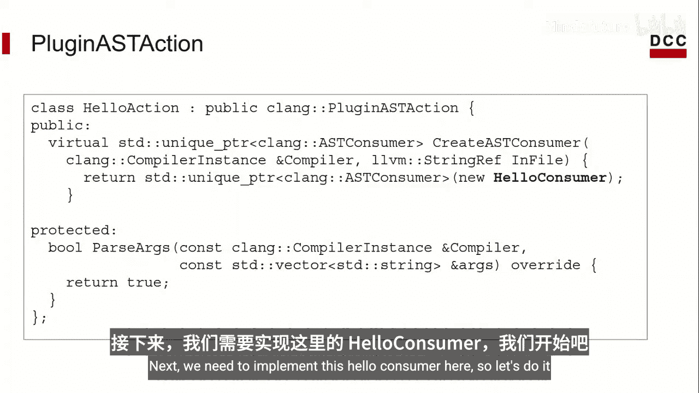

同样，我们的插件叫做`Hello`。让我们将消费者命名为`HelloConsumer`。它内部定义了一个`HelloVisitor`的实例。别担心，我们稍后会介绍`HelloVisitor`。它将是本节的主角，但到目前为止，我们正在为它施展魔法奠定基础。

`HandleTranslationUnit`是我们访问AST的方式。如果你还记得视频前面提到的，`HandleTranslationUnit`在编译器完成处理整个程序文件后被调用，并接收这个`ASTContext`对象。

它包含了我们程序中AST收集的信息。然后我们将其交给我们的访问器对象，以便我们可以访问AST。

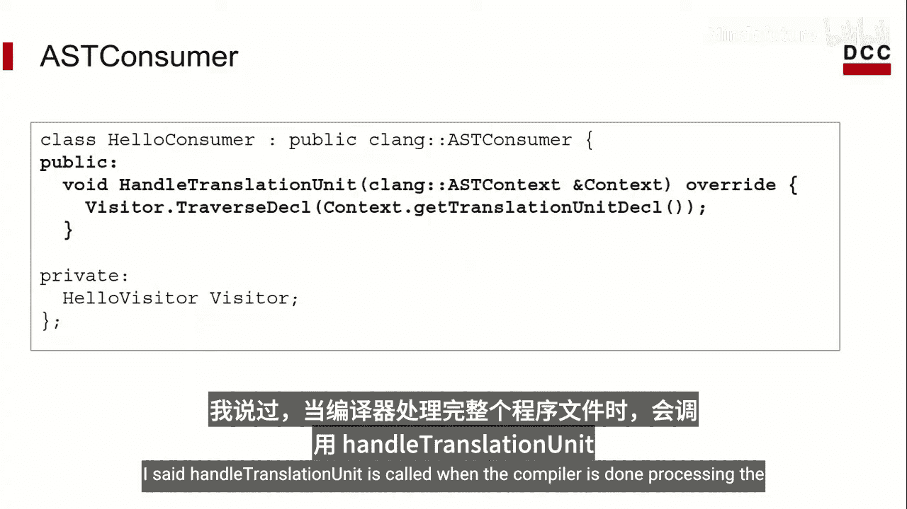

最后，让我们实现我们的访问器。

## 实现AST访问器

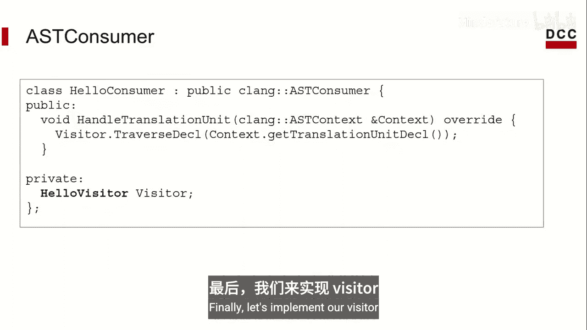

一个简短的说明：我们即将实现的访问器类遵循访问器模式。你可以在《设计模式：可复用面向对象软件的基础》这本书中了解更多。它是书中描述的行为模式之一。当你有一个对象结构，并且希望能够在这些对象上执行各种操作时，它非常有用。

这正是我们想要的。我们拥有AST，并且希望使用其节点做很多事情。

使用这个类的一种方法是实现它向我们公开的`Visit`方法。让我们看看其中的几个。

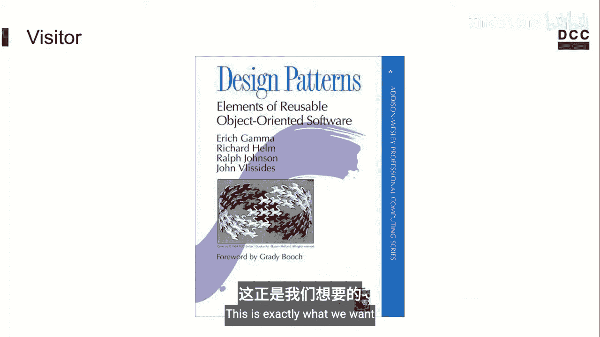

例如，我们可以定义`VisitFunctionDecl`方法。在Clang构建的AST上，有许多代表函数的节点。对于每一个这样的节点，`VisitFunctionDecl`方法将被调用，我们将能够以我们想要的任何方式使用这个节点。注意，该方法接收一个`FunctionDecl`类型的参数。

这就是所指的AST节点。我们继续调用`dump()`函数。它所做的就是打印我们对象的AST表示。我们将在视频末尾看到它的实际效果。

我们同样为参数声明（即函数的参数）实现`VisitParmVarDecl`方法。

甚至还有一个用于所有声明的访问器`VisitDecl`。这个访问器将访问你程序中的每一个声明。

## 注册插件

编写完访问器后，剩下的就是在插件中注册它。

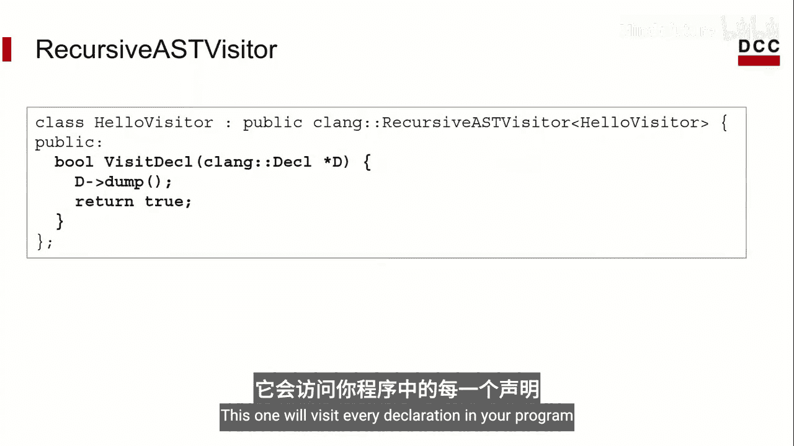

在这里，我们将我们的操作类`HelloAction`添加到注册表中。然后我们将其命名为`hello`。

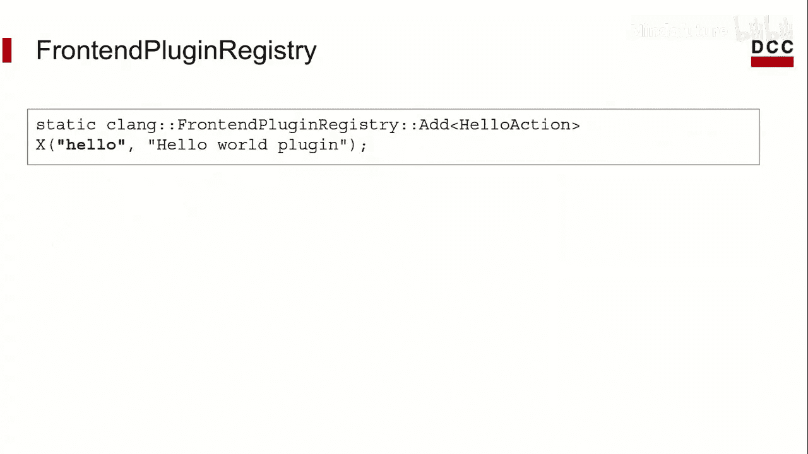

这是当我们需要告诉Clang我们希望它为我们运行哪个插件时使用的名称。

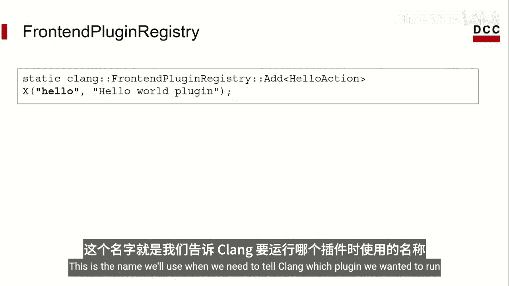

我们还给它一个简短的描述。这就是运行一个基础Clang插件所需的全部内容。

然后，你需要将其编译成一个共享库，例如`libhello.so`。

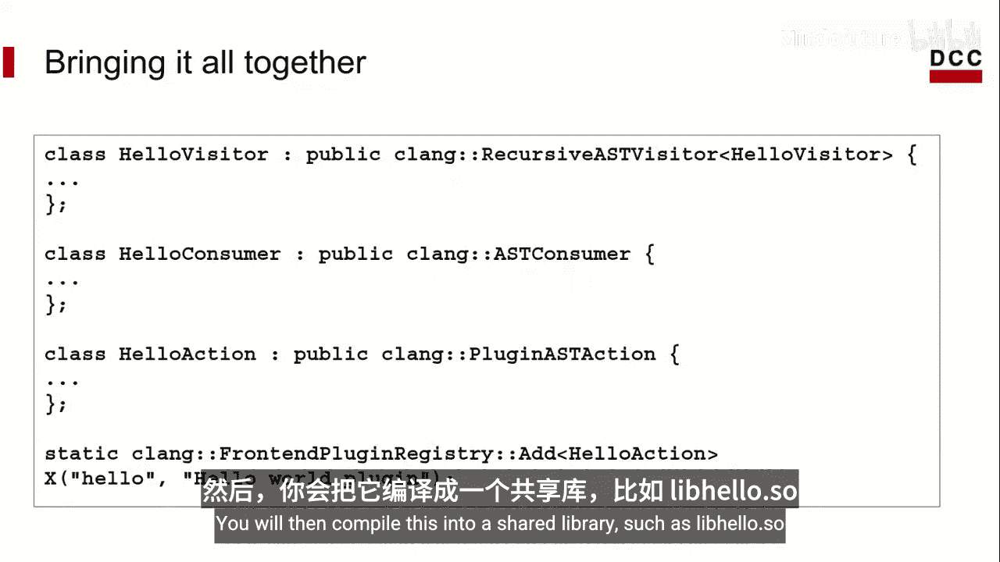

## 运行插件

我们将运行以下命令来调用插件。这里，我们加载`libhello`库中的所有插件，并将它们传递给Clang的CC1进程。

`-cc1`标志表示我们只想运行编译器的前端。这里，我们告诉它我们想要运行我们命名为`hello`的插件。

并且我们希望它在这个示例C程序上运行。一如既往，让我们看一个示例程序来了解这将如何工作。

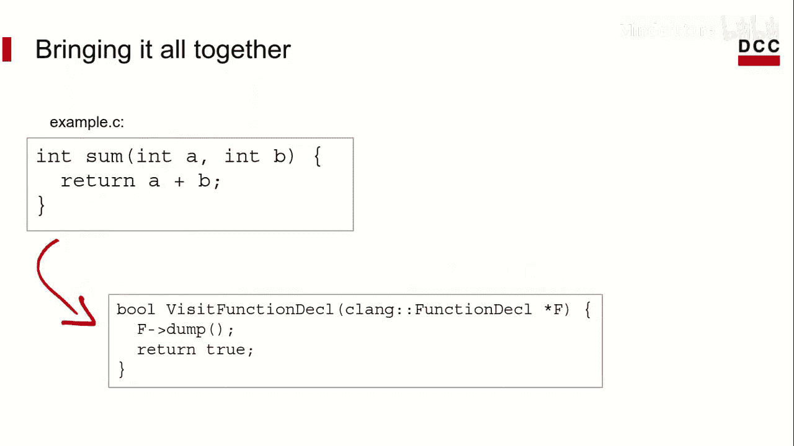

示例C文件只有一个函数，类型为`int`的`sum`。

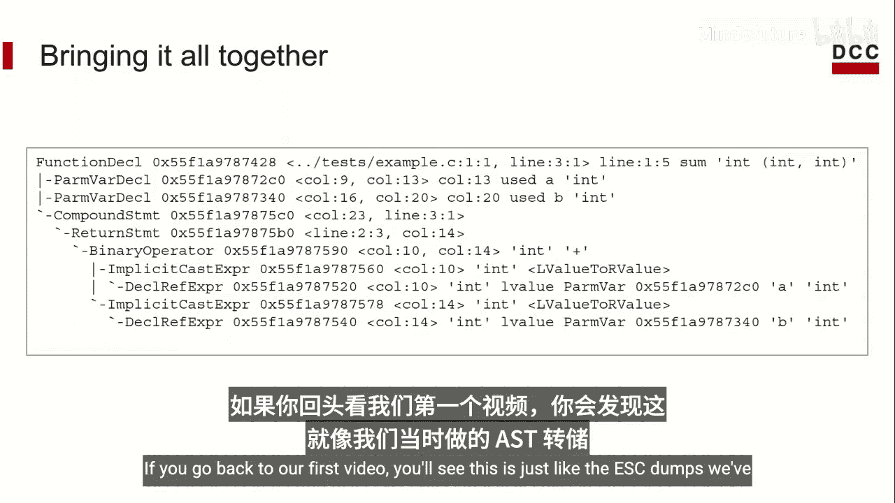

如果我们实现了`VisitFunctionDecl`方法，我们将得到这个输出。

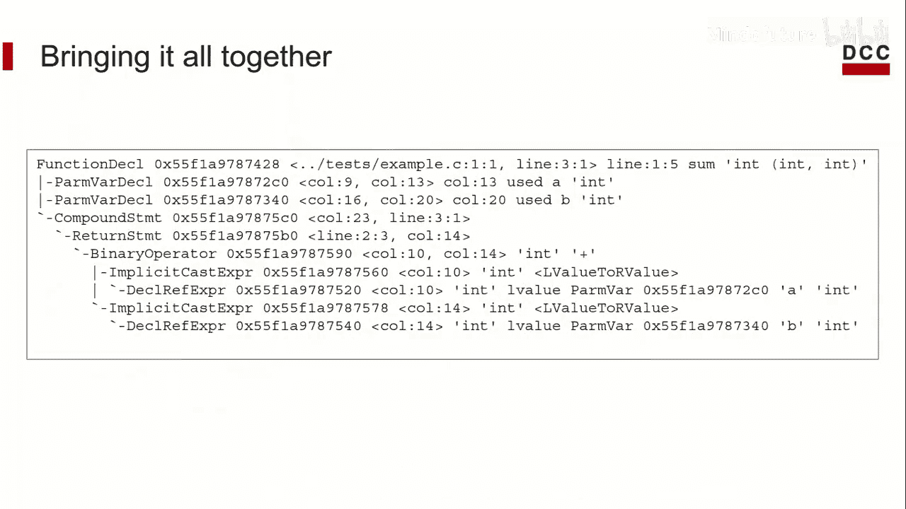

如果你回到我们的第一个视频，你会看到这就像我们当时做的AST转储一样。现在你可以使用自己的代码来做到这一点。

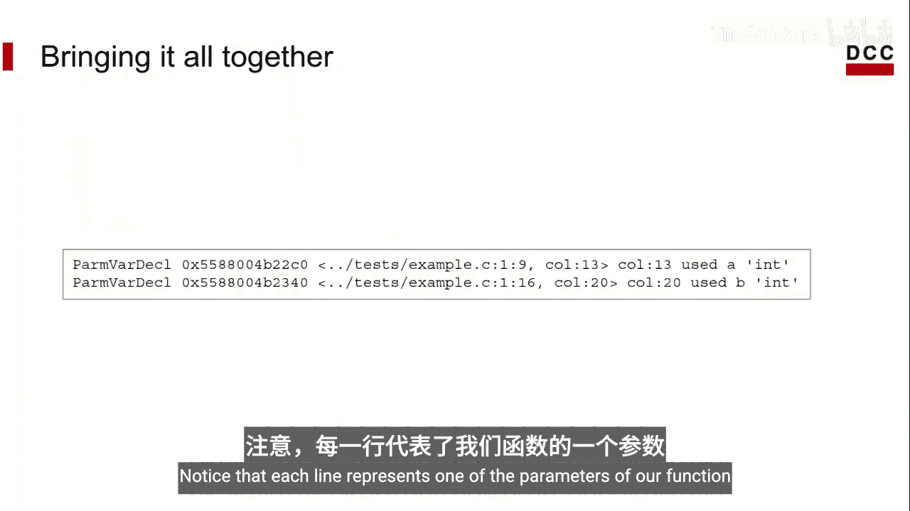

类似地，如果我们使用`VisitParmVarDecl`来运行这个，我们将得到这个输出。注意，每一行代表我们函数的一个参数。

## 总结

本节课中，我们一起学习了如何编写构建第一个Clang插件所需的所有基础模板代码。在下一个视频中，我们将尝试使用目前学到的知识构建一些更有趣的东西。

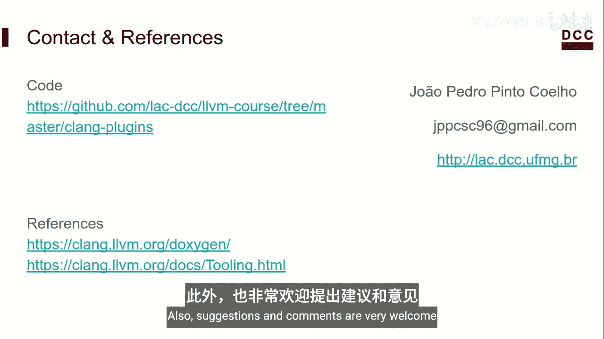

请记住，我们今天看到的代码在课程仓库中是公开可用的。欢迎随意尝试。如果你有任何问题，可以给我发邮件。同时，也非常欢迎建议和评论。