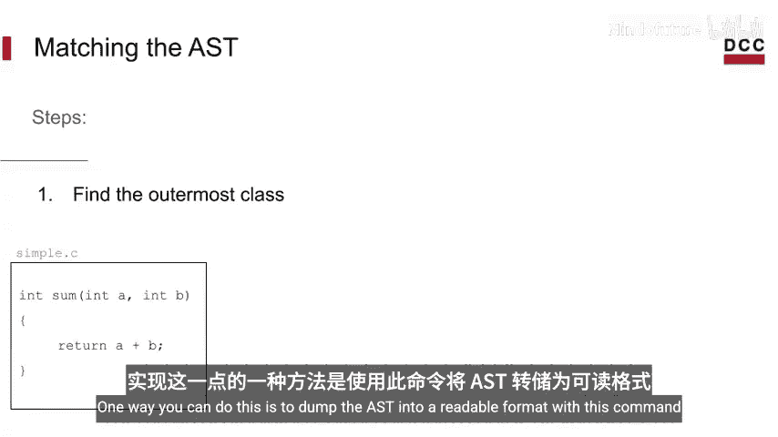
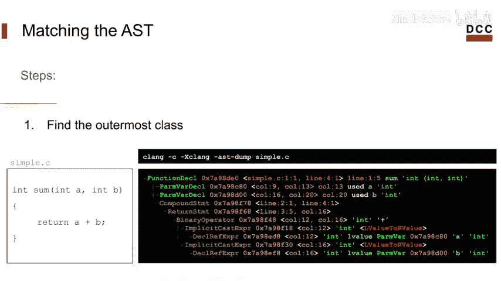
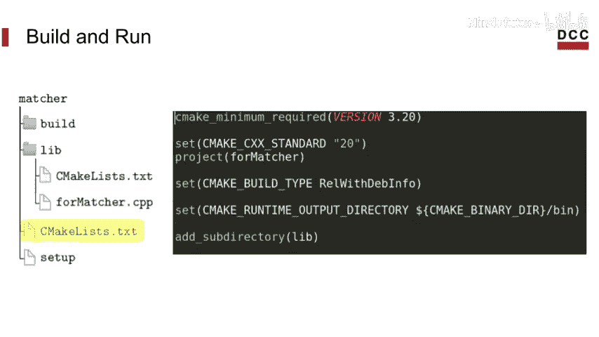
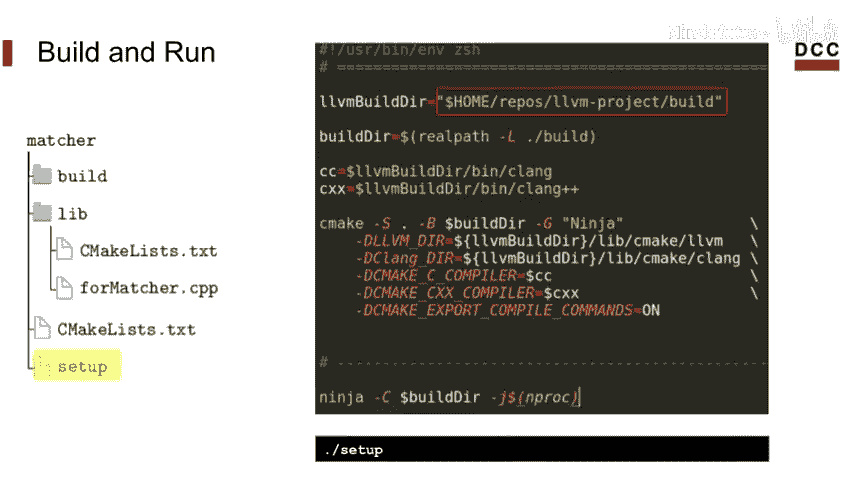
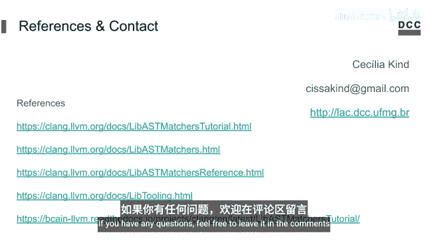

# 021：AST匹配器 🧩

在本节课中，我们将学习Clang AST匹配器库。这是一个强大的工具，它提供了一种简洁的领域特定语言（DSL），用于描述和匹配抽象语法树（AST）中的特定模式。我们将了解其核心概念，并通过一个实际示例演示如何利用Clang Tooling库来构建一个使用AST匹配器的独立工具。

## 什么是AST？

上一节我们介绍了Clang AST的基础。AST代表**抽象语法树**，它是一种以树形结构表示源代码的数据结构。与左侧的原始文本相比，右侧的树形结构使编译器更容易理解和处理程序。

Clang将这些结构提供给我们使用。正如前一视频所提到的，遍历AST的一种方法是使用递归AST访问器。但Clang引入了另一种探索AST的有趣方式——AST匹配器库。该库为我们提供了一种简单而简洁的方法来描述和匹配AST中的特定模式。

## AST匹配器示例

以下是一个来自AST匹配器文档的示例。假设你想匹配一个`for`循环，该循环有一个初始化语句，且该初始化语句包含一个声明，这个声明是一个变量声明，并且该变量被初始化为整数`0`。

```cpp
for (int i = 0; i < 10; ++i) {} // 匹配此模式
for (int i = 5; i < 10; ++i) {} // 不匹配，因为初始化值不是0
```

基本上，这个库提供了一个领域特定语言，允许你在AST级别提取信息，例如源代码位置、属性、类型等。其约定是通过构建一个匹配器树，并使用内部匹配器使你的匹配更加具体。

在上例中，我们只对变量初始化为`0`的情况感兴趣。如果我们不那么具体，接受任何整数初始化，但仍想知道变量被初始化为什么数字，可以使用`bind`方法从树中提取此信息。我们给它一个标签，以便在找到匹配项后稍后检索该节点。

## 编写匹配器的步骤

以下是编写匹配器时可以遵循的五个步骤。

第一步是找到你想要匹配的AST中最外层的节点类。因此，在编写匹配器时，需要理解你想要匹配的代码的AST是什么样子。一个很好的技巧是编写一些你想要匹配的代码，并查看它在AST中的表示。你可以使用以下命令将AST转储为可读格式，这有助于你创建匹配器，因为现在你可以看到节点及其在树中的相对位置。

```bash
clang -Xclang -ast-dump -fsyntax-only your_file.cpp
```

第二步，也是最重要的一步，是查阅**AST匹配器参考文档**。文档中列出了许多匹配器，可以帮助你匹配节点并细化树上的属性。匹配器主要分为三类：节点匹配器、细化匹配器和遍历匹配器。





*   **节点匹配器**：匹配特定类型的AST节点。它们是匹配表达式的核心，指明了期望的节点类型。每个匹配表达式都以一个节点匹配器开始。它们是唯一支持`bind`调用的匹配器，`bind`调用将节点绑定到给定的字符串，以便稍后检索。
    *   示例：`functionDecl()`, `varDecl()`, `forStmt()`

*   **细化匹配器**：匹配AST节点上的属性。它们用于细化节点，限制需要匹配的特定类型节点的集合。
    *   示例：`hasName("foo")`, `hasInitializer(integerLiteral(equals(0)))`

*   **遍历匹配器**：允许在AST节点之间遍历，它们定义了从当前节点必须可达的其他节点之间的关系。遍历匹配器将节点匹配器作为其参数，因为它们处理这些节点之间的关系。
    *   示例：`hasDescendant()`, `hasParent()`

在我们的示例中更容易可视化：`forStmt(hasLoopInit(varDecl(hasInitializer(integerLiteral(equals(0))))))`
*   `forStmt()` 是一个**节点匹配器**。
*   `equals(0)` 是一个**细化匹配器**。
*   `hasLoopInit()` 和 `hasInitializer()` 是**遍历匹配器**，它们允许你从一个节点遍历到另一个节点。

在研究了想要匹配的AST并查阅了官方文档后，第三步是创建你的匹配器表达式并验证其是否按预期工作。接下来，你应该寻找想要匹配的下一个内部节点，然后重复此过程直到完成。

## 使用Clang Tooling构建工具

由于已有另一个视频展示了如何制作Clang插件，这次我们将复制我们的示例，使用**Clang Tooling库**。该库支持创建独立工具，并让我们完全控制AST。

从我们的工具开始，我们需要包含以下库：

```cpp
#include "clang/ASTMatchers/ASTMatchers.h"
#include "clang/ASTMatchers/ASTMatchFinder.h"
#include "clang/Tooling/CommonOptionsParser.h"
#include "clang/Tooling/Tooling.h"
#include "llvm/Support/CommandLine.h"
```

我们还需要这一行来为所有命令行选项应用自定义类别：

```cpp
using namespace clang::tooling;
static llvm::cl::OptionCategory MyToolCategory("My tool options");
```

现在，我们可以添加我们的匹配器。我使用之前示例中的匹配器。接下来，我们给它一个名称，并可以选择绑定一个或多个节点以便稍后检索。在本例中，我选择绑定`varDecl`节点，这将允许我在获得匹配时获取所声明变量的名称。

`bind`调用允许我们定义一个标识符。这里我称之为`"init_var"`，它将映射到我们匹配的节点，并让我们稍后在匹配回调中恢复它们。

```cpp
using namespace clang::ast_matchers;
StatementMatcher LoopMatcher =
    forStmt(hasLoopInit(varDecl(hasInitializer(integerLiteral(equals(0))))
                .bind("init_var")));
```

这就引出了**匹配回调**，它与我们的匹配器配对。当找到匹配项时，它将告诉我们执行什么操作。因此，在AST中找到正确的节点时，将调用相应的匹配回调并传入匹配结果。

在我们的匹配回调（我称之为`MatchPrinter`）中，我将重写虚函数`run`，接收匹配结果，并决定在获得具有相应标识符的匹配时执行什么操作。这里，我只是打印变量名。

```cpp
class MatchPrinter : public MatchFinder::MatchCallback {
public:
  virtual void run(const MatchFinder::MatchResult &Result) {
    if (const auto *VD = Result.Nodes.getNodeAs<VarDecl>("init_var")) {
      llvm::outs() << "Found variable initialized to 0: " << VD->getName() << "\n";
    }
  }
};
```

现在，转到我们的`main`函数。我们已经定义了匹配器和匹配回调（即打印机），但我们仍然需要添加一些东西。首先，我们需要使用匹配查找器对象编写一个AST匹配器，然后使用ClangTool运行它。

首先，我们创建匹配查找器，然后需要注册我们的匹配器。一个注意事项是我们设置的选项，用于忽略非源拼写的节点。AST匹配器的默认操作模式（称为`ASTMatchFinder::TK_AsIs`）可以访问源树中未明确拼写的节点，因此它们不明显匹配。选择使用此模式忽略非源拼写的AST节点，可以更轻松地创建匹配器。

```cpp
int main(int argc, const char **argv) {
  auto ExpectedParser = CommonOptionsParser::create(argc, argv, MyToolCategory);
  // 错误处理...
  CommonOptionsParser &OptionsParser = *ExpectedParser;
  ClangTool Tool(OptionsParser.getCompilations(),
                 OptionsParser.getSourcePathList());

  MatchFinder Finder;
  MatchPrinter Printer;
  Finder.addMatcher(LoopMatcher, &Printer);

  return Tool.run(newFrontendActionFactory(&Finder).get());
}
```

最后，我们需要从ClangTool运行匹配器。为了运行它，我们需要`CommonOptionsParser`结构来解析参数并创建编译数据库。我们使用`getCompilations`和`getSourcePathList`来检索编译数据库和输入文件路径列表。一旦有了这些，我们就可以围绕我们的前端操作在一些代码上创建一个ClangTool。

## 构建与测试

现在你已准备好测试它。我将使用Ninja作为生成器，用CMake构建该工具。我不会详述细节，但会展示一切是如何设置的。

在`lib`文件夹中，有我们创建的`matcher_finder.cpp`。然后我们需要添加一个`CMakeLists.txt`文件。

```cmake
# 查找Clang及其库
find_package(Clang REQUIRED)
# 为源文件创建可执行文件
add_executable(matcher_finder matcher_finder.cpp)
# 链接Clang Tooling库
target_link_libraries(matcher_finder PRIVATE clangTooling)
```

在我们的根目录中，有另一个`CMakeLists.txt`，用于设置最低CMake版本、本项目使用的C++标准、项目名称、构建类型，并准备将我们的可执行文件放入`lib`目录。

```cmake
cmake_minimum_required(VERSION 3.20)
project(llvm_matcher_tutorial)
set(CMAKE_CXX_STANDARD 17)
add_subdirectory(lib)
```

最后，运行CMake生成Ninja构建文件并启动构建过程。这是唯一需要更改的部分，你应该添加你的LLVM构建目录的路径。

```bash
mkdir build && cd build
cmake -G Ninja -DLLVM_DIR=/path/to/your/llvm/build/lib/cmake/llvm ..
ninja
```



运行脚本后，我们的二进制文件应位于`build/bin`目录内。现在，你只需传入你的文件并运行它。

```bash
./build/bin/matcher_finder your_source_file.cpp
```



## 总结



本节课中，我们一起学习了Clang AST匹配器库。我们了解了AST匹配器的核心概念，包括节点匹配器、细化匹配器和遍历匹配器。我们通过一个查找被初始化为0的`for`循环变量的示例，逐步演示了如何设计匹配器表达式、使用`bind`方法提取节点信息、编写匹配回调函数，并最终利用Clang Tooling库构建和运行一个独立的AST分析工具。掌握AST匹配器能极大地简化在Clang AST中查找特定模式的过程，是进行源代码分析和重构的强大工具。