# 023：LLVM测试套件 - 第二部分 🧪

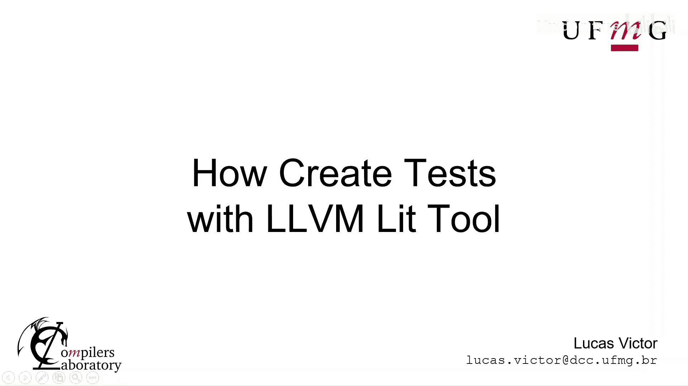


在本节课中，我们将学习如何使用LLVM集成测试器（Lit）来创建我们自己的测试。我们将从零开始构建一个测试套件，并了解如何配置和运行测试。

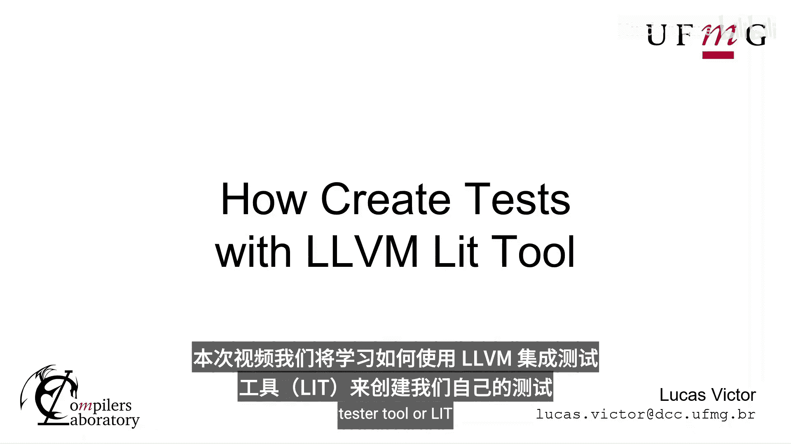

---

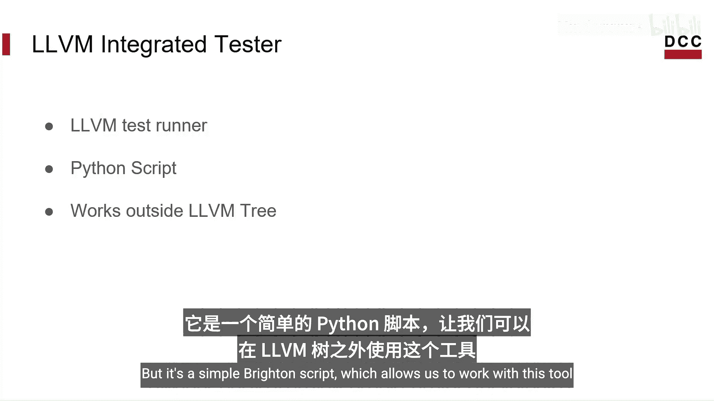

## 概述

上一节我们介绍了LLVM测试套件的基本概念。本节中，我们将深入探讨如何使用Lit工具来创建和管理自定义测试。Lit是一个简单的Python脚本，负责运行LLVM编译器文件中的所有测试。我们可以在LLVM环境之外使用它，甚至可以通过pip单独安装。

## 为什么使用测试运行器？

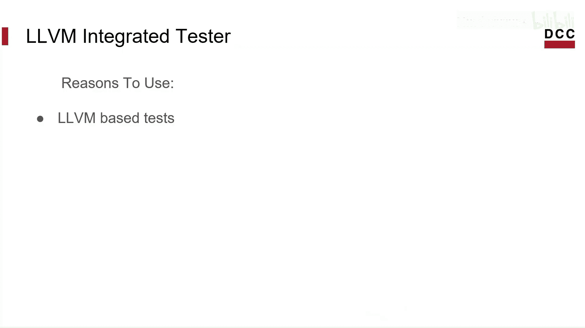

如果你正在为LLVM开发工具，那么使用测试结构是必要的，因为LLVM编译器的主要测试运行器就是Lit。即使在LLVM结构之外，Lit也提供了一些有趣的功能。

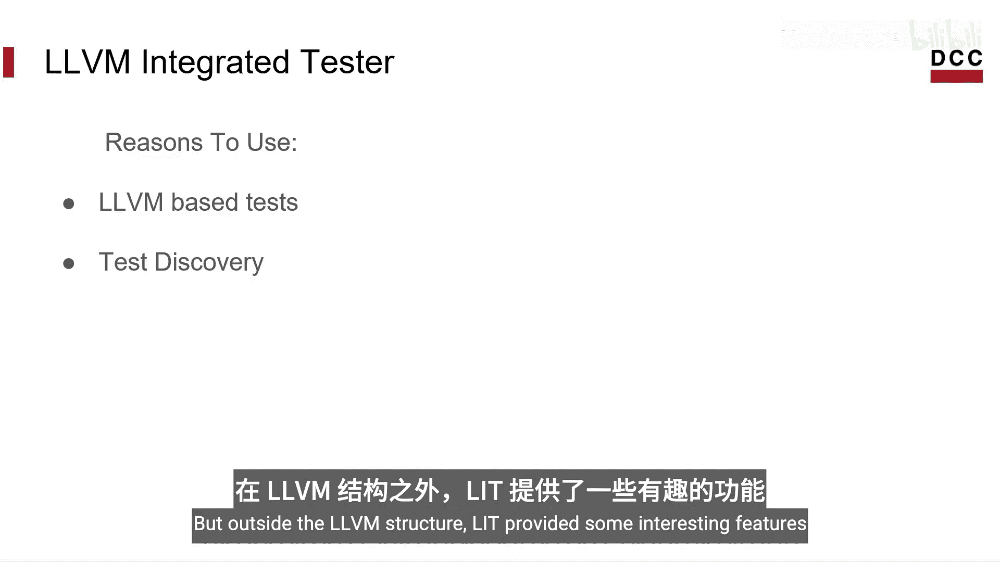

以下是使用Lit的几个主要原因：

*   **测试发现**：无需手动传递每个测试文件，你可以将整个目录或测试套件传递给工具，让它自动搜索并运行测试文件。
*   **易于使用**：只需三行代码即可配置整个测试。
*   **脚本简单**：测试文件或测试脚本是一小段Shell代码，Lit会自动为你运行。

## 安装Lit

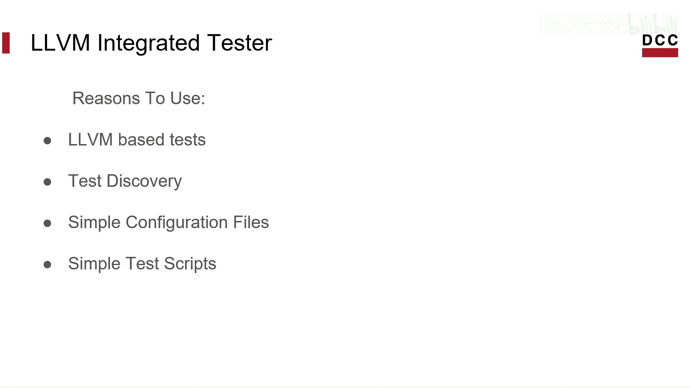

安装Lit工具有两种方法：

1.  使用pip安装：`pip install lit`
2.  如果你已经构建了LLVM，可以在其二进制文件中找到它。

在本视频中，我们将从零开始创建一个测试套件，演示如何创建测试和配置测试结构。需要注意的是，我们的测试结构应遵循LLVM测试套件的结构，但这并不复杂，我们稍后会看到。

## 创建测试套件结构

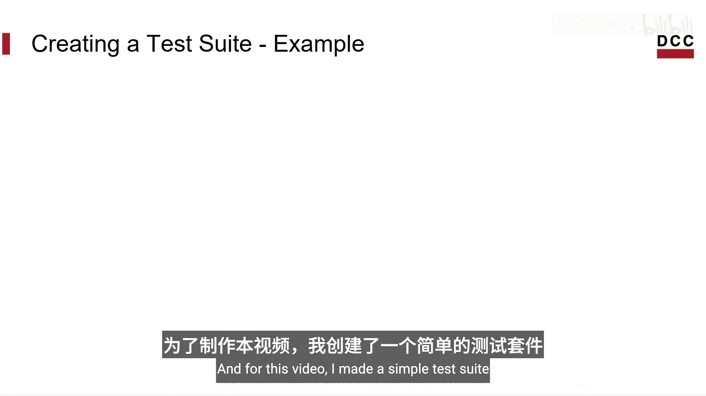

为了简化演示，我创建了一个简单的测试套件。该套件具有以下结构：

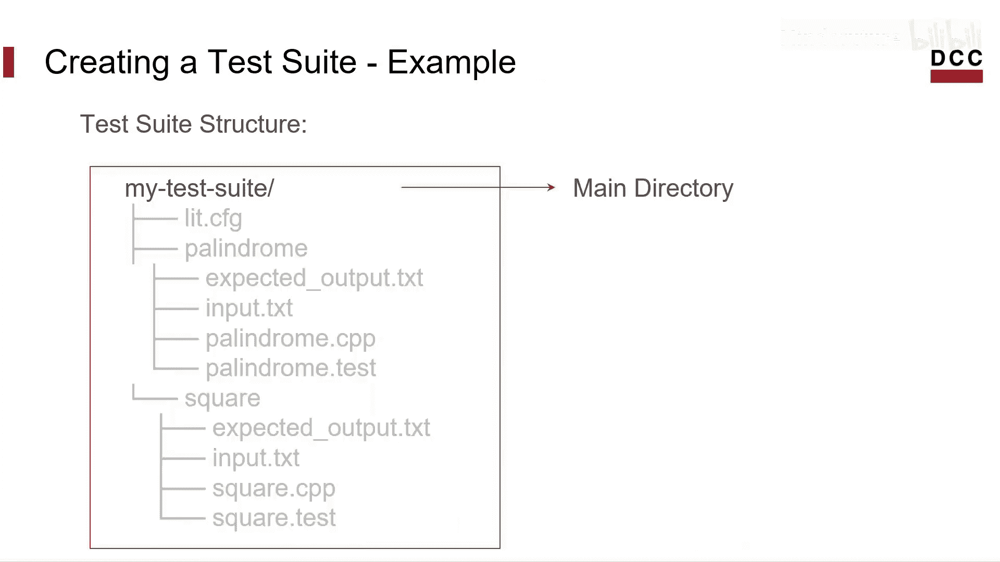

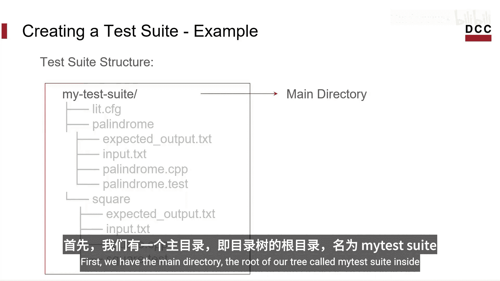

```
mytest/
├── lit.cfg.py
└── test/
    ├── palindrome/
    │   ├── palindrome.cpp
    │   ├── palindrome.test
    │   ├── input.txt
    │   └── output.txt
    └── square/
        ├── square.cpp
        ├── square.test
        ├── input.txt
        └── output.txt
```

*   `mytest/` 是主目录，即项目根目录。
*   `lit.cfg.py` 是Lit配置文件，用于加载测试套件的所有配置。
*   `test/` 目录下包含各个程序的测试目录。

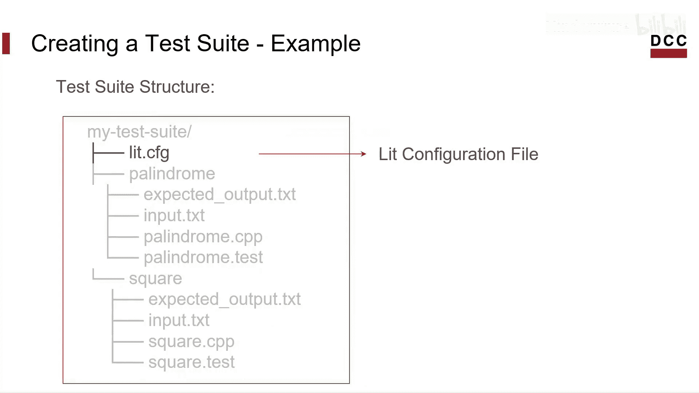

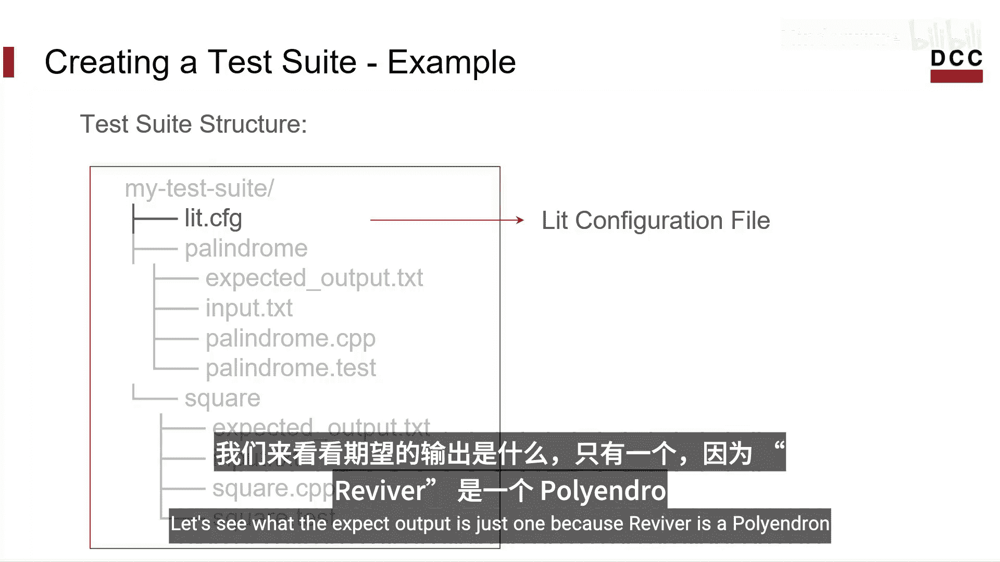

## 配置文件详解

`lit.cfg.py` 是一个简单的Python脚本，我们需要将配置传递给工具。首先需要导入lit模块。

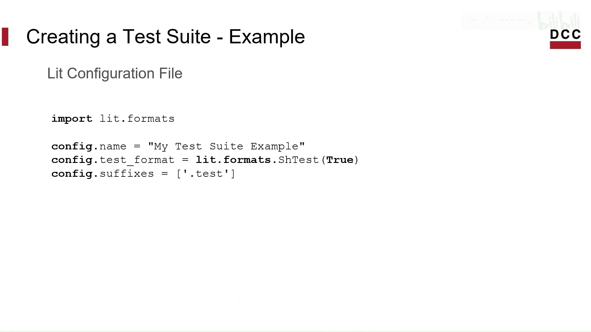

该文件中有许多可用配置，但只有两个是必需的：

1.  **`name`**：测试套件的名称，例如 `config.name = 'My Test Suite Example'`。
2.  **`test_format`**：需要告知我们将要运行的测试类型，这里我们使用Shell测试：`config.test_format = lit.formats.ShTest()`。

第三个配置 `config.suffix` 是可选的，我在这里告知Lit测试文件将以 `.test` 结尾：`config.suffix = '.test'`。

## 测试程序示例

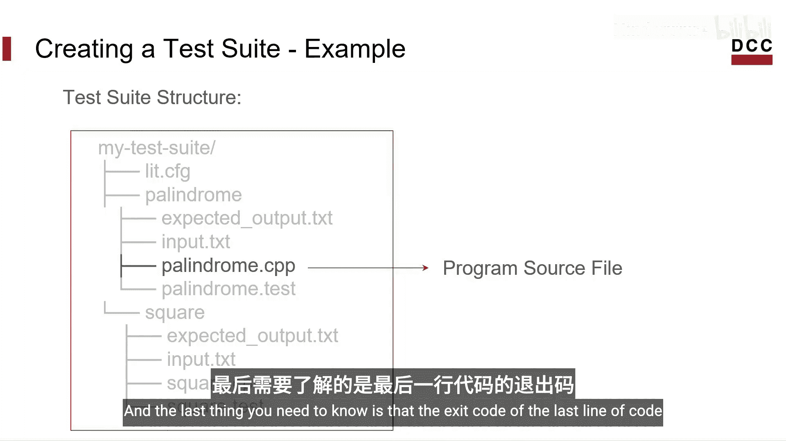

在 `test/` 目录下，我们有一些程序目录。第一个是 `palindrome/`（回文检查程序）。

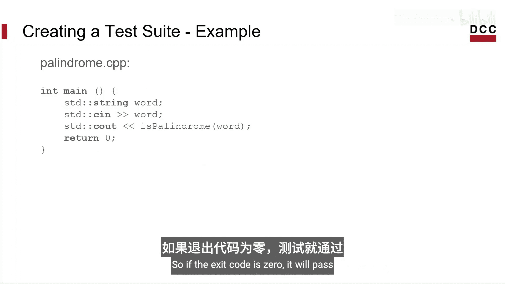

*   `palindrome.cpp` 是一个程序源文件。这是一个非常简单的程序，用于验证一个单词是否是回文。它从外部输入读取一个单词，如果单词是回文则输出1，否则输出0。
*   `input.txt` 是输入文件，我传入了单词 "Reviver"。
*   `output.txt` 是预期输出文件，内容就是 `1`，因为 "Reviver" 是一个回文。
*   `palindrome.test` 是用于测试程序是否正确的Shell脚本。

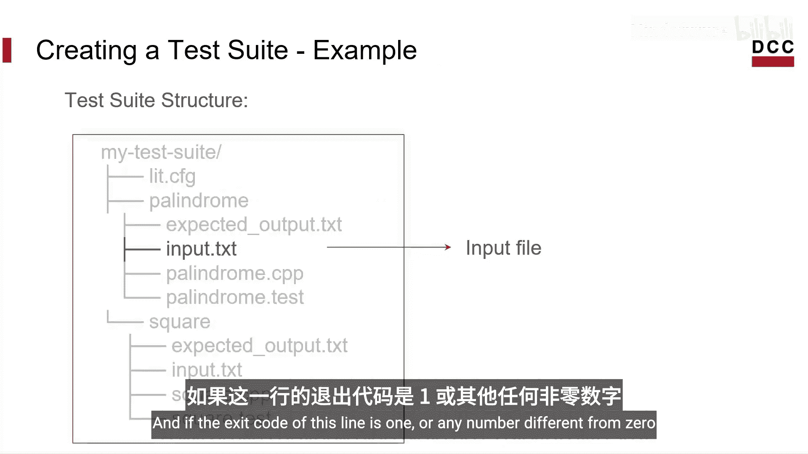

## 测试脚本解析

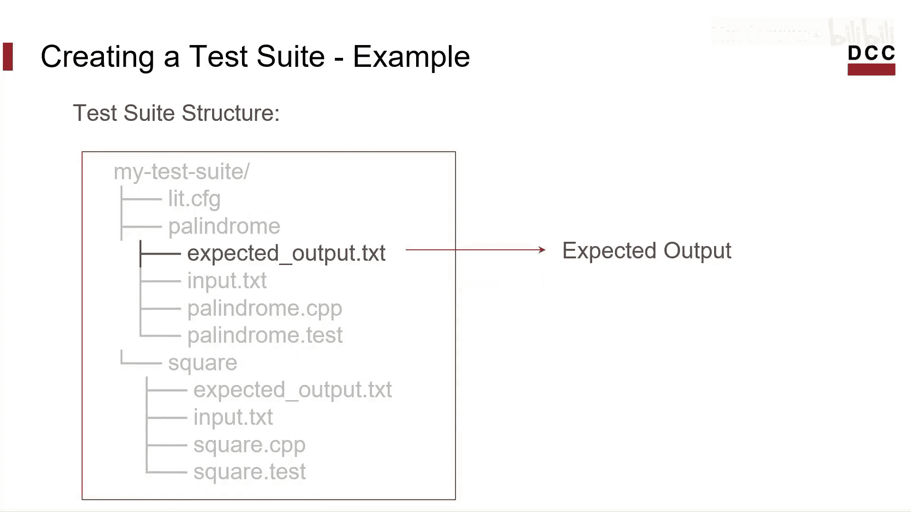

以下是测试文件的内容。第一行，我编译了程序。第二行，我调用程序并将实际输出与预期输出进行比较。

```bash
# RUN: clang++ %s -o %t
# RUN: %t < %S/input.txt | diff %S/output.txt -
```

Lit为我们提供了一些在Shell脚本中使用的宏，最常见的宏是：

*   **`%s`**：这个宏表示当前测试文件。
*   **`%S`**：这个宏表示测试目录，即当前测试文件所在的目录。
*   **`%t`**：这是一个临时文件。

如你所见，在Shell脚本的第一行，我通过给程序命名 `%t` 来调用程序。第二行，我通过 `%t` 调用程序，并将其输出与预期输出进行比较。

最后需要知道的是，**最后一行代码的退出代码将指示测试是否通过**。如果退出代码是0，测试将通过；如果退出代码是1或任何非零数字，测试将不会通过。

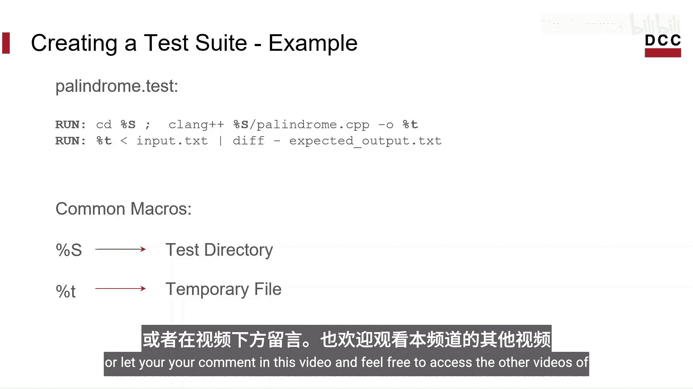

对于 `square/` 程序，我也在做同样的事情。

## 运行测试

配置好所有文件后，运行测试的过程就很简单了。

如果你想为整个测试套件（套件内的所有程序）运行测试，可以调用Lit并指向整个测试套件目录。

如果你只想为特定程序运行测试，可以调用它并指向所需的目录。例如，以下命令仅对 `square` 程序运行测试：

```bash
lit test/square/
```

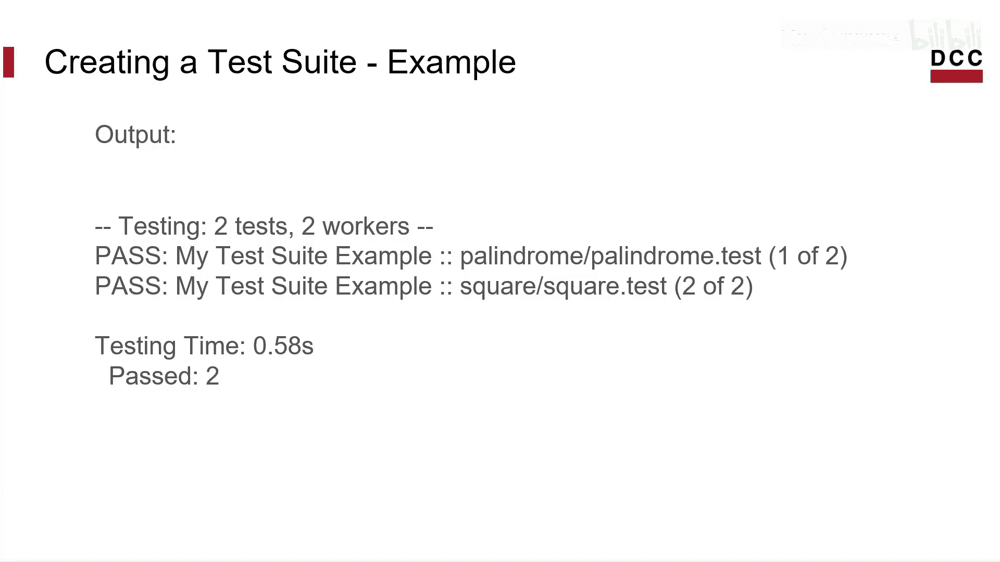

输出将类似以下内容：第一行指示工具在你传递的目录中找到的测试数量（如果对整个目录运行，会找到两个测试）。之后的每一行将指示找到的测试名称（例如 `palindrome.test` 和 `square.test`）以及测试是否失败。

## 总结

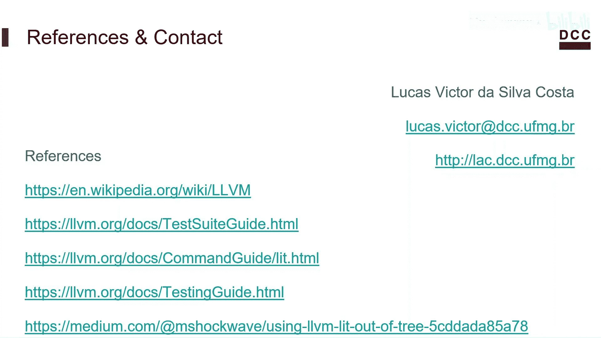

本节课中，我们一起学习了如何使用LLVM集成测试器（Lit）来创建和运行自定义测试。我们了解了测试套件的基本结构，如何编写配置文件（`lit.cfg.py`），以及如何编写包含Lit宏的Shell测试脚本。最后，我们掌握了运行整个测试套件或单个程序测试的方法。通过遵循这些步骤，你可以为自己的项目构建一个简单而强大的测试框架。