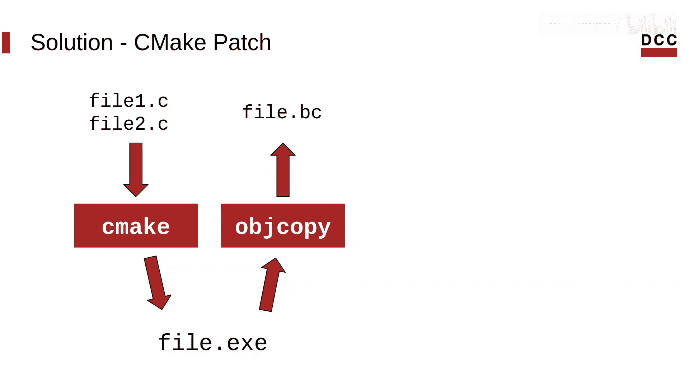
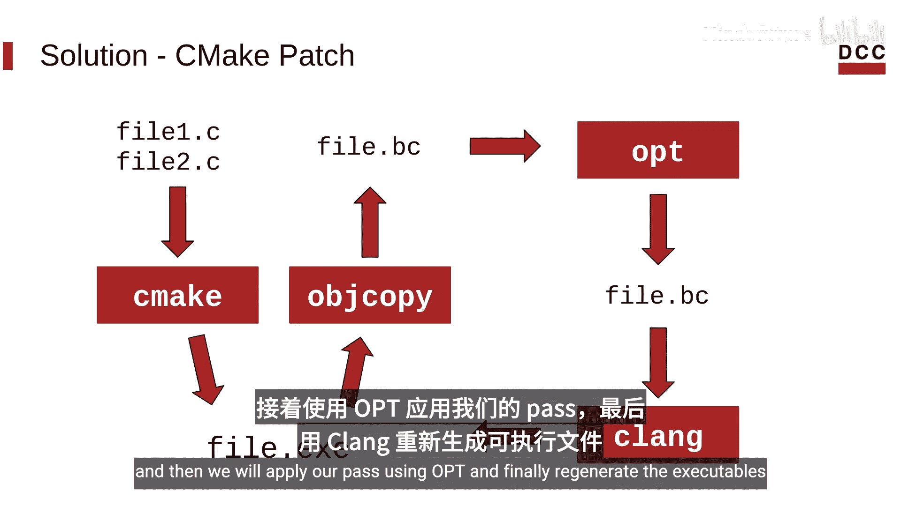
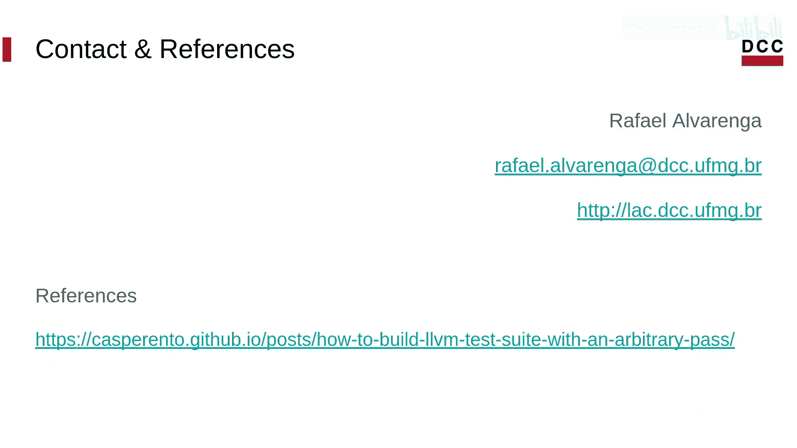

# 024：如何为任意LLVM Pass构建测试套件 - 第一部分

在本节课中，我们将学习如何将一个自定义的LLVM Pass应用到整个LLVM测试套件中，并编译生成可执行文件。这个过程对于评估Pass在真实程序上的效果至关重要。

大家好，我是Hafaovaangga，是UFMG大学编译器实验室的一名研究生研究员。我目前的工作是在LLVM中实现代码压缩技术。

## 问题与目标

上一节我们介绍了LLVM Pass的基本概念。本节中我们来看看一个实际问题：如何评估自定义Pass在整个测试套件上的效果？我们的目标是使用特定的Pass来编译测试套件中的二进制文件。

为了实现这个目标，我们需要完成以下步骤：
1.  首先构建项目，并使用`lit`运行测试以收集基线性能指标。
2.  然后，重新构建测试套件，但这次要应用我们的自定义Pass。
3.  最后，收集应用Pass后的指标，并与基线进行比较。

## 核心挑战与解决方案

但是，在开始之前，我们需要对`cmake`项目进行补丁修改。这是必要的，因为标准的LLVM测试套件没有提供直接使用指定Pass来编译二进制文件的方法。

以下是解决方案的核心流程：

1.  首先，使用测试套件默认的CI配置选项进行构建。
2.  接着，从生成的可执行文件中提取出完全链接后的Bitcode文件（`.bc`）。
3.  然后，使用`opt`工具对我们的Bitcode文件应用自定义Pass。
4.  最后，使用`clang`将处理后的Bitcode文件重新编译为可执行文件。

这个过程可以用以下代码流程描述：
```bash
# 1. 构建测试套件（基线）
cmake ... -DCMAKE_C_COMPILER=clang -DCMAKE_CXX_COMPILER=clang++ ...
make

# 2. 提取Bitcode (假设通过某种方式获得 .bc 文件)
extract_bc_from_executable ${EXECUTABLE} -o ${EXECUTABLE}.bc



# 3. 应用自定义Pass
opt -load=MyPass.so -mypass ${EXECUTABLE}.bc -o ${EXECUTABLE}.optimized.bc

# 4. 重新编译为可执行文件
clang ${EXECUTABLE}.optimized.bc -o ${EXECUTABLE}.optimized
```



感谢观看。在下一个视频中，我将向大家展示如何具体应用这个补丁并使用它。

## 本节总结



本节课我们一起学习了为自定义LLVM Pass构建测试套件的整体思路和高级解决方案。我们明确了目标是通过对比基线指标和优化后指标来评估Pass效果，并指出了需要修改构建系统的核心挑战。关键步骤包括：构建基线、提取Bitcode、应用Pass、重新编译。下一节我们将进入实践环节。