# 025：如何为任意LLVM Pass构建测试套件 - 第二部分 🛠️

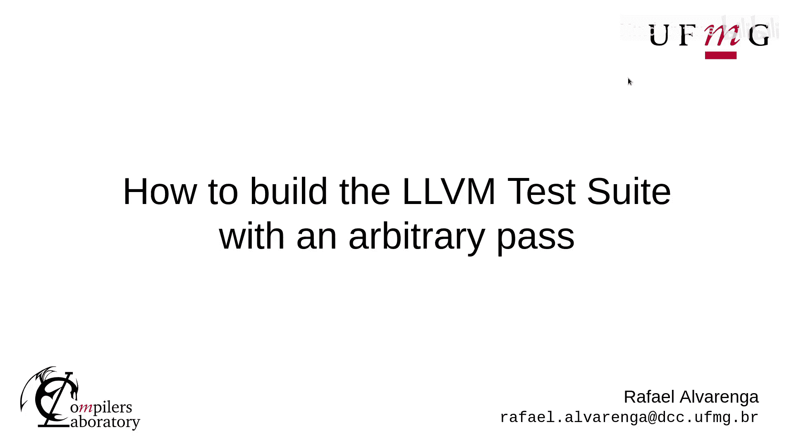

在本节课中，我们将学习如何应用上一节讨论的补丁，并利用它来配置环境、运行测试套件以及收集和分析程序指标数据。

---

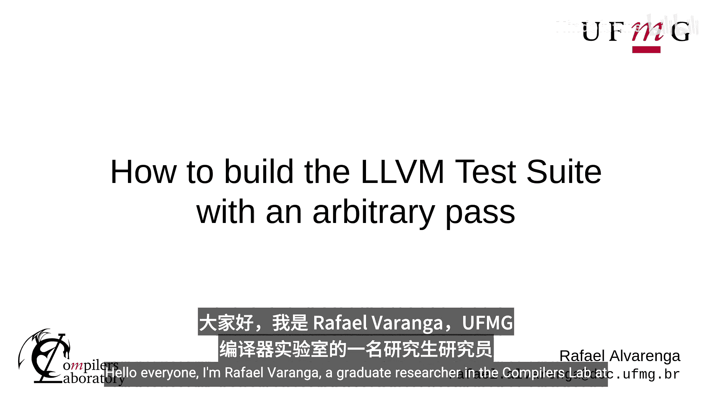

大家好，我是Hafao Vaningga，佛罗里达大学编译器实验室的Gwi研究员，主要研究LLVM中的代码压缩技术。本视频将展示如何应用上一节讨论的补丁，以及如何使用它。

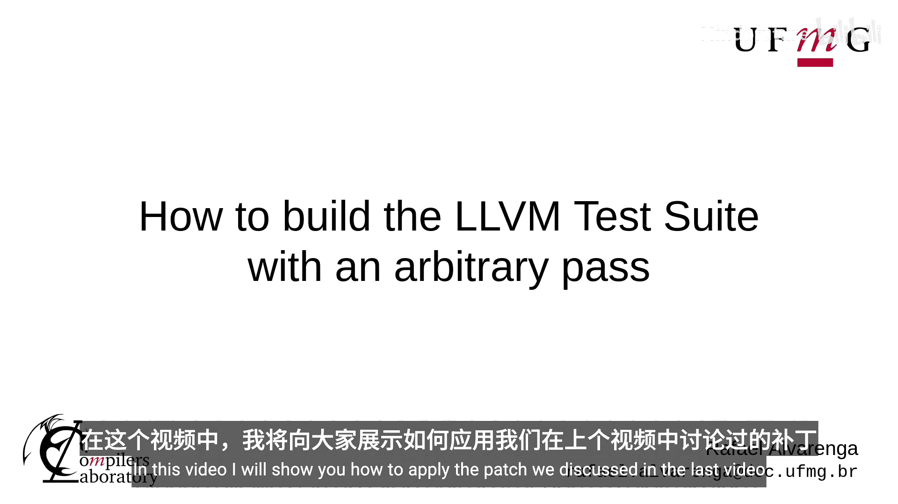

上一节我们介绍了补丁的基本概念，本节中我们来看看具体的应用步骤。

## 环境与前提假设

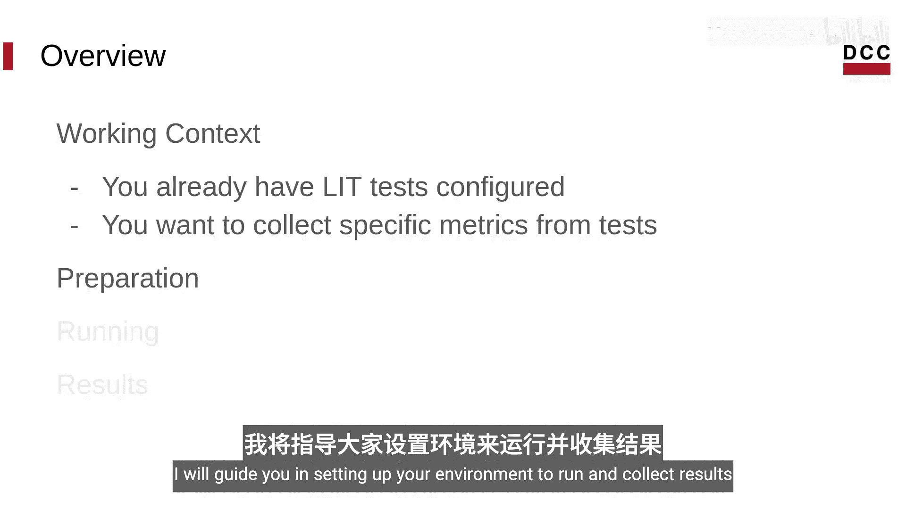

我们假设LLVM测试套件已经配置完成，目标是收集特定的程序指标。我将指导你设置环境以运行测试并收集结果。

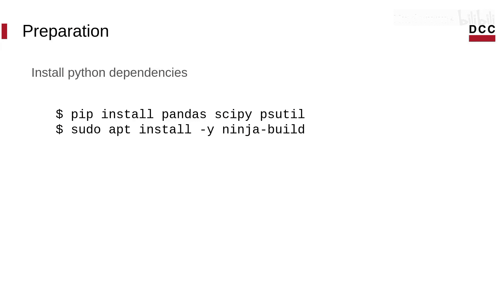

## 安装必要的Python库

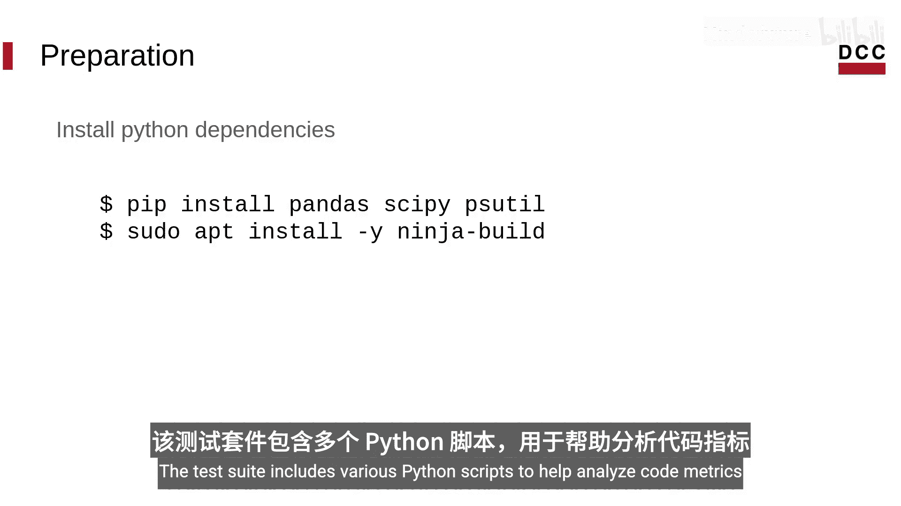

测试套件包含多个Python脚本，用于帮助分析代码指标。要使用它们，需要先安装一些依赖库。

以下是需要安装的库：
*   `pandas`
*   `scipy`
*   `psutil`

你可以使用以下命令进行安装：
```bash
pip install pandas scipy psutil
```

## 应用补丁与配置构建

我们将使用Ninja作为构建系统。要应用补丁，你可以选择克隆已打好补丁的测试套件版本，或者根据幻灯片中的提交链接手动应用补丁。

应用补丁后，进入测试套件目录并创建一个构建文件夹。我们将使用CMake进行配置，具体设置如下：

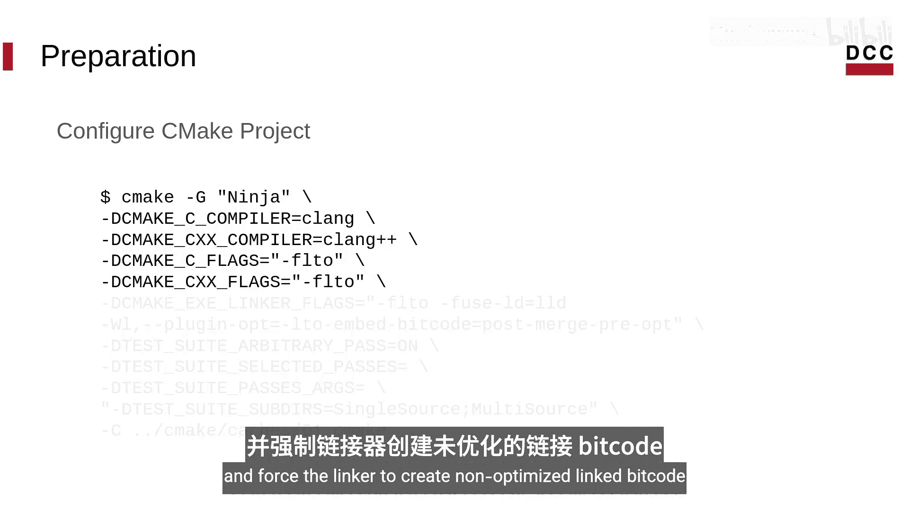

*   使用Ninja作为构建系统。
*   指定`clang`为编译器。
*   启用`-flto`标志以生成Bitcode文件。
*   强制链接器创建未优化的链接后Bitcode。
*   启用对Bitcode文件应用Pass的选项。
*   指定要运行的Pass。

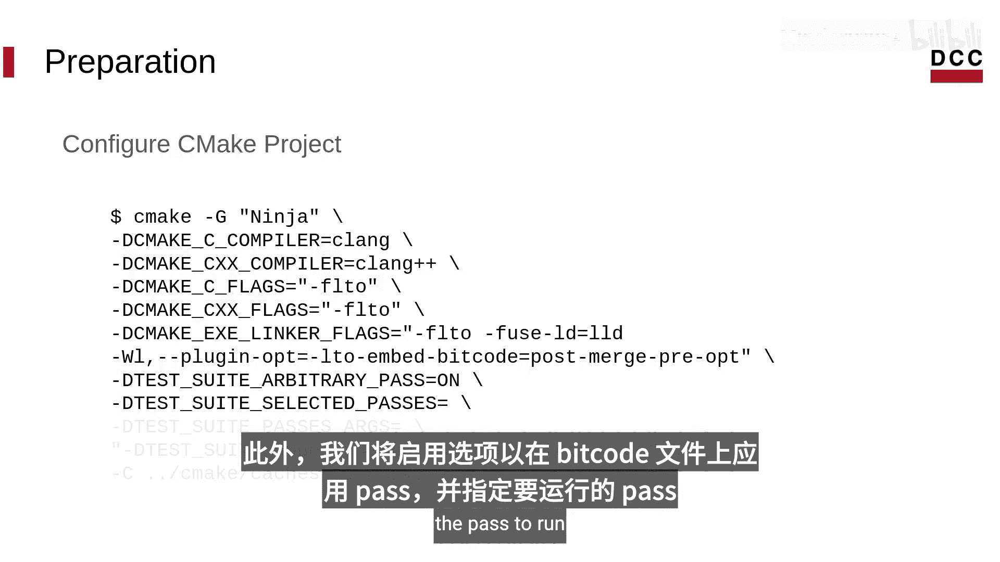

我们将使用单源和多源测试套件，并对所有二进制文件使用`-O1`优化标志。

## 编译与运行测试（第一轮）

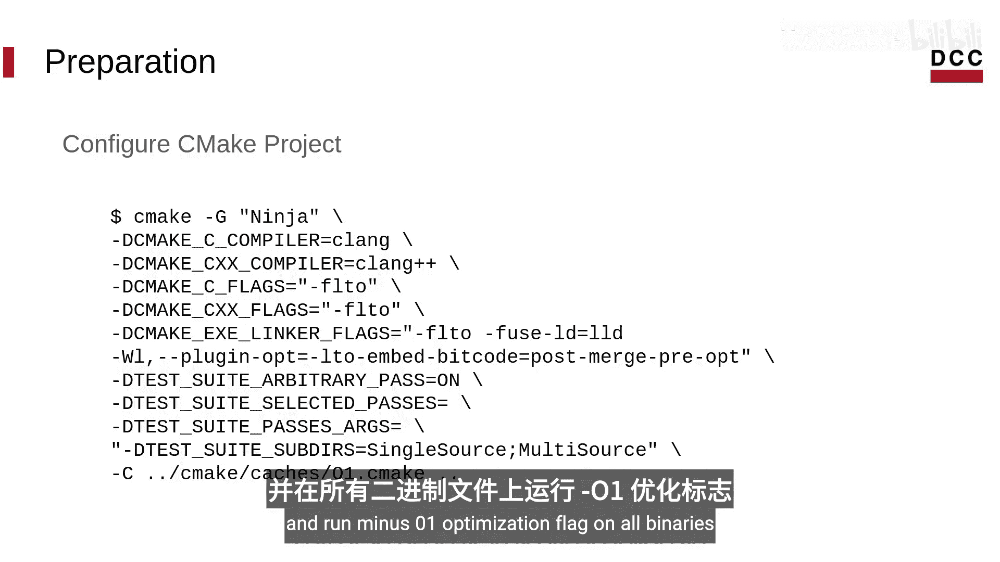

现在可以编译测试套件了。编译完成后，我们将运行`lit`来收集`-O1`优化级别下的指标数据。

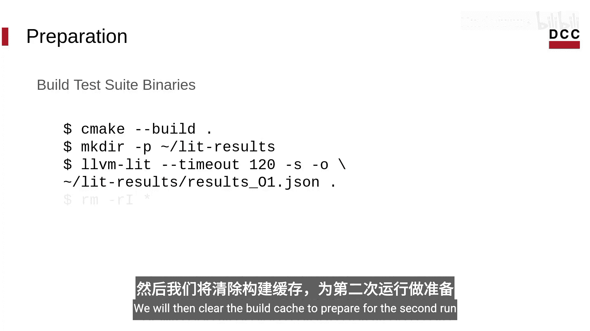

之后，我们需要清理构建缓存，为第二轮运行做准备。

## 编译与运行测试（第二轮）

对于第二轮运行，我们重复使用相同的CMake命令，但将优化标志设置为`-O2`。重新编译后，再次运行`lit`以收集`-O2`级别的指标数据。

## 结果比较与分析

最后，我们将比较两轮运行的结果。测试套件提供了一个Python脚本，可以生成包含差异计算的详细报告，比较指令计数和代码大小等指标。

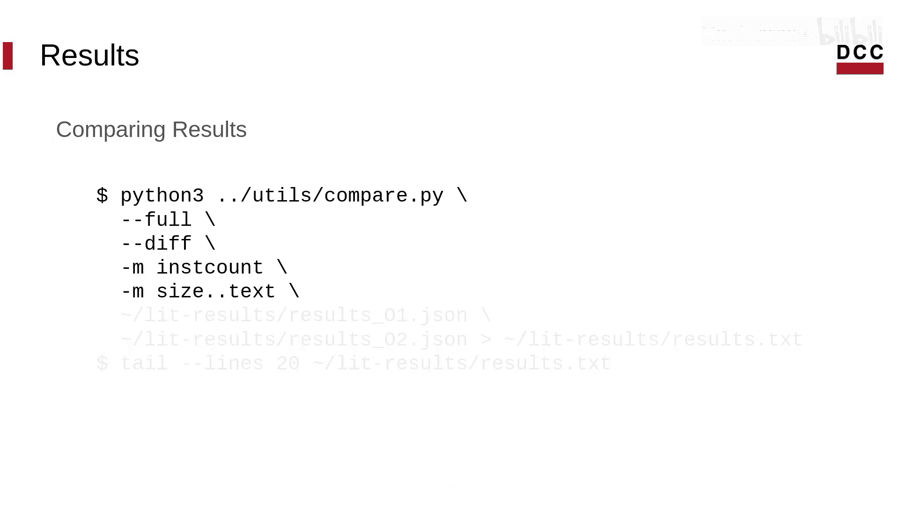

你需要指定要比较的文件以及保存结果的位置。如果需要，你还可以使用`tail`命令在终端中显示结果。

---

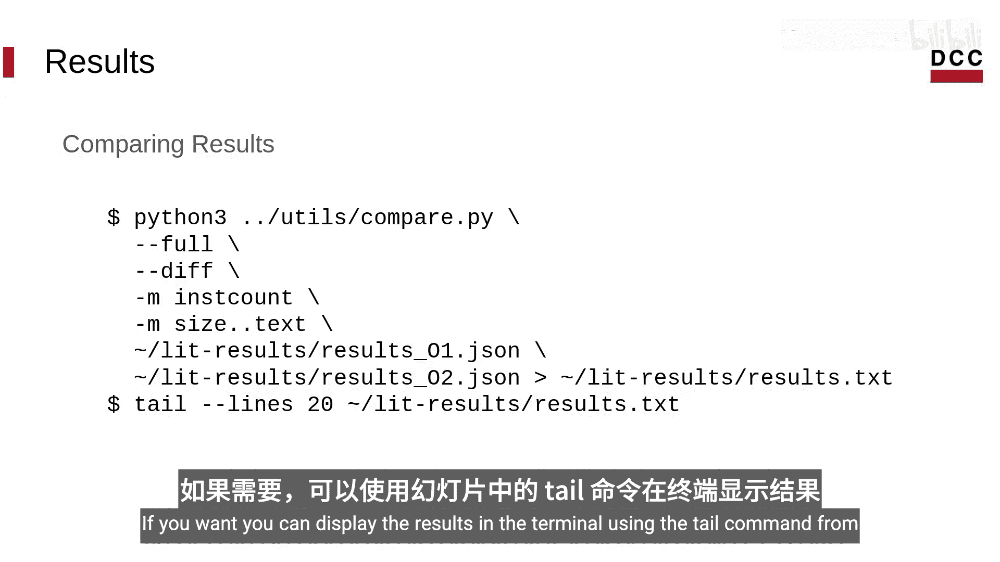

本节课中我们一起学习了如何为自定义的LLVM Pass应用补丁、配置并运行LLVM测试套件，以及如何收集和比较不同优化级别下的程序性能指标。这为分析和验证Pass的效果提供了完整的工作流程。