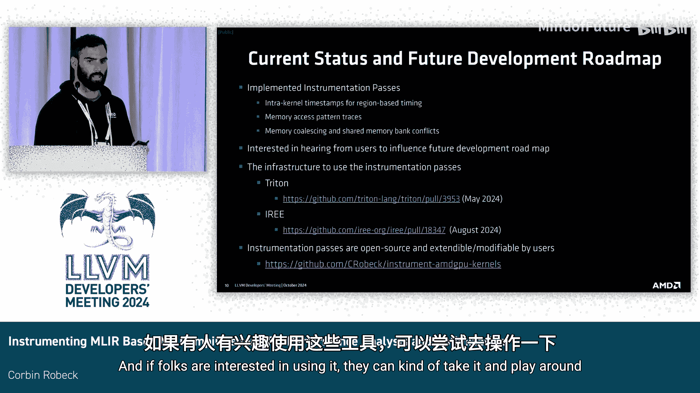

# 001：基于MLIR的ML编译器性能分析插桩

在本教程中，我们将学习如何为基于MLIR的机器学习编译器进行性能分析插桩。我们将探讨在GPU编程环境中进行编译器级性能分析所面临的挑战，并介绍一种通过LLVM插件和自定义编译过程来实现高效、低开销数据收集的解决方案。

## 概述

我是Corman，来自MDD的ML编译器团队。本次分享我们将介绍我们为基于MLIR的机器学习编译器进行性能分析所做的工作。

背景是，许多机器学习编译器和框架广泛使用MLIR和GPU内核。这从基于编译器的性能分析角度提出了挑战。虽然可以使用动态二进制信息工具，但它们通常粒度较粗，难以获取更高级别的源码级信息。调试信息虽有帮助，但会丢失编译器内部可用的信息。因此，通过在编译器中插桩，我们可以追踪导致性能瓶颈的特定GPU内核缺陷，穿越通常非常繁琐的各个降级阶段，而目前缺乏内置于编译流程的工具。

我们发现，在程序源码层面进行插桩以获取更高级别的数据操作信息非常有用。本项目的总体目标是开发一套轻量级、可定制的开源编译器过程，并将其集成到一些流行的ML编译器和流程中。

对于不熟悉此概念的听众，这里的“插桩”指的是通过编译器过程，将分析代码注入GPU代码的性能关键部分，以获取各类信息。

## 挑战

在基于MLIR并使用GPU的框架中工作时，会遇到哪些类型的挑战？

首先，GPU插桩并不像在CPU上那样直接。分析代码在GPU上生成数据后，必须以某种方式将这些数据移回CPU。这涉及到主机调用（host call）类型操作，例如AMD实现`printf`的方式，但这会带来巨大的开销，因此不适用于任何重量级操作。在我们的示例中，一个小的注意力模型就生成了约10GB的数据。因此，任何生产环境中的方案都必须能处理这种情况。

其次，LLVM（至少在我们的案例中）将GPU和CPU代码分离到不同的模块中。因此，必须找到在它们之间协作的方法。

再者，通常我们希望使用基于Clang的工具链来编写插桩函数（即用C++编写），然后将其插入到基于MLIR的框架中，而该框架本身可能并不包含Clang驱动和运行时环境。

此外，当在MLIR流水线中进行插桩时，尤其是在我们工作的框架中，通常只能看到GPU内核，而没有CPU主机代码可供添加调用。因此，我们只能获得基于MLIR的GPU内核。

## 应用框架与视角

我们通常工作的流行框架包括Triton、IREE，以及部分PyTorch（仍在进展中）。在这些框架中工作的一项挑战是，GPU代码对用户是刻意隐藏的，旨在提供易用性，用户无法直接访问实际的代码生成过程。因此，在进行性能分析和调优时，你希望了解幕后做出的决策，并找出问题所在。

这种需求根据你的身份而有所不同：
*   **如果你是硬件架构师**，设计内存系统，你想了解特定模型的内存访问模式。
*   **如果你是编译器开发者**，你想查看数据移动、计算与通信的重叠机会、内核内计时等。
*   **如果你是用户**，你希望获得即时反馈，并能关联到流水线中的各种对象。你不仅想知道源码级别的信息，还想知道：“能否给我关于特定对象（例如Triton中的张量对象）的信息？能否告诉我哪一行源码的哪个张量对象存在内存合并或存储体冲突等性能瓶颈？”

## 解决方案：插桩机制

我们通过结合LLVM插件、特定分析过程和Clang生成的内核来实现插桩。我们通过“优化模块阶段”插入它们，这是MLIR框架中一个常用的部分。这种方法具有通用性，可以在不同框架的多个位置插入。

插桩过程的工作原理细节如下：
1.  **克隆内核并添加额外参数**：过程会克隆内核函数，并添加一个额外的内核参数。这是数据传递发生的地方，用于将信息从GPU传回CPU。在模块化编译的方式下，这是将GPU生成的数据高效移回CPU（用于写入磁盘或进行分析）的最佳体验方式。
2.  **设置设备端缓冲区**：我们在GPU上设置一个设备端缓冲区，GPU线程将数据写入其中。这一切都是通过LLVM过程设置的。
3.  **缓冲区管理与信号机制**：你拥有一个用户定义大小的缓冲区。当发现缓冲区已满时，GPU会发出一个信号，通知一个主机线程来清空缓冲区，然后GPU可以继续运行。这样，设备可以持续填充这个缓冲区，当它周期性变满时，处理过程会暂停。这与主机调用不同，主机调用需要停止所有操作，破坏性很大。

## 示例：内存访问模式追踪

这是一个相当常见的插桩示例，用于获取加载和存储操作访问虚拟内存地址的热力图。

其工作方式是，在每个全局加载和存储操作处添加一个编译器过程。这是一段C++分析代码，它被编译后插入到没有Clang依赖的MLIR框架中。这很酷，意味着我们可以将C++代码插入到任何想要进行分析的地方。

我们计算虚拟地址，并能够获取元数据，例如：
*   源码位置
*   MLIR级别的对象信息
*   时间戳
*   硬件特定信息，如生成数据的波前（wave）、计算单元（CU）或小芯片（chipplet）

这是一个示例。在一个Flash Attention模型中，你可以获得各种有趣的数据，可以将它们与内存地址关联起来，获取硬件特定信息，并将其关联回源码。此外，还有一个独立的部分允许你获取更高级别的对象信息。

## 当前状态与总结

本节课中，我们一起学习了为基于MLIR的ML编译器进行GPU性能分析插桩的方法。

当前的状态是，我们已经开发了用于以下方面的插桩过程：
*   **内核内计时**
*   **内存访问模式**（最成熟的部分）
*   **各种基础性能瓶颈**，如内存合并、存储体冲突

其优点是高度可定制，你可以基于现有过程进行扩展以满足需求。相关基础设施代码已经上游化，我们正致力于将其集成到现有工具中。我们还有一些开源的过程可供使用，如果大家有兴趣，可以取用并进行实验。

我的时间到了。谢谢，Carbin。

