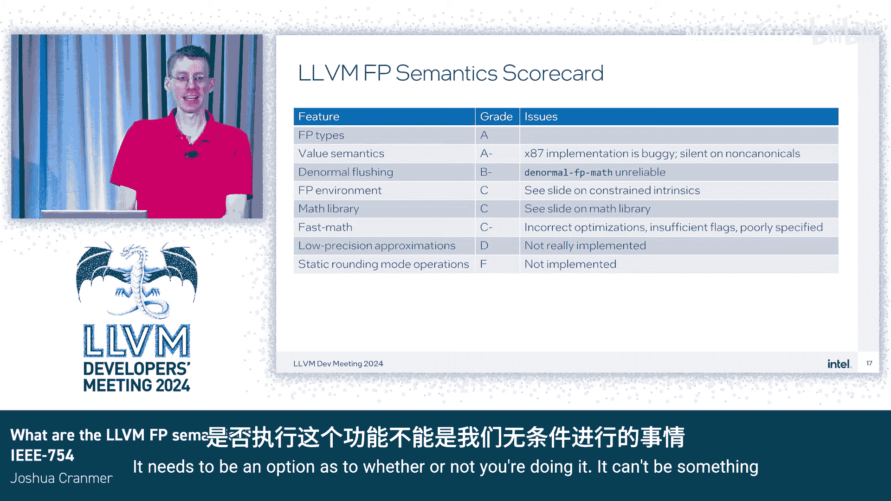

# 002：LLVM中的浮点运算——现状、问题与缺失

在本节课中，我们将要学习LLVM中浮点运算的语义。我们将探讨其良好定义的部分、当前存在的问题以及完全缺失的功能。课程内容基于IEEE 754标准，但会重点分析LLVM实现中的具体细节和挑战。

## 概述：为什么IEEE 754标准不是完整答案？

上一节我们介绍了课程主题，本节中我们来看看为什么单纯引用IEEE 754标准不足以定义LLVM的浮点语义。

首先，并非LLVM中的所有浮点类型都基于IEEE 754定义的类型。其次，标准本身在某些方面定义不够明确，例如NaN的有效载荷（payload）行为或“粘性”（tininess）的定义。此外，硬件实现经常做出与标准不同的行为，有时是提供额外功能（如非规格化数刷新），有时则是不得不偏离标准（例如某些嵌入式硬件可能完全没有浮点环境）。最后，浮点环境本身是一种共享的、隐藏的、可变的全局状态，这对编译器优化者而言是一个难题。许多用户有时也愿意为了速度而牺牲一点正确性，这正是快速数学（fast math）标志的基本前提。

## 硬件实现的约束

在讨论LLVM描述的浮点语义之前，让我们先了解一些硬件层面的差异，这些差异限制了我们提供不同语义的能力。

### 非规格化数刷新

最著名的硬件差异之一是非规格化数（denormal）刷新。它包含两个独立的控制位：
*   **非规格化数为零（DAZ）**：如果浮点操作的输入操作数是非规格化值，则将其视为带符号的零。
*   **刷新到零（FTZ）**：如果操作的结果是微小的（tiny），则将其刷新（刷新）为带符号的零。

需要注意的是，“微小结果”和“非规格化结果”之间存在区别。在某些情况下，即使结果是规格化数，如果启用了FTZ，它仍然可能被刷新为零。

一些硬件允许按类型设置非规格化刷新，例如仅对32位浮点数启用，而64位则完全支持非规格化数。另一些硬件则不给选择，例如在x86架构上使用AVX-512和Bf16时，总是会刷新非规格化数，与状态寄存器中的控制位无关。

最后一个问题是，某些编译器在使用快速数学标志链接时，会在进程启动时设置模式位，从而在整个进程范围内启用非规格化刷新，这可能导致问题。

### x87浮点单元（FPU）

x87 FPU主要与32位x86代码相关。其核心问题是它只支持80位浮点类型。当加载或存储32位和64位浮点数时，会进行隐式转换，这种转换会静默NaN，可能引发问题。此外，80位类型实际上不足以在不进行双舍入的情况下充分模拟64位浮点类型。

### 浮点环境

浮点环境是另一个主要问题。IEEE 754标准强制要求一定程度的支持，特别是动态舍入模式和一些异常支持。在浮点运算中，异常与常规硬件陷阱不同，它们可以同时返回一个值并“抛出”异常。默认行为是设置粘性位（sticky bits），这些位将一直保持设置状态，直到被显式清除。一些硬件还支持在异常发生时产生硬件陷阱。

许多硬件也支持非规格化处理位，并且不同架构还有各种奇特的控制位，这些都以各种奇怪的方式改变值语义，使得为LLVM设计通用的、与目标无关的浮点语义变得困难。

### 基本操作与扩展

IEEE 754定义了一组核心算术运算，包括基本算术、比较、转换以及平方根和融合乘加（FMA）。大多数硬件都提供这组操作。此外，IEEE 754还定义了一组映射到标准初等函数（主要是超越函数，如指数函数、三角函数等）的附加算术函数，这些在硬件中不太常见，且精度往往较低。硬件还可以在此基础上添加其他操作，特别是在向量类型和低精度近似操作（如用于除法和平方根的倒数近似）方面。

一个值得注意的趋势是，忽略动态舍入模式的静态舍入模式在硬件（尤其是加速器硬件）中变得越来越普遍，因为这意味着不再需要关心浮点环境。

## LLVM IR中的浮点语义

现在我们对硬件和IEEE 754标准有了一些基础了解，接下来开始审视LLVM IR内部的浮点语义。

### 良好定义的部分

LLVM浮点语义有一些好的方面。所有浮点类型都有明确定义的格式，其模式（pattern）也定义得相当好。在互操作中使用这些类型时，它们都有特定的预期行为，不会随机改变。NaN的有效载荷也不会被任意更改。

需要指出的是，我们定义的 `fneg`、`fabs` 和 `fcopysign` 操作本质上是针对符号位的整数操作。因此，如果你有特殊的NaN有效载荷，可以保证LLVM在通过这些操作传递时不会改变它们。

几年前，我们确定了处理NaN有效载荷的完整行为规则，本质上是一种传播机制。如果你的硬件不引入奇怪的NaN有效载荷，LLVM也不会。但如果上述情况不成立，那么发生什么就难以预料了。

在此过程中，我们还规定操作不要求将信号NaN（SNaN）转换为静默NaN（QNaN），这使我们能够将 `1.0 * x` 优化为普通的 `x` 表达式，从而消除FMA操作。

可能最重要的优化规则是：就浮点操作的值结果语义而言，必须保证其符合IEEE 754标准。这意味着优化不能改变该值，例如不能用 `a * (1.0 / b)` 替换 `a / b`。然而，后端和各种代码生成中存在许多错误，这意味着如果你依赖后端正确执行，不一定能得到相同的一致性。

需要强调的是，x87的行为被视为一个错误，尽管它加载数据时无需进行任何转换即可获得精确的32位到64位转换。这是一个错误，只是目前修复它的优先级不高。

### 浮点环境带来的复杂性

浮点环境是事情开始变得有点奇怪的地方。LLVM合理地假设浮点环境处于默认状态，并且大多数情况下没人真正关心它。如果你熟悉C语言中 `#pragma STDC FENV_ACCESS` 的规则，这实际上等同于默认关闭 `FENV_ACCESS`。基于这个假设，我们可以认为浮点操作是没有副作用的纯操作，因此可以自由推测、添加或删除。

如果你不希望遵守这些规则，即你想使用浮点环境，那么就需要使用 `strictfp` 属性。一旦启用，就不能再推测这些操作了。然而，这引发了一些关于这些操作在该点语义的问题。

关于浮点环境，另一个有趣的细节是：非规格化刷新不是通过 `strictfp` 指示的，而是通过 `denormal-fp-math` 属性指示的，因为它与快速数学（fast math）相关，而不是与更高级的环境操作相关。

由于前端在链接目标文件时可能为整个进程启用此功能，因此按翻译单元工作的前端无法始终正确地设置它。此外，将其作为函数属性也存在一些问题，例如它无法反映函数中间环境发生变化的可能性。

### 约束内部函数（Constrained Intrinsics）

如果你想在非默认浮点环境中使用浮点操作，应该用约束内部函数替换它们。这些内部函数被设计为具有不同的语义，并且能够感知环境。实际上，创建这些内部函数的初衷是：首先移除我们对浮点操作的所有优化，仅在我们知道安全的情况下才添加它们。

需要注意的是，约束内部函数目前被认为是实验性的，并且它们并不算新。因此值得问一个问题：这个实验失败了吗？我认为是的。我们注意到了这些内部函数的几个主要问题。

首先是大量的重复。当我们添加向量谓词（vector predication）内部函数时，这个问题变得尤为明显，因为现在每个操作都需要四套内部函数：带约束的、带向量谓词的、两者都带的以及两者都不带的。对于目标特定的内部函数来说情况更糟，因为它们最初就没有这些变体。

其次，如果你想对这些内部函数进行优化（例如，你想使用非默认舍入模式但不关心浮点异常），那么现在必须在代码生成器中复制每一个模式，这对编译器来说是大量的重复工作。

其他问题包括：这些内部函数没有提供指定更奇特浮点环境功能（如非规格化处理）的方法。在LLVM的浮点工作小组中，已经形成了一个初步共识：我们希望从约束内部函数转向使用操作数包（operand bundles）。目前已经有相关的补丁，但尚未实现，因此目前唯一的选择是使用约束内部函数。

## 数学库函数的问题

接下来要讨论的是数学库函数的问题，这些函数来自IEEE 754的附加操作（不包括平方根或FMA，因为它们被视为核心函数）。

根据IEEE 754，所有这些函数都应该是正确舍入的。但数学库的实现者表示这太难了，他们不会进行正确舍入。因此，不同的库对于相同的输入可能会给出不同的结果。

数学库函数在LLVM中可以通过两种方式使用：使用带有C语言名称修饰（name mangling）的C函数名，或者使用带有LLVM名称修饰的LLVM内部函数。使用C名称修饰可能有问题，因为C语言中的 `long double` 类型根据编译目标的不同，可能映射到四种不同的LLVM IR类型。

另一个问题是，这些内部函数被定义为等效于库函数调用，但不应该设置任何异常。然而在代码生成中，它们通常被降低为库调用，而这些库调用在大多数情况下会设置 `errno`。

我们还有其他问题：我们愉快地对这些内部函数进行常量折叠，这可能会改变结果，特别是在交叉编译或主机与目标库不同的情况下。由于C函数名和LLVM内部函数之间的重复，我们用于优化各种表达式的模式通常只匹配其中之一，两者都匹配的情况 surprisingly 很少。

这些函数与快速数学标志的交互也很有趣：我们何时被允许应用各种数学恒等式？我们需要快速数学标志来说明 `sin(-x)` 等价于 `-sin(x)` 吗？对于其他情况呢？是否有一组小的常数值，我们知道可以常量折叠，并且应该对所有架构都相同？更复杂的表达式呢？例如，将 `sin(x) / cos(x)` 转换为 `tan(x)`，因为这代数上是正确的，需要哪些快速数学标志？实际上，目前的答案是 `reassoc`（重关联）。有多少人预料到了这个答案？

## 快速数学标志的现状

快速数学标志本身目前也是一个棘手的问题。目前主要通过七个标志位来指定，这些标志可以附加到单个指令上。但事实证明，我们并非在所有浮点指令上都支持快速数学标志，特别是转换指令上没有，我找不到原因。

你也可以通过函数属性来指定这些标志，但这些属性主要只在代码生成的选择DAG期间使用，我们应该在所有情况下都逐渐弃用它们。

这些标志的实际底层语义在很大程度上是未定义的，许多情况下不清楚它们的真正含义。例如，如果你读过 `afn`（近似函数）的定义。我一直在慢慢梳理所有这些标志，并试图为它们提出更好的定义，但这确实需要大量时间来分析和确定应有的情况。

然而，我可以非常肯定地说，我们需要更多的标志位。例如，`reassoc` 标志做的事情太多了：它不仅用于表示可以对浮点表达式进行结合律和分配律变换（以便进行归约树优化），还用于许多代数表达式变换，比如将 `sin/cos` 转换为 `tan` 或其他类似的代数定律。

Andy在他的下一个演讲（几分钟后开始）中会更多地谈到这个问题。还有一个问题是，许多现有的优化并没有遵循我们已有的快速数学标志规则。总的来说，这个领域需要更多的工作。

## 总结与现状评估

本节课中我们一起学习了LLVM中浮点运算的语义、存在的问题以及缺失的功能。

我相信你们会喜欢我继续谈论浮点语义的各种问题，但这次演讲的时间不足以覆盖所有内容。以下是我对LLVM中浮点支持现状的评估：

*   **表现良好的方面**：例如，值语义（value semantics）。
*   **完全缺失的方面**：例如，我们没有任何对静态舍入模式操作的支持，也基本上没有对低精度近似操作的支持。
*   **半工作状态**：例如浮点环境支持，部分工作，部分不工作。

我将很乐意把这张幻灯片留在这里，供大家提问时参考。

谢谢。

