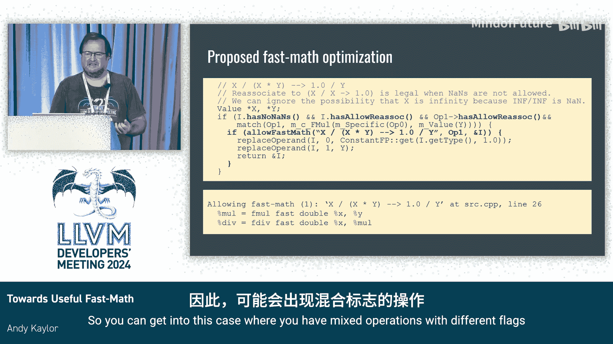

# 003：迈向实用的快速数学优化


## 概述
在本节课中，我们将探讨LLVM编译器中的“快速数学”优化。我们将分析其带来的性能优势与潜在风险，并讨论如何使其对开发者更加实用和可控。

---

## 快速数学的“坏处”：潜在风险

上一节我们概述了课程内容，本节中我们来看看快速数学优化可能带来的问题。它虽然能提升性能，但也伴随着改变程序行为的风险。

以下是快速数学可能导致的一些主要问题：

1.  **改变数值结果**：最常见的例子是重关联优化。对于浮点数运算，`(a + b) + c` 与 `a + (b + c)` 的结果可能不同。编译器在启用快速数学后，可能会为了规范化或优化而改变运算顺序。
2.  **优化掉显式的NaN/Infinity检查**：启用 `-ffast-math` 通常会包含 `-fno-signed-zeros` 和 `-fno-trapping-math` 等假设，这可能导致编译器认为程序中不存在NaN或无穷大，从而移除开发者编写的显式检查代码。
3.  **悄无声息地刷新次正规数到零**：在许多情况下，快速数学会隐式启用刷新次正规数到零的选项。这可能导致当数值进入次正规数范围时，结果突然变为零，而开发者可能对此毫无察觉。
4.  **完全丧失精度**：某些算法对数值变化非常敏感。快速数学优化可能导致关键的小量值在计算中被丢弃，从而使算法失效。例如，在计算 `(A - B) + epsilon` 时，如果 `A` 和 `B` 非常大，重关联为 `A + (epsilon - B)` 可能导致 `epsilon` 因数量级差异而被完全忽略。

为了总结本节内容，我们来看一个最极端的案例。这是一个经典的用于计算机器精度的算法：

```c
// 寻找最小的 k，使得 1.0 + 2^(-k) != 1.0
for (int k = 0; ; k++) {
    double a = 1.0 + pow(2, -k);
    double c = (a + 1.0) - a; // 理论上，若未发生精度丢失，c应为1
    if (c != 1.0) break;
}
```

在启用快速数学后，编译器看到 `c = (a + 1.0) - a`，并应用重关联优化，将其简化为 `c = 1.0`。这导致循环条件永远为假，进而可能被优化为无限循环。根据语言标准，无限循环是未定义行为，编译器甚至可能将整个循环删除。

---

## 快速数学的“好处”：性能提升

既然快速数学有这么多风险，为什么还有人使用它？答案在于它能显著提升程序性能。本节我们来看看它带来的好处。

以下是快速数学启用后带来的主要优化机会：

1.  **循环不变代码外提**：通过重关联，编译器可以将循环内部分计算移到循环外部。例如，将 `A[i] = x * B[i] * y` 重写为 `tmp = x * y; A[i] = tmp * B[i]`，减少循环内的计算量。
2.  **启用向量化**：对于浮点数循环，许多简单的向量化优化需要重关联语义才能进行。如果没有快速数学，编译器可能无法生成高效的SIMD指令。
3.  **基于无NaN/Infinity假设的优化**：如果开发者能确定程序中不会出现NaN或无穷大，并告知编译器，则可以启用更多优化。例如，知道 `x` 不是NaN后，编译器可以将 `x - x` 优化为 `0`。

---

## 现状：控制选项与局限

我们已经了解了快速数学的双面性，本节中我们来看看目前开发者有哪些工具可以控制它。主要从Clang编译器的角度进行说明。

目前控制浮点数模型和快速数学的选项主要继承自GCC，但存在一些混淆：

*   **`-ffast-math` 与 `-funsafe-math-optimizations`**：从名字上看，哪个听起来风险更大？显然是“unsafe”。但事实上，`-ffast-math` 包含了“无NaN/无穷大”的激进假设，通常比 `-funsafe-math-optimizations` 更“不安全”。
*   **`-ffp-model=` 选项**：为了提供更清晰的语义，Clang引入了此选项。其模式包括：
    *   `strict`：严格遵守标准，禁用所有可能改变结果的优化。
    *   `precise`：允许不影响精度的安全优化（默认）。
    *   `fast`：启用一组被认为“较快”但可能改变结果的优化（类似 `-funsafe-math-optimizations`）。
    *   `aggressive`：启用更激进的优化（类似传统的 `-ffast-math`）。
*   **精细控制选项**：开发者可以单独启用或禁用特定的优化，例如：
    *   `-ffp-contract=fast`：允许跨表达式的融合乘加（FMA）优化。
    *   `-fno-honor-nans`：假设没有NaN。
*   **编译指示（Pragmas）**：可以在代码局部范围内控制优化行为，例如 `#pragma clang fp reassociate(on/off)`。这为控制快速数学的影响范围提供了有力工具。

---

## 实用工作流程与未来构想

面对众多选项，如何安全有效地使用快速数学？本节将介绍一个建议的工作流程，并探讨编译器未来如何能提供更多帮助。



一个通用的探索性工作流程如下：
1.  使用 `-ffp-model=fast` 编译整个项目。
2.  测试结果是否在可接受范围内。
3.  如果结果不可接受，则需定位问题。可以逐个文件禁用快速数学，找到引入问题的源文件。
4.  在问题文件中，使用编译指示（Pragmas）在更小的作用域内重新启用优化，逐步缩小范围，直到找到引发问题的具体代码区域或优化。

然而，这个过程非常耗时且容易出错。因此，我构想了一个长期的解决方案：在优化器中引入一个“许可检查”机制。

其核心思想是：**每当优化器想要执行一个依赖于快速数学假设的变换时，它首先调用一个“许可检查”函数**。这个机制类似于现有的“优化燃料”（Bisect）功能，但目的是为了报告和诊断。

设想中的工作方式：
*   开发者可以通过一个编译选项（如 `-ffast-math-debug`）启用此报告功能。
*   当优化器执行一个快速数学变换时，它会输出一条信息，包含源位置、所做的变换类型等。
*   如果因为快速数学标志未启用而无法进行某个潜在优化，它也可以报告这个“错失的机会”。
*   这能帮助开发者直观地看到哪些优化被应用了，并在结果出错时，快速定位到元凶变换。

代码层面的设想是在每个优化变换点插入检查，例如在重关联优化的代码中：

```cpp
// 假设的代码修改处
if (I->hasAllowReassoc() && K->hasAllowReassoc()) {
    if (shouldReportFastMathOpt()) {
        emitFastMathRemark(“正在进行浮点数重关联优化”, I);
    }
    // ... 执行实际的优化变换
}
```

实现这一构想面临挑战，例如需要维护大量的检查点、确保报告信息的准确性，以及平衡运行时开销。但它有望使快速数学优化变得更加透明和可控。

---

## 总结与问答环节要点

本节课中我们一起学习了LLVM中快速数学优化的利与弊。我们了解到，虽然它能通过重关联、向量化等优化大幅提升性能，但也会改变数值结果、移除安全检查，甚至引入错误。目前，开发者可以通过 `-ffp-model`、精细控制选项和编译指示来管理其影响范围。

在问答环节，讨论要点包括：
*   **优化报告**：有开发者指出，现有的优化报告（Remarks）机制可以为基础框架，但需要更好的用户体验（如与源文件行号对应）和更完整的覆盖。
*   **混合标志**：当不同指令具有不同的快速数学标志时（例如，由于局部使用了Pragma），优化器的检查必须考虑所有相关操作，目前的实现有时存在遗漏。
*   **替代方案**：有建议认为，或许可以通过语言扩展（如OpenMP的SIMD指令）或引导用户手动重写代码（例如使用C++并行算法）来获得性能，从而减少对全局快速数学标志的依赖。
*   **维护性与开销**：关于“许可检查”机制的实现，主要挑战在于长期维护（确保每个优化点都添加检查）和在发布版本中的运行时开销。解决方案可能包括通过编译选项完全禁用该机制，或将其设计为非常轻量的内联判断。

**核心目标**是让编译器在追求性能的同时，为开发者提供足够的透明度和控制力，使快速数学优化真正变得“实用”。

---

**本节课中我们一起学习了**：快速数学优化的风险与收益、当前可用的控制选项（如`-ffp-model`和Pragmas）、一个定位优化问题的实践工作流程，以及一个关于未来通过“优化报告”机制来增强可控性和透明度的构想。