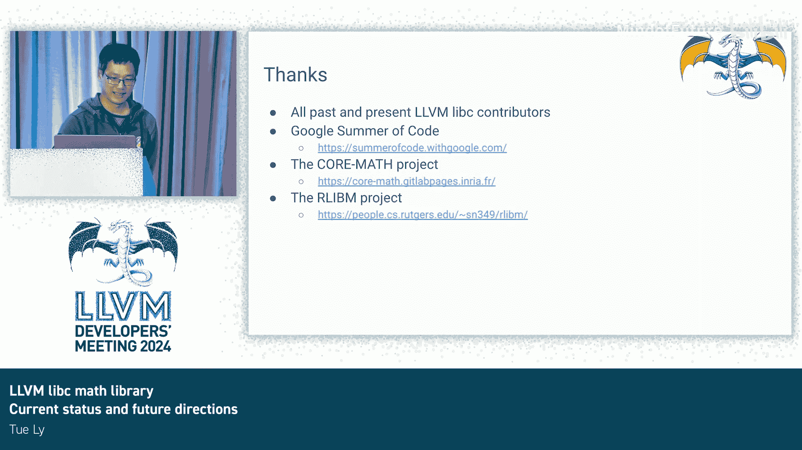

# 004：当前状态与未来方向

## 概述

在本教程中，我们将学习 LLVM libc 数学库的当前状态与未来发展方向。我们将了解其目标、实现特点、性能表现以及对最新 C23 标准的支持情况。

## 什么是 LLVM libc？

LLVM libc 是 C 标准库的一个实现，属于 LLVM 项目的一部分。它专注于实现最新的 C23 标准，并填补 POSIX 等其他用户所需的功能。实现语言主要为 C++，并辅以少量汇编代码。

## 项目目标

我们的目标是完整实现 C23 标准。一个更宏大的目标是提供一个“通用 libc”，使其能在任何你关心的操作系统、现代 CPU 或嵌入式系统上运行。我们也在 GPU 上开展工作。

## 数学函数实现特点

我们正在实现所有 C23 数学函数，首要关注点是**精度**。当然，为了使其随处可用，我们也需要**性能**。此外，还有**可移植性**和**可配置性**，因为我们知道没有一种方案能适合所有人。当前我们主要遵循的浮点标准是 IEEE 754-2019。

### 关于精度

我们致力于使数学函数尽可能精确，最终目标是使其在所有舍入模式下都能正确舍入。目前，我们已在 x86-64 的 4 种默认舍入模式下进行了测试。正确舍入的数学函数将带来**一致性**，这种一致性将跨越所有平台、CPU 和操作系统。这能显著减少将新库版本集成到应用程序中的工作量。

### 关于性能

许多人在谈论精度时会担心性能。那么，为了达到这种精度，我们付出了什么代价呢？事实证明，代价并不大。总体而言，在延迟方面，我们平均比 Glibc 快约 15-16%。在吞吐量方面，我们平均比 Glibc 快约 25-30%。这有助于大幅降低机器学习和 AI 的计算成本。

### 关于可移植性

我们的大多数函数实现都是平台无关的，使用 C++ 编写。得益于当前的努力，它可以在没有任何浮点单元甚至浮点运行时库支持的平台上构建。我们拥有构建通用软浮点库所需的所有组件。

### 关于可配置性

我们在构建时提供对多种用例的支持。你可以创建自己喜欢的数学函数集。我们还提供一些优化选项，例如禁用 NaN 处理、指定舍入模式以及优化代码大小。我们也可以允许你通过跳过最终精度提升步骤来降低一些精度，以换取性能。

## 对 C23 标准的支持进展

在 C23 中，新增了高精度类型（如 `float16_t` 和 `float128_t`）以及对固定点数的支持。我们已经完成了所有浮点类型的基本数学运算实现。目前，我们已实现大约四分之一的超越函数，并且所有已实现的函数在我们测试的舍入模式下都能正确舍入。

### 高精度类型支持

*   **`float16_t`**：这是 C 标准指定的新类型。它在未来硬件上具有巨大的性能潜力，也非常适用于其他小型平台。
*   **`float128_t`**：C23 将其指定为 `_Float128`。实际上它比听起来更复杂，但 `float128_t` 是确保跨平台一致性的一个很好的选择。
*   **固定点类型**：这是 2008 年作为嵌入式处理器扩展指定的。当适用时，它能提供显著的加速和代码大小缩减。Clang 和 LLVM libc 是目前唯一开箱即用支持固定点的开源选项。

## 近期与远期规划

在近期，我们希望完成所有 C23 数学函数的实现，并开始支持复数运算。我们还需要确保所有其他平台都能获得与当前 x86-64 平台同等的优先级支持。

更长远来看，我们将持续为不同目标优化性能和代码大小。我们计划启动向量数学库（libmvec）的工作。此外，我们还将支持 C++26 的 `constexpr` 数学函数，并探索对其他浮点类型（如 `bfloat16` 或 Intel 80 位浮点）的支持。

## 总结

本节课我们一起学习了 LLVM libc 数学库的现状与未来。我们了解到它是一个追求高精度、高性能、可移植和可配置的 C 标准库数学实现，正积极跟进 C23 标准，并规划了包括向量化支持在内的未来发展路线。