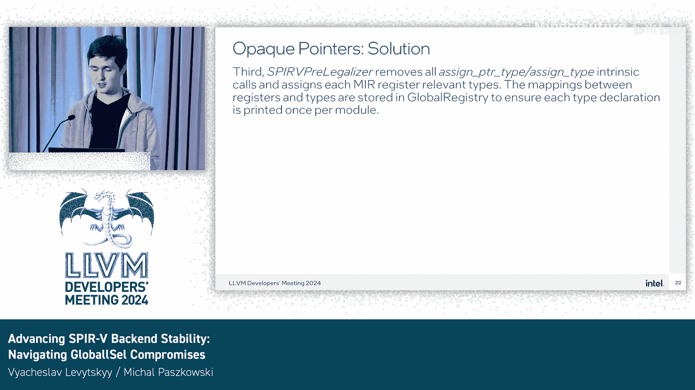

# 005：提升后端稳定性与应对 GlobalISel 的挑战 🧩

在本教程中，我们将学习如何将高级的 LLVM IR 稳定地翻译为 SPIR-V 中间语言。我们将探讨 SPIR-V 后端开发的核心挑战，特别是在使用 GlobalISel 框架时遇到的语义鸿沟问题，并介绍一系列实用的解决方案和权衡策略。

---

## 概述：SPIR-V 后端的目标与挑战

SPIR-V 是一种用于表示图形着色器阶段和计算内核的中间语言。其规范由 Khronos Group 驱动，后端由 Khronos 成员公司开发。SPIR-V 是一个可移植、稳定、跨供应商的程序表示，其作用类似于 LLVM IR，旨在使开发者从供应商特定的指令集和前端语言中抽象出来。

将 LLVM IR 映射到 SPIR-V 的主要挑战在于，两者都是高级表示，但 SPIR-V 是一种语义丰富的语言。这个任务更像是“翻译成 SPIR-V”，而非传统的“指令选择”，因为它并不总是遵循常规的指令选择转换和机器码验证的期望。

另一个关键挑战是 SPIR-V 不代表任何真实的硬件。它是一个可移植的、与供应商和硬件无关的抽象目标。因此，我们期望 SPIR-V 代码稍后被翻译成加速器指令集，或者可以编码回 LLVM IR。这意味着我们不需要寄存器分配和调度，并将硬件相关的优化推迟。

---

## 类型系统的鸿沟与映射策略 🔍

上一节我们介绍了 SPIR-V 后端的基本目标，本节中我们来看看类型系统带来的核心挑战。

SPIR-V 拥有丰富的类型系统，包括指针类型、数组、结构体等。相比之下，LLVM IR 的低级类型（如 `i32`、`i64`）设计用于机器指令和低级语言，所有复杂类型都被分解并简化为最小信息。

为了将原始的 IR 类型关联到最终的 SPIR-V 类型，我们实施了两项操作：
1.  用注解来丰富 IR 类型。
2.  追踪 `Value` 之间的关系，推导隐式存在的类型，并显式地链接 IR 值和 SPIR-V 类型，因为代码生成器不会跟踪每个 `Value` 关联的类型。

我们通过寻找已知模式来关联值和显式类型，分析复合体和函数调用，并在所有函数处理完毕后重新审视不完整的类型。后端使用一个全局状态来追踪关联，并引入内部服务内部函数（intrinsics），以保留代码高级视图与其低级表示之间的链接。

---

## 聚合体（Aggregate）降级的挑战与解决方案 🧱

聚合体（如结构体）的降级是展示技术权衡解决方案的一个很好例子。

GlobalISel 预期物理寄存器的出现。然而，SPIR-V 没有指令集架构，它期望单个 `Value` 代表一个聚合体，并且不会被分解成低级类型。当一个聚合体参数在 IR 翻译器中被扁平化时，会产生多个 `Value`，这使得调用无法被翻译。

初始方法是移除聚合体，将调用变异为用 `i64` 替换聚合体，并记录这些更改，以便稍后存储一个有效的类型。但这种方法的缺点在 SPIR-V 测试套件中显现出来：由于普遍存在的类型 `i64`，在 IR 翻译器之前无法推导和存储正确的类型。

为了测试正确的聚合体类型，我们使用完全变异来在类型推断期间获取原始函数类型。但这并没有消除根本原因。例如，带有溢出的算术内部函数（intrinsic）就很好地演示了这个问题，因为代码生成管道可能在后期插入它们，而后端传递无法变异该调用，并且它们返回一个结构体而不是 `i64`。

翻译器没有为用于将高级值映射到 `Value` 的后端内部函数提供特殊翻译。一个后端服务调用对翻译器来说是一个未知的内部函数。因此，当 LLVM IR 被映射到 `Value` 时，聚合体被扁平化，产生多个 `Value`，这样的调用将不会被翻译。

我们有哪些选择？
以下是几种可能的解决方案：

*   **手动展开内部函数**：提前将它们翻译成等效的 IR。这可行，但忽略了通用的共享代码，并且当我们希望修改全局的 ISel 逻辑时，这不是一个可取的方案。
*   **采用自定义调用降级**：这将使解决方案复杂化，无论是在开发还是维护方面。
*   **改进现有方法**：我们最终选择了一个成本更低的解决方案。后端利用 LLVM 的 `fake use` 内部函数来追踪聚合体参数的原始 IR 值。这链接了代码的高级视图与其低级表示。我们还插入后端内部内部函数，在元数据中存储 IR 值的名称和原始类型，否则这些信息将被丢弃。

这些问题在此案例中得到了解决，我们重用了代码生成逻辑，避免了维护目标无关更改的负担，也避免了开发自定义代码降级的开销。

---

## 控制流处理的特殊性 🌊

控制流处理也存在特殊性。与 IR 类似，SPIR-V 也有函数、基本块等模型，但 SPIR-V 没有“调用单元”（call units）。GPU 特定的编译器希望看到控制流图（CFG）结构。计算着色器（Compute flavor）能解决这个问题，但着色器（Shaders）需要结构化的控制流。

一个常见但出乎意料的点是：在 SPIR-V 中，**标签（Label）实际上是一条指令**，它开始一个逻辑基本块。此外，根据规范，在无条件分支之后不能删除指令，因为它是块中的最后一条指令。SPIR-V 中没有指令来编码“if-then-only-else”结构。

因此，我们不允许像分支折叠、if 转换这样的分支优化来重构块，因为这可能会破坏结构化的控制流，而且无论如何，这种优化用处不大。

---

## 具体案例分析与解决方案 💡

现在，我们通过几个最近的 Pull Request 来简要演示具体问题。

**案例一：标签打印问题**
`AsmPrinter` 被硬编码为忽略目标中可能不存在的“标签”概念。为了保持打印器对目标的不可知性，它总是在函数末尾存在有效分支指令时为其创建一个符号。解决方案是检查目标格式，并授予目标决定是否不同的权利。我们检查格式，但通常，“标签”概念是在目标级别定义的。

**案例二：指针类型推断与位转换（Bitcast）**
一个更复杂的例子涉及指针类型推断。在左侧的 IR 中，有两个指针被推断为 `i8` 和 `i32` 类型。IR 没有显式的指针类型，但通过 `alloca`、函数返回和赋值的链，可以进行类型推断。在 `phi` 节点处，传入的 `%r1` 和 `%r2` 值的类型必须相同。

在右侧的后端代码中，我们看到在赋值和 `phi` 节点之间插入了一个位转换（bitcast）。这在 LLVM 中是一个无操作（no-op）指令，但对 SPIR-V 验证器来说并非如此。没有这个位转换，验证器会处理不一致的显式类型。机器码验证器会验证 `G_BITCAST`，并看到错误：“bitcast 必须改变类型”。对于 SPIR-V，我们确实要求位转换来改变指针类型。

鉴于我们不能对操作码施加可选限制，我们仍然可以使其依赖于目标。可以考虑添加一个虚拟调用来微调降级过程，后端可以实现其目标降级规则并覆盖无操作位转换的默认状态。目前，我们所能做的就是选择一种错误类型：要么由于 `phi` 中的类型不匹配而无效，要么在指针上使用 `G_BITCAST`。

**案例三：Phi 节点处理**
更重要的是关于 `phi` 节点的例子。在 SPIR-V 中，`OpPhi` 就是 `phi` 节点。它开始一个基本块，每个前驱块有一对传入值和标签。在指令选择步骤之后，`G_PHI` 操作码变为 `OpPhi`，验证器开始报告“定义不支配所有使用”的问题。

问题在于，传统指令集不实现 `phi` 指令，但 SPIR-V 实现。可能的解决方案是让代码生成器不检查 `phi` 指令，或者允许我们覆盖该检查，引入一种检查机制来判断操作码是否代表 `phi` 指令。

我们提出了三种情况：
1.  首先，接受 SPIR-V 是不同的。
2.  其次，机器验证器迫使我们适应一个不可行的方案。
3.  一个有些可疑的修复方法（不修改 ISel）是直接生成 `OpBitcast`，而不重用 `G_BITCAST`。这需要在翻译前访问 IR 并将原始位转换转换为调用点，带来开销。同时，在这种情况下，我们不重用共享的代码数据库，并忽略现有的位转换操作码。

这个简短的案例对指令选择本身的定义提出了质疑。理论上，指令选择会产生目标特定的机器指令，而 SPIR-V 是一个后端。根据规范，SPIR-V 在函数的 SSA 图中实现了 `phi` 节点。因此，在指令选择之后报告目标规范认为有效的内容似乎是一个问题。

---

## 应对不透明指针（Opaque Pointers）的过渡 🔄

首先，我们讨论一下向 LLVM 17 中不透明指针过渡带来的一些挑战。虽然不透明指针简化了 LLVM IR 的某些方面，但这一过渡给 SPIR-V 代码生成带来了独特的挑战。

在 SPIR-V 中，指针元素类型不仅用于发出必要的类型声明，而且对于解析 OpenCL 内置类型和函数调用、保留正确的指针类型，以及降级未在 SPIR-V 中扁平化的嵌套类型（如结构体或数组）都至关重要。现在，没有了显式的指针类型，SPIR-V 后端必须推导这些类型，并且必须在编译管道的早期就正确获知。

为了确保我们恢复并保留这些类型，我们有三个相互协作的传递（passes），在代码生成的不同阶段工作，以解决 GlobalISel 降级和扁平化带来的问题。

让我们关注第一个传递：`SPIRVEmitIntrinsics`。
类型推断过程是逻辑性的，但非线性且通常是嵌套或递归的。首先，类型从常见指令（如 `G_PTR_ADD` 或 `G_LOAD`）中推导出来。对于每个类型赋值，该传递会发出一个目标内部函数：`spv_assign_ptr_type` 或 `spv_assign_type`（在 OpenCL 或 SPIR-V 内置函数的情况下）。然后，该传递遍历调用并调整操作数类型，当被调用函数内部期望不同类型时，发出 `spv_ptr_cast` 内部函数。随后，`SPIRVEmitIntrinsics` 传递尝试推导剩余函数的类型，并在最后重新访问每条指令以修复任何不一致之处，或者换句话说，经常只是注入新的指针请求。

需要注意的是，这个过程非常复杂，有时是主观的。例如，`phi` 节点可能具有不同指针元素类型的传入值。当这种情况发生时，出现最频繁的类型会被分配。另外，一些 OpenCL 或 SPIR-V 内置函数具有众所周知或预定义的类型，在这些情况下，该传递使用带有硬编码值的查找表。

在 `SPIRVEmitIntrinsics` 和 IR 翻译器之后，我们有一个 `SPIRVCallLowering` 传递。SPIR-V 标签声明或类型也在定义函数的指令序列中被引用。因此，该传递尝试合并序列，使用通过 `spv_assign_type` 或 `spv_assign_ptr_type` 内部函数分配的类型。一个例外是 OpenCL、GLSL 或任何 SPIR-V 内置函数调用的情况，我们在模块中只有一个存根（stub）。在这些情况下，调用通过使用一个 TableGen 文件进行反混淆（demangle），SPIR-V 内置类型和正确的实现（包括返回和函数参数类型）被发出到机器模块中。

在这两个传递之后，最后我们有一个 `SPIRVPreLegalizer` 传递，顾名思义，它在合法化之前运行。该传递从机器模块中移除所有 `spv_assign_ptr_type` 和/或 `spv_assign_type` 内部函数，并将每个机器 IR 寄存器映射到相关类型。这些映射存储在一个全局注册表中，以确保没有重复的类型声明，并且每个后续传递都可以使用全局注册表来获取现有类型或创建新类型。这不仅适用于指针，也适用于任何类型。

---

## 目标扩展类型（Target Extension Types）的作用 🎯

一个重要注意事项是，SPIR-V 有多种类型，例如 `OpTypeImage` 或 `OpTypeEvent`，它们在 LLVM 16 中以前被表示为指向不透明结构体的指针。得益于 Joshua 的贡献，引入了一种新的目标扩展类型（Target Extension Type），以在某种意义上被目标无关优化忽略的同时，保留这些类型。这对于像 SPIR-V 这样的目标很重要，对于 DXIL 和其他在代码生成管道中需要更复杂自有类型的后端也很重要。

然而，一个缺点是，由于不透明指针的过渡，这些后端现在与来自旧版本 LLVM 的 IR 真正不兼容了。目标扩展类型的另一个用例是表示来自 SPIR-V 图像和采样器路径的嵌套类型，而不是依赖无法用于创建值的类型化指针类型作为起点。

---

## 测试策略与未来展望 🧪

回归测试（Lit tests）在不透明指针过渡中非常有帮助，其数量已显著增加。我们将其视为最重要且最简单的调试方法或捕捉回归的方法。这与通常依赖特定硬件或需要专用驱动程序栈的外部一致性测试套件形成对比。

我们已扩展了大多数回归测试，添加了 `spirv-val` 检查行。因此，每个测试的 SPIR-V 输出都被传输到 Khronos 的 SPIR-V 验证工具中，以确保二进制文件符合规范。此外，Nathan 贡献了一个名为 `spirv-sim` 的工具，用于测试当前正在开发的 SPIR-V 结构化器（Structurizer）传递。该工具专注于控制流和跨通道交互，最重要的是，它比简单的 FileCheck 行更健壮。当然，FileCheck 仍然可以用于这些测试，但检查行的顺序需要始终匹配 CFG 的输出，而不是 IR，这意味着任何修改这些测试的贡献者都需要具备相关知识并进行正确的调整。`spirv-sim` 帮助我们避免了影响后端的更改所产生的连锁反应。

SPIR-V 后端在过去两年中发生了很大变化，在许多方面是 Khronos LLVM-SPIRV-Translator 更好的替代品，通常能提供更简洁或性能更好的代码。因此，下一步自然是**将 SPIR-V 后端确立为官方或非实验性目标**。我们将在开发者会议之后跟进此事。我们也希望在不久的将来贡献 SPIR-V 消费者（consumer）部分。

---

## 总结 📚

本节课中我们一起学习了 LLVM SPIR-V 后端开发的核心内容。我们探讨了将高级 LLVM IR 翻译到语义丰富的 SPIR-V 所面临的主要挑战，特别是类型系统映射、聚合体降级和控制流处理方面的难题。我们深入分析了几个具体案例，展示了如何通过引入内部函数、改进现有逻辑等方式解决这些问题。我们还讨论了向不透明指针过渡带来的影响，以及如何利用目标扩展类型和增强的测试策略来确保后端的稳定性和正确性。最后，我们展望了将 SPIR-V 后端确立为官方目标以及开发 SPIR-V 消费者工具的未来方向。