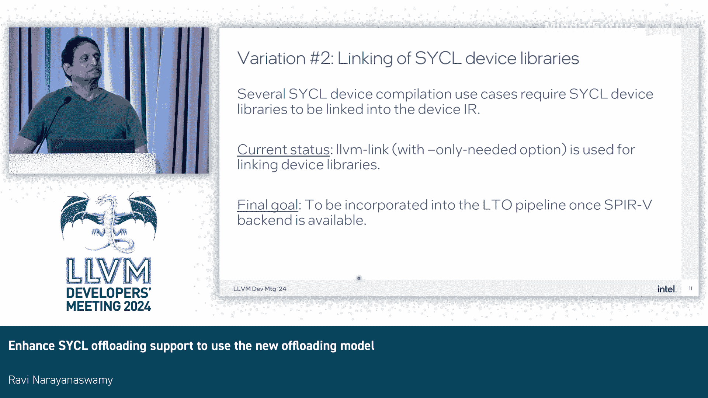

# 006：使用新型卸载模型增强SYCL卸载支持


在本节课中，我们将学习如何为SYCL编程模型增强卸载支持，使其采用社区中已广泛使用的新型卸载模型。我们将概述SYCL卸载的基本原理，探讨新模型的设计方案，分析其与现有社区方案的差异，并介绍当前的工作进展与未来计划。

## SYCL卸载概述

SYCL是为数据并行和异构计算设计的编程模型。它基于C++提供了一致的编程接口，允许开发者编写适用于CPU、GPU、FPGA和AI加速器的代码。编译器通常涉及至少一次主机编译和针对每个指定目标的一次设备编译。

以下是一个简单的SYCL程序示例：

```cpp
#include <sycl/sycl.hpp>
sycl::queue q;
float *data = sycl::malloc_device<float>(N, q);
q.memcpy(data, host_data, N * sizeof(float)).wait();
q.parallel_for(N, [=](sycl::id<1> i) { data[i] += 1.0; }).wait();
```

该程序展示了在设备上分配内存、传输数据并提交内核执行的基本流程。黄色高亮部分即为SYCL内核。

## 新型卸载模型的设计

上一节我们介绍了SYCL的基本概念，本节中我们来看看新型卸载模型的具体设计。该模型将编译和链接过程分离，以实现更灵活的代码生成和处理。

### 编译阶段

使用Clang编译SYCL程序时，会进行两阶段编译。第一阶段生成主机目标文件，第二阶段生成设备中间表示。

编译命令示例如下：
```bash
clang++ -fsycl -fsycl-targets=spir64 my_program.cpp
```
此命令会为指定的SPIR-V目标生成代码。

在编译阶段，设备IR会通过`clang-offload-packager`工具打包，并可使用`-fembed-offload-object`选项嵌入到主机目标文件中。

### 链接阶段

链接阶段使用称为`clang-linker-wrapper`的工具。以下是链接过程的核心步骤：

1.  从包含主机和设备代码的“胖”目标文件中提取设备代码（LLVM IR）。
2.  链接所有必需的设备库，生成完全链接后的设备LLVM IR。
3.  执行SYCL后链接步骤，其关键功能之一是代码分割。

以下是代码分割的主要原因：
*   **功能隔离**：将每个内核分割到独立的镜像中，便于管理。
*   **条件执行**：根据内核特性（如是否使用FP64）分割，以便在运行时根据硬件能力选择合适的内核。
*   **减少JIT开销**：仅编译实际使用的内核，而非整个镜像中的所有内核。
*   **并行AOT编译**：分割后可以并行调用后端编译器，减少编译时间。

4.  使用`llvm-spirv`工具将LLVM IR转换为SPIR-V格式。若用户指定，则在此阶段调用AOT编译器生成设备镜像。
5.  使用`clang-offload-wrapper`工具将所有设备镜像（或单个镜像）打包成一个文件。
6.  最后，调用主机链接器，将主机代码和包含设备镜像的目标文件链接成最终的可执行文件。

我们计划将上述链接阶段中高亮部分的功能迁移到一个新的子工具中，称为`clang-sycl-linker`。

## 与现有社区方案的差异

上一节我们介绍了新模型的设计流程，本节中我们来看看它与现有社区方案的主要区别。这些差异是为了更好地适应SYCL的特性和Intel的硬件支持。

1.  **使用LLVM链接器**：目前使用`llvm-link`进行设备代码链接，而非LTO位码链接。未来SPIR-V后端就绪后，将切换至使用ThinLTO或LTO。
2.  **链接时链接设备库**：在链接时使用`llvm-link`按需链接设备库，而非在编译时链接。未来同样计划整合到LTO阶段。
3.  **向运行时传递信息**：需要将编译信息（如优化标志`-O0`）从设备镜像传递到运行时，以确保JIT编译时使用正确的选项。我们使用字符串数据映射来存储这些信息。
4.  **内核属性传递**：SYCL语言规范要求传递内核属性（如是否使用FP64）。我们同样使用字符串数据映射，通过`device_image_property`结构（包含名称、值、类型和大小等字段）来存储，以便运行时在JIT前检查硬件兼容性。
5.  **代码分割**：如前所述，出于功能隔离、条件执行和性能考虑，我们在SYCL后链接阶段执行代码分割。
6.  **使用外部工具转换SPIR-V**：目前使用外部的`llvm-spirv`工具将LLVM IR转换为SPIR-V。未来直接生成SPIR-V代码的backend可用后，将移除对此工具的依赖。

## 当前进展与未来计划

我们已经为支持完整的SYCL编程模型提交了RFC，并设计了针对SPIR-V目标的SYCL卸载方案。相关演讲已在EuroLLVM 2024会议上分享。

代码贡献方面，已提交两个主要的PR：
*   添加SYCL设备库。
*   引入SYCL链接包装器（`clang-sycl-linker`）。

感谢社区成员Joseph、Matt、Chris和Tom的宝贵反馈与帮助。

接下来的工作计划包括：
1.  在SYCL链接器包装器中添加运行SYCL最终步骤的逻辑。
2.  修改`clang-linker-wrapper`，使其通过调用Clang并传递`-sycl-link`选项来调用SYCL链接器。
3.  在`clang-linker-wrapper`中添加SYCL卸载逻辑。
4.  为Intel、AMD、NVIDIA等目标添加AOT编译支持（目前仅支持Intel GPU的JIT）。
5.  待SPIR-V后端就绪后，更新工具链以直接使用SPIR-V，并转向使用LTO。

## 总结

本节课中我们一起学习了SYCL卸载模型如何迁移到新型社区标准模型。我们回顾了SYCL卸载的流程，深入探讨了新模型在编译、链接、代码分割和信息传递方面的设计，分析了其与现有方案的差异及原因，并了解了当前的工作进展与未来的整合方向。最终目标是构建一个高效、灵活且与上游社区模型兼容的SYCL卸载实现。

---
**问答环节摘要**

*   **问**：关于使用LTO，SPIR-V是否有定义的链接规范？最终目标是否是像WebAssembly那样拥有`lld -sycl`或`ld.lld -spv`？
    *   **答**：这是计划中的目标。但目前没有专门的SYCL链接器，因此暂时使用`llvm-linker`。
*   **问**：为什么需要创建一个独立的新工具（`clang-sycl-linker`），而不是作为上游现有工具的一部分？
    *   **答**：为了与现有对NVIDIA和AMD等目标的卸载支持模式保持一致，避免过度偏离社区做法。`clang-linker-wrapper`的接口旨在调用Clang为GPU目标生成有效的镜像，为SYCL创建专用工具符合这一设计思路。未来可能演变为`lld-spv`这样的工具。



