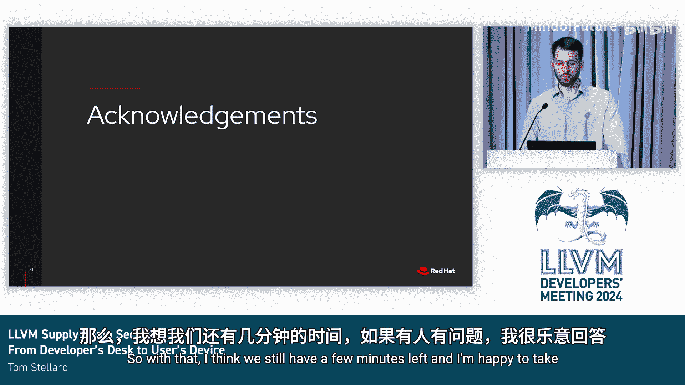

# 007：从开发者桌面到用户设备


## 概述

在本教程中，我们将探讨 LLVM 项目的软件供应链安全。我们将从代码的源头（Git 仓库）开始，一直追踪到代码最终运行在用户设备上的整个过程，分析其中存在的安全风险，并讨论如何通过改进策略和流程来加强整个链条的安全性。

---

## 1：软件供应链安全简介

上一节我们概述了本教程的内容，本节中我们来具体看看什么是软件供应链安全。

软件供应链是指代码从开发者编写开始，到最终在用户设备上运行的整个过程。供应链安全的核心目标，是确保代码在这个传递过程中不被篡改。

这个概念不仅适用于软件世界，对于实体产品同样重要。有时通过实体产品的例子更容易理解。

**一个实体产品的例子：**
假设有一家公司生产世界上最安全的锁。他们将锁和钥匙装入盒子，用卡车运往商店。途中，司机在酒店过夜时忘记锁车。小偷潜入卡车，打开所有盒子，复制了钥匙，再把原钥匙放回。最终，消费者买到的锁虽然本身坚固，但小偷手中的复制钥匙可以轻易打开它。

这个例子说明了供应链安全的重要性：即使产品本身是安全的，如果运输过程（供应链）存在漏洞，整个系统的安全性也会崩塌。

对于像 LLVM 这样被数百万甚至数十亿设备使用的软件，我们不仅要确保软件没有缺陷，还必须保证它在传递过程中没有被篡改。想象一下，如果有人通过供应链攻击在大多数手机中植入后门，其破坏性将难以估量。

---

## 2：LLVM 的软件供应链

上一节我们介绍了供应链安全的基本概念，本节中我们来看看 LLVM 项目的具体供应链流程。

下图描绘了 LLVM 的软件供应链：
1.  **起点**：开发者直接向 Git 仓库提交代码，或通过拉取请求（Pull Request）提交。
2.  **主分支**：代码进入 Git 仓库的主分支。
3.  **发布分支**：定期从主分支创建发布分支，以提供更稳定的代码版本。
4.  **打包分发**：基于发布分支，代码被打包成源代码压缩包和二进制文件分发给用户。

通常，代码在流水线中移动时会受到更严格的审查。例如，合并到主分支的代码可能经过（也可能没有经过）审查或 CI 测试。合并后，总会运行提交后 CI 测试来验证正确性。代码也可能在提交后被审查。一旦代码进入发布分支，管控会更加严格，任何新更改都需要审查者和发布经理的批准。只有发布经理有权向发布分支提交代码。

虽然随着代码在流水线中移动，审查力度会增加是好事，但必须记住 LLVM 的供应链并非一个简单的、只有一个起点和终点的管道。

**一个重要事实是：** 人们几乎从流水线的每一步都在使用我们的代码。有些人（可能是大多数人）直接从主分支获取代码，有些人从发布分支获取，还有些人使用我们发布的资源（如压缩包和二进制文件）。记住这一点至关重要，因为如果我们只为发布分支增加安全措施，对于那些直接从主分支拉取代码的人来说并无帮助。

---

## 3：保护 Git 仓库

上一节我们梳理了 LLVM 的供应链，本节中我们聚焦于供应链的起点：如何保护 Git 仓库的安全。

Git 仓库是代码的起点，也是所有分发 LLVM 的参与者共有的供应链环节。

### 保护 Git 仓库的方法

以下是几种保护 Git 仓库安全的主要方法：

1.  **限制提交权限**
    *   **做法**：要获得 LLVM 项目的提交权限，只需满足两个要求：1) 提出申请；2) 提供一个理由（例如“我刚提交了第一个 PR，需要权限来合并它”）。
    *   **现状**：可以说，我们项目获得提交权限的门槛相当低。没有贡献数量或时间的要求。

2.  **制定提交规则**
    *   **做法**：我们有一些项目级的策略，规定允许提交什么以及何时提交。例如，重大更改需要提交 RFC 提案；较小的更改可能需要提交前审查；通常 CI 测试应该通过。
    *   **问题**：这些规则主要是“被动执行”的，即仅通过政策来执行。如果有人违反规则，可能有人会发现并要求其回退，但没有技术屏障能实际阻止人们违反这些规则。我们严重依赖庞大的开发者基础来手动检查仓库、拉取请求和 CI 运行，以确保规则被遵守。

3.  **提交后审查**
    *   **做法**：这是一种被动安全措施，主要由关注各种提交邮件列表的人进行，他们会审查对自己重要的补丁。
    *   **挑战**：在项目规模较小时这很常见，但现在我们每天在提交列表上会收到超过 1000 封邮件，这使得这种审查变得非常困难甚至不可能。

**总结当前 Git 仓库的安全状况：**
*   任何人都可以获得提交权限。
*   几乎任何时候都可以提交。
*   我们的政策主要依靠人工手动执行。

这引出了一个关键问题：**我们是否在晚上“没有锁车”？** 看起来可能是的。

---

## 4：谁应该关心以及潜在风险

上一节我们分析了 Git 仓库的安全现状，本节中我们来探讨如果安全措施不足，谁会受到影响以及可能面临哪些风险。

每个人都应该关心供应链安全。请思考你如何构建你的产品：

*   **恶意代码的影响**：如果恶意代码被推送到 LLVM 项目的主分支，它多快会进入你的构建流水线？在上游社区有人注意到问题之前，你将其拉取到自己的构建环境中会有多少时间？
*   **构建流水线的安全**：如果你直接从主分支构建，请记住，你正在执行不受信任的代码。你的系统是否针对此进行了加固？我们上游的被动策略可能无法保护你免受攻击。
*   **具体场景**：如果你在每个星期二午夜从主分支拉取代码，而有人在 11:55 推送了恶意代码，会发生什么？

风险远不止于你的构建流水线。即使你只是运行 CI（无论是内部系统还是发布在 Buildbot 网页上的系统），如果主分支被推送了恶意内容，你的系统也可能面临风险。

**执行构建脚本时，它有能力在你的系统上运行任意命令。** 攻击者可以轻易修改 CMake 文件来启动 SSH 服务器、下载安装恶意软件，或者更糟的是——修补编译器，在编译器本身或编译器构建的任何产品中插入后门。这类编译器后门尤其难以追踪。

**再次总结风险：**
*   我们向任何申请者授予提交权限。
*   我们没有技术屏障来防止人们未经审查直接推送到主分支。
*   我们的构建和 CI 系统可能面临被入侵的风险。
*   我们的产品可能被插入后门。

这一切听起来很糟糕。我们怎么会错得这么离谱？实际上，我认为我们并没有做错什么。在项目历史上，我们只是优先考虑了安全之外的其他事情。

---

## 5：历史背景与改进思路

上一节我们看到了潜在的风险，本节中我们来分析这些策略形成的原因，并探讨可能的改进方向。

我们当前政策的主要原因是：我们希望让新贡献者尽可能容易地参与，并给予有经验的贡献者改进代码的灵活性。这个政策总体上对项目非常有利：项目快速增长，每天约有 100 次提交，每月有超过 600 位独立贡献者，开发者会议有近 500 名参与者。

但现在可能是时候重新审视一些政策，看看我们能否在满足其他项目目标的同时，改善项目的供应链安全。

### 针对新贡献者体验的考量
在项目早期（使用 SVN 甚至 CVS 时），新贡献者如果没有提交权限，流程会非常繁琐：需要将补丁发送到邮件列表，说服审查者下载、应用并推送。这可能导致数天甚至数周的延迟。因此，当时快速分发提交权限确实节省了大家的精力，改善了新贡献者体验。

然而，如今技术已大大改进：我们可以一键合并新贡献者的拉取请求。但我们的政策却保持不变。

### 针对有经验贡献者的考量
我们仍然希望给予他们工作上的灵活性。我们能否定义不同类别的贡献者，并给予有经验的贡献者更多权限？

### 可能的改进措施
以下是一些可能的改进方向：

*   **对新贡献者要求提交前审查**。
*   **增加获得提交权限的要求**，例如要求一定数量的补丁被合并，或自首次提交后经过一定时间。
*   **强制要求提交前 CI 通过**，甚至可以在拉取请求通过 CI 之前禁用合并按钮（尽管这面临 CI 不一致等挑战）。

### 如何提供帮助
在保护 Git 仓库方面，你可以通过以下方式提供帮助：

1.  **分享你的想法**：如果你发现问题，请提交错误报告或在 Discourse 上发帖。不一定需要完整的 RFC，有时仅仅是发起讨论就能带来改进。
2.  **审查内部流程**：如果你有内部流程，请理解你可能存在的漏洞，并告诉我们上游可以做什么来帮助你保持安全。

---

## 6：保护拉取请求与 CI 基础设施

上一节我们讨论了 Git 仓库的改进思路，本节中我们来看看与 Git 仓库紧密相关的部分：如何保护拉取请求和 CI 基础设施的安全。

对于拉取请求，关键问题是如何保护我们的基础设施，主要是 CI 基础设施，如 GitHub Actions、Buildkite 和 Buildbot。

我们首先关注 **GitHub Actions**，因为由于 GitHub Actions 工作流可能拥有的访问权限种类，这里是项目本身最脆弱的地方。保护 Buildkite 和 Buildbot 系统也很重要，但通常那里的漏洞只影响运行任务的机器或网络。而 GitHub Actions 的漏洞可能导致权限升级，允许攻击者获得对仓库的写入权限，这非常危险。

### GitHub Actions 简介
对于不熟悉的人来说，GitHub Actions 允许你在 GitHub 基础设施或自己的自托管机器上运行自动化任务。工作流定义用 YAML 编写，每个文件对应一个工作流，每个工作流可以包含多个任务。任务可以通过多种方式触发，不仅限于拉取请求。

### 安全核心：GitHub Token
在保护仓库安全方面，最需要关注的是 **GitHub Token**。这是赋予每个任务的唯一令牌，授予任务与仓库交互的权限。除了这个令牌，工作流还可以定义特殊的 **Secrets**（可以是访问令牌或其他东西），这些可能拥有比普通 GitHub Token 更高的权限。

### GitHub Actions 的风险类型
我们需要警惕几种风险：

1.  **令牌/Secret 泄露**：可能导致某人获得对仓库的提升权限。
2.  **拒绝服务攻击**：例如，有人可以打开 1000 个拉取请求，使我们的 CI 过载。
3.  **资源窃取**：有人可能接管我们的 Actions 流水线，用于加密货币挖矿或其他资源密集型任务。

本教程主要关注 **令牌泄露**，因为这里我们的供应链风险最高。

### GitHub Token 与 Secrets
GitHub Token 可以用来创建问题、为拉取请求添加标签、合并拉取请求，甚至将代码推送到主分支。只要存在相应的 REST API，它几乎可以用于 Git 仓库的任何操作。

我们可以为每个任务配置权限。通常我们将默认权限定义为只读，然后根据需要添加额外权限。GitHub Token 的一个安全特性是它在任务完成后过期，这增加了利用难度。

但有一个注意事项：由 GitHub Token 发起的事件不会触发新的工作流运行。

### Secrets 的使用
Secrets 允许工作流链式触发（这是我们使用 Secrets 的主要原因之一）。另一个使用场景是当需要某种额外权限组合时。Secrets 也可以是任何类型的秘密值，如部署 Python 包或安全密钥。

我们尽可能避免使用 Secrets，因为任何拥有提交权限的人都可以很容易地看到它们。而且与 GitHub Token 不同，Secrets 不会在任务结束时过期。通常我们每月轮换一次 Secrets，但如果有人获得访问权限，这仍然给了他们充足的利用时间。

### 真实世界的漏洞案例
令牌或 Secret 泄露是真实存在的威胁，并非理论上的。近期有几个 GitHub Actions 被成功利用的例子：

1.  **PyTorch 项目**：研究人员通过利用其 GitHub Actions 配置获得了项目的写入权限。他们利用了项目使用自托管运行器的事实，通过带有恶意 GitHub Actions 工作流的拉取请求入侵了其中一个运行器，从而窃取了其他任务中的 GitHub Token。
2.  **GitHub Runner 镜像仓库**：使用了类似的技术被利用。这个仓库托管了 GitHub 上所有 Actions 任务安装的镜像，如果攻击者是恶意的，可能造成巨大破坏。
3.  **令牌通过构件上传泄露**：许多仓库通过构件上传工作流泄露了 GitHub Token。问题在于，用于从仓库检出源代码的 GitHub Actions 代码会将 GitHub Token 写入源代码目录的 Git 配置文件中。如果任务打包该目录并上传为构件，就会泄露令牌。GitHub 随后修改了上传操作以忽略 Git 配置目录。**LLVM 项目也曾被发现存在此问题**，但由于遵循了最佳实践，泄露的令牌是只读的，没有构成风险。

### 如何避免这些漏洞
我们可以采用一些最佳实践来保持安全：

*   **优先使用 GitHub Token 而非 Secrets**：GitHub Token 生命周期更短，权限范围有限，危害潜力更小。
*   **使用最小权限原则**：确保 GitHub Token 只拥有完成任务所需的最小权限。
*   **使用临时运行器**：如果必须使用更强大的运行器，请确保使用在每个任务结束后被销毁的临时运行器。
*   **禁用首次贡献者的工作流运行**：LLVM 项目已经这样做了。首次提交拉取请求时，需要审查者或组织成员手动启动相关的 GitHub Actions 工作流，以防止针对多个仓库的自动化攻击。

### 工作流文件示例与权限控制
在工作流文件中，我们总是在顶部定义最小权限，例如：
```yaml
permissions:
  contents: read
```
这确保所有任务默认具有最小权限。如果特定任务需要更多权限，可以在任务级别授予，例如：
```yaml
jobs:
  my-job:
    permissions:
      issues: write
```

### `pull_request` 与 `pull_request_target` 事件
GitHub Actions 支持两种拉取请求事件：`pull_request` 和 `pull_request_target`。它们允许你在不同上下文中处理拉取请求事件。

*   `pull_request`：在**分支（fork）的上下文**中执行工作流。**无法访问**目标仓库的 Secrets，**无法执行**对目标仓库的写入操作，限制非常严格。
*   `pull_request_target`：在**目标仓库的上下文**中执行工作流。**可以访问** Secrets，**可以执行**对仓库的写入操作。

**经验法则**：如果你正在从用户的分支检出代码（例如运行 CI），**绝对不应该**使用 `pull_request_target` 事件，因为这可能将写入权限或 Secret 访问权授予不受信任的用户。

LLVM 仓库中确实有一些工作流使用 `pull_request_target`，但通常被认为是安全的，因为它们只从主分支检出代码。不过，为了更加安全，我们仍然可以将它们移植到 `pull_request` 事件。

### 其他 CI 基础设施
除了 GitHub Actions，我们还有其他 CI 基础设施（如 Buildbot）。同样需要确保它们能抵御不受信任的代码。使用临时节点有助于缓解许多攻击，这不仅适用于公共 CI，也适用于任何内部 CI 系统。

---

## 7：保护流水线的其他部分

上一节我们深入探讨了拉取请求和 CI 的安全，本节中我们来看看如何保护供应链中其他环节的安全。

### 发布分支
我们每六个月创建一个新的发布分支，目标是为偏好稳定代码而非快速迭代主分支的用户提供稳定的代码版本。

在这个分支上，我们有非常严格的提交规则：
*   只有发布经理（目前仅两人）可以提交到此分支。
*   所有更改都通过拉取请求提交，并且必须在审查后才能提交。

### 发布资源
基于发布分支，我们生成一些发布资源：

1.  **发布压缩包**：
    *   使用 GitHub Actions 生成。
    *   由我们的发布经理进行密码学签名。
    *   我们开始使用 GitHub 的新功能 **“Artifact Attestations”** 来为压缩包建立来源证明。

2.  **发布二进制文件**：
    *   与发布压缩包类似，由发布经理签名并使用 Artifact Attestations 建立来源证明。
    *   **一个不同点**：我们允许第三方贡献者提供二进制文件。大多数情况下，这些二进制文件发布在远离我们官方二进制文件的地方。但确实有一些来自受信任第三方的二进制文件被发布在发布页面上。

### Artifact Attestations 简介
Artifact Attestation 是一个 JSON 文件，包含描述构件的多个字段。其中最重要的两个字段是：
*   构建时所检出代码的 **Git 哈希值**。
*   生成该二进制文件的 **GitHub Actions 运行链接**。

在发布页面下载二进制文件时，你会看到旁边有 `.jsonl` 文件，这就是来源证明。你可以下载此文件与二进制文件一起，使用 GitHub CLI 工具来验证该二进制文件确实是由某个 GitHub 工作流生成的。

我们开始这样做的一个原因是：**GitHub 的权限控制不够精细**。任何拥有提交权限的人都可以向发布页面上传资源。这再次表明，获得提交权限会带来很多权限：不仅可以提交代码、查看 Secrets，还可以向发布页面上传文件。

### 如何处理 GitHub 的精细权限问题？
我们有一个审计任务，每小时检查一次上传，以确保只有授权人员上传了二进制文件。我们也考虑过其他解决方案，例如创建一个单独的仓库（如 `llvm-project-releases`）并只给发布经理权限。但问题是，即使这样做，我们也无法关闭主项目仓库中的发布页面，而这仍然是人们首先会去查看的地方，因此我们仍然容易受到恶意上传的攻击。

### 一个相关的 GitHub 问题
请看这个文件链接：`https://github.com/llvm/llvm-project/blob/main/...`。它看起来来自官方仓库，文件名也没问题，似乎很安全。**但实际上并不安全。** 这个文件是用户附加到某个问题（Issue）上的上传文件。任何拥有 GitHub 账户的用户（即使完全无权访问 LLVM）都可以上传这样的文件。

**重要提示**：如果你要下载发布版本或其他构件，请务必前往发布页面获取链接。**不要下载别人给你的链接，无论它看起来多么可信。**

---

## 8：真实攻击案例分析

上一节我们讨论了发布流程的安全，本节中我们通过一个真实发生的供应链安全攻击案例，将之前讨论的要点串联起来。



今年早些时候，**XZ 项目**遭受了一次成功的供应链安全攻击。幸运的是，它被迅速发现，但被入侵的构建版本还是进入了某些流行的 Linux 发行版。

### 攻击步骤
1.  **获取提交权限**：攻击者花了大约 8 个月时间获得提交权限。
2.  **建立信任**：获得权限后，他们在项目中建立信任。
3.  **推送恶意代码**：最终，他们向仓库推送了恶意代码，这些代码隐藏在项目测试使用的某些二进制文件中。
4.  **转移官方资源托管**：他们说服项目将官方发布压缩包的托管从自定义域名转移到 GitHub。
5.  **上传恶意压缩包**：由于拥有提交权限，他们能够向 GitHub 发布页面上传自定义的压缩包。这些压缩包内含额外代码，会在构建 XZ 库时将测试文件中的恶意代码插入其中。

### 恶意代码的作用
由于 XZ 库被某些发行版中的 OpenSSH 使用，该攻击使得恶意代码在每次调用 `RSA_public_decrypt` 函数时都可能被触发。

### 对比分析：这种攻击会发生在 LLVM 上吗？
我分析了促成此次攻击的主要因素，并与 LLVM 项目进行了对比：

| 因素 | XZ 项目 | LLVM 项目 |
| :--- | :--- | :--- |
| **获取提交权限时间** | 约 8 个月 | 通常几天（取决于管理员繁忙程度） |
| **仓库中存在测试二进制文件** | 是 | **是** |
| **强制代码审查** | 没有 | 没有严格的技术强制（主要靠人工监督） |
| **维护者数量** | 主要是一位过度劳累的维护者 | **拥有大量维护者和关注者** |

**LLVM 项目的优势**：我们拥有大量的维护者和利益相关者，有很多双眼睛关注着项目。这增加了攻击不被注意的难度。然而，这并不能抵消我们可能存在的其他问题。

---

## 9：下一步行动与总结

上一节我们通过真实案例看到了风险，本节中我们将探讨 LLVM 项目未来的改进方向，并对本教程进行总结。

我认为我们需要做出一些改变。单独看我们的某些政策似乎没问题（例如，设置较低的提交权限门槛或最少的提交规则）。但当这些因素组合在一起时，就给项目带来了真实的风险。

### 我们可以做什么来改进？
以下是一些可能的改进措施：

*   **实施强制拉取请求**：这有助于提高更改的可见性，并使得在更改被推送前要求 CI 通过或其他要求成为可能。
*   **要求所有更改都经过审查**：可以更进一步。
*   **提高获取提交权限的要求**：减少权限分发。

在考虑这些变化时，我们必须记住要在**便利性**和**安全性**之间取得平衡。我们不希望项目开发因为一堆严苛的安全措施而陷入停滞。

### 给下游用户的建议
如果你是一个下游用户，你必须意识到所有这些风险，并学会保护自己：

1.  **了解你的风险**：理解你的流水线依赖于 LLVM 供应链的哪个部分，以及你面临的风险是什么。
2.  **考虑为上游改进做贡献**：如果这对你很重要，可以考虑为上游的供应链安全改进做出贡献。
3.  **资助相关工作**：你可以雇佣专人全职从事这项工作，或者向 LLVM 基金会捐款。有了足够的资金，基金会或许可以雇佣全职管理员来帮助维护仓库安全。
4.  **权衡成本**：如果你担心成本，请想想如果你的产品被入侵，并向客户或用户交付了恶意软件，代价会有多大。

### 总结
我希望你同意供应链安全非常重要。我们的项目取得了巨大成功，但在供应链安全方面，我们仍在沿用一些旧方法，这增加了遭受攻击的风险。

我们有责任对我们的用户和下游消费者认真对待此事，并努力改善现状。对于任何安全问题，一次成功的攻击都可能带来毁灭性后果，我们必须保持警惕。

---

## 本节课总结

在本节课中，我们一起学习了：

1.  **软件供应链安全**的基本概念及其重要性。
2.  **LLVM 项目具体的软件供应链**流程，从代码提交到分发给用户。
3.  当前保护 **Git 仓库**的主要方法（权限、规则、审查）及其局限性。
4.  供应链安全不足可能带来的**广泛风险**，特别是对下游构建和CI系统的影响。
5.  现有政策形成的**历史背景**以及未来可能的**改进方向**。
6.  如何保护**拉取请求和 CI 基础设施**（特别是 GitHub Actions），包括令牌管理、事件类型和最佳实践。
7.  如何保护**发布分支和发布资源**，以及引入 Artifact Attestations 的作用。
8.  通过 **XZ 真实攻击案例**的分析，将理论风险与实际威胁联系起来。
9.  LLVM 项目**下一步可能的行动**，以及对**下游用户**的实用建议。

通过理解这些环节，我们可以共同努力，提升 LLVM 生态系统的整体安全性。