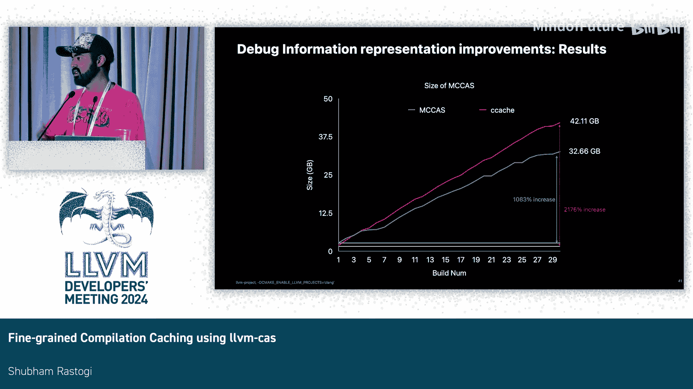

# 008：使用 LLVM CAS 进行细粒度编译缓存

在本教程中，我们将学习如何使用 LLVM 的内容寻址存储（CAS）系统实现细粒度的编译缓存。我们将从 CAS 的基础概念开始，逐步深入到其在调试信息存储、重放速度优化以及对 Swift 语言支持方面的具体应用和改进。

## 概述：什么是内容寻址存储（CAS）？

我们使用 CAS 的目标是创建一个可与 `ccache` 媲美的构建缓存。我们希望将目标文件分割成更小的 CAS 对象进行细粒度存储，这种模式我们通常称之为 `MC CAS`。选择与 `ccache` 比较，是因为 `ccache` 是一个广为人知且易于理解的工具，为我们所做的工作提供了一个很好的比较基准。

## CAS 基础概念 🔍

上一节我们介绍了 CAS 的目标，本节中我们来看看 CAS 的核心工作原理。

CAS 对象的地址是其内容的哈希值。在缓存对象中存储的数据与其地址之间存在一一映射关系，并且这是不可变的。因此，如果数据发生变化，其地址也会随之改变。然而，如果你尝试在 CAS 中存储冗余数据，系统不会再次存储它，而是返回一个指向该数据的引用，这被称为**去重**。这正是我们追求的目标，也是我们试图减少增量构建体积的本质方法。

数据在 CAS 中的表示形式是一个有向无环图（DAG），由 CAS 对象组成。每个 CAS 对象都包含一些数据和一个指向其他 CAS 对象的引用列表。

## 从 `ccache` 到 `MC CAS` 📊

为了理解 `MC CAS` 的优势，我们首先需要将其与 `ccache` 进行对比。

以下是 `ccache` 与 `MC CAS` 的主要区别：
*   **粒度**：`ccache` 的粒度在目标文件级别，而 `MC CAS` 的粒度要小得多，低于函数级别。
*   **增量增长**：由于 `ccache` 的粒度是目标文件级别，即使目标文件中只有微小改动，也必须重新存储整个文件，导致增量构建的体积增长率很高。而 `MC CAS` 并非如此，我们只存储更改的部分，因此增量增长率要小得多。这是我们设计时有意考虑的特性。

## 调试信息在 CAS 中的表示 🐛

在去年的工作中，我们初步实现了调试信息在 CAS 中的表示。为了模拟开发者的工作流程，我们进行了为期10天的构建测试。结果显示，如果不进行细粒度优化，CAS 的体积会膨胀到约 65 GB，增长率高达 708%。而使用 `MC CAS` 后，体积降至约 17.5 GB，增长率也大幅降低到 4000%。

然而，当我们叠加 `ccache` 的数据进行比较时，发现一个有趣的现象：10次构建后，`ccache` 的体积（约 15.5 GB）反而小于 `MC CAS`（17.5 GB），但 `ccache` 的增长率（约 730%）更高。我们相信，如果进行更长时间的构建（如20或30天），`MC CAS` 的体积最终会更小。同时，我们也相信自己可以做得更好，这就是本次教程后续要讨论的内容。

## 优化调试信息存储 📉

分析 `MC CAS` 17.5 GB 的体积构成，我们发现调试信息部分占了约 9.9 GB，超过总容量的一半。因此，优化调试信息在 CAS 中的表示是减少总体积的关键。

首先，我们需要了解调试信息部分的构成。调试信息以调试信息条目（DIE）的形式表示。一个 DIE 可以代表一个函数、一个参数等。DIE 中包含一些无法去重的数据，我们将其提取出来，存储在一个单独的 CAS 块中，称为**独立数据**。DIE 还可以有子 DIE。此外，调试缩写部分包含了 DIE 的类型信息，多个 DIE 可以共享同一个缩写。

综合来看，去年我们的表示方式如下：顶部是一个代表调试信息部分的 CAS 对象，接着是代表独立数据的块，然后是缩写块，最后是各个 DIE 块。我们并非为每个 DIE 创建一个 CAS 对象，而是使用一些启发式方法来确定子 DIE 是否应从其父 DIE 中分离出来。

这种表示方式体积较大，因此我们进行了两项主要改进来减少其在 CAS 中的大小：**扁平化节布局**和**使用压缩减少独立数据块的大小**。

## 改进一：扁平化节布局 🏗️

CAS 对象的地址是其内容的哈希值，而内容不仅包括数据，还包括对其他 CAS 对象的引用列表。如果其中任何一项发生变化，CAS 引用也会改变。此外，CAS 对象总是有序的。

我们遇到的问题是：在增量构建中，即使一个小子 DIE 中只有一个字节发生变化，它的引用也会改变。问题在于，它的父 DIE 包含一个指向它（以及其他子 DIE）的引用列表。因此，即使其中一个引用发生变化，父 DIE 也会改变，进而导致父 DIE 的引用改变。这就产生了一种级联效应，即使 DIE 中的微小变化也会导致大量去重失效，这是我们想要缓解的问题。

为了解决这个问题，我们采用了一种扁平化的表示结构。在这种结构中，没有子 DIE 附加到其父 DIE 上。因此，如果一个子 DIE 发生变化，只有它自己的引用改变，其父 DIE 不会改变。这样，我们提高了增量构建的整体去重率。

## 改进二：压缩独立数据 🗜️

在 `MC CAS` 约 17.5 GB 的体积中，调试信息占 9.9 GB，而独立数据块就占了约 9 GB，几乎是整个调试信息表示的 90%。这是一个巨大的数据块，每次新构建时都必须存储。

鉴于每个独立数据块平均约为 630 KB，并且在整个构建过程中有大量此类块，它非常适合进行简单的压缩。因此，我们采用了压缩技术来进一步减少调试信息表示的大小。

将这两项改进结合起来后，调试信息部分的大小从优化前的约 9.9 GB 显著下降到约 5 GB。当我们纵观整个 CAS 的大小时，可以看到总体积从 17.5 GB 下降到了约 12.6 GB。

此时，再与 `ccache` 叠加比较，可以发现从第三次构建开始，`MC CAS` 的体积就严格小于 `ccache`。在第十次构建后，`ccache` 约为 15.5 GB，而 `MC CAS` 约为 12.6 GB。

## 扩展测试与 DWARF5 支持 📈

为了验证模式的正确性，我们进行了更长时间的测试。在为期30天的构建中，`ccache` 体积膨胀到约 42 GB，而 `MC CAS` 约为 32.5 GB。`MC CAS` 的增长率（约1000%）远低于 `ccache`（约2200%），这证实了我们最初的假设。

此外，我们还测试了200次连续增量构建。结果显示，虽然初始时 `MC CAS` 体积较大，但随着时间的推移，其增长率更低，因此在200次构建后，`MC CAS` 总体积更小。图中出现的一些大峰值可能是因为某些提交更改了大量内容，导致许多目标文件重建，这是无法避免的。

接下来，我们讨论 `MC CAS` 对 DWARF5 的支持。Darwin 系统现已支持 DWARF5，我们也希望 `MC CAS` 能够支持。然而，测试发现 DWARF5 在 `MC CAS` 中的体积反而比 DWARF4 大，这与 DWARF5 本应更高效的预期相反。

调查后发现，原因是 DWARF5 引入了一个新的节——调试字符串偏移节。这部分数据同样无法去重，只是一个必须存储的数据块。因此，它也是压缩的绝佳候选对象。对其应用压缩后，DWARF5 的体积与 DWARF4 基本持平。

## 优化重放速度 ⚡

“重放”在此上下文中指的是重新构建先前已缓存的构建。例如，当你切换分支后又切换回来时，由于构建已被缓存，你期望构建速度会快很多。

在优化之前，`MC CAS` 的重放速度与 `ccache` 基本持平。但我们认为可以做得更好。我们发现了影响重放速度的两个主要问题：一是多次物化相同的缩写，二是使用的 ULEB128 解码器不是最优的。

调试缩写描述了调试信息节中的 DIE，多个 DIE 可以由一个缩写描述。因此，缩写数量总是小于或等于 DIE 数量。我们之前的问题是，每次物化一个 DIE 时，都会同时物化与之关联的缩写，这非常耗时，因为需要进行大量的 ULEB128 解码。一个简单的解决方案是只物化所有缩写一次并缓存它们，这显著减少了物化时间。

另一个问题是，我们使用的 ULEB128 解码器不是最优的。物化操作需要进行大量 ULEB128 解码，而我们使用的是 LLVM 中的 `BinaryStreamReader` 类。这个类不能保证流是连续的，但我们读取的所有 CAS 对象都是连续流，这导致了一些性能开销。实际上，这是物化时间的主要瓶颈。快速的解决方案是用 `DataExtractor` 类替换 `BinaryStreamReader` 类，后者只处理连续流。

进行这些优化后，`MC CAS` 的重放时间比之前严格更快。与 `ccache` 叠加比较，`MC CAS` 现在重放缓存构建的速度严格快于 `ccache`。虽然差异不大（约8%），但确实存在。

## Swift 语言支持 🦅

目前，Swift 编译器也可以创建 `MC CAS`。我们仅在一个名为 `AmoFire` 的小型开源项目中进行了测试，似乎工作正常。但在正式批准之前，我们还需要进行进一步的测试以确保其正确性。

## 总结与未来展望 🚀

本节课中我们一起学习了 `MC CAS` 如何展示了在 LLVM 中拥有 CAS 的实际用例。我们相信，与仅使用 `ccache` 这样的解决方案相比，CAS 可以为 LLVM 带来许多优势。事实上，我们还可以缓存 Clang 模块。

对于未来的工作，我们希望测试和基准测试 `MC CAS` 在 Swift 上的表现，确保其正常工作，并针对 Swift 进行任何必要的优化。我们还希望为其他 DWARF 节（如调试行节、调试范围节等）实现更多 CAS 特定的优化。

如果你有兴趣贡献代码，我们在 GitHub 上有一个 LLVM CAS 实现的初始补丁。链接在此，请积极参与，留下你的评论和建议，以便我们将这项工作集成到 LLVM 主干中。我们期待看到更多社区对此工作的反馈。

