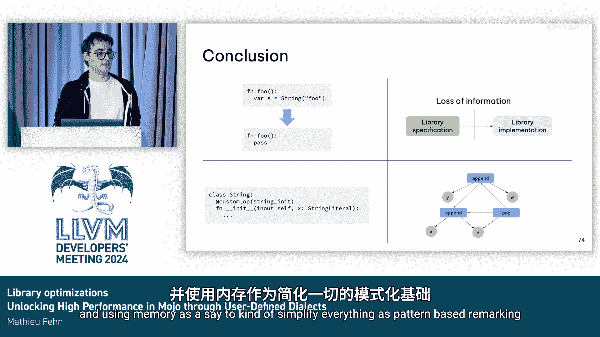

# 010：通过用户自定义方言解锁高性能

## 概述

在本节课中，我们将探讨如何在Mojo语言中通过用户自定义方言来实现库级别的优化，从而解锁更高的运行时性能。我们将分析传统系统编程语言（如C++）在优化标准库操作时面临的挑战，并介绍Mojo提供的一种新颖解决方案。

## 问题背景：传统语言优化的局限性

上一节我们介绍了课程主题，本节中我们来看看传统语言在优化库代码时遇到的具体问题。

让我们看两个C++代码的例子，并观察Clang编译器目前如何优化它们。

**示例一：未使用的字符串**

如果我们看第一个例子，我们有一个函数，它只是创建一个字符串，但没有对它做任何操作。这个字符串足够长，不会触发小字符串优化。

你可能期望Clang编译器直接删除它，因为它是未使用的。但如果你询问它的好朋友Compiler Explorer，你会发现它实际上并没有这样做。

原因在于，至少在C++17中，有一个函数调用没有被内联。因为它没有被内联，编译器无法推断这只是一个`malloc`操作，没有发生任何真正重要的事情。

事实证明，如果我们设法内联这个调用，那么所有东西都可能被消除，一切都会正常工作。

我们在这些例子中遇到的一个问题，不仅限于字符串，也适用于数据结构，那就是编译器需要内联所有内容才能理解它在做什么。这可以说是C++等语言的一个根本性问题。

**示例二：向量操作**

另一个展示不同类型问题的例子是向量操作。假设我们有一个整数向量，我们向其中推入一个值，然后获取向量的最后一个值（即我们刚刚推入的值），接着移除我们刚刚添加的最后一个值，最后返回这个值。

我们一眼就能看出，在`push_back`之后获取最后一个值，就等价于直接返回你刚刚添加的值。有人可能认为，如果你对一个向量推入某物然后弹出它，这应该等价于对向量什么都不做。

如果我们再次询问Compiler Explorer，会发现事情并不像看起来那么简单。但这次的问题不是内联问题。这次的问题是，从语义上讲，执行`push_back`实际上比仅仅添加一个元素更复杂，在某些情况下它可能会使容量翻倍。当你使容量翻倍时，会发生重新分配。这是编译器可以观察到的副作用。因此编译器知道它不能将其优化掉，因为使容量翻倍实际上产生了一种副作用。所以，推入然后弹出并不是什么都不做。它意味着如果向量在其当前容量下已达到最大尺寸，则使其容量翻倍。

## 更多优化机会与信息丢失

即使在C++标准库中，我们也能看到很多类似的例子，我们可能希望进行一些优化，这些优化要么需要大量内联，要么需要在LLVM级别上实际非法的优化。

以下是几个例子：
*   如果我们检查一个元素是否在哈希映射中，如果不在就添加它，这本质上就是一个`try_emplace`操作。
*   如果我们有一个乘法后跟一个加法，它可以被融合乘加指令替代。
*   如果我们先排序然后搜索一个元素，我们可以直接进行二分查找。
*   如果我们在循环中进行`push_back`，我们知道可以在循环前先`reserve`，这样我们一开始就有精确的容量，无需多次重新分配。

所有这些例子都很有趣。它们虽然很小，但你希望在编译器进行内联和自动优化之后应用它们。据我所知，目前没有任何系统编程语言能完成这些优化。

其中一个原因是，我们在编译器管道的早期阶段就丢失了太多信息。当我们定义库时，比如STD向量库，我们只有部分定义的函数。我们说容量可能会改变，但我们没有说它实际上会翻倍，我们没有具体说明在哪些情况下它会改变。从我们的库规范中，我们定义了实际的实现（比如`.cpp`文件）。在这种情况下，一切都是完全定义的，然后我们移除了库中许多未指定的部分。之后，我们将其交给Clang前端，再交给LLVM。问题在于，在Clang和LLVM级别，这些优化在此时实际上是“非法”的，因为我们很早就丢失了信息。

正如我所说，在C++中会发生这种情况，在Rust中也会发生同样的事情，在Zig中也是如此。

## Mojo的解决方案：用户自定义方言

因此，我们一直在尝试弄清楚，在Mojo中，我们是否能做一些不同的事情。我们能否在库实现中添加一些额外的东西，从而解决这些问题？这里的“额外的东西”就是使用用户自定义方言进行用户自定义优化。

这样，我们在管道中就有了早期优化，同时也减轻了LLVM的压力，因为我们移除了许多需要内联的情况，我们不需要再移除函数或进行更多优化。

那么，我们如何实际解决问题呢？作为一个长期从事MLIR工作的人，我的第一个想法是：我们能否添加更多方言？就像我们已经存在的传统Mojo方言一样，我们能否为标准库的每个部分都设置方言？

问题是这根本无法扩展，因为标准库会变得越来越大，实际上会超过你在基于MLIR的编译器中所拥有的传统方言数量。另一个问题是，它会使编译器本身固化——库成为了编译器的一部分，而不是独立的东西。此外，它也不能推广到用户库。如果有人想编写自己的向量实现，他们无法受益于编译器为标准库所做的所有优化。

## 实现方式：装饰器与模式匹配

我们拥有的解决方案是能够以某种方式“插入”你自己的方言，但它不会是MLIR方言，而是有点不同的东西。如果你能对标准库这样做，你可能也能为任何用户库方言这样做。这就是为什么我们称之为库优化。它针对所有类型的库。

那么它实际上是什么样子的呢？假设我们想在Mojo中添加一个新操作，用于将整数乘以二。以前你会在库中有一个函数。现在我们想要一种类似MLIR的操作。

解决方案就是添加一个装饰器。这实际上就是你定义新操作所需的全部，因为这比在ODS中做要更好。例如，对于Python用户来说很熟悉，你只需添加一个装饰器，无需为了新方言去学习像C++ ODS TableGen这样的新语言。

这对于之前提出的所有情况都足够了。编译器只需要进行少量更改，因为你仍然在操作函数，我们不需要在管道的每个地方都添加新的优化集来处理自定义操作。

它也非常充分，因为我们在通常的MLIR操作中拥有所需的一切。我们有一个验证器（这只是函数的输入输出）。我们有一个降级（这实际上就是一个函数调用）。我们也有一个解释器（因为它也只是一个函数调用）。我们还可以定义一些接口。例如，我们知道在这种情况下没有副作用，因为我们只进行整数操作。

由此，我们现在可以定义优化。如果我们有两个操作：`X * 2` 和一个执行加法的操作。我们可以在Mojo中为这些操作定义一个实际的优化，我们可以称之为规范化模式。这些优化会在任何自定义操作出现时被调用。所以在这里，每当我们看到`add`函数被调用时，我们会在管道的某个点调用`add_mojo`优化。

这些优化只使用MLIR模块API，这些API调用可以在Mojo编译器内部使用。

在此基础上，我们可以通过使用一点Mojo元编程和一些“魔法”来直接引用操作。它就能工作。

由此，我们可以处理简单的基于模式的操作。问题是，如果你想实现融合乘加，这在MLIR中很容易匹配。但如果你想做像`push_back`/`pop_back`这样的例子，我们当前有`append`和`pop`操作，这就更复杂了，因为现在我们需要某种内存分析，因为你想知道`pop`是否紧接在`append`之后发生，这不是我们能轻易处理的。

如果你中间有操作，你实际上不知道`pop`和之前发生的操作之间有什么关系。你不知道在这种情况下`V`和`W`是否别名相同，这意味着你不知道是否可以触发你的优化。

因此，为此我们有一个更小的实现，或者说是LLVM中所谓的“内存SSA”。在这种情况下，它会根据是否存在别名来告诉你优化是否可以触发。所以在这里，如果它们没有别名，你知道`pop`紧接在`append`之后发生。如果存在别名，那么你知道`pop`可能有两个前驱之一：`append`发生在`V`上或发生在`W`上。

## 应用实例

有了这个，我们实际上可以完成我在一开始展示的第一个优化。对于`push_back`/`pop_back`，这实际上就是查看`pop`，看是否有一个唯一的前驱是`append`，然后我们用MLIR API重写它，我们只需检查向量的值是否相同，然后我们就可以移除这些操作。

类似地，对于字符串的例子，就是检查在初始化之后是否有字符串的删除操作，这就可以工作。如果你看它，其实相当简单。

## 总结

本节课中我们一起学习了Mojo如何通过用户自定义方言来解决库优化问题。

我们得出的结论是，我们想要编写很多库优化。原因是在大多数编程语言中，管道早期就有很多信息，我们希望通过能够在你的语言中编写新操作，并使用内存SSA来简化一切，使其成为基于模式的重写，从而解决这个问题。

谢谢。😊