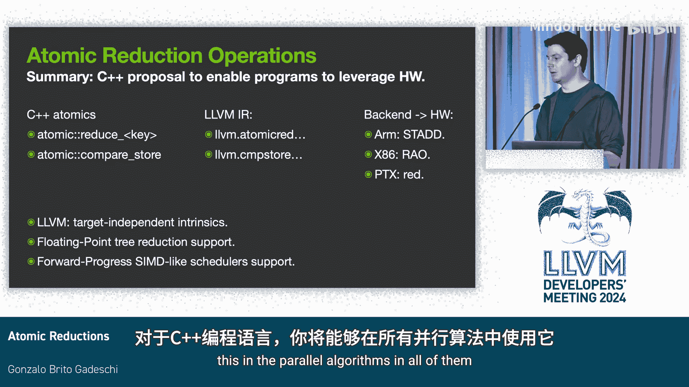
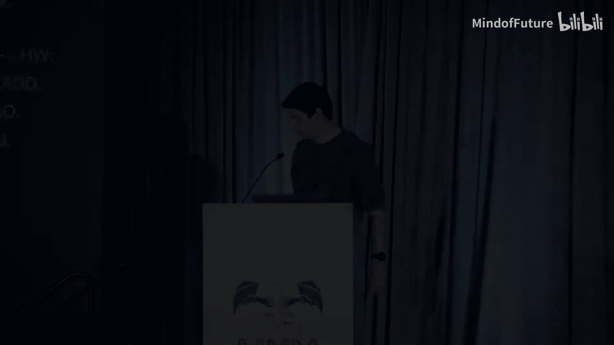

# 011：原子规约操作

在本节课中，我们将要学习原子规约操作。我们将探讨它们是什么、为什么需要它们以及如何实现它们。

## 概述

首先，简要概述LLVM中的原子原语指令。原子原语指令用于实现高级软件结构，例如C++的原子 `fetch_*` 操作。它执行从内存位置加载值，然后使用加法等二元操作修改加载的值，最后将修改后的值存储回内存。所有这些步骤都是原子执行的，这意味着在加载和存储之间，不允许其他并发写入修改该内存位置。

许多工作负载，例如并行直方图构造，使用像 `fetch_add` 这样的原子操作，但会丢弃加载的值。原子读-修改-写操作总是返回内存被修改前加载的值。

## 原子规约操作的定义与动机

上一节我们介绍了原子读-修改-写操作，本节中我们来看看原子规约操作。

原子规约操作指的是那些不返回旧值的原子读-修改-写操作。在许多工作负载中，修改前的旧值实际上并不相关。

例如，我们有一个并行for循环，它生成多个线程，每个线程遍历一个整数数组。根据整数落入哪个原子桶，线程将该桶的计数加一。对于这个算法，修改前桶中的旧值并不需要。存在许多类似的工作负载。

因此，我们今天将研究如何为那些旧值不相关的工作负载优化原子读-修改-写操作。

许多LLVM目标架构对这类不返回旧值的原子规约操作有良好的硬件加速支持。在这些目标上，从内存排序和内存模型的角度看，这些原子规约操作的行为类似于存储操作。

以下是原子规约操作的一些硬件指令示例：
*   ARM架构的 `STADD` 指令。
*   RISC-V架构的 `AMOADD` 指令，当使用零寄存器作为目标时，其语义变为原子规约操作。
*   PTX（NVIDIA GPU）的 `red` 指令，它没有目标操作数，不加载旧值。

## 性能优势

当我们查看并行直方图构造模型，并将其编译为使用PTX的 `atom` 指令（执行读-修改-写并加载旧值）或 `red` 指令（不加载旧值）时，在H100 GPU上，我们观察到 **1.2倍到2倍的吞吐量提升**。

所以，我们需要这些指令的原因是，它们能在旧值不被需要的工作负载中提供更好的性能。

## 优化挑战与安全性

第三个问题是LLVM是否能够优化使用原子读-修改-写的代码，使其变为使用原子规约操作的代码。

虽然在某些情况下这样做是安全的，但在一般情况下，无条件地进行这种优化是不安全的。

我不会深入这个程序的细节，但这是一个示例程序，如果我们实际执行这种优化，会引入一个被C++内存模型禁止的结果。因此，在这个示例程序中，这种优化是不安全的。

这种优化曾在多个编译器（包括GCC和LLVM）中被错误地执行。在LLVM内部，不仅在一个地方（如中间表示层），而且在多个后端和多个地方都出现过。我们一直在努力修复这些问题以获得正确结果。

但我们面临的问题是，当我们修复时，会损害那些优化本应正确的工作负载。并且，很难区分哪些程序优化是安全的，哪些是不安全的。

## C++标准的扩展

那么，C++委员会对此在做些什么呢？我们正在努力将原子规约操作作为C++内存模型、C++原子操作和标准库中原子类型的扩展引入。

这本质上是在原子类型等中引入新的API。这些API执行写入操作，但返回 `void`，即不返回旧值。这允许程序表达意图，并允许像Clang这样的实现暴露内置函数，这些函数随后被降级为LLVM的目标无关中间表示。然后，后端等编译器可以选择将其降级为特定的硬件指令。

虽然将原子读-修改-写优化为原子规约操作可能不安全，但反方向是安全的。也就是说，将原子规约操作编译为原子读-修改-写是安全的，只是会施加更强的内存排序约束。

## 树形规约与浮点运算

当前实现使用的一种技术是使用树形规约来实现某些整数原子操作。这对于整数是安全的，因为以不同顺序执行操作实际上不可观察。

然而，我们的目标之一是提高原子浮点操作的性能。实现这一目标的一种方法是让它们也能利用树形规约。

问题在于，在树形规约中，操作在内存中执行的顺序略有不同。因此，有可能观察到浮点加法以不同顺序结合。

我们已经扩展了此功能的规范，以支持这些允许树形规约的更弱的内存排序。它们还允许进行优化，例如，如果你有单线程中连续的两个原子规约操作，你可以合并这两个值，然后发出一次规约操作。在GPU等硬件上，这允许在一个线程束内跨线程执行水平规约，然后只向内存发出一次原子规约操作，而不是发出32次。

## 在无序上下文中的使用

当前C++原子操作的另一个限制是，它们在无序上下文中使用不安全。例如，在使用并行算法时，有多个并行执行策略。其中一种称为 `par_unseq`，它支持多线程并假设向量化是安全的。C++标准本质上禁止在这些上下文中使用原子操作，因为加载值的原子操作可能引入数据竞争问题。

这些原子规约操作不加载值，这与读-修改-写操作形成对比，这使我们实际上可以在保证自动向量化的无序上下文中允许它们。

这意味着，通过赋予这种操作稍弱的内存排序保证，我们实际上可以增加人们可以在大多数现代硬件上编写的安全程序的数量。好处是，实际上许多异构架构只支持 `par_unseq`，并且它们确实提供原子操作，但由于标准禁止，它们无法在C++中公开这些操作。而原子规约操作解决了这个问题。

## 总结与未来工作

本节课中我们一起学习了C++原子操作的原子规约扩展。

我们将准备一份提案，在LLVM中引入目标无关的内置函数来编译原子规约操作，因为这至少允许后端将其降级为某些可用指令，这总是安全的。

支持浮点树形规约的扩展是可用的。对于主要的编程语言，你将能够在并行算法中使用它，并且是在所有并行执行策略中，而不仅仅是在特定的策略中。

谢谢。

