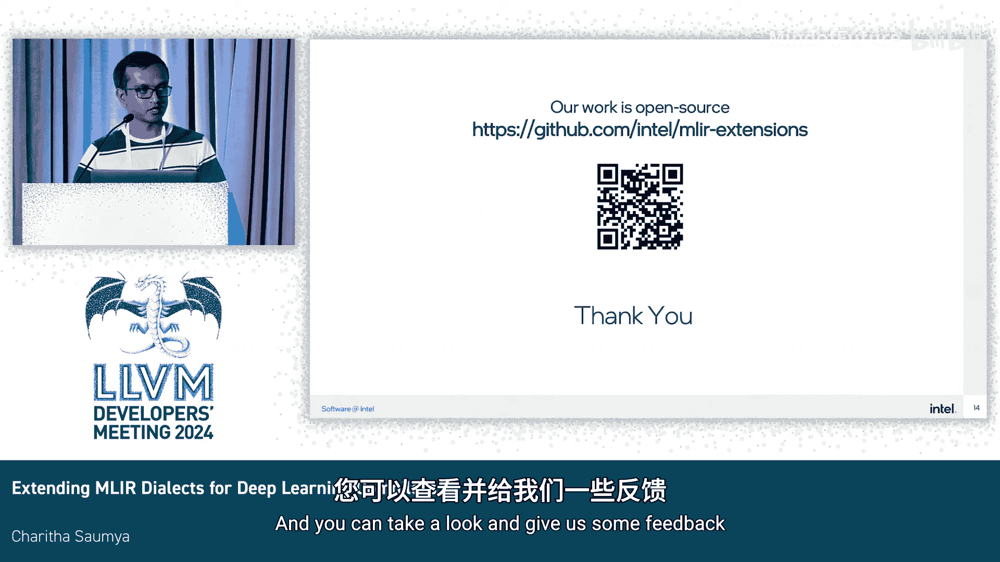

# 013：扩展MLIR方言以支持基于分片的编程


## 概述

在本节课程中，我们将学习如何扩展MLIR方言以更好地支持深度学习编译器，特别是针对基于分片（Tile）的编程模型。我们将介绍英特尔团队提出的X Tile方言，它旨在解决当前MLIR生态系统中在GPU上实现工作组分片编程时遇到的挑战。

## 深度学习编译器的挑战

深度学习编译器目前是一个非常活跃的领域。一方面，算法快速发展，催生了像Flash Attention这样的高度专业化内核。另一方面，AI硬件领域变化迅速，业界正大力推动使用低精度类型、脉动阵列和块加载/存储操作来提升性能。从用户角度看，他们既希望获得接近硬件的性能，又希望保持相对简单的编程模型。所有这些因素都指向了对灵活编程模型以及支持这些模型的深度学习编译器的需求。

## 基于分片编程的兴起

近年来，基于分片的编程模型被广泛采用。这是因为它在使用分片表达算法和并行策略方面具有更大的灵活性。同时，这种方法也很容易集成到现有的图编译器中。

然而，如果我们审视当前以GPU为目标的MLIR生态系统和方言，会发现使用现有MLIR方言实现基于分片的编程并不直接。存在一些限制。

## 现有MLIR方言的局限性

以下是当前MLIR方言在支持GPU分片编程时面临的主要挑战：

1.  **数据所有权问题**：在`memref`和`vector`方言中，没有直接的方法来指定数据所有权。这在处理复杂的GPU层次结构（如工作组、子组和工作项线程）时是必需的。
2.  **抽象层级缺失**：有时我们希望在工作组或块级别指定程序，并隐藏所有复杂的硬件细节，但目前没有可以直接用于实现这一点的方言。

## X Tile方言的引入

为了弥合这些差距，我们提出了X Tile，这是一个用于工作组分片编程的方言。在设计X Tile时，我们主要考虑了三个因素：

1.  **可配置的分片大小**：支持在工作组、子组甚至子组内的块级别配置分片大小。
2.  **支持高级优化**：X Tile主要针对类GEMM算法设计，因此需要支持像预取或软件流水线这样的高级GEMM优化。
3.  **显式控制分解逻辑**：提供对如何将计算分解到子组和工作项线程的显式控制。

## X Tile的实现核心

实现X Tile需要解决的一个关键问题是如何在`memref`和`vector`方言中指定数据所有权和分解逻辑。

*   **扩展`memref`方言**：我们通过引入一种新的数据类型以及一些所有权属性来扩展`memref`方言，并定义了一组操作来操作这种分片数据类型。
*   **扩展`vector`方言**：对于`vector`数据类型，由于其添加属性的空间有限，我们选择将分解或所有权属性附加到向量操作本身。这是一个我们希望与社区讨论并获得反馈的设计点：是否可能扩展向量数据类型本身，从而使设计更简单。

## 分片数据类型详解

分片数据类型描述了一个`memref`内部的二维内存区域。除了分片的大小和数据类型外，它还包含一些额外的信息。这些附加属性描述了分解逻辑。具体来说，你可以指定拥有此分片的子组布局，以及每个子组在此分片中拥有多少数据。

为了将数据切片分配给子组，我们使用了循环分配策略。以下通过两个简单例子说明其含义。

### 示例一：标准分配

假设子组布局为 `4x4`，每个子组拥有一个 `32x32` 的数据切片，而总的分片大小为 `128x128`。在这种情况下，布局中的每个子组都唯一地拥有大分片内的一个数据切片。

### 示例二：共享数据分配

假设你有一个相对“瘦长”的分片，只有32列，但子组布局和每个子组的数据大小保持不变。在这种情况下，当你在列维度上应用循环分配时，同一列内的所有子组将共享该数据切片。这种机制非常强大，可以用来指定数据共享，并表达诸如协作加载到共享本地内存或协作预取等操作。

## X Tile操作示例

以下是一个在工作组级别用X Tile指定的类GEMM示例。我们将用它来快速浏览一些重要的X Tile操作。

```mlir
// 伪代码示例，展示X Tile操作概念
%tile = x_tile.define_tile %memref, %offset_x, %offset_y, %size_m, %size_n
%reg_tile = x_tile.load_tile %tile
%result = x_tile.mma %reg_tile_a, %reg_tile_b
```

以下是关键操作的解释：

1.  **`x_tile.define_tile`**：用于描述`memref`内部的一个分片。它需要源`memref`和描述分片位置的二维偏移量。它还有一个更新偏移量参数，特别用于K循环中，其作用是在`memref`内移动分片，而不是初始化一个全新的分片，从而节省地址计算开销。
2.  **`x_tile.load_tile` / `x_tile.store_tile`**：用于在分片和寄存器之间加载/存储数据，这部分比较直观。加载到寄存器分片后，我们使用`vector`方言来表示这些数据。
3.  **`x_tile.mma`**：这是一个在向量寄存器分片上执行矩阵乘积累加的操作。

一个重要的细节是，每个向量操作都附加了这些所有权或分解属性。这些属性非常灵活，你可以通过改变子组布局或子组数据属性来控制分解方式。例如，在K循环内部进行预取时，如果硬件要求预取操作与相邻子组协作需要不同的子组布局，你可以为预取操作和加载操作分别指定不同的布局。

## 从工作组到子组的分解转换

在从工作组到子组的分解转换过程中，我们直接消费这些所有权属性来生成子组级别甚至更细粒度的代码。

在左侧的工作组级别代码中，操作在一个更大的分片（例如`128x128`）上进行，并定义了子组数据和子组布局。在右侧的子组端，生成了更小的分片GEMM计算（例如`32x32`）。每个子组可以使用自己的子组ID来计算它所拥有的数据切片在全局中的偏移量。同样重要的是，A和B分片在列和行上的子组会共享数据，这为进一步预取或加载到共享本地内存以提升性能创造了条件。

## 降低流水线与性能

这是目前为X Tile规划的高级降低流水线。一旦处于子组级别的X Tile表示，可以直接转换到特定供应商的GPU方言，例如可以转换到Intel的X GPU方言。之后，我们可以将其进一步降低到SPIR-V或LLVM IR，然后传递给后端编译器驱动。

我们也测量了类GEMM操作的性能。这项工作仍在进行中，但我们很高兴地分享，在工作组级别的X Tile上，我们达到了手写优化MLIR代码性能的约90%，并且我们正在努力继续改进。

## 总结



本节课我们一起学习了扩展MLIR以支持深度学习编译器中基于分片编程的关键技术。我们了解到，当前MLIR缺乏工作组或块级别的分片方言，以及指定分片内数据所有权的方法。为了弥合这一差距，英特尔团队引入了X Tile，这是一个为GPU设计的工作组级别分片方言。X Tile通过扩展`memref`和`vector`方言，实现了基于分片的编程。初步的性能结果表明X Tile非常有前景。这项工作是开源的，欢迎大家查看并提供反馈。