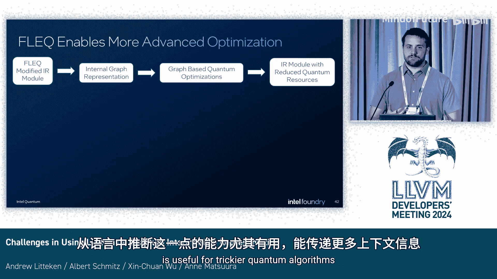

# 014：将LLVM用作量子中间表示所面临的挑战 🧠


在本节课中，我们将学习如何将LLVM用作量子计算的中间表示，并探讨这种做法的优势与挑战。我们将从量子编译的基本约束开始，了解LLVM如何帮助满足这些约束，然后讨论如何简化高级程序员的开发流程，最后介绍如何让非编译器专家的量子领域研究者也能轻松使用我们的编译框架进行优化。

## 量子计算基础与编译挑战 ⚛️

量子程序随时间作用于量子比特。量子比特在电路图中通常用水平线表示。程序会应用单量子比特门（操作一个量子比特）和多量子比特门。门从左到右依次应用，类似于经典电路，整个结构被称为量子电路。

将这样一个电路从编程语言转化为可在后端（如物理量子芯片、超级计算机模拟器，甚至个人电脑）上运行的程序，是一个多步骤的过程。由于量子设备的限制，这个过程需要考虑许多编译约束。

## 英特尔量子SDK编译流程概览 🔧

我们将主要关注英特尔量子SDK中基于LLVM的量子编译器。为了理解设计决策，我们先快速了解一下编译流水线中的其他组件。

主要前端是英特尔通过SDK提供的、基于C++的混合量子-经典编程语言。我们的量子中间表示本质上是添加了量子内联函数的LLVM IR。与整个LLVM生态系统一样，这允许我们开发不同的前端，包括英特尔自己的OpenQASM前端（一种可移植的电路表示），然后将其翻译成我们的量子IR。

编译器承担了大部分工作，负责重新配置和规范化量子程序，以满足量子技术栈其余部分的限制和要求。在高层级上，这意味着：
*   运行时中的经典代码将使用经典编译流程。
*   我们必须从程序中提取量子指令。
*   利用物理设备或模拟器的架构信息，来匹配设备的连接性限制（例如，有限的寄存器数量、有限的量子比特数，以及只有特定量子比特可以相互作用）。
*   我们需要减少设备使用的量子资源。在当前技术下，使用设备越多，程序失败的可能性就越大。
*   量子编译器最终会生成量子指令集架构级别的程序。这些量子组件随后被链接到二进制文件的其余部分，以便运行时稍后访问。

虽然量子编译器中使用的一些抽象对整个量子计算领域是通用的，但我们确实有针对英特尔后端（模拟器和硬件）的优化和特定ISA。程序运行时，会调用量子运行时。它处理量子ISA，将量子程序部署到设备，并处理返回的任何测量结果。

只有在量子运行时这个层级，我们才能在量子指令之间运行任何经典计算组件，因为运行时和处理器通常在空间和温度上（从室温到接近绝对零度）与量子设备分离。由于量子设备上量子比特的寿命很短，这实际上意味着整个量子程序或其片段不能依赖任何经典操作来重现其结果。量子指令通过控制电子设备传递到量子设备。在这里，指令在实际执行前，不能有任何条件执行或经典指令，直到它们被返回给运行时。

这种无法基于用户输入（甚至任何条件）执行条件操作的能力，是我们在英特尔量子编译器设计中做出决策的关键部分。

总结一下，我们的编译器面临的主要挑战是：
1.  量子指令中不能有分支。
2.  需要减少使用的量子操作数量。
3.  需要匹配设备约束。
4.  量子代码中不能有任何经典操作。

需要说明的是，这些决策很多是基于当前的量子技术，并非永恒不变，整个领域和英特尔都在努力改进。

## 利用LLVM匹配约束 🛠️

上一节我们介绍了量子编译的核心挑战，本节中我们来看看编译器如何利用LLVM来匹配这些约束。

以下是一个用户使用英特尔量子SDK可以编写的代码示例：
```cpp
__quantum__ void kernel(int count) {
    Qubit q0 = __quantum__rt__qubit_allocate();
    Qubit q1 = __quantum__rt__qubit_allocate();
    for (int i = 0; i < count; ++i) {
        __quantum__qis__h(q0);
        __quantum__qis__cnot(q0, q1);
    }
    Result m0 = __quantum__qis__mz(q0);
    if (__quantum__rt__result_equal(m0, Result_One)) {
        __quantum__qis__x(q1);
    }
}
```
*   `__quantum__` 函数属性在编译过程中传递，标志着该部分需要被特殊处理为量子代码。
*   我们有 `Qubit` 和 `Result` 类型，它们本质上是特定的整数类型，标志着这是可以执行量子门操作或存储测量结果的数据。
*   头文件中定义了许多标准的量子操作，使用户能够定义量子算法。
*   整个内核可以像经典函数一样被调用，它会被提取、处理，然后由运行时通过指向量子指令块来调用。在这个层级，程序能够与量子数据交互、捕获测量值并对其做出反应。

代码中，多个量子操作被包含在循环和条件语句中。但我们不能在最终程序中保留这些结构，需要将其展开，并且所有量子比特参数在编译时必须已知。

幸运的是，LLVM基础设施拥有许多工具来处理这些结构并展开它们。然而，这些结构显然也存在于经典代码部分。因此，对程序的每个部分都应用展开操作将是耗时且不必要的。我们使用LLVM的Pass管理器来处理这些情况。

但是，为了在最后得到一个有效的量子内核，我们需要满足一系列条件。我们不能直接使用现成的Pass管理器框架，因为我们可能需要“回退”或根据条件重新运行某些操作。早期，这主要通过多次调用 `opt` 工具来实现。但现在，我们在自己的驱动程序中使用了五个不同的Pass管理器来实现这一目标。

以下是各个Pass管理器的作用：
1.  **第一个管理器**：将头文件声明替换为量子内联函数。
2.  **第二个管理器**：递归地内联量子内核，以便展开和常量折叠操作能够获得所需的所有信息来完全展开电路。
3.  **第三、第四和第五个管理器**：实际上会运行多次，是使用LLVM Pass最多的编译部分，并且它们仅限于量子操作。
4.  **中间循环展开和常量折叠Pass**：仅作为函数Pass运行在量子内核上（由前端添加的属性标识）。在优化之前会检查循环是否包含任何量子操作，如果没有，则无需展开。
5.  **最后一个管理器**：如果内核未被发现有效，则运行一组与O1函数简化流程非常相似的Pass。这个过程会持续到函数被展开和常量折叠，或者达到尝试次数上限（此时向用户显示错误）。最后一个管理器还负责实际的量子处理和量子处理，这是一组Pass，用于将用户友好的数学门降低到硬件上实际可用的物理门集，以及将程序量子比特映射到物理位置（必要时移动它们），以便每个需要相互作用的量子比特能够实现。这里也是针对英特尔后端进行性能优化的地方。

## 增强高级程序员的开发体验 💡

上一节我们探讨了如何利用LLVM的基础设施来满足量子编译的硬性约束，本节中我们来看看如何通过一些策略为高级程序员提供更强大的工具，让他们能更轻松地表达程序。

由于我们需要在编译时知晓一切，编写可能涉及递归的函数可能需要一些技巧，例如使用模板来递归索引程序中的量子比特。左侧的代码展示了一种标准但可能繁琐的实现方式。我们可以用递归实现，但方式并不简单直观。

因此，我们为量子计算引入了函数式语言扩展（Fleck）。这是一个小型领域特定语言，在某些情况下可以帮助用户更简洁地表达代码，同时也允许编译器直接从程序中推断更多信息，而无需在最终的IR中进行推理。右侧的代码展示了使用Fleck后的递归函数，它更类似于函数式流水线，并能产生基本相同的电路。对于英特尔量子编译器来说，由于右侧代码中使用的原语，推理右侧代码变得简单得多，我们也能够更高效地优化这些程序。

Fleck还允许我们在编译器内部处理一些经典控制流。一个例子是进行基本的字符串处理，并在编译步骤中根据不同的输入进行动态适配。

由于量子表达式（`QExpr`类型）需要按值传递，并且在C++环境中被视为整数，仅在IR级别处理可能比较困难，因为它可能被转换或某些操作被优化掉。但我们可以使用Clang插件在前端进行一些处理。基本上，我们可以通过查找特定的二元运算符来修改抽象语法树，并用头文件中特定的函数调用替换它们。用户可以直接调用这些函数，但我们希望提供最佳的编程体验。通过这个Clang插件，我们也能够提供比仅在IR级别更好的错误信息。

我们替换了几个不同的运算符为量子特定的调用。虽然这对前端来说是一个相对简单的操作，但能够在Clang级别而非IR级别确定这些操作，使我们能够对生成的函数调用做更多处理，这对我们来说是一个强大的功能，也让识别量子操作变得容易得多。

在我们的LLVM流水线中，Fleck处理本质上就是一个Pass。我们将Fleck调用转换为内部图，并在此执行重构操作，从而减少电路中的门数量和长度，这通常特别针对英特尔设备。从语言而非IR推断这些信息的能力尤其有用，因为它可以传递更多上下文信息，这对于更复杂的量子算法很有帮助。



此外，这让我们能够处理和通知任何顶层操作，例如逆操作。量子计算是可逆的计算环境，如果没有像Fleck这样的东西以及用于识别二元/一元运算符以执行逆操作的Clang插件，我们实际上很难推断（除非手动编写）在哪里执行这个逆操作。

因此，虽然我们不得不稍微超出标准的LLVM流水线以获得更多能力，但SSA形式允许我们构建量子程序的简洁操作图并执行优化。LLVM本身仍然足够灵活，让我们能够以各种形式执行这些优化和更改。

## 为量子研究者提供易用的优化工具 🧑‍🔬

上一节我们介绍了如何通过语言扩展和前端插件提升开发体验，最后一个挑战则更具人文色彩：如何让不熟悉编译器的量子物理学家也能轻松使用编译栈进行优化。

编译器开发者不一定需要了解量子计算来编写编译器部件，同样，物理学家也不想为了编写一个优化而去了解编译器。但我们仍然希望让他们更容易地使用编译器栈。

以下是一个用英特尔量子SDK编写的简单量子程序，编译为LLVM IR后的示例。左侧是之前展示的电路结构，而LLVM代码对于不熟悉它的人来说可能有些难以理解。此外，许多量子优化是使用量子电路的抽象来编写的。虽然我们可以从IR中获得相同的信息，但这需要大量的簿记工作：必须理解如何跟踪量子比特以及如何在不同函数调用中跟踪数据。我们希望为英特尔量子SDK（包括英特尔内部和外部的用户）开发优化的用户，很多是物理学家，并不熟悉这些计算机科学概念。因此，让他们能够开发优化的一个重要部分，就是“在他们所在的地方与他们相遇”。

这类似于CIRCUIT或Qiskit等工具。我们有一个基于图的结构来表示量子电路。每个包含量子操作的基本块都有一个图，并且这个图只包含量子操作。每个节点就是一个量子操作，每条边表示两个操作之间共享的量子比特。例如，`Prep Z` 操作连接到 `Hadamard` 门，而 `Prep Z` 在 `Q1` 和 `Hadamard` 在 `Q0` 都连接到 `CNOT` 操作。这些依赖关系仅告知电路中操作的执行顺序。

从IR转换到这种图结构比较容易，但我们希望用户能够操作这个图，而无需实际处理IR本身。由于我们处于这种仅包含量子操作的受限模式，我们能够提供一系列标准的图操作，这些操作将能够被翻译回IR本身，主要涉及处理传递给每个门的参数。

作为一个简单的例子，假设我们想在 `Q0` 和 `Q1` 的 `CNOT` 操作之前，在量子比特1和一个当前不在图中的新量子比特3之间插入一个 `CNOT` 操作。

用户可以像在LLVM中创建指令一样，为量子操作调用一个创建方法。这会实例化一个新指令，并出于内存管理的考虑，让量子模块拥有其所有权。然后，他们可以在该新操作上使用插入方法，将其放在 `Q1` 的 `Prep Z` 操作之后。

我们需要做几件事：首先，像处理任何有向图一样更新电路对象；然后，我们也需要将其添加到IR中，并相应更改IR。在简化形式中可以看到，紫色框是新添加的指令，它添加了那个 `CNOT` 操作以及为 `Qubit 3` 的寻址，同时它还将 `Qubit 0` 的寻址移到了 `Prep Z` 的 `CNOT` 操作之上。这是我们需要为LLVM做的额外处理，但优化开发者不一定需要担心这些。这让他们能够利用LLVM的能力，同时只专注于量子算法的需求。

还有其他操作可以嵌入，例如作为量子内核的父函数的一部分，但由于时间关系，这部分暂时跳过。

## 总结与展望 📚

本节课中我们一起学习了将LLVM用作量子中间表示的完整过程。

使用LLVM是英特尔量子编译器的一个强大组成部分，它让我们能够将经典计算与量子硬件的需求结合起来。Clang插件和LLVM Pass系统的模块化使我们能够实现独特的优化，并通过Fleck等语言扩展为高级开发人员提供更多可能性。此外，我们希望提供操作IR以进行优化的工具，并通过量子电路对象来实现这一点，试图为那些开发者创建一个仅触及量子部分的、领域特定版本的IR。

最后，这些组件很多都是开源的。我们欢迎来自更广泛社区的反馈和贡献，特别是关于如何改进我们结构设计的建议（我们团队大部分成员是物理学家，可能做出了一些有趣的决定），以及关于更高效使用LLVM组件或我们未知工具的建议。同时，也欢迎研究人员使用量子电路对象进行优化。

---
**本节课中我们一起学习了：**
1.  **量子编译的核心约束**：包括无分支、资源优化、设备匹配和无经典操作。
2.  **LLVM在量子编译中的作用**：通过多级Pass管理器处理内联、展开、常量折叠和硬件映射，满足量子编译的特殊需求。
3.  **提升开发体验的工具**：引入Fleck函数式语言扩展和Clang插件，简化量子算法表达，并增强编译器的推理和优化能力。
4.  **面向领域专家的抽象**：提供量子电路图对象，让物理学家能在熟悉的抽象层面进行优化，而无需深入LLVM IR细节。

通过结合LLVM的强大基础设施与量子计算的专业需求，我们正在构建一个既高效又易用的量子编译工具链。