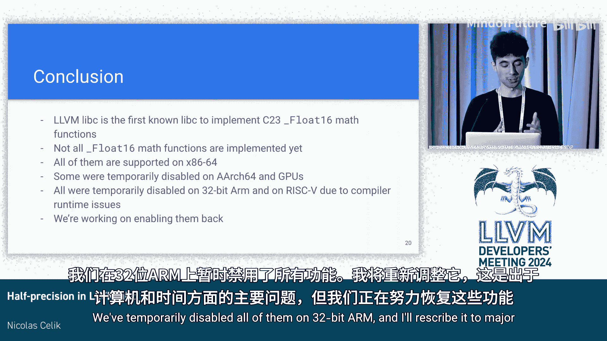

# 015：半精度浮点数支持 🧮

## 概述

在本节课中，我们将学习LLVM libc项目中关于C23标准新增的`_Float16`（半精度浮点数）类型及其数学函数的实现工作。我们将了解其背景、实现目标、已完成的工作、遇到的挑战以及从中获得的经验教训。

---

## C23 标准与 `_Float16` 类型

上一节我们介绍了课程概述，本节中我们来看看`_Float16`类型的定义。

C23标准定义了新的`_FloatN`类型，其中之一是`_Float16`。它对应于IEEE 754标准中的binary16格式（如右图所示）。这种格式也被称为半精度或FP16。它最近因神经网络而流行，但也在图形领域使用了相当长的时间。

随着C23定义这些新的浮点类型，它也相应地定义了新的数学函数。例如，为了获取浮点数的绝对值，我们已经有`fabsf`函数。现在对于`_Float16`，我们有了`fabsf16`函数。

## 项目目标 🎯

这引出了本次Google Summer of Code项目的目标：在LLVM libc中实现这些新的C23 `_Float16`数学函数。显然，这样做的好处是向支持C23标准迈出了一步。据我所知，这使得LLVM libc成为第一个实现这些新C23数学函数的libc库。

## 已完成的工作

以下是我们在项目中完成的主要工作。我们将数学函数分为两类：基本运算和高等数学函数。

**基本运算实现：**
我们实现了所有计划中的70个`_Float16`基本运算。这包括绝对值函数、舍入函数、最大值函数等。如果你对完整列表感兴趣，可以查看相关的跟踪问题。

**高等数学函数实现：**
我们实现了54个计划中的`_Float16`高等数学函数中的17个。这些包括指数函数、对数函数、双曲正弦、余弦等。我们知道无法在夏季完成所有实现，如果你对完整列表感兴趣，这里同样有跟踪问题的链接。

## 性能优化 ⚡

作为项目目标的一部分，我们也希望优化一些基本运算，因为其中一些操作与某些CPU上的特殊硬件指令非常匹配。但我们不希望使用内联汇编或特定于目标的内部函数（intrinsics），在LLVM libc中我们不太喜欢这样做。相反，我们希望使用编译器内置函数（builtins）。

我们成功地使用内置函数优化了`_Float16`，以及以下基本运算的`float`和`double`变体：一系列舍入指令（如四舍五入到最接近的整数）以及最大值和最小值函数。

以下是这些优化的一些示例结果：

*   在Pixel 8手机上，`ceilf16`函数的初始实现耗时可达8.92纳秒，而使用内置函数的版本仅需0.79纳秒。
*   在第13代Intel Core i7上，`fmaxf16`函数：如果不启用任何可选的F16指令支持，耗时可达133纳秒；如果启用F16C支持（即用于与`float16`相互转换的更高指令），则降至6.17纳秒；但无论如何，使用最佳实现仅需3.81纳秒。

最后，这里有一个关于`_Float16`数学函数与`float`数学函数在延迟上如何比较的简单示例。同样在第13代Core i7上，`_Float16`的指数函数耗时可达16纳秒，而`float`版本仅需3.18纳秒。目前在x86_64上，`_Float16`的表现并不理想。而在具有几乎完全硬件支持`_Float16`的ARM CPU（如Pixel手机）上，`_Float16`版本实际上比`float`版本稍快一些。

## 遇到的问题与挑战 🐛

我们遇到了相当多的问题。我们遇到了编译器错误，甚至是崩溃。因为在LLVM libc网站上，我们仍然声明支持Clang 11，并且确实在一些合并后的CI中使用它。但当我们使用该版本的Clang编译一些手写代码并针对AArch64时，它会崩溃（你可以看到“指令选择失败”）。

另一方面，在当前版本的Clang上，我们遇到了错误编译。可能你已经知道，并非所有CPU都有完整的`_Float16`硬件支持。大多数x86_64 CPU只有与`_Float16`相互转换的指令，有些则根本没有特殊的`_Float16`指令。在大多数情况下，当前版本的Clang可能会生成改变代码结果的转换。你可以在这里看到`fabsf16`函数的例子：它本应只是将符号位设置为0（左边是Clang 19的情况），但在右边（Clang 18），你可以看到它生成了对软件转换函数的调用。这些软件转换函数已经存在，但当你向该函数传递一个信令NaN时，它会将其转换为静默NaN，而两者的编码方式不同。因此，当你更改符号位并转换回来时，不会得到相同的结果。

我们还遇到了次优代码生成的问题，你可以认为这没那么严重。在右边，Clang 18生成的代码比GCC在x86_64上生成的代码更长更慢，但即使GCC生成的代码在这种情况下也并非最优。

## 使用编译器内置函数的困难

我之前谈到了使用编译器内置函数进行优化，但这并不像我希望的那么简单。我制作了一个大表格，尝试了一系列内置函数，包括直接的`_Float16`内置函数，以及使用从`_Float16`转换而来的`float`内置函数。我在所有支持的架构（x86、ARM、RISC-V）以及Clang和GCC上进行了测试。

当你看到一个绿色的对勾时，意味着我们实际上可以尝试使用它，它似乎能生成有趣的代码。如果是黄色或红色，它只是生成一个可调用的libc函数，我们可以自己实现。首先，它会使编译器崩溃。其次，即使是一个绿色的对勾，我们也可以尝试使用它，但最终可能不值得使用。例如，`floorf16`内置函数在x86_64上生成的代码实际上比我们在LLVM libc中该数学函数的当前实现还要慢。

## 编译时问题

最后，我们遇到了一系列编译时问题，因为我之前提到的一些软件转换函数可能缺失，这取决于你使用的是哪个编译器以及目标平台。

*   在ARM和RISC-V上，GCC缺少将`_Float16`与`long double`相互转换的内置函数。
*   在x86_64上，Clang缺少将`_Float16`与`x86 long double`相互转换的内置函数（无论目标平台如何）。
*   即使这些函数可用，它们也可能给出错误的结果。它们可能忽略当前的舍入模式，只假设使用默认的舍入模式。这就是在ARM 32位（AArch32）上使用GCC时发生的情况。它为该目标单独部署了这些函数（我不知道为什么）。Clang在所有目标上使用相同的实现，因此在所有目标上都有同样的问题：总是向最近的偶数舍入。
*   我们还有一个奇怪的问题，Clang在用于与`_Float16`相互转换的函数中使用了错误的寄存器。我在LLVM 19中提交了一个补丁来修复这个问题，但人们说这现在引起了其他问题。棘手的是，这取决于你从哪个上游LLVM和Clang项目构建编译器运行时库。

## 经验教训 📚

我们从所有这些遇到的问题中学到了什么？嗯，你可以看出一个模式：我们在某个目标上对一种新类型的支持越少，就越可能遇到问题。在ARM目标上，如果你有完整的硬件支持，你就不需要所有这些软件转换函数。目前，硬件供应商似乎主要对他们制造的、拥有硬件支持的类型感兴趣。

为了让我们未来在库中添加新的浮点类型更容易，我想我们可以尝试反过来：首先为该新类型和编译器实现完全可用的软件操作实现，然后才通过使用特殊的硬件指令来为具有硬件支持的目标进行优化。这样，库从一开始就可以使用新类型，即使代码很慢，但至少它能实际工作。这样，库就可以避免 tangled conditions（根据编译器版本和目标平台来决定是否启用对这些新类型的支持）。但这可能需要说服硬件供应商改变他们的优先级，所以我不确定这是否会发生。

## 总结

本节课中我们一起学习了LLVM libc在实现C23 `_Float16`数学函数方面的工作。

总结来说，LLVM libc是第一个实现C23 `_Float16`数学函数的libc库，但我们尚未实现全部。所有函数都在x86_64上受支持，但我们暂时在AArch64和GPU上禁用了其中一些。由于主要的编译时问题，我们暂时在ARM上禁用了所有`_Float16`函数，但我们正在努力重新启用它们。