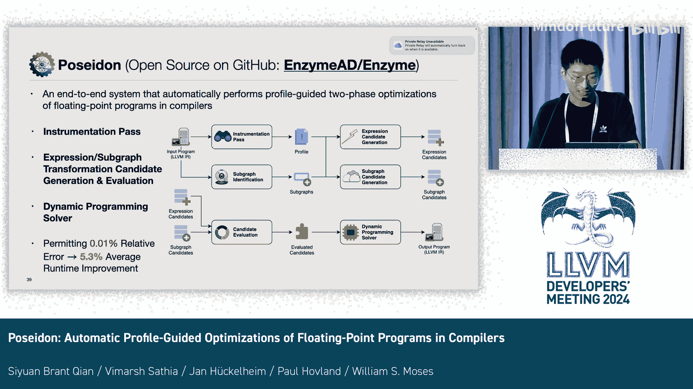

# 017：FPOpt - 在LLVM中平衡浮点计算的成本与精度

## 概述

在本教程中，我们将学习一个名为Poseidon的系统。该系统能够在编译器中对浮点程序进行自动优化，旨在以给定的计算成本预算为约束，最大化程序的精度。我们将了解其工作原理、核心组件以及如何评估优化效果。

## 系统架构与工作流程

上一节我们介绍了Poseidon的目标，本节中我们来看看它的整体架构。Poseidon是一个类似PGO（Profile-Guided Optimization）的双阶段编译系统，构建在LLVM和MLIR的Enzyme自动微分器之上。

以下是Poseidon系统的主要工作流程：

1.  **插桩与分析阶段**：Poseidon首先对输入程序进行插桩，运行增强版本的程序以收集运行时信息。
2.  **子图识别阶段**：系统分析程序，识别出可进行浮点优化的子计算图。
3.  **候选变换生成阶段**：针对识别出的子图，生成表达式重写和混合精度分配两类优化候选方案。
4.  **评估阶段**：使用内部成本和精度模型，评估每个候选变换对全局程序成本和精度的影响。
5.  **求解与选择阶段**：利用动态规划求解器，在用户定义的成本预算内，选择能最大化程序精度的一组变换。

接下来，我们将详细探讨每个阶段。

## 阶段一：插桩与分析 🧪

为了进行优化，Poseidon需要了解程序的运行时行为。它通过插桩来收集这些信息。

Poseidon使用反向模式Enzyme为输入程序合成梯度代码，并在合成的代码中插入日志函数调用。这些日志函数会记录原始指令的值和梯度，并将其传递到一个日志数据结构中。

执行这个增强后的程序后，Poseidon会得到一个程序剖析文件。这个文件包含了指令值的范围、执行次数以及值和梯度的几何平均值。

## 阶段二：子图识别 🔍

上一节我们收集了程序运行时数据，本节中我们来看看Poseidon如何确定需要优化的代码区域。Poseidon需要理解程序的哪些部分可以优化。我们将可以被Poseidon优化的LLVM值称为“Poseidonable值”，这包括基本算术运算和一些初等函数。其他LLVM值，如加载和存储，则不可优化。

Poseidon运行一个泛洪填充算法来遍历整个程序。该算法沿着指令的操作数和用途进行追踪，直到遇到不可优化的值为止。在此过程中，Poseidon还会识别出将数据传入或传出子图的LLVM值，并将它们标记为输入值和输出值。

## 阶段三：生成变换候选方案 ⚙️

识别出子图后，Poseidon开始生成两类优化候选方案：表达式重写和混合精度分配。

### 表达式重写候选

Poseidon从子图的输出指令开始，向上追溯到输入值和常量，从而构建出浮点表达式。然后，Poseidon将这些表达式传递给表达式重写器（如Herbie）来生成候选表达式。重写器会利用在插桩阶段提取的输入值范围信息。Poseidon从重写器获取多个表达式候选，并解析这些表达式以备后续使用。

### 混合精度分配候选

Poseidon通过使用从插桩路径捕获的指令值及其梯度的绝对值乘积，来估计改变一个中间指令对最终结果的影响程度。基于这些指令的敏感度信息，Poseidon生成变换候选，这些候选会改变浮点子图中最不敏感部分的精度，并在被改变的区域周围插入浮点类型转换指令。

## 阶段四：评估成本与精度 ⚖️

当Poseidon准备好所有变换候选后，它开始使用内部模型评估这些不同类型的变换如何改变全局程序的成本和精度。

*   **成本模型**：Poseidon要么使用来自LLVM TargetTransformInfo的每指令成本，要么使用通过对LLVM浮点指令进行微基准测试得到的更精确的自定义成本模型。对于两类候选变换，Poseidon会将该候选中所有指令的执行次数与指令成本的乘积求和。
*   **精度模型**：Poseidon使用一个基于MPFR的高精度求值器。该求值器使用任意精度浮点数计算“真实值”，同时使用常规机器精度模拟原始计算。然后，Poseidon通过计算“真实值”与模拟结果之间的差异来计算局部误差。接着，用梯度放大这个局部误差，以估计该变换候选对全局误差的贡献。

## 阶段五：动态规划求解 🧮

Poseidon需要求解出一组变换，使得在满足用户定义的成本预算的前提下，全局误差贡献的总和最小。这个问题本质上是一个更复杂的0/1背包问题变体，我们试图找到将物品放入背包的最佳方式，以在不违反容量约束的情况下最大化总利润。

0/1背包问题可以使用动态规划在多项式时间内求解。不同之处在于，Poseidon需要将所有计算成本四舍五入到最近的整数，以便能够将具有较大预算的原始程序拆分为许多具有较小预算的子问题。Poseidon还需要调整子图候选的成本和误差贡献，以考虑求解器已经选择的表达式候选，从而避免同一段指令被多次修改。

## 评估与结果 📊

我们在FPBench上评估了Poseidon。FPBench是一个用函数式编程语言编写的微基准测试集。我们将这些微基准测试导出为C语言，并使用Poseidon对它们进行优化。

在所有46个可直接优化的微基准测试中，我们计算了运行时间改进的几何平均值。在评估相对误差为0.01%的条件下，Poseidon平均带来了5.3%的运行时间改进。同时，在几个微基准测试上，Poseidon可以获得高达5个数量级的精度提升。

让我们看一个具体的微基准测试示例。图表顶部的虚线是原始程序的运行时间，底部的虚线是原始程序的相对误差。蓝色和绿色的点分别是优化后程序的运行时间和相对误差。对于这个微基准测试，Poseidon提供了6个优化后的程序供选择，包括那些更快但精度较低的程序，以及那些更精确但更慢的程序。在图的右下角预览中，Poseidon提供了两个程序，它们都比原始程序更快且更精确。

## 总结

本节课中我们一起学习了Poseidon系统。这是一个能够在编译器中对浮点程序自动执行基于剖析的双阶段优化的引擎系统。它通过插桩收集运行时信息，识别可优化子图，生成并评估表达式重写与混合精度分配候选，最后利用动态规划在给定成本预算下选择最优变换组合，从而在性能与精度之间实现智能平衡。该系统目前正在大型代理应用程序上进行进一步评估。