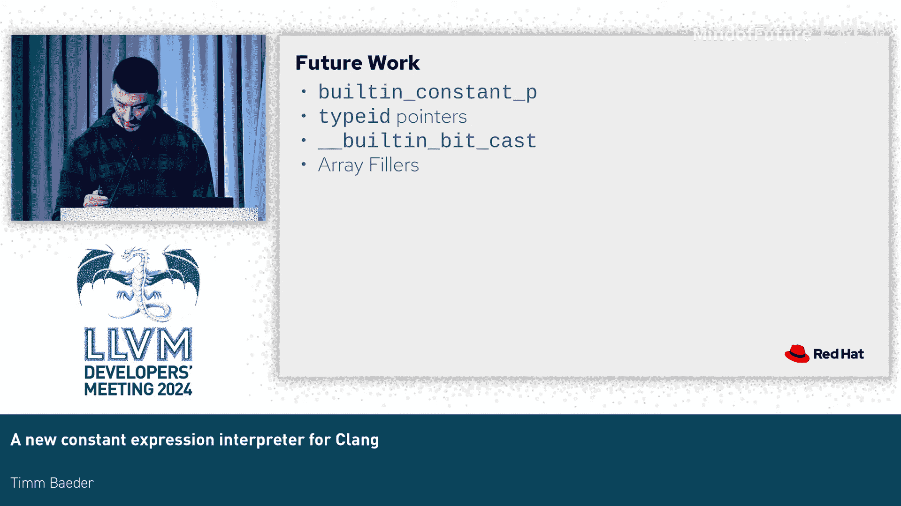

# 018：Clang 的新常量表达式解释器


## 概述

在本节课中，我们将学习 Clang 中一个新的常量表达式解释器。这个解释器的主要改进在于，对于常量表达式和常量求值函数，它不再每次调用时都解析抽象语法树，而是将其编译为字节码，后续仅解释字节码，旨在提升编译时的求值性能。

## 背景与动机

欢迎来到关于 Clang 新常量表达式解释器的分享。我是 Tim，在 Red Hat 工作。如果你今天在听讲时有一种似曾相识的感觉，可能是因为这个主题。早在 2019 年，也就是五年前，就有一个几乎同名的分享。我不仅借鉴了标题，还“借用”了第二张幻灯片，这是一个不错的开始。最初的工作是由 Nandor Licker 完成的，他在 2019 年向代码库提交了一个初始框架的提交，之后我在 2021 年接手了这项工作。接下来的 20 分钟，我将浓缩这三年的工作成果。

这个解释器的核心目标是在编译时解释表达式。与当前解释器的关键区别在于：对于常量表达式和常量求值函数，我们不再每次调用时都查看 AST，而是将其编译为字节码一次，后续仅解释字节码。这应该会更快。对于表达式，我们仍然直接解释，不生成任何字节码，这一点稍后会看到。

## 基础架构

解释器的所有内容都位于 `clang::Interp` 命名空间下。我们有一个名为 `Context` 的类，它管理着整个程序。一个程序基本上就是一个全局变量列表，以及我们编译的所有函数和相应的字节码。同时，它持有对 AST 上下文的常规引用。

在 Clang 的 `Expr` 类中，有一系列用于求值表达式的 API，例如 `EvaluateAsKnownConstant`、`EvaluateForOverflow`、`EvaluateAsRValue` 等。但最终，它们都会调用以下四个函数之一：

*   `PotentialConstantExpression`：这个函数名可能不太直观，但它接收一个函数声明，本质上负责将函数编译为字节码。
*   `Evaluate` 和 `EvaluateAsRValue`：接收一个表达式，对其进行求值并返回结果。`EvaluateAsRValue` 变体在最后会执行一次隐式的左值到右值转换。
*   `EvaluateAsInitializer`：接收一个声明，对其初始化器进行求值并返回结果。

## 常量求值无处不在

为了让大家有个直观感受，我们来做个小练习。假设我使用以下命令行运行这段代码，你能告诉我有多少东西被进行了常量求值吗？

```cpp
// 示例代码
for (int i = 0; i < 10; ++i) {
    // 一些操作
}
```

答案是 16。这包括了所有字面量的溢出检查，以及 C++ 范围 for 循环中大量你看不到的隐式变量。我想强调的是，常量求值无处不在，可能比我们想象的要多得多。

## 程序、函数与编译器

我已经提到了 `Program`。`Function` 基本上符合你的预期，它包含编译后的字节码以及关于函数的更多信息。我们还有一个名为 `Compiler` 的类。所以，你的编译器现在内部也有一个编译器，它负责根据发射器将函数编译为字节码。我们有一个字节码发射器来实际生成字节码，还有一个求值发射器，它在我们发射指令时立即进行求值，而不是生成字节码。

## 字节码与解释栈

字节码是基于栈的。我们使用解释栈来操作。解释帧本质上就是通常的函数帧，包含局部变量、大小等信息。

## 类型系统

对于类型，我们有各种不同大小的整数、浮点数、指针等。我们没有为向量和复数类型设计专门的东西，只是使用一个具有合适大小的基本类型数组。对于复数，大小就是 2。对于类和结构体，我们实际生成记录，这简单地包含了类或结构体的信息，特别是我们计算基类、字段和虚基类的偏移量。之后，当我们引用一个字段时，只需使用该偏移量即可。

## 指针与内存块

对于指针，最重要的是块指针。这里的“块”不是 Objective-C 中的概念，对我们来说，块就是实际分配的数据。例如，如果你有一个整数，我们需要分配内存。通常，局部变量分配在解释帧中，全局变量分配在程序中。最近，我们还支持了编译时的动态内存分配，它也会分配一个块。

为了描述块的内容，我们有一个称为“描述符”的东西。描述符提供了我们可能需要的关于块内数据的所有信息。如果是数组，它给出数组大小和元素类型；如果是记录，它给出记录信息等。

对于字段，它们前面总是有一个我们称为“内联描述符”的东西。内联描述符提供关于字段的数据，例如字段的描述符，或者最重要的是，有一个位指示该字段是否已被初始化。

## 示例：结构体布局

以下是一个结构体布局的示例：

```cpp
struct Player {
    int health;
    float position;
};
```

对于这个结构体，我们将计算偏移量。字段 `health` 的偏移量是 16 字节（即内联描述符的大小）。因此，如果你想引用字段 `health`，你会指向偏移量 16 处，然后才是字段的实际数据。对于 `position` 字段，我们最终会到达偏移量 64 处，其大小是 32（即 `APFloat` 的大小，对于浮点数我们也使用 `APFloat`）。

图中绿色部分显示了全局变量所需的另一部分元数据。这里只是初始化状态。如果全局变量被声明为 `constexpr`，则必须被初始化，但这可能会失败。如果失败且我们后来没有使用该变量，我们需要正确地诊断这一点，这就是我们使用它的目的。

现在，如果你要引用一个全局变量的 `position` 字段，你会指向第二个内联描述符之后，也就是 `position` 实际数据之前的位置。

## 解释函数调用过程

我想实际看看如何解释一个函数调用。我刚刚给 `Player` 结构体添加了一个成员函数，并声明了一个名为 `p` 的全局常量变量并初始化了它。我们要查看的表达式是静态断言中的二元运算符（一个等号比较 `==`）。左边是一个成员调用，成员调用的基址只是一个声明引用表达式，也就是 `p`。

当我们求值这样一个声明引用时，它基本上会以一个指向声明的指针结束。此时，我们开始实际求值 `getHealth` 函数。

在解释栈中，我们从一个指针开始。实际内容并不有趣，但它是一个根指针，因为我们还没有应用任何偏移量。

如果你记得 `getHealth` 函数体，它只是 `return health;`，但前面当然有一个隐式的 `this->`。所以我们首先要做的是获取实例指针，在这里实例指针就是 `p`，所以我们得到的是完全相同的东西。现在栈上有两个相同的指针。

接下来我们想做的是获取 `health` 字段。我们使用 `GetPtrField` 指令来完成。`GetPtrField` 指令会弹出栈顶，应用一个偏移量，然后将结果推回栈顶。这里我们应用之前看到的偏移量 64。结果是指向同一内存但应用了 64 偏移量的指针。

接下来我们想实际加载这个值，不出所料，这将是我们之前的 30。

然后，就像在其他函数调用位置一样，我们将通过一个返回指令结束。这将从栈中弹出返回值，清理函数调用后的现场（即从栈中移除所有传递给函数的参数），销毁解释帧，然后将返回值放回栈顶。

此时，函数的调用者才能实际使用它。二元运算符现在已经求值了左侧，当然，接下来它会求值右侧并进行比较。结果将是相等。

如你所见，然后结果将被转换成一个 `APValue`。在这个例子中，这是我们唯一一次将任何东西转换为 `APValue`。我们将把它返回给 `EvaluateAsRValue`。你的编译器不会因为断言未失败而报错。

## 性能测量

我进行了一系列性能测量。我认为目前两个解释器还没有达到可以进行有意义性能比较的状态。但鉴于我演讲的主题，我觉得必须展示一些数据。

例如，处理一个 GitHub issue (#61425) 的测试表明确实有实际需求。现在你可以在 4 秒内完成原来需要 11 秒的工作。如果你想以一种非常低效的方式编译斐波那契数列，现在也可以更快地完成。

这里我使用了 `embed`（一个现代特性）。我嵌入的文件是 SQLite3 的合并文件，大约 8.6 MB，我只是对每个字节求和。结果是 18 秒对 31 秒，有提升。

当然，我也有 SQLite3 文件，可以直接运行它来证明我没有编造数字，但这次它变慢了。我还不确定原因，尚未调查。重申一下，我仍在努力让功能正常工作，还没有投入大量时间来优化性能。

## 测试

对于测试，我们在 Clang 测试目录中有通常的目录。我们也在向现有文件添加越来越多的新运行行。顺便说一下，如果你想尝试这个功能，这是你需要传递给 Clang 的参数。

今年四月，我开始定期测试整个 Clang 测试套件。开始时，有近 600 个测试失败，现在在这个图表上是 179 个。如果你访问下面的链接网站，是 175 个。如果看我的笔记本电脑，是 156 个。总的趋势是下降的，虽然中间有一次上升，但我正在努力解决。

## 挑战与待办事项

有一个关于“固定构建常量指针”的问题，我不会详细说明它是什么，因为我不想破坏任何人的好心情。但它是我们在生成字节码时以及后来解释时需要做的一系列奇怪组合。据我所知，这是一个新事物。如果你看 Clang 的做法，它与 GCC 完全不同。

类型 ID 指针方面，我没有什么有趣的可说，只是一堆如果实现了就会通过的测试，但实现起来工作量很大。

位域支持方面，有一个补丁在等待审核。它比当前的实现更好，因为它支持位域。当你声明一个巨大的数组但只初始化其中一个元素时，如果我们不为你创建巨大的数组，那会很好。

## 总结



在本节课中，我们一起学习了 Clang 新常量表达式解释器的设计动机、核心架构、类型与内存布局、函数解释过程，以及目前的性能表现和测试状态。这个新的解释器旨在通过编译为字节码并解释执行的方式来提升常量表达式求值的效率，是 Clang 未来发展的重要方向。


## 问答环节

**问：** 你如何测试以确保新解释器的语义是正确的？例如，与编译成本地代码运行相比，如何确保常量求值的结果一致？

**答：** 你可以编写测试，确保它们一定在编译时运行。例如，通过将变量声明为 `constexpr` 来确保初始化器在编译时求值。但更主要的是，我试图成为当前解释器的直接替代品。所以当前解释器做什么，我就尝试做什么。我们依赖现有的测试套件，并希望它们有良好的覆盖率。

**问：** 你是否考虑过不再使用 `APValue` 作为最终结果的表示形式？

**答：** 是的，某种程度上考虑过。但 `APValue` 在 Clang 内部被大量使用。我认为这可能是我们在切换解释器之后可以做的事情，届时我们可以简化很多东西。

**问：** 感谢你的工作。新的常量表达式解释器确实是 Clang 的未来，它明显更快，尽管你还没有投入太多精力优化它。这是一个巨大的工程，谢谢你为之付出的努力。

**答：** 谢谢。