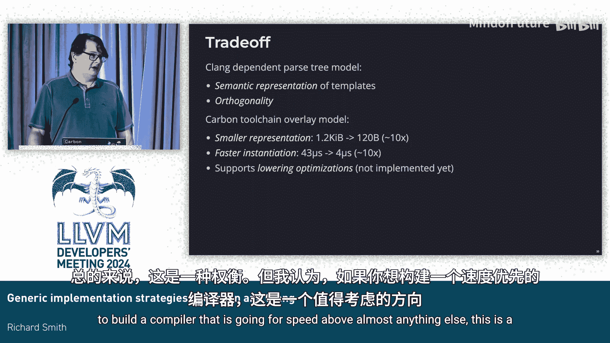

# 019：Carbon与Clang中的泛型实现策略


在本节课中，我们将学习C++模板在Clang中的实现方式，分析其优缺点，并探讨Carbon语言工具链所采用的全新实现策略。

## 概述

C++模板和Carbon泛型的基本原理相似：它们在定义时并不进行完整的类型检查，而是等到通过参数替换确定具体类型后，才决定代码的有效性和含义。替换模板会产生一个具体的实体，例如函数或类。Carbon在此基础上引入了“受检泛型”，它在定义时就进行类型检查，并要求泛型参数必须带有约束条件。

上一节我们介绍了泛型的基本概念，本节中我们来看看它们在编译器中的具体实现方式。

## C++模板的现有实现策略

当前C++编译器主要有两种实现模板的方法。

### 方法一：令牌序列法

这种方法将模板主体视为一系列令牌序列。在实例化时，编译器根据模板参数的含义重新“回放”这些令牌，从而构建出具体的函数体。EDG前端和旧版MSVC编译器采用了此方法。

### 方法二：抽象语法树法

这是GCC和Clang采用的方法。编译器会预先构建一个抽象语法树，其中明确表示出依赖于模板参数的部分。

让我们更深入地看看Clang使用的方法。

当Clang解析一个函数模板时，它会像处理非依赖代码一样构建AST。关键区别在于，它会为依赖部分创建明确的表示。例如，一个依赖类型的构造表达式会被标记为“未解析的构造表达式”，其具体含义要等到替换时才能确定。

在实例化时，Clang会从原始AST出发，为每个节点创建一个新节点，并在此过程中执行替换。所有模板参数`T`都会被替换为具体类型（如`int`）。原先具有依赖类型的节点现在获得了具体的类型。最终生成的AST形状可能与原始模板的AST略有不同。

在Clang中，这项工作由`TreeTransform`类完成。它有一个重要的优化：尝试重用那些不依赖于模板参数、因此在多次实例化中保持不变的AST部分。这是避免模板实例化开销的最大来源。

然而，在当前的Clang中，这种重用通常失败。主要原因如下：
*   如果一个节点被重用，其父节点也必须重建，因为它包含指向子节点的指针。
*   局部变量包含指向其父函数（作用域）的指针。由于每次实例化都会生成新的函数，因此也需要新的局部变量，这导致任何涉及局部变量的部分都会被重建。
*   Clang中表达式的类型表示方式意味着，如果类型改变，整个表达式都需要重建。
*   由于句法形式和语义形式表示的差异，初始化器总是从头开始重建。
*   包展开也总是完全重建。

因此，Clang中构建实例化的成本，大致相当于解析模板源代码或从头构建实例化的成本，尽管在词法分析和非限定名称查找方面能节省一些开销。

## Carbon的覆盖层模型

考虑到Clang模型的局限性，Carbon团队设计了一种新的实现策略：使用覆盖层来表示泛型和特化。

其核心思想是：像Clang一样，尽可能完整地解析泛型，形成一个依赖表示。然后，将特化表示为一组应用于泛型的“补丁”。这意味着，在特化中，我们只存储那些在实例化之间发生变化的部分，并且只花费时间重建这些变化的部分。

以下是该模型的工作原理：

1.  **构建依赖数组**：解析泛型时，编译器会构建一个数组，包含泛型中出现的所有依赖构造。
2.  **替换为索引引用**：泛型代码中所有对这些依赖项的引用，都被替换为它们在数组中的索引。
3.  **计算具体值**：当需要从泛型生成特化时，编译器通过计算数组中每个“槽位”对应的值，来生成具体的值数组。

这个过程本质上将泛型转换为一个编译时函数。该函数的“代码体”就是那个依赖数组中的指令，而生成特化的过程，就是对这个编译时函数进行求值。

**公式/代码表示**：
```
特化 = 编译时求值(泛型函数， 具体类型参数)
```

这种方法的优势非常明显：
*   **表示更紧凑**：特化只存储变化的部分，数据密度高。
*   **速度更快**：只计算需要变化的部分，避免了大量重复工作。
*   **便于优化**：由于明确分离了不变和可变部分，编译器可以在后续阶段（如代码生成）做更多优化，例如识别并合并两个最终代码相同的特化。

## 处理模板泛型（非受检泛型）

上述覆盖层模型很好地处理了“受检泛型”，因为其类型和常量值可以符号化确定。但对于更传统的、类似C++的“模板泛型”，代码的含义和有效性在替换前是未知的，问题更为复杂。

Carbon的解决方案是：在中间表示中引入一种新的指令。这种指令代表一种“原子实例化”操作，用于实例化单个表达式或构造。

例如，对于一个调用未知函数`F`的表达式，编译器会构建一个指令，表示“类型检查这个成员访问并实例化它”。在生成特化时，对这个指令进行编译时求值，就会计算出具体的调用指令。

这意味着，Carbon的表示不是一个预先确定程序最终含义的依赖语法树（如Clang），而仍然是一个基于参数计算含义的过程。生成特化，依然是编译时函数求值。



## 权衡与总结

本节课中我们一起学习了两种泛型实现策略。

Clang的模型（基于AST）主要优点是**正交性**。编译器中的大部分代码在处理表达式或声明时，无需关心它是否来自模板实例化。这极大地简化了编译器内部不同功能模块之间的交互，避免了组合爆炸问题。

Carbon的覆盖层模型则追求**极致的速度和紧凑性**。代价是损失了一定的正交性。在Carbon的IR中，任何时候想要遍历指令操作数、查看声明初始化器或查找结果，都必须考虑当前处于哪个特化的上下文中，因为边（引用关系）本身不包含这些信息。这给编译器内部API的使用者带来了额外的负担。

**总结如下**：
*   **Clang模型**：强语义表示，优秀的正交性，保持工具链相对简单。
*   **Carbon模型**：更小的内存表示（初步数据显示约10倍缩减），更快的实例化速度（初步数据显示约10倍提升），并为后续优化（如特化合并）提供了便利。

最终，这是一个工程上的权衡。如果你构建的编译器将速度置于几乎其他一切之上，那么Carbon所采用的覆盖层模型是一个非常值得考虑的方向。