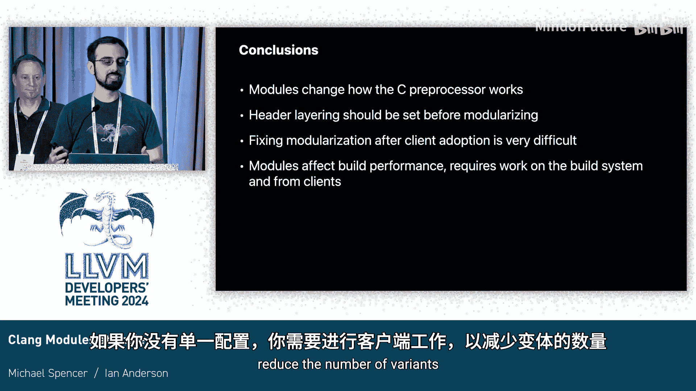

# 020：大规模使用 Clang Modules

在本教程中，我们将学习 Clang Modules 在大规模项目中的应用。我们将回顾过去十年在 Apple 平台进行模块化的经验，探讨如何避免常见的模块化陷阱，了解预处理器的使用，并学习如何高效地构建模块。

## 1：Clang Modules 基础

Clang Modules 是可导入的接口，类似于 Swift、C++、Python 等语言中的模块导入功能。它们与 C++ 模块类似，但早于后者约五年出现。它们最初是为 Swift 与现有 C 代码交互而设计的，但也可以从 C 和 C++ 中使用。

Clang Modules 在模块映射文件中定义，由头文件组成，并作为独立的翻译单元进行构建。这一点非常重要，我们将在后续多次提及。

## 2：模块化历程与早期挑战

最初的模块是与 Swift 1.0 一同创建的。大多数库都有自己的模块，这相对简单。然而，当我们处理用户包含路径时，我们为整个路径创建了一个大型模块，并为 Clang 头文件和 libc++ 分别创建了模块。

这种方法导致了一系列问题。我们不得不引入一些编译器变通方法来绕过模块映射的限制，但这些问题最终仍需解决。在 Swift 1.0 发布后，库的所有者开始负责管理自己的模块，并有一些早期采用者开始使用模块。

我们很快发现，对于 C 开发者来说，模块的使用并不直观，存在一些容易陷入的陷阱。我们发现了头文件中各种各样的内容和用法，并且发现构建性能并非理所当然就能获得。

## 3：模块化陷阱详解

在深入探讨具体陷阱之前，我们需要了解关于模块的更多信息。模块是预编译并可复用的，它们作为独立的翻译单元构建。`#include` 语句会被转换为模块导入语句，这是一个关键点，因为模块**不会**继承包含者的预处理器环境。

这与 C 语言的传统行为有很大不同，并且是许多陷阱的根源。此外，在 Swift 中，模块名是声明标识符的一部分。这意味着对于同名但位于不同模块的声明，它们是不同的类型，类型合并规则不适用。

以下是几个关键的陷阱：

### 陷阱一：必须自底向上按依赖顺序模块化

这意味着模块化的头文件只能包含其他模块化的头文件。我们最初没有遵循这一点，结果发现包含非模块化头文件会导致大量难以理解和排查的 Bug。

这些 Bug 包括：`#include` 似乎不起作用、出现无意义的类型重声明错误、类型不兼容错误（在 Swift 中尤其常见），以及其他各种莫名其妙的错误。

为了说明这一点，我们来看一个例子。假设有一个基本的模块映射，其中第二个头文件包含了一个非模块化的头文件。这个非模块化头文件只定义了一个类型。当用户同时包含另一个模块化头文件和非模块化头文件时，他们可能会发现非模块化类型变成了“未找到”的类型。这看起来像是编译器错误，但实际上与模块的实现方式有关。唯一的解决方法是按依赖顺序模块化所有头文件。

### 陷阱二：模块图必须是无环的

这很容易理解，你不能有循环包含或循环模块依赖。当涉及 C 标准库头文件时，情况会变得棘手，因为看似简单的包含可能会在搜索路径之间来回跳转。

我们最初为 `usr/include` 和 `usr/include/c++` 中的所有内容创建了大型模块。这直接导致了模块循环。我们最初的变通方法是阻止包含从 libc 模块跳转到标准库，但这在 C++ 中引起了许多奇怪的问题，并且可能引入额外的循环依赖。我们今年终于修复了这个问题，现在我们的模块图是线性的。

### 陷阱三：确保预期的宏被定义

这源于“模块作为独立翻译单元构建”这一事实。这意味着头文件不能依赖包含者的预处理器环境。

一个常见的例子是 `stddef.h`。几乎所有东西都需要它，但有时你会忘记包含它。在传统包含方式下，由于其他头文件包含了它，你侥幸成功了。但在独立的预处理器环境中，包含 `stddef.h` 就变得至关重要。

更令人困惑的是，用户提供的宏现在需要通过命令行传递。假设有一个模块，它根据客户端传入的宏定义有条件地添加额外的 API。通常，你会在包含前定义这个宏。但对于模块，这行不通，因为模块在构建时，该宏可能未被定义。解决方法是将该宏通过命令行传递给编译器。

### 陷阱四：单一定义规则

你听说过的所有单一定义规则在这里同样适用。对于类型、宏、函数等，只能有一个定义。有时你可以使用 `#ifndef` 保护来规避不便，但模块作为独立翻译单元构建，这可能导致类型重声明错误。

例如，Apple 的 ICU 副本中，`UBreakIterator` 类型在几个不同的头文件中都有声明。在模块化后，这就成了类型重声明错误。解决方法是指定一个头文件来拥有该声明，或者创建一个新的公共头文件来存放这些通用类型。

### 陷阱五：`#undef` 可能导致问题

有时我们使用 `#undef` 来修复其他头文件的问题。但模块作为独立翻译单元构建，这同样会导致重声明错误。修复这个问题更具挑战性，因为需要让头文件对模块敏感，并小心避免重声明 Clang 坚持要拥有的内容。

### 陷阱六：`extern "C"` 的类似问题

`extern "C"` 有时也被用来修复其他头文件的错误。但模块作为独立翻译单元构建，同样会引发问题。例如，一个坏的头文件忘记使用 `extern "C"`，另一个好心的中间层头文件试图用 `extern "C"` 包裹它来帮忙。但在模块构建时，坏的头文件得不到包裹，仍然缺少 `extern "C"`，最终导致链接错误。

这个问题尤其棘手，因为它诱使你将一堆头文件包裹在 `extern "C"` 中。例如，C++23 中的 `stdatomic.h` 是 C++ 感知的，包含了许多 C++ 原子操作。如果把它包裹在 `extern "C"` 中，会导致大量错误和奇怪的行为。因此，在 C++ 模式下构建模块时，我们将此视为错误。同样，在命名空间括号内包含头文件也会导致类似问题。

由于 Apple 内部有许多混乱的头文件，我们使用了一个模块变通方法来解决这个问题，并一直在努力修复。

## 4：预处理器的使用与文本头文件

当你的头文件中需要进行非模块化操作时该怎么办？模块映射文件有一个名为 `textual` 的特性。你可以在模块映射中的头文件前加上 `textual`，这样它基本上就变成了一个普通的头文件。

这些文本头文件不作为模块的一部分构建。因此，如果你导入该模块，实际上看不到该头文件的内容。包含该文本头文件也不会转换为导入语句，除非该头文件自己导入了模块。它们不作为独立的翻译单元构建，只是普通的头文件。

使用文本头文件存在一些危险，类似于我们之前讨论的非模块化头文件问题。你不能让一个声明存在于多个模块中，它必须属于一个模块。例如，`assert.h` 很难从模块化头文件中使用，因为如果在调试和发布版本中有不同的值，然后导入到后续的翻译单元中，Clang 会感到困惑。

文本头文件也有一些用途。一个常见的例子是 X 宏，例如 `llvm/Support/Options.inc` 文件，它只是一堆类似函数的宏，需要标记为 `textual`。而 `llvm/Support/Options.h` 是模块的一部分，它文本式地包含 `Options.inc`，并在该上下文中创建声明，因此这些声明只属于实际的模块。

另一种常见情况是私有实现头文件。有时你会因为头文件太长而将其拆分，但拆分不当，只是被切成几块，并期望按正确顺序包含。另一种情况是并行实现，例如在不同架构上需要不同的内联汇编。解决方案是确保它们有一个单一的包含点，并标记为 `private textual`，这可以防止其他模块包含它，从而保证这些声明只属于一个模块。

有时头文件确实同时包含文本部分和声明部分。一个常见的例子是 GCC 风格的 `.td` 文件，其中有一些巧妙的宏。为此，我们创建一个顶层的文本头文件来处理所有的预处理部分，然后创建单独的模块化头文件来提供声明。

## 5：构建模块与性能优化

现在我们有这么多模块，需要构建它们。首先了解一些基础知识：Clang 将模块编译成磁盘上的 PCM 文件（预编译模块），它们是 LLVM 位码格式，包含 AST 密钥和其他信息。PCM 文件的内容取决于编译器标志，如 `-D`、`-target`、语言版本等。特别是 `-D`，在不同的源文件或目标上设置不同的 `-D` 很常见，因此会产生很多变体。

命令行参数的一个子集构成了模块上下文哈希值，这包括所有可能影响 AST 的命令行参数。由于这是从命令行形成的，我们实际上不知道它们是否一定会影响，只知道它们可能影响。因此，具有不同哈希值的同一模块的 PCM 文件称为变体。我们可能对同一个模块有很多变体。只有当哈希值匹配时，PCM 文件才能安全地在编译之间重用。混合哈希值非常危险，Clang 会阻止你，如果强行覆盖，有时能工作，但很多时候会导致崩溃或随机错误。

我们最初构建 Clang 模块的方式是隐式构建模块。在这种方式下，模块由每个编译器进程在需要时单独构建。如果另一个编译器进程需要同一个模块，它会阻塞等待该模块构建完成。如果模块已经构建好并存在于磁盘上，每个 Clang 进程都需要检查构建该模块的输入文件是否发生了更改。在大型项目中，跨翻译单元拥有不同的模块上下文哈希值很常见，因此最终会产生许多变体。这导致 PCM 重用率低和重复验证工作，从而拖慢构建速度。

我们有一些变通方法。构建太慢，所以隐式模块会“作弊”，认为那些不同的命令行选项可能不重要，因此我们使用了非严格的上下文哈希。这显著提高了隐式模块的重用频率，但牺牲了正确性，有时会导致编译器错误或崩溃，例如当构建的不同部分因头文件搜索路径不同而包含不同头文件时。

重复验证问题通过“构建会话”的概念得到部分解决。这是构建系统的一个微小改变，它可以告诉 Clang 在某个时间点之后，任何内容都已经被验证过了。

我们想出了一个更好的解决方案：显式构建模块。在这种方式下，构建系统在实际构建任何翻译单元之前，先扫描每个翻译单元以确定它需要哪些模块，然后提前构建这些模块。扫描器可以检测出不重要的配置差异，因为它实际上在查看代码。这允许我们在扫描时使用严格的哈希，但不必为那么多不同的变体付出代价。这基本上让我们修复了正确性问题。虽然 Clang 仍有 Bug，但这些随机的非确定性 Bug 现在几乎消失了。这种方式更精确，因此有时你会构建更多的模块，但那些模块是你之前侥幸成功但实际上需要的。

这让我们能够从隐式模块构建转变为显式构建，所有模块都预先构建好。由于我们的构建系统很智能，它可以调度任务并将它们打包在一起。

## 6：性能考量与最佳实践

目前，构建模块有很大的开销。这不是固有的，也不是必需的，可以修复。但这是当前的现状。大量的变体和小模块会显著降低扫描性能和构建性能。

有两种主要的修复方法。第一种是拥有全局唯一的配置。如果你能在整个构建中，尤其是在大规模构建中（例如编译 10 万个源文件），为 `libc` 或 `libc++` 使用一个配置，那么你只需要解析它们一次。如果能做到这一点，那就太好了。

第二种是合并头文件，无论是在有意义的地方，还是在不会产生循环的地方。本质上，你需要在单一巨型模块（基本上是 PCH）和每个头文件一个模块之间找到平衡。这两种极端效果都不好：每个头文件一个模块太慢，单一巨型模块在大型规模下存在逻辑问题。我们发现，每个库一个模块通常是最好的。有时库之间存在循环依赖，最好避免，但如果发生了，我们会拆分这些库以最小化地打破这些循环。

## 7：总结与要点

在本教程中，我们一起学习了 Clang Modules 在大规模项目中的应用、常见陷阱及解决方案。

主要要点如下：
*   **模块从根本上改变了预处理器的工作方式**：这是我们反复强调的最重要的一点。模块作为独立翻译单元构建，不继承包含者的预处理器环境。开发者和代码编写者都需要理解这一点。
*   **头文件分层应在模块化之前完成**：你需要在开始时就把这个做好，后期很难更改。
*   **模块化后的修复非常困难**：这使得增量更改变得困难。你希望采用增量采用策略，例如在开发过程中逐步修复 SDK。同样，最好从一开始就做对。
*   **模块影响构建性能**：你不能天真地直接启用模块并期望获得性能提升。你必须进行构建系统方面的工作。如果你没有单一的配置，还需要进行客户端工作以减少变体的数量。

