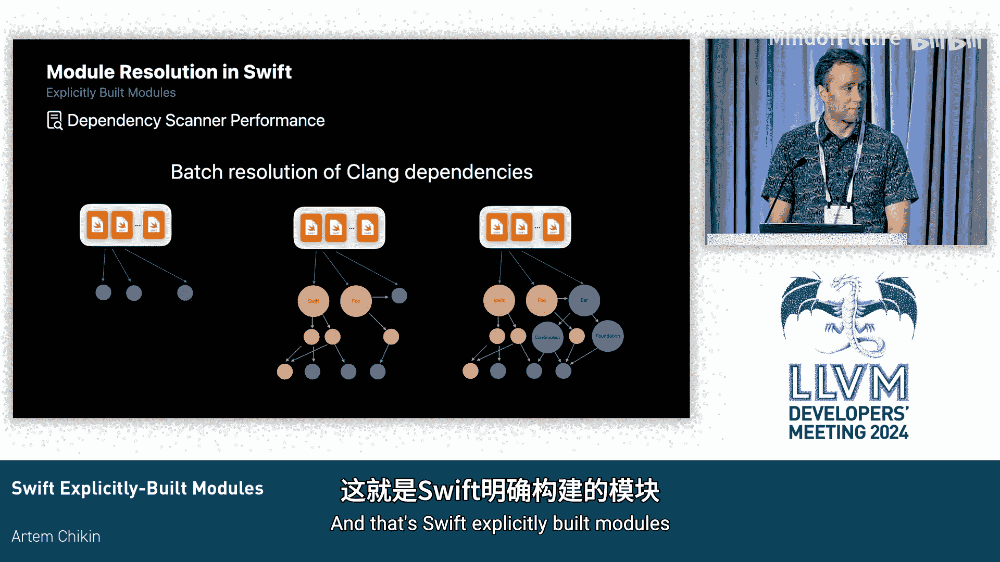

# 021：显式构建模块

在本节课中，我们将要学习 Swift 如何处理模块，并深入了解其模块加载策略。我们将从 Swift 模块的基础概念讲起，分析传统隐式模块构建方式的挑战，最后介绍新的显式构建模块模型及其优势。

## Swift 模块基础

Swift 是一门现代语言，其设计从一开始就是模块化的。模块是 Swift 的核心概念，它封装了一组源文件，构成了一个库。模块定义了它向客户端提供的 API 契约，并最终映射到二进制文件中的符号。

与 C 语言家族不同，Swift 的模块接口并非由开发者在文本头文件中手动编写。相反，它们通过使用访问控制关键字直接从源代码中捕获。例如，`public` 关键字定义了构成模块接口的所有声明、类型和函数。

为了让客户端能够使用模块并引用其中的声明，模块需要被编译成编译器可处理的二进制表示形式，即**二进制 Swift 模块**。这是一个 LLVM 比特码容器，捕获了所有相关声明的抽象语法树。在 Apple 平台的 Swift 5 中，用户可以选择构建**弹性模块**，它提供了 ABI 稳定性保证，确保库在演进时，新版本能与基于旧版本构建的客户端兼容。

为了实现跨编译器版本的兼容性，编译器会生成**文本模块接口**文件，其工作原理与二进制模块类似，同样使用访问控制机制来捕获相关声明。

## 与 C 语言的互操作性

Swift 从一开始就与 C 和 Objective-C 代码有深度互操作性，最近也扩展到了 C++。Swift 提供了一种机制，可以直接导入文本头文件及其中的所有内容。然而，要在大型混合语言 SDK 中实现大规模互操作，就需要模块化的头文件接口。为此，我们使用**Clang 模块**机制。

Clang 模块由一个模块映射文件定义，该文件指定了模块名称及其属性，以及构成该模块的头文件。Clang 模块被构建成**二进制预编译模块文件**。

## 传统模块加载策略

我们可以通过一个小例子来了解 Swift 导入模块的所有可能方式。假设我们正在编译一个 Swift 程序，其源文件导入了模块 `Foo` 和 `Bar`。`Foo` 是一个位于编译搜索路径上的弹性 Swift 模块，`Bar` 是一个 Clang 模块。

当编译器遇到 `import` 语句时，它会发现该模块有一个文本接口。这个模块需要被构建成编译器可处理的格式，然后才能被主源文件编译器使用。对于 `Bar` 这样的 Clang 模块，我们还需要经过一个额外的步骤，即 **Clang 导入器**。这是 Swift 编译器的一个子系统，负责遍历 Clang 模块中的所有声明，并将其转换为 Swift 原生的格式。

这里的核心概念是，每个命名的模块都需要被编译成编译器可以实际使用的格式。

## 隐式构建的挑战

如果我们退一步，观察编译一个包含多个源文件、每个文件都有自己 `import` 语句的 Swift 目标时，这个过程会变得复杂。

Swift 编译模型将模块本身定义为一个编译单元。但为了提高多核 CPU 的利用率，我们实际上将模块拆分为按源文件进行的编译任务。如果你正在构建一个供客户端使用的库，还会有一个单独的任务来生成模块本身。

在这个例子中，一旦编译器遇到 `import` 语句，它就需要在文件系统的给定搜索路径集中查找该模块。假设其中一个任务遇到了对 `Foo` 的导入，它会启动一个编译子任务。这个子任务会获取自己的编译器进程和一部分编译上下文（如标志、目标三元组、`-D` 标志等），并启动一个新线程去编译那个模块。在编译线程完成之前，原始任务无法继续前进。

很可能在同一模块中，另一个源文件会有完全相同的模块依赖。当其他源文件遇到对 `Foo` 的导入时，我们不希望它也启动线程去构建同一个模块，以避免重复工作。因此，我们会在该模块上放置一个文件系统锁，让后续进程等待。同样，这些进程也无法继续前进，因为它们也需要 `Foo` 的内容。这个过程会不断重复，导致许多任务长时间等待。

当 `Foo` 和 `Bar` 本身也是模块，并且它们也有自己的模块或头文件包含、`import` 语句时，情况会变得更加复杂。处理方式完全相同：编译 `Foo` 时遇到 `import` 语句，该编译实例会启动自己的子编译实例线程，放置文件系统锁，其他进程最终会等待它，依此类推。

在构建任何有意义的 Swift 程序时，例如 Apple 平台上的 macOS 或 iOS SDK，一个给定的编译任务拥有一个由数百个 Swift 和 Clang 模块组成的模块依赖图是很常见的。

这个过程虽然有效，并且服务了我们很多年，但在实践中也发现了一些缺点，特别是在扩展到我们想要构建的构建系统技术时。

以下是传统隐式构建模型的一些主要缺点：

*   **对构建系统不透明**：构建系统创建一组任务来编译给定目标时，并不知道每个任务将进行多少工作、将产生多少线程，因此无法最佳利用机器资源。
*   **资源浪费**：任务最终会等待文件系统锁，无法取得进展，同时却占用着宝贵的执行槽，这显然不是最优的。
*   **文件系统锁机制脆弱**：当进程因某种原因挂起或遇到错误时，需要非常小心。
*   **嵌套编译上下文难以推理**：这会导致用户难以调试的错误，对编译器工程师来说，在数十层深的编译线程中追踪问题根源也非常棘手。
*   **任务非隔离**：构建系统和编译器都不知道这些任务的输入和输出文件是什么，这限制了优化和分发的能力。
*   **错误发现延迟**：许多事情需要在编译过程中发生，我们需要沿着数十层深的子编译线程链，才能最终发现一个循环依赖。为了向用户提供有意义的诊断信息，我们需要做大量工作来重建导致该问题的所有事件链。

## 解决方案：显式构建模块

针对上述问题的解决方案是一种我们称之为**显式构建模块**的模型。其核心概念是将构建过程分解为三个阶段。

1.  **依赖扫描阶段**：在执行任何编译之前，我们先进行依赖扫描。我们会找到 Swift 代码中的所有 `import` 语句，将它们解析为模块依赖，并传递性地解析这些模块的依赖。最终结果是得到一个**依赖图**。这个图包含了每个模块的信息：它是什么、由哪些文件组成，以及构建它所需的完整命令行配方。
2.  **模块构建阶段**：有了依赖图后，编译器驱动程序或任何编排此过程的构建系统可以按照依赖顺序调度这些模块的构建。
3.  **源文件编译阶段**：最后，重新编译我们的源文件。关键的是，这些源文件编译任务现在**不会**产生任何新线程，它们自己**不会**等待任何东西。所有的输入都被直接且明确地指定。

如果你没有编译那么多源文件，或者在 Swift 编译模型中，如果我们以全模块优化流程构建整个模块，你将只有一个编译任务。你仍然可以在构建依赖项时利用机器上的多个核心，而我们可以更好地调度这些任务。

## 显式构建模型的优势

与之前那些对开发者和用户都难以理解的、长期运行的任务集合相比，我们现在最终得到了一个更加连贯的任务图。

以下是显式构建模型的一些优势：

*   **解锁更多调度并行性机会**：我们的依赖图可以包含数百个模块，而机器的核心越来越多。由于我们提前发现了更多并行工作，因此可以更好地利用这些核心。
*   **编译任务被隔离**：所有任务的输入和输出都提前精确指定。这是一个非常有用的特性，特别是如果我们希望将来使它们可分发。
*   **极大简化了调试**：这不仅对查看此过程的编译器工程师有益（他们现在可以查看特定任务，更精确地知道该任务在做什么以及可能出了什么问题），也对许多在办公桌前可能遇到各种模块化问题的用户有益，同时对构建工程师也很有价值，他们在构建 SDK 和确保其健康时经常需要处理各种模块化问题。能够拥有一个预先的依赖图以及对故障的精确归因是极其宝贵的。
*   **过程现在是确定性和可解释的**：我们不再受限于等待哪个特定源文件首先遇到 `import` 语句并启动其编译，这种情况在连续编译同一内容时不一定发生。我们现在对编译模型有了更清晰的了解。

## 关键技术：依赖扫描器

这个新构建模型中最有趣的技术是**依赖扫描器**。Swift 依赖扫描器是一个供构建系统使用的库服务。它本质上是一个包装了整个编译器的库，其执行模式严格限定为：接收一个 `import` 语句，并将其解析为文件系统中的给定模块。

由于 Swift 直接与 Clang 模块互操作，Swift 依赖扫描器实际上完全包装了 Clang 依赖扫描器。该系统的一大优势是，Swift 源代码在导入模块时无需区分该模块是用 Swift 还是 Clang 编写的，这一切都是透明的。

依赖扫描服务本身由一组工作线程组成。当有许多不同的 `import` 语句需要解析时，我们可以尝试并行解析它们。

以下是扫描过程的核心步骤：

1.  我们从一个源文件集合开始，每个文件都有自己的 `import` 语句集合。
2.  对于每个 `import` 语句标识符，我们提出一个问题：我的搜索路径集合在文件系统中是否有这个模块？
3.  如果有，很好，我们找到这个 Swift 模块，获取它的导入项，并将其添加到工作列表中。
4.  如果没有，我们现在查询内置的 Clang 依赖扫描器。Clang 依赖扫描器的工作方式有所不同，它不能简单地给我们一个模块及其依赖项，它需要给我们所查询模块的完整依赖子图。原因是，你导入的 Clang 模块的依赖集和接口实际上可能受到其依赖项的影响，因此我们需要从 Clang 依赖扫描器获取整个子图。
5.  如果第二个问题的答案也是“没有”，那么我们知道没有这样的模块，我们可以告诉用户检查他们的搜索路径。

Swift 依赖扫描器用于此的 API 实际上非常简单。Clang 模块在模块映射中命名。我们使用一个名为 `moduleDependencies` 的 API 来查询扫描器，它接收模块名称和一个定义编译环境的命令行，从而定义了包含目标三元组、所有宏定义等的模块上下文哈希。

## 性能优化：批量处理 Clang 模块

在将编译模型过渡到使用显式构建模块的过程中，我们学到的一个关键经验是：**依赖扫描器的性能至关重要**。我们通过拥有更丰富的前期模块依赖任务图解锁了更多并行性，但请记住，为了解锁这种并行性，我们首先需要运行这个计算图的瓶颈任务。

在研究此过程的性能特征时，我们发现 Swift 模块发现的成本相对非常低。原因之一是 Swift 从一开始就是完全模块化的语言，并且模块接口可以表达的内容类型也更具限制性。例如，文件系统中的 Swift 模块以模块名称命名。

相比之下，为了找到一个 Clang 模块标识符，你首先需要找到出现在搜索路径上的每一个模块映射文件，打开它，解析它，找到正确的标识符，然后去解析和预处理它的头文件，这最终会变得非常昂贵。

此外，为了计算构建给定 Clang 模块依赖项的配方，你需要计算其整个传递闭包图。因此，我们最近探索的一个见解是：**利用 Clang 模块实际上不能依赖 Swift 模块这一事实**，我们可以提前计算完整的 Swift 模块依赖图。所有未解析的节点都必须是 Clang 模块，然后我们可以尝试将它们作为一个大批量进行解析。

现在这个过程看起来是这样的：和之前一样，我们从源文件集合开始，它们有一组 `import` 语句标识符。我们将所有这些解析为 Swift 模块，这花费的时间相对微不足道。然后我们知道，图中每个未解析的节点都必须是 Clang 模块。我们可以收集它们，放入一个大的查询批次中，然后分派给 Clang 依赖扫描器并行执行这些查询。

## 问答环节

**问**：当有修改需要重新编译时，你们会重建依赖图吗？是部分重建吗？

**答**：不是从头开始重建。Clang 依赖扫描器在计算依赖图子集时，会序列化图的状态。因此，在增量构建中，当我们启动依赖扫描过程时，每当扫描器遇到一个查询（例如，我正在编译一个需要找到 `Foo` 的源文件，给定某个命令行调用），扫描器就能够重用之前计算的工作。我们不会重新计算图的部分内容，而是增量地重新计算整个图，但我们不需要做太多工作。我们只需要有适当的机制来进行所有必需的**一致性检查**：我序列化的内容是否是最新的？这个模块依赖是否发生了变化？如果没有，我们就可以重用；如果有，我们需要使该节点失效并进行一次全新的查询。因此，存在这种增量机制，它获取整个图，并使需要增量重新计算的部分失效。

## 总结

本节课中，我们一起学习了 Swift 的模块系统。我们从 Swift 模块的基础概念和与传统 C 语言模块的区别讲起，深入分析了传统隐式模块加载策略的工作原理及其在并行性、资源利用和可调试性方面面临的挑战。接着，我们介绍了**显式构建模块**这一解决方案，它将构建过程清晰地分为依赖扫描、模块构建和源文件编译三个阶段，从而带来了更高的并行性、任务隔离性、更简单的调试体验以及确定性的构建过程。最后，我们探讨了实现此模型的关键技术——**依赖扫描器**，以及通过批量处理 Clang 模块查询来优化性能的实践。显式构建模块模型为 Swift 构建系统带来了更强的可扩展性和可维护性。