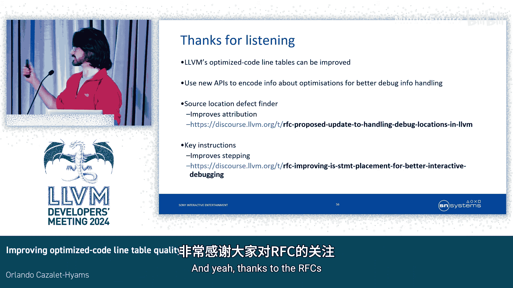

# 022：提升优化代码行表质量


在本教程中，我们将探讨如何提升 LLVM 编译器生成的优化代码的调试信息质量。我们将聚焦于两个核心项目：一是自动化检测 LLVM 中的源码位置缺陷，二是改进“语句起点”的放置策略，以获得更流畅的交互式调试体验。第一个项目已基本完成，第二个项目仍在进行中。

## 行表简介

行表是调试信息的核心组件，用于在指令地址和源码位置之间建立双向映射。许多工具依赖行表，例如调试器。SPGO（采样分析引导优化）使用行表将程序执行描述为源码形式，以便编译器理解性能剖析数据。在 LLVM IR 中，我们使用 `DILocation` 元数据（有时也称为 `DebugLoc`）来追踪指令的源码位置。

## 项目一：自动化检测源码位置缺陷

上一节我们介绍了行表的基本概念。本节中，我们来看看 LLVM 优化过程中可能出现的源码位置“误归属”问题。

### 问题：源码位置误归属

有时，在代码转换过程中，调试位置未能正确更新。这被称为“误归属”，即指令被错误地赋予了不正确或缺失的源码位置。这会导致多种问题：
*   **缺失行号**：发生崩溃时，堆栈跟踪可能无法提供精确的行号。
*   **错误的崩溃行号**：提供错误的源码位置。
*   **额外覆盖**：指令被移出其原始基本块但仍保留原位置，可能导致调试器错误显示分支路径。
*   **步入不可达代码**：调试器可能引导用户步入实际上不会执行的代码。

### 现有工具与局限

我们有一个名为 `debugify` 的工具，它可以统计每个优化过程中丢失的调试位置数量并生成报告。但其主要问题是会产生误报，因为它无法区分编译器**有意**丢弃调试位置和真正的缺陷。

### 解决方案：增强意图表达

我们的解决方案很简单：要求优化通道的作者在有意丢弃调试位置时，通过一个新的 API 来明确声明其意图。例如，将默认的 `DebugLoc()` 构造函数调用替换为一个特定的函数。

```cpp
// 旧方式（可能无意丢弃）
setDebugLoc(DebugLoc());
// 新方式（明确声明有意丢弃）
setDebugLoc(DebugLoc::getDiscard());
```

`debugify` 工具可以利用这个额外信息来区分意外丢弃和有意丢弃。重要的是，为了编译器性能，这个新 API 默认是禁用的，需要通过编译标志手动启用。

### 增强的报告功能

由于这是一个可选功能，我们可以更深入地增强元数据。我们可以在报告中嵌入堆栈跟踪，精确指出缺陷在 LLVM 中的起源位置。更进一步，我们可以提供一个 `opt-bisect-limit` 编号，方便开发者创建可复现的测试用例，使得修复问题变得相对容易。

### 项目一小结

误归属会导致 SPGO 和调试错误。我们扩展了 `debugify` 工具，使其能够无误报地定位调试位置丢失的问题，并精确指出问题根源。这只需要通道作者使用新 API 编码少量额外信息。我们目前正在修复已发现的问题，并计划将其集成到构建机器人中，以自动检测未来补丁中的问题。

## 项目二：减少优化代码调试的跳跃性

现在转换话题，谈谈第二个项目：如何减少调试优化代码时的跳跃感，提升体验。

### 问题：当前 `is_stmt` 放置策略

`is_stmt` 是行表条目中的一个标志，用于向调试器指示某个指令是一个推荐的断点位置。目前 LLVM 的 `is_stmt` 放置策略非常简单：在生成目标代码时，如果当前指令的行号与上一条指令不同，就设置 `is_stmt`。这虽然有效，但会导致调试步进时出现过多的跳跃行为。核心问题在于，LLVM 将**源码归属**和**调试步进**这两个概念混为一谈了。

### 解决方案：关键指令

好消息是，前人已经研究过这个问题。我们的方法受到了 Caroline Tice 等人关于“关键指令”工作的启发。核心思想是：源码由有趣的“原子”操作组成，如控制流、赋值、函数调用等。每个原子操作通常有一条指令来实现其核心功能，从调试者视角看，这条指令触发或完成了该操作。那么，我们为何不只为这些“关键指令”设置 `is_stmt` 呢？这样，重排非关键指令就不会影响调试体验。

### 原型实现

我们有一个原型实现。我们在 `DILocation` 元数据中增加了两个字段：`atom_group` 和 `atom_rank`。
*   具有相同 `atom_group` 编号的指令属于同一个源码原子操作。
*   通常，只有组内 `atom_rank` 最低的最终指令会获得 `is_stmt` 标志。

在优化通道运行之前，我们使用一个预置通道，通过启发式方法将这些新元数据应用到指令上。大多数优化通道无需做任何更改。最后，在生成 DWARF 信息时，我们使用新元数据来决定 `is_stmt` 的放置。

### 成本与要求

**编译时间成本**：原型目前导致带有调试信息的 LTO Release 构建的编译时间增加约 0.6%，我们认为考虑到对调试的改进，这是合理的。对于 O0 构建，开销略高（约 1.6%）。

**对通道作者的要求**：同样，我们需要通道作者在特定转换中编码更多信息。主要涉及那些会复制控制流的转换（例如循环展开）。默认情况下，克隆指令会复制其调试位置（包括 `atom_group`），这会导致所有克隆实例属于同一组，可能只有一个获得 `is_stmt`。为了让调试器能在每个实例上步进，我们需要重新映射组编号，使每个实例处于不同的组中。这可以通过一个新的 API（`ValueMap` 类）来实现。由于大部分逻辑可以放在公共辅助函数中，实际需要特殊处理的代码点并不多。

### 评估与风险

理想的断点位置可能带有主观性。我们未能找到一个满意的量化指标，但发现了一种良好的可视化定性评估方法：绘制调试步进轨迹图。

通过比较 O0、O2 以及启用关键指令的 O2 构建的步进轨迹，我们可以直观地看到改进。在许多案例中，启用关键指令后，O2 构建的步进轨迹变得与 O0 构建非常相似，跳跃性大大减少。

**主要风险**：我们可能意外丢弃了本应保留的断点位置。好消息是，源码归属不受影响，因此崩溃分析和 SPGO 不受影响。风险可以通过策略缓解，例如原型目前无条件地对所有函数调用应用 `is_stmt`，我们可以对其他必要指令采取类似措施。我们认为，步进体验的整体提升值得承担这个相对较小的风险。



### 项目二小结

我们可以通过更智能的 `is_stmt` 放置策略，减少由指令调度、代码移动等优化引入的步进熵。这只需要 LLVM 社区中的通道作者编码更多关于优化行为的意图信息。目前存在一定的编译时间成本，前端可能也需要一些工作（详见 RFC）。

## 总结

在本教程中，我们一起学习了如何通过改进源码归属和调试步进策略（并将两者分离），来提供更高质量的优化代码行表。我们介绍了两个相关的项目：
1.  **自动化检测源码位置缺陷**：通过增强 `debugify` 工具和引入新的 API，无误报地定位并修复调试信息丢失问题。
2.  **基于关键指令改进步进体验**：通过识别并只为“关键指令”设置断点标志，显著减少调试优化代码时的跳跃性，使体验更接近 O0 构建。

这两个项目都需要优化通道作者调用新的 API 来编码更多关于转换过程的信息。这些改进将共同提升 LLVM 在提供高质量调试信息方面的能力。


